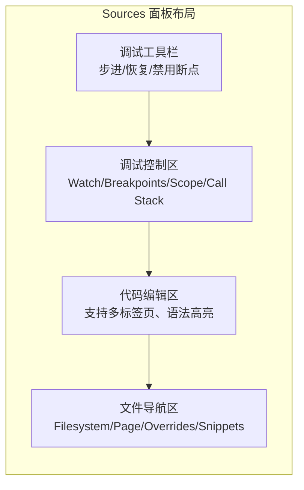
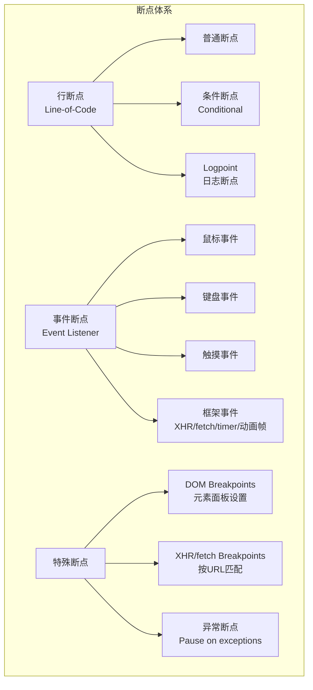
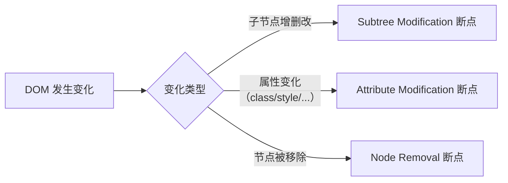
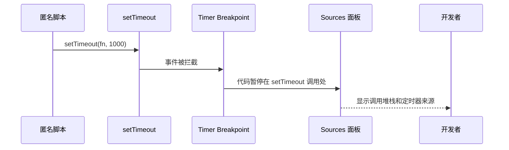
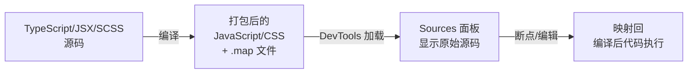
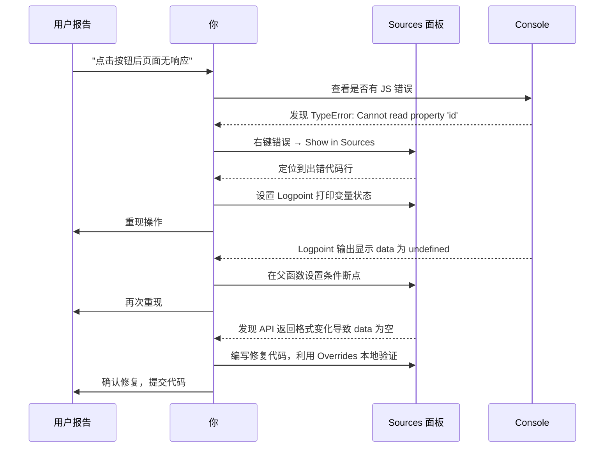

# Chrome-Sources篇

Sources 面板是调试 JavaScript 代码的主战场。它远不止"在行号上点一下设置断点"——它是一套完整的代码调试系统，支持条件断点、多类型事件断点、Source Map 映射、Blackboxing 过滤和本地文件持久化。

## 4.1 Sources 面板架构速览



---

## 4.2 断点系统完全指南

### 4.2.1 断点类型全景



### 4.2.2 条件断点

右键行号 → `Add conditional breakpoint...` → 输入 JavaScript 表达式。当表达式返回 truthy 值时，断点**暂停**执行。

```javascript
// 示例：只在特定用户数据时暂停
user.id === 'abc-123'

// 示例：循环中只在接近目标时暂停
i > 100 && data[i].status === 'error'
```

### 4.2.3 Logpoint —— 零侵入日志

右键行号 → `Add logpoint...` → 输入要记录的内容。代码执行到该行时，内容输出到 Console，但**不暂停**执行。

```javascript
// Logpoint 表达式
'当前用户:', user.name, '角色:', user.role

// Console 输出：
// [Logpoint] 当前用户: Alice 角色: admin  (来源: user-service.js:42)
```

> 💡 **为什么用 Logpoint 而非 console.log？**
> - 不需要修改源码
> - 在 Breakpoints 面板可以一键禁用/启用
> - 不会因 `console.log` 意外进入 Git 提交
> - 支持在所有打开的 DevTools 中可见

### 4.2.4 条件断点的"忍者"技巧

```javascript
// 在条件断点中输入此表达式
// 它利用 && 短路特性：当条件满足时执行 console.log，但 console.log 返回 undefined (falsy)，所以断点不暂停
i > 90 && console.log('Index:', i, 'Value:', data[i])
```

这结合了条件断点（只在条件满足时执行）和 Logpoint（不暂停执行）的优点。

### 4.2.5 异常断点

Sources 面板右上方的暂停按钮 ⏸ 勾选：

- **Pause on caught exceptions**：在 `try-catch` 捕获的异常处暂停
- **Pause on uncaught exceptions**：仅在未捕获的异常处暂停（默认推荐）

对于分析 `try-catch` 中被吞掉的异常，勾选 caught exceptions 是唯一能捕获它们的方法。

### 4.2.6 DOM 断点

在 Elements 面板中右键某个 DOM 元素 → "Break on"，可以监听该元素的变更：

| 类型 | 含义 |
|------|------|
| Subtree modifications | 子树修改时断住（子节点增删改） |
| Attribute modifications | 属性修改时断住（如 class、style 变化） |
| Node removal | 节点删除时断住 |



**使用场景**：
- React/Vue setState 后需要查看 DOM 是如何被修改的
- 某个元素莫名被添加了奇怪的 class，需要定位添加来源
- 某个节点不确定被谁删除

---

## 4.3 事件监听器断点

Sources 面板右侧的 `Event Listener Breakpoints` 提供了对浏览器事件系统的全面控制。

### 4.3.1 事件分类

| 分类 | 包含的事件 | 实战场景 |
|------|-----------|----------|
| **Mouse** | click, dblclick, mousedown, mouseup, mouseover, mouseout 等 | 追踪点击事件冒泡路径 |
| **Keyboard** | keydown, keyup, keypress, input | 调试表单输入处理 |
| **Touch** | touchstart, touchend, touchmove 等 | 移动端触摸调试 |
| **Timer** | setTimeout, setInterval, requestAnimationFrame | 找不到定时器的来源代码 |
| **Animation** | requestAnimationFrame | 动画帧回调调试 |
| **Clipboard** | copy, cut, paste | 粘贴处理调试 |

### 4.3.2 实战：追踪未知的定时器



场景：你发现页面每 3 秒发起一次不必要的 API 请求，但找不到是哪个组件设置的。

**步骤**：
1. 在 `Event Listener Breakpoints` → `Timer` → 勾选 `setTimeout` 和 `setInterval`
2. 刷新页面，代码在第一个定时器设置处暂停
3. 查看调用堆栈（Call Stack）→ 找到业务代码位置
4. 如果是对的定时器，分析逻辑；如果不是，按 `F8` 继续到下一个定时器

---

## 4.4 XHR / Fetch 断点

在 Sources 面板右侧的 `XHR/fetch Breakpoints` 区域：

- 点击 `+` 添加 URL 匹配模式
- 当匹配的请求即将发送时，代码**暂停**在 `fetch()` 或 `xhr.send()` 处
- URL 模式支持部分匹配：`/api/users` 将匹配所有包含 `/api/users` 的请求
- 不添加任何 URL 则匹配**所有** XHR/fetch 请求

**实战场景**：
- 追踪某个 API 调用是在哪个组件/函数中发起的
- 验证 API 调用是否携带了正确的请求参数
- 找到"调用次数过多"的无辜 API

---

## 4.5 Sources 面板中的调试操作

### 4.5.1 步进控制

| 按钮 | 快捷键 | 操作 | 说明 |
|------|--------|------|------|
| ⏯ Resume | `F8` | 继续执行 | 直到下一个断点 |
| ⤵ Step over | `F10` | 单步跳过 | 当前行函数不进入 |
| ⬇ Step into | `F11` | 单步进入 | 进入当前行函数内部 |
| ⬆ Step out | `Shift + F11` | 单步跳出 | 跳出当前函数 |
| ▶ Step | `F9` | 单步运行 | 🆕 类似 Step over 但逐表达式执行 |

### 4.5.2 Scope 面板解读

当代码在断点处暂停时，Scope 面板展示了当前的变量环境：

- **Local** — 当前函数作用域的变量
- **Closure** — 闭包中捕获的变量（按嵌套层级显示多个 Closure）
- **Script** — 脚本级作用域变量（`let`/`const` 在顶层）
- **Global** — 全局作用域变量（`var` 声明的全局变量）
- **Block** — 块级作用域变量（`if`/`for` 块中的 `let`/`const`）

> 💡 双击 Scope 中的任意值可以**就地编辑**——在不修改源码的情况下改变变量的值，用于测试不同的数据分支。

### 4.5.3 Watch 表达式

添加任意 JavaScript 表达式到 Watch 面板，实时查看其值：

```javascript
// 监测数组长度
users.length

// 监测条件是否成立
users.filter(u => u.age > 18).length === users.length

// 调用函数查看返回值
typeof user.name === 'string' && user.name.length > 0
```

当表达式无法求值时（例如变量不在当前作用域），Watch 面板会显示 `‹not available›`。

### 4.5.4 Call Stack 面板

显示从当前断点位置向上追溯到顶层调用的完整堆栈：

- **Async 调用链**：如果函数是异步调用（Promise/async-await），堆栈会跨异步边界链接
- **点击堆栈中的任意帧**：跳转到对应的代码位置，查看当时的局部变量
- **Restart frame**：右键堆栈帧，选择 Restart frame 可以将当前函数重置到入口处重新执行

---

## 4.6 Blackboxing：屏蔽噪音

当调试过程中经常进入三方库的代码（`node_modules`、`webpack` 运行时等），Blackboxing 是解决之道。

### 4.6.1 设置方式

- 右键编辑器行号 → `Never pause here` → 将该脚本加入 Ignore List
- 右键文件 → `Add script to ignore list`
- Settings → Ignore List → 添加自定义正则表达式模式

### 4.6.2 推荐模式

```text
# Settings → Ignore List
node_modules
__puppeteer_evaluation_script__
\.min\.js$
webpack-internal
\.next/
```

Blackbox 的脚本在调试时会：
- 自动跳过（Step into 不会进入）
- 在堆栈跟踪中折叠为一个帧标记

---

## 4.7 Source Map：调试编译后代码

### 4.7.1 Source Map 工作原理



### 4.7.2 验证 Source Map 是否生效

在 Sources 面板的文件树中，`Page` 标签页显示的是实际加载的文件。如果 Source Map 生效，你会看到：
- 原始文件（`.ts`、`.tsx`、`.vue`、`.scss`）出现在文件树中
- 原始文件行号旁边的断点可以在打包代码中生效

你也可以检查打包文件末尾是否包含 `//# sourceMappingURL=app.js.map` 注释。

### 4.7.3 🆕 Developer Resources 标签页

Chrome 130+ 中，Sources 面板新增 `Developer Resources` 标签页，专门展示 Source Map 引用的原始源文件。这避免了文件树中 `.ts` 文件和 `.js` 文件混在一起的混乱。

---

## 4.8 代码持久化：Workspace 与 Overrides

详细内容见第 11 章，这里简述 Sources 面板中的入口：

- **Filesystem**：将本地文件夹添加到 DevTools，实现双向同步编辑
- **Overrides**：拦截网络请求，用本地文件替代远程资源
- **Snippets**：保存和运行可复用的代码片段（见第 1 章）

---

## 4.9 🆕 代码折叠与行内提示

### 4.9.1 代码折叠

Chrome 110+ 中，Sources 面板的代码编辑器支持**代码折叠**：点击行号旁的折叠箭头可以折叠函数体和代码块。

### 4.9.2 行内值提示

在断点暂停时，按 `Option` 键（Mac）或 `Alt` 键（Windows），会在代码行内显示变量的**内联值**。不需要在 Scope 面板中查找。

---

## 4.10 实战：完整调试工作流



---

## 4.11 参考资料

- [Chrome DevTools Sources Panel](https://developer.chrome.com/docs/devtools/javascript/)
- [Pause your code with breakpoints](https://developer.chrome.com/docs/devtools/javascript/breakpoints/)