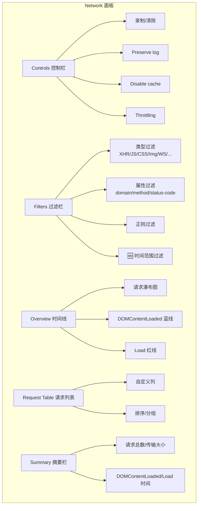
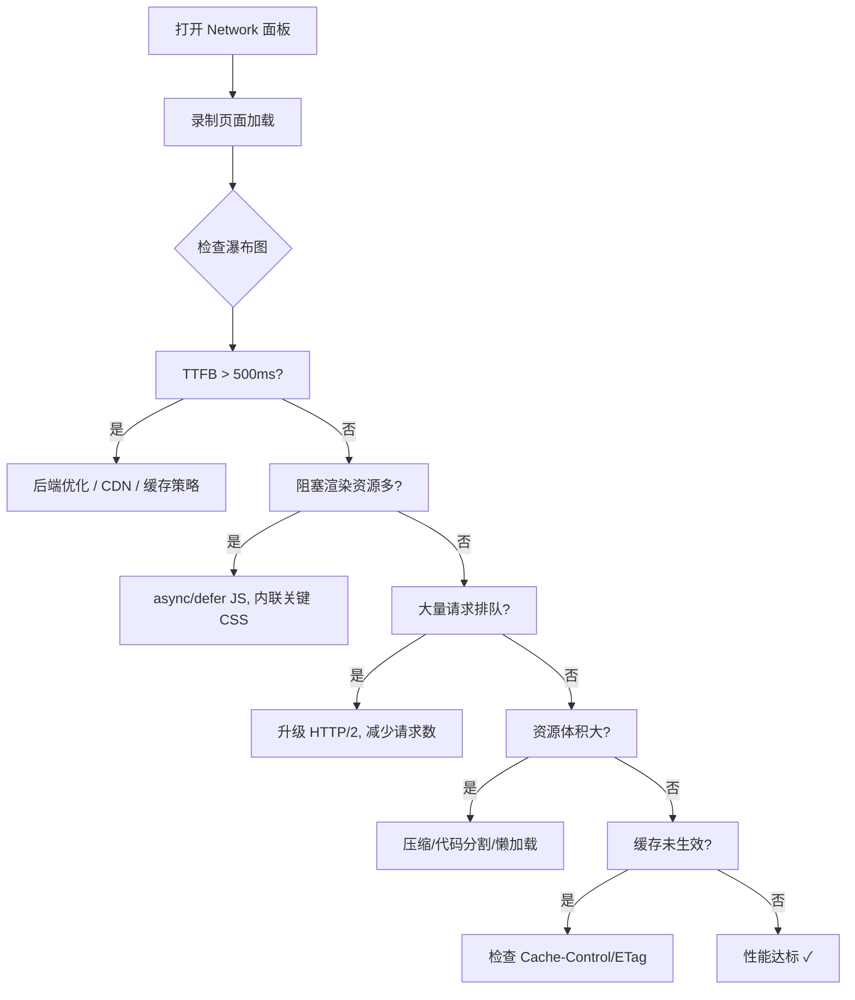

# Chrome-Network篇

Network 面板是性能优化的主战场。它不仅是"看看请求有没有发出去"的工具，更是一套完整的网络诊断系统——从请求的生命周期分析到网络环境模拟，从请求拦截到 HAR 导出。

## 5.1 Network 面板架构



---

## 5.2 请求过滤：在噪声中找到信号

### 5.2.1 类型过滤

过滤栏下方的快捷按钮按资源类型分类：

| 按钮 | 过滤内容 | 常用场景 |
|------|----------|----------|
| `Fetch/XHR` | `fetch()` 和 `XMLHttpRequest` | API 调试 |
| `JS` | JavaScript 文件 | 脚本加载分析 |
| `CSS` | 样式表 | 样式加载分析 |
| `Img` | 图片资源 | 图片优化 |
| `Media` | 音视频 | 媒体加载 |
| `Font` | 字体文件 | 字体加载策略 |
| `Doc` | HTML 文档 | 页面导航 |
| `WS` | WebSocket | 实时通信调试 |
| `Wasm` | WebAssembly | WASM 模块 |
| `Manifest` | PWA Manifest | PWA 配置 |

### 5.2.2 属性过滤

在过滤输入框中，使用 `<属性>:<值>` 语法进行精确过滤：

```text
method:POST                    # 只看 POST 请求
domain:*.api.example.com       # 只看某域名的请求
status-code:404                # 只看 404 请求
status-code:>=400              # 只看所有错误请求
larger-than:100K               # 只看大于 100KB 的响应
mime-type:application/json     # 只看 JSON 响应
set-cookie-name:session_id     # 只看设置了特定 Cookie 的响应
has-response-header:cache-control  # 只看包含特定响应头的请求
```

按 `Ctrl + Space` 可以查看所有可用的过滤属性。

### 5.2.3 🆕 时间范围过滤

Chrome 130+ 中，你可以按住 `Shift` 键在 Overview 时间线上拖拽选择一个时间范围，请求列表会自动过滤为该时间段内的请求。

### 5.2.4 反向过滤

在过滤输入框中以 `-` 开头，表示排除匹配的请求：

```text
-method:OPTIONS                # 隐藏所有 OPTIONS 预检请求
-domain:google-analytics.com   # 隐藏分析追踪请求
-status-code:200               # 隐藏所有成功请求（只看有问题的）
```

---

## 5.3 请求列表：信息密度最大化

### 5.3.1 自定义列

右键请求列表表头，可以添加/移除列：

| 列名 | 含义 | 推荐度 |
|------|------|--------|
| `Name` | 资源名称 | 必选 |
| `Status` | HTTP 状态码 | 必选 |
| `Type` | 资源类型 | 必选 |
| `Initiator` | 发起请求的代码 | ⭐ 强烈推荐 |
| `Size` | 传输大小 | 必选 |
| `Time` | 总耗时 | 必选 |
| `Waterfall` | 瀑布流 | 必选 |
| `Method` | HTTP 方法 | 推荐 |
| `Domain` | 请求域名 | 推荐 |
| `Protocol` | HTTP/1.1, h2, h3 | 🆕 推荐 |
| `Priority` | 请求优先级 | 高级 |
| `Connection ID` | TCP 连接 ID | 高级 |

### 5.3.2 Initiator 列解读

Initiator 列显示了是谁发起了这个请求：

- **直接链接**：点击跳转到 Sources 面板中的发起代码行
- **悬停预览**：显示完整调用堆栈（从业务代码到 `fetch()` 调用）
- **`(index)`**：HTML 文档中的 `<script>`、`<link>`、`` 等标签
- **`Other`**：用户导航、重定向等浏览器发起的请求

---

## 5.4 请求详情：每个字节的故事

### 5.4.1 Headers 标签页

**General** 区域的关键信息：

- **Request URL** 和 **Request Method**
- **Status Code** 和 **Remote Address**
- **Referrer Policy**：请求的引用策略

**Request Headers** 和 **Response Headers** 可以直接点击复制。对于自定义响应头，可以在请求列表表头右键 → `Response Headers` → 选择自定义头作为列。

### 5.4.2 Timing 标签页：请求的生命周期

```mermaid
gantt
    title HTTP 请求生命周期
    dateFormat X
    axisFormat %s ms

    section 连接阶段
    Queueing           :q, 0, 15
    Stalled            :s, 15, 20
    DNS Lookup         :dns, 20, 45
    Initial Connection :tcp, 45, 80
    SSL/TLS            :ssl, 80, 110

    section 传输阶段
    Request Sent       :req, 110, 112
    Waiting (TTFB)     :ttfb, 112, 250
    Content Download   :dl, 250, 280
```



| 阶段 | 含义 | 优化方向 |
|------|------|----------|
| **Queueing** | 请求在队列中等待 | 减少同域名并发请求数，使用 HTTP/2 |
| **Stalled** | 被高优先级请求阻塞 | 减少关键资源数量 |
| **DNS Lookup** | DNS 解析耗时 | 使用 DNS Prefetch：`<link rel="dns-prefetch">` |
| **Initial connection** | TCP 三次握手 | 使用 `preconnect`、HTTP/2 多路复用 |
| **SSL** | TLS 握手 | 使用 HTTP/2 减少握手次数 |
| **Request sent** | 发送请求体 | 请求体不宜过大 |
| **Waiting (TTFB)** | 等待服务器首个字节 | 后端优化、CDN 缓存 |
| **Content Download** | 下载响应体 | 压缩、CDN、流式传输 |

> 💡 **TTFB 是关键指标**：如果 TTFB 占总耗时的大部分，瓶颈在后端或网络；如果 Content Download 占大头，瓶颈在资源大小。

### 5.4.3 Preview vs Response

- **Preview**：格式化展示（JSON 高亮、图片预览、HTML 渲染）
- **Response**：原始响应文本，适合复制粘贴和搜索

### 5.4.4 Initiator 标签页

展示请求的完整调用链，包括中间件、拦截器、第三方库的调用栈。这在追踪由 Axios 拦截器、Fetch 包装函数等间接发起的请求时非常有用。

---

## 5.5 高级操作

### 5.5.1 重新发送请求

右键请求 → `Replay XHR`：以相同的参数重新发送请求。对于调试 API 响应变化非常有用。

### 5.5.2 复制请求

右键请求 → `Copy` 子菜单：

| 选项 | 输出格式 | 用途 |
|------|----------|------|
| `Copy as fetch` | `fetch()` 调用代码 | 在 Console 中复现请求 |
| `Copy as cURL` | cURL 命令 | 在终端中复现请求 |
| `Copy as Node.js fetch` | Node.js fetch 代码 | 后端复现 |
| `Copy response` | 响应内容 | 获取响应数据 |
| `Copy all as HAR` | HAR JSON | 完整请求日志导出 |

### 5.5.3 请求拦截 (Block Requests)

右键请求 → `Block request URL` 或 `Block request domain`。被拦截的请求会在列表中显示为红色。

**实战场景**：
- 测试某个 JS/CSS 加载失败时页面的降级行为
- 模拟广告拦截器对页面的影响
- 验证第三方脚本是否真的必需

被拦截的请求可以在 Drawer 中的 `Request blocking` 面板统一管理。

### 5.5.4 导出 HAR 文件

右键请求列表 → `Save all as HAR with content`。HAR (HTTP Archive) 是一个 JSON 格式的完整网络日志，包含：

- 所有请求的 URL、方法、状态码
- 请求头和响应头
- Timing 各阶段耗时
- 请求体和响应体（选择 "with content" 时）

HAR 文件可以：
- 发送给后端同事分析 API 调用
- 导入到 [HAR Analyzer](https://toolbox.googleapps.com/apps/har_analyzer/) 进行可视化分析
- 作为性能审计的证据

---

## 5.6 网络环境模拟

### 5.6.1 Throttling 预设

| 预设 | 下载速度 | 上传速度 | 延迟 |
|------|----------|----------|------|
| `No throttling` | 不限 | 不限 | 0ms |
| `Fast 4G` | 20 Mbps | 10 Mbps | 20ms |
| `Slow 4G` | 4 Mbps | 2 Mbps | 70ms |
| `Fast 3G` | 1.6 Mbps | 750 Kbps | 150ms |
| `Slow 3G` | 400 Kbps | 400 Kbps | 400ms |
| `Offline` | 0 | 0 | N/A |

### 5.6.2 自定义网络配置

选择 `Add...` → `Custom profile`，可以精确设置：
- Download / Upload (Kbps)
- Latency (ms)
- Packet loss (%) — 🆕 丢包率模拟
- Packet queue length — 🆕 队列长度

> 💡 **移动端性能测试的最佳实践**：使用 `Slow 3G` + `Disable cache` 的组合，模拟最差网络条件下的首次访问体验。

### 5.6.3 User-Agent 切换

在 Drawer → `Network conditions` 面板中，取消 `Use browser default`，可以：
- 从预设列表中选择设备 UA
- 输入自定义 UA 字符串
- 同时设置 `Accept-Language`、`Accept-Client-Hints` 等

---

## 5.7 WebSocket 调试

当页面使用 WebSocket 时，Network 面板会显示：

- **WS 过滤按钮**：筛选所有 WebSocket 连接
- **Frames 标签页**：显示每条 WebSocket 消息（发送和接收）
- **消息内容**：文本消息直接显示，二进制消息显示大小和类型

> 💡 点击 WebSocket 连接 → Frames 标签页 → 可以按方向（发送/接收）过滤消息。

---

## 5.8 性能优化实战

### 5.8.1 加载性能分析清单



### 5.8.2 识别渲染阻塞资源

在 Waterfall 视图中，关注蓝线（`DOMContentLoaded`）和红线（`Load`）之前加载的 JS 和 CSS 文件：

- **阻塞 DCL 的 JS**：没有 `async`/`defer` 属性的 `<script>` 标签
- **阻塞渲染的 CSS**：`<head>` 中的样式表
- **优化策略**：
  - JS：添加 `async`（不关心执行顺序）或 `defer`（保持执行顺序）
  - CSS：内联关键 CSS，其余异步加载

### 5.8.3 缓存策略验证

在请求的 Headers 中检查：

- **`Cache-Control: max-age=...`** — 强缓存时间
- **`ETag` / `If-None-Match`** — 协商缓存
- **`Last-Modified` / `If-Modified-Since`** — 时间戳协商缓存
- **Status 304** — 协商缓存命中
- **Size 列显示 `(disk cache)`** — 强缓存命中

---

## 5.9 🆕 Network 面板新特性

| 特性 | Chrome 版本 | 说明 |
|------|------------|------|
| **时间范围过滤** | 130+ | 在 Overview 上拖拽选择时间范围 |
| **Protocol 列** | 早期已有 | 显示 h2/h3 协议标识 |
| **Response 覆盖** | 117+ | 右键请求 → Override content |
| **请求分组** | 110+ | 按域名/类型/框架分组显示 |
| **Fetch Priority 列** | 早期已有 | 显示浏览器分配的请求优先级 |
| **Early Hints** | 120+ | 显示 103 Early Hints 响应 |

---

## 5.10 关键指标目标与 Core Web Vitals 关联

### 5.10.1 加载性能关键指标与目标值

| 指标 | 全称 | 含义 | 目标值 |
|------|------|------|--------|
| **TTFB** | Time To First Byte | 从请求发出到收到首字节 | < 200ms |
| **DOMContentLoaded** | — | HTML 解析完成，DOM 就绪 | < 1.5s |
| **Load** | — | 所有资源加载完成 | < 3s |
| **Transfer Size** | — | 实际传输大小（含压缩） | 尽量小 |

### 5.10.2 网络请求在 Performance 面板中的表现

Performance 面板的 Network 行显示请求的时间分布，与 Main 线程的调用栈对照，可定位网络请求对主线程的阻塞。

### 5.10.3 Core Web Vitals 与网络的关系

| 指标 | 与网络的关系 | 优化策略 |
|------|-------------|----------|
| **LCP** | 最大内容绘制依赖关键资源加载 | preload 关键图片/字体、设置 fetchpriority |
| **INP** | 网络请求阻塞主线程 | 减少同步请求、使用 Web Worker |
| **CLS** | 异步加载资源导致布局偏移 | 预设尺寸、font-display: swap |

---

## 5.11 参考资料

- [Chrome DevTools Network Panel](https://developer.chrome.com/docs/devtools/network/)
- [Inspect network activity](https://developer.chrome.com/docs/devtools/network/reference/)