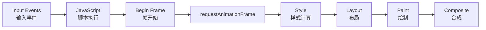
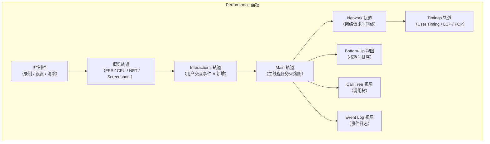
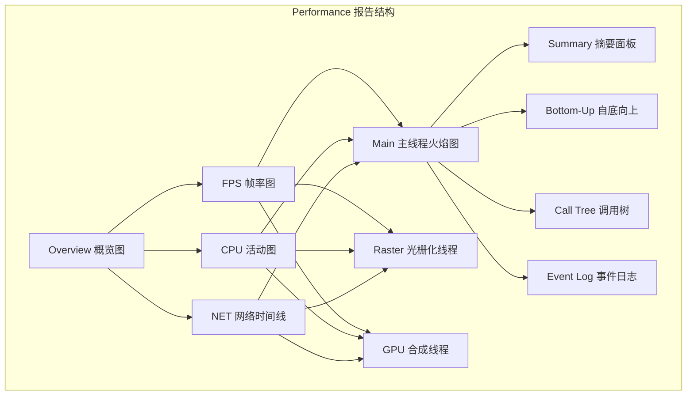
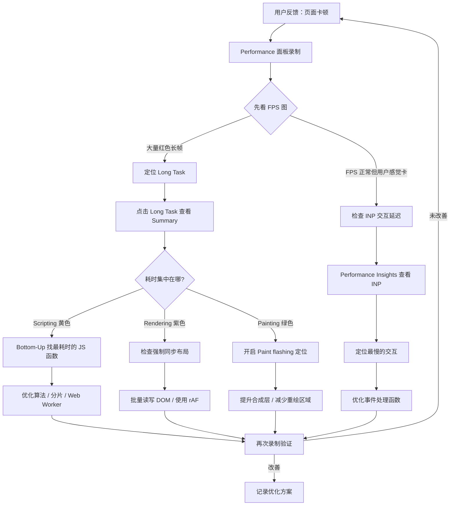

# Chrome-Performance篇

Performance 面板是 DevTools 中最强大的性能分析工具。它不仅能告诉你"页面卡不卡"，还能精确告诉你"卡在哪里"、"为什么卡"、"怎么优化"。

## 6.1 性能分析的核心概念

### 6.1.1 浏览器的一帧

浏览器渲染一个帧的完整流程：



**关键事实**：在 60fps 的目标下，每一帧的预算只有 **16.67ms**（1000ms / 60）。如果某个环节耗时超过这个预算，就会导致**掉帧**，用户感知到卡顿。

**理想帧预算拆解**（Main 线程一帧的可分配时间）：

```text
理想帧：JS(3ms) + Style(1ms) + Layout(2ms) + Paint(3ms) + Composite(1ms) = 10ms ✅
问题帧：JS(15ms) + Layout(5ms) + Paint(3ms) = 23ms ❌（超出 16.67ms 预算）
```

**常见瓶颈模式**：

| 模式 | 火焰图特征 | 原因 | 解决方案 |
|------|------------|------|----------|
| 长任务 | 黄色块 > 50ms | 复杂计算 | 拆分任务 / Web Worker |
| 布局抖动 | 交替的紫-黄-紫 | 读写布局属性交替 | 批量读写分离 |
| 强制同步布局 | JS 中嵌套紫色布局 | `offsetHeight` 等触发布局 | 缓存布局值 |
| 频繁 GC | 灰色 GC 块 | 短命对象过多 | 对象池 / 减少分配 |

### 6.1.2 Core Web Vitals 三剑客

| 指标 | 衡量什么 | 良好 | 需要改进 | 差 |
|------|----------|------|----------|-----|
| **LCP** (Largest Contentful Paint) | 加载性能 | ≤ 2.5s | ≤ 4.0s | > 4.0s |
| **INP** (Interaction to Next Paint) | 交互响应 | ≤ 200ms | ≤ 500ms | > 500ms |
| **CLS** (Cumulative Layout Shift) | 视觉稳定性 | ≤ 0.1 | ≤ 0.25 | > 0.25 |

> 🆕 INP 在 2024 年 3 月正式取代 FID (First Input Delay) 成为 Core Web Vitals 指标。INP 衡量的是整个页面生命周期中最慢的交互延迟，而非仅首次输入。

### 6.1.3 Performance 面板布局

> **2024-2026 更新**：Chrome DevTools Performance 面板进行了重大 UI 改版，新增了多个轨道和功能。



关键轨道说明：

| 轨道 | 说明 |
|------|------|
| FPS | 每秒帧数，低于 60fps 时变红 |
| CPU | CPU 使用率 |
| NET | 网络请求时间线 |
| Screenshots | 每帧的截图 |
| **Interactions** | 用户交互事件（click、keydown 等），**新增** |
| Main | 主线程任务火焰图（最核心的轨道） |
| Network | 网络请求详情 |
| Timings | LCP、FCP、User Timing 标记 |

---

## 6.2 录制性能 Profile

### 6.2.1 录制前的准备

1. **使用无痕模式**：避免浏览器插件干扰性能数据
2. **关闭其他标签页**：减少系统资源竞争
3. **选择合适的节流**：
   - CPU：`4x slowdown` 或 `6x slowdown`（模拟低端设备）
   - Network：`Fast 3G` 或 `Slow 3G`
4. **禁用缓存**：模拟首次访问

### 6.2.2 录制方式

| 方式 | 操作 | 适用场景 |
|------|------|----------|
| **普通录制** | 点击 Record → 操作页面 → Stop | 分析特定交互的性能 |
| **重载录制** | 点击 🔄 "Start profiling and reload page" | 分析页面加载性能 |
| **Recorder 集成** | 在 Recorder 面板录制用户流程 | 可复现的性能分析 |

### 6.2.3 录制时的注意事项

- **录制时间**：5-10 秒为宜，太长数据量大难分析
- **操作覆盖**：只执行你想分析的操作，避免无关交互混入
- **多次录制**：至少录制 2-3 次，排除偶然波动

---

## 6.3 解读性能报告

### 6.3.1 报告全景



### 6.3.2 FPS 图表

- **绿色柱**：帧率正常（接近 60fps）
- **黄色柱**：帧率下降（30-60fps）
- **红色柱**：长帧（< 30fps），用户会明显感知卡顿
- **红色块上的红色三角**：Long Task（超过 50ms 的任务）

### 6.3.3 CPU 活动图

不同颜色代表不同类型的活动：

| 颜色 | 活动类型 | 含义 |
|------|----------|------|
| 🟡 黄色 | Scripting | JavaScript 执行 |
| 🟣 紫色 | Rendering | 样式计算 + 布局 |
| 🟢 绿色 | Painting | 绘制 + 光栅化 |
| ⚪ 灰色 | System | 浏览器内部工作 |
| 🔵 蓝色 | Idle | 空闲 |

### 6.3.4 火焰图 (Flame Chart)

火焰图是 Performance 面板的核心。它展示了主线程上每个任务的调用栈：

- **X 轴 = 时间**：从左到右时间推进
- **Y 轴 = 调用深度**：上层函数调用下层函数
- **宽度 = 耗时**：越宽的函数耗时越长
- **红色三角标记**：Long Task（> 50ms）

**阅读火焰图的技巧**：

1. 先找**红色三角**（Long Task）
2. 点击 Long Task，查看 Summary 中的耗时分布
3. 展开最宽的函数块，逐层下钻
4. 关注自执行时间（Self Time）占比最高的函数

### 6.3.5 Summary 面板

选中火焰图中的任意任务，Summary 显示该任务的时间分布饼图：

| 类别 | 说明 |
|------|------|
| **Loading** | 网络请求、HTML 解析 |
| **Scripting** | JS 执行、事件处理、定时器 |
| **Rendering** | 样式计算、布局 |
| **Painting** | 绘制、图层化、光栅化 |
| **System** | 浏览器内部任务 |
| **Idle** | 空闲时间 |

### 6.3.6 Bottom-Up 与 Call Tree

- **Bottom-Up**：按函数聚合，显示每个函数的**总耗时**（Self Time + Children Time）。适合找"哪个函数整体最耗时"
- **Call Tree**：按调用路径组织，显示从根到叶的调用关系。适合理解"这个函数被谁调用了"

---

## 6.4 🆕 Performance Insights

Performance Insights 是 Chrome 102+ 引入的智能分析面板，旨在降低性能分析的门槛。

### 6.4.1 与 Performance 面板的区别

| 维度 | Performance 面板 | Performance Insights |
|------|-----------------|---------------------|
| 定位 | 专家级原始数据 | 智能分析与建议 |
| 输出 | 火焰图 + 原始时间线 | 洞察卡片 + 优化建议 |
| 门槛 | 需要理解浏览器渲染原理 | 面向所有开发者 |
| 适用 | 深度性能调优 | 快速性能诊断 |

### 6.4.2 Insights 提供的关键洞察

- **LCP 分解**：LCP 的四个子阶段（TTFB → Load Delay → Load Duration → Render Delay）
- **渲染阻塞请求**：阻塞 LCP 的网络请求
- **布局偏移**：CLS 的来源和原因
- **长任务**：主线程上的 Long Task 及其影响
- **DOM 大小**：过多的 DOM 节点对性能的影响
- **Document Latency**：文档解析延迟

### 6.4.3 LCP 分解实战

```mermaid
gantt
    title LCP 四阶段分解
    dateFormat X
    axisFormat %s

    section LCP 子阶段
    TTFB               :ttfb, 0, 200
    Load Delay         :delay, 200, 500
    Load Duration      :duration, 500, 900
    Render Delay       :render, 900, 1100
```



- **TTFB**：服务器响应时间 → 优化后端/CDN
- **Load Delay**：资源发现到开始加载 → 使用 `preload`/`fetchpriority`
- **Load Duration**：资源下载时间 → 压缩、CDN、缓存
- **Render Delay**：下载完成到渲染 → 减少 JS 阻塞、优化关键渲染路径

### 6.4.4 在 Performance 面板中分析 INP

交互延迟（INP）可以在 Interactions 轨道中精准定位：

1. 录制用户交互操作（点击、输入等）
2. 在 **Interactions** 轨道中查看交互事件
3. 点击交互事件，查看从交互到下次绘制的延迟时间
4. 在 Main 轨道中找到对应的任务，分析耗时原因
5. 结合 Insights 的 LCP/INP 分解，确认是哪一段（事件处理 / 样式计算 / 布局）拖慢了响应

### 6.4.5 Long Animation Frames API

> **2024-2026 新增**：Chrome 123+ 支持 **Long Animation Frames API**，比 Long Tasks API 更精确地检测长任务。它不仅检测单个长任务，还检测整个动画帧（包括样式计算、布局、绘制）是否超时。

```javascript
const observer = new PerformanceObserver((list) => {
    for (const entry of list.getEntries()) {
        console.log('Long animation frame:', {
            duration: entry.duration,
            startTime: entry.startTime,
            scripts: entry.scripts.map(s => ({
                name: s.name,
                duration: s.duration,
                type: s.type,        // classic / module / event-handler etc.
                invoker: s.invoker,  // 触发者
            })),
        });
    }
});

observer.observe({ type: 'long-animation-frame', buffered: true });
```

对比：
- **Long Tasks API**：只检测单个长任务（> 50ms）
- **Long Animation Frames API**：检测整个动画帧是否超时（含微任务、样式计算、布局、绘制），能更全面地反映主线程拥塞

---

## 6.5 常见性能问题定位

### 6.5.1 强制同步布局 (Forced Synchronous Layout)

**现象**：在火焰图中看到交替出现的紫色（Layout）和黄色（Scripting）块。

**原因**：JavaScript 在修改 DOM 后立即读取布局属性，触发了强制同步布局：

```javascript
// ❌ 强制同步布局
elements.forEach(el => {
  el.style.width = '100px'           // 写
  const height = el.offsetHeight     // 读 → 触发 Layout
  el.style.height = height + 'px'    // 写
})

// ✅ 批量读写分离
elements.forEach(el => {
  el.style.width = '100px'           // 批量写
})
elements.forEach(el => {
  const height = el.offsetHeight     // 批量读
  el.style.height = height + 'px'    // 批量写
})
```

### 6.5.2 布局抖动 (Layout Thrashing)

当强制同步布局在循环中发生时，就变成了布局抖动——每轮迭代都触发一次 Layout，性能呈指数级下降。

**在火焰图中识别**：多个连续的紫色 Layout 块，每个之间夹着很短的黄色 Scripting 块。

### 6.5.3 长任务 (Long Task)

**识别**：火焰图中带红色三角标记的块（> 50ms）。

**常见原因**：
- 大量 DOM 操作在单个同步函数中
- 未分片的计算密集型任务
- 第三方脚本阻塞主线程

**优化策略**：
- 使用 `requestAnimationFrame` 将任务分散到多个帧
- 使用 `setTimeout(fn, 0)` 或 `scheduler.postTask()` 分片
- 将计算移到 Web Worker

### 6.5.4 内存泄漏导致性能下降

内存泄漏的典型火焰图特征：GC（垃圾回收）事件越来越频繁，每次 GC 耗时越来越长。详见第 7 章 Memory。

---

## 6.6 渲染性能优化

### 6.6.1 使用 Rendering 工具

通过 Command Menu (`Cmd + Shift + P`) → `Show Rendering` 打开渲染调试工具：

| 选项 | 作用 |
|------|------|
| **Paint flashing** | 绿色高亮显示正在被重绘的区域 |
| **Layout Shift Regions** | 蓝色高亮显示布局偏移区域 |
| **Layer borders** | 显示合成层边界（橙色边框 = 独立合成层） |
| **FPS meter** | 实时帧率显示 |
| **Scrolling performance issues** | 高亮可能影响滚动性能的元素 |

### 6.6.2 优化绘制 (Paint)

**Paint flashing 实战**：
1. 开启 Paint flashing
2. 滚动页面或触发动画
3. 观察绿色闪烁区域——这些是正在被重绘的区域
4. 如果大面积闪烁，说明存在不必要的重绘

**优化方向**：
- 使用 `will-change` 或 `transform: translateZ(0)` 将频繁变化的元素提升为独立合成层
- 避免在动画中使用 `top`/`left`/`width`/`height`，改用 `transform` 和 `opacity`

### 6.6.3 优化布局 (Layout)

**减少布局触发**：
- 批量修改 DOM（使用 `DocumentFragment` 或 `display: none` 包裹）
- 使用 CSS class 切换代替逐属性修改
- 使用 `requestAnimationFrame` 将布局操作安排在帧开始时

---

## 6.7 实战：性能优化工作流



---

## 6.8 参考资料

- [Chrome DevTools Performance Panel](https://developer.chrome.com/docs/devtools/performance/)
- [Performance Insights](https://developer.chrome.com/docs/devtools/performance-insights/)
- [Core Web Vitals](https://web.dev/vitals/)