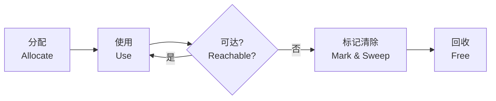
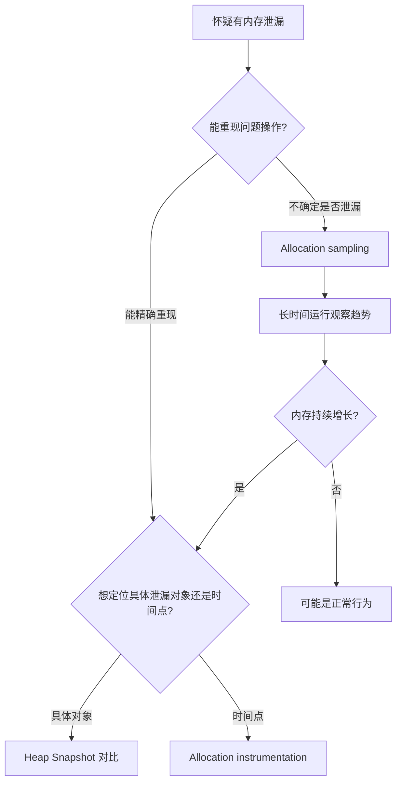
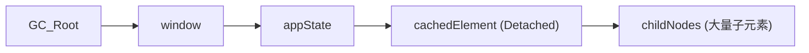
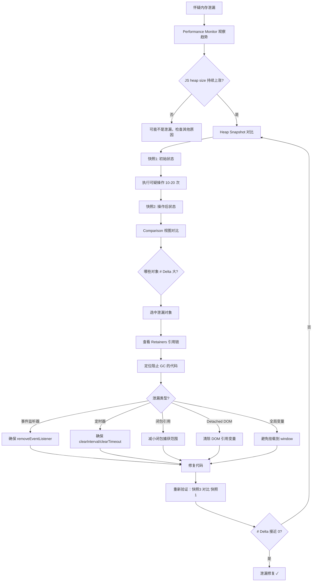

# Chrome-Memory篇

内存泄漏是单页应用（SPA）最隐蔽的性能杀手。它不会立即导致崩溃，而是像慢性毒药——页面越来越慢，响应越来越迟钝，最终浏览器标签页占用数 GB 内存后崩溃。Memory 面板就是用来诊断和治愈这种"慢性病"的。

## 7.1 内存分析基础

### 7.1.1 JavaScript 内存生命周期



**关键概念**：JavaScript 的垃圾回收（GC）基于**可达性**。从根（Root）对象出发，通过引用链可达的任何对象都不会被回收。

### 7.1.2 常见内存泄漏模式

| 模式 | 示例 | 影响 |
|------|------|------|
| **未清理的事件监听器** | 移除 DOM 元素但未 `removeEventListener` | 元素无法被 GC |
| **闭包保留大对象** | 闭包意外引用了整个外部作用域 | 大对象长期存活 |
| **全局变量/属性** | `window.dataCache = hugeArray` | 永不释放 |
| **Detached DOM** | 移除元素但 JS 仍持有其引用 | 不可见的 DOM 占用内存 |
| **定时器未清理** | `setInterval` 但未 `clearInterval` | 回调及其闭包不释放 |
| **Promise 未 resolve/reject** | 链式 Promise 中产生了悬挂引用 | 整个 Promise 链保留 |
| **WebSocket 未关闭** | 页面切换后连接未 close | 连接对象常驻 |

---

## 7.2 Memory 面板工具概览

### 7.2.1 三种分析模式

| 工具 | 作用 | 使用场景 |
|------|------|----------|
| **Heap Snapshot** | 快照式分析：拍两张快照对比 | 定位具体泄漏的对象类型 |
| **Allocation instrumentation on timeline** | 时间线分配：记录每帧的分配 | 追踪分配发生的时间点 |
| **Allocation sampling** | 采样分析：低开销长时间记录 | 初步探测是否存在泄漏 |

### 7.2.2 选择正确的工具



---

## 7.3 Heap Snapshot：对象级内存分析

### 7.3.1 创建堆快照

1. 打开 Memory 面板 → 选择 `Heap snapshot`
2. 点击 `Take snapshot` 拍摄初始快照（Snapshot 1）
3. 执行可疑操作（例如：打开弹窗 → 关闭弹窗 ×10 次）
4. 再次 `Take snapshot` 拍摄对比快照（Snapshot 2）

### 7.3.2 快照视图切换

| 视图 | 说明 | 最佳场景 |
|------|------|----------|
| **Summary** | 按构造函数分组，显示对象计数和大小 | 定位泄漏的类型 |
| **Comparison** | 两个快照之间的差异对比 | 🔑 寻找泄漏对象的核心视图 |
| **Containment** | 按引用层级组织对象树 | 理解对象的引用链 |
| **Statistics** | 按数据类型（Array, String, Code 等）饼图 | 了解内存整体分布 |

### 7.3.3 Comparison 视图实战

这是定位内存泄漏最重要的视图：

1. 选择 Snapshot 2
2. 切换到 `Comparison` 视图
3. 在 `Perspective` 下拉中选择 Snapshot 1 作为基准
4. 按 `# Delta`（数量变化）排序

关注以下信号：
- **# New** > 0 且为预期之外的对象
- **# Delta** 大的对象类型
- **Shallow Size** 或 **Retained Size** 显著增大的对象

### 7.3.4 关键指标解读

| 指标 | 含义 |
|------|------|
| **Shallow Size** | 对象自身占用的内存（不含引用的其他对象） |
| **Retained Size** | 对象自身 + 其独占引用的所有对象的内存总和 |
| **Distance** | 从 GC Root 到该对象的最短引用链长度 |
| **# New** | Comparison 视图中新创建的对象数量 |
| **# Deleted** | Comparison 视图中被删除的对象数量 |
| **# Delta** | # New - # Deleted（净增量，正值 = 泄漏信号） |

### 7.3.5 定位 Detached DOM

Detached DOM 是已从 DOM 树移除但由于 JavaScript 仍持有引用而无法被 GC 的 DOM 元素。

**在 Comparison 视图中**：
1. 在过滤框中输入 `Detached`
2. 所有 Detached DOM 元素会被高亮显示
3. 选中一个对象 → 查看下方的 `Retainers` 面板

Retainers 面板显示了**谁在持有这个对象的引用**：



> 💡 Retainers 面板是追踪引用链的核心工具：从 Detached 对象开始，沿着 Retainers 逐层向上，就能找到阻止 GC 的根源代码。

### 7.3.6 实战：追踪 SPA 路由切换泄漏

**场景**：用户反映在 Dashboard 和 Settings 页面之间反复切换后，页面越来越卡。

**步骤**：

1. 拍摄快照 1：在 Dashboard 页面
2. 执行操作：Dashboard → Settings → Dashboard × 20 次
3. 拍摄快照 2：确保回到 Dashboard 页面
4. Comparison 视图：Snap 2 vs Snap 1

**预期分析**：
- 正常情况：# Delta 应该接近 0（切换后的状态与初始状态一致）
- 泄漏情况：某些组件相关的对象 # Delta 显著 > 0

**进一步定位**：
- 寻找组件名称相关的构造函数（如 React 组件名）
- 查看 Retainers，找出是什么闭包、事件监听器或全局引用阻止了组件卸载

---

## 7.4 Allocation instrumentation on timeline

### 7.4.1 工作原理

与 Heap Snapshot 的"拍快照对比"不同，Allocation instrumentation 会**持续记录**每个对象的分配时机，生成一条时间线。

### 7.4.2 何时使用

- 你想知道**泄漏发生在哪个时间点**，而不仅仅是"哪些对象泄漏了"
- 泄漏与特定的用户交互相关
- 你想看到内存分配的实时趋势

### 7.4.3 使用步骤

1. 选择 `Allocation instrumentation on timeline`
2. 点击 `Start`
3. 执行你想分析的操作
4. 点击 `Stop`
5. 时间线上会出现蓝色柱状图（每个柱代表该时间段分配的对象）
6. 点击任意柱状时间段，下方显示该时段的分配详情

**关键信号**：
- 蓝色柱越来越高 → 内存分配加速（正常，如果之后被 GC 回收）
- 蓝色柱持续增长不回落 → 内存泄漏（分配了但不回收）

---

## 7.5 Allocation sampling

### 7.5.1 特点

- **低开销**：适合长时间运行（数分钟甚至数小时）
- **采样式**：不记录每个对象，而是定期采样调用栈
- **近似结果**：非精确，但足以发现趋势

### 7.5.2 使用场景

- 需要在生产环境或类生产环境进行分析
- 精度要求不高，但需要长时间观察
- 初步判断是否真的存在内存泄漏

---

## 7.6 Performance Monitor：实时内存监控

通过 Command Menu → `Show Performance Monitor` 可以打开实时监控面板。

关注以下指标：
- **JS heap size**：JS 堆大小——如果持续上涨不回落，存在泄漏
- **DOM Nodes**：DOM 节点数量——页面切换后应该回落
- **JS event listeners**：事件监听器数量——持续增长说明未清理

> 💡 Performance Monitor 是发现泄漏的**第一道防线**。在开发过程中保持它打开，就能在泄漏早期发现异常。

---

## 7.7 基础内存泄漏场景与排查

除了框架特定的场景，以下四类**通用**内存泄漏在任意项目中都很常见：

### 闭包保留大对象

```javascript
function createLeak() {
    const largeData = new Array(1000000).fill('x');
    return function() {
        // 即使不使用 largeData，它也不会被 GC
        console.log('leak');
    };
}
const leak = createLeak();
```

**排查**：在 Heap Snapshot 中搜索 `Array`，查看 Retainers，会发现闭包引用了 `largeData`。

### 未移除的事件监听器

```javascript
function Component() {
    window.addEventListener('resize', handler);
    // 组件卸载时未移除监听器 → handler 引用的对象无法被 GC
}
```

**排查**：在 Heap Snapshot 中搜索 `EventListeners`，查看哪些监听器没有被移除。

### Detached DOM 节点

```javascript
const list = document.getElementById('list');
const items = list.children;
list.innerHTML = '';
// items 仍然引用了已移除的 DOM 节点
```

**排查**：在 Heap Snapshot 中搜索 `Detached`，找到 Detached DOM 节点，查看 Retainers 找到保持引用的 JS 代码。

### 全局变量累积

```javascript
function processData(data) {
    leakedData = data;  // 没有 var/let/const，变成了全局变量
}
```

**排查**：在 Heap Snapshot 中查看 Global 对象下的属性。

---

## 7.8 内存分析高级技巧

### Class Filter 过滤对象

在 Heap Snapshot 的搜索框中输入类名，如 `Array`、`Object`、`HTMLDivElement`，可以快速过滤到特定类型的对象。

### Three Snapshots 技术

1. 抓取快照 1（基线）
2. 执行操作
3. 抓取快照 2
4. 再次执行操作
5. 抓取快照 3
6. 对比快照 2 和 3，排除初始化时的正常分配

### 查看 GC Roots 路径

在 Retainers 面板中，可以看到从 GC Roots 到目标对象的完整引用路径：

```text
Window → Global → leakedData → Array(1000000)
```

这条路径就是对象无法被 GC 回收的原因——有从 GC Roots 出发可以到达该对象的引用链。

---

## 7.9 内存泄漏排查工作流



---

## 7.10 框架特定的内存泄漏

### 7.8.1 React

- **useEffect 未返回清理函数**：`useEffect(() => { const timer = setInterval(...); /* 缺少 return () => clearInterval(timer) */ }, [])`
- **useRef 持有 Detached DOM**：ref.current 指向一个已被移除的元素
- **全局状态管理中的缓存**：Zustand/Jotai store 中无限追加数据

### 7.8.2 Vue

- **watch 未清理**：`watch()` 返回的 `unwatch` 未在组件卸载时调用
- **事件总线**：`$on()` 注册的事件在组件卸载时未 `$off()`
- **keep-alive 缓存过多组件实例**

### 7.8.3 通用建议

- 在 Memory 面板的 Comparison 视图中，按组件名称搜索构造函数
- 关注 `HTMLDivElement`、`HTMLSpanElement` 等 DOM 构造函数的 # Delta
- 检查 `EventListener` 对象的数量变化

---

## 7.11 参考资料

- [Fix memory problems](https://developer.chrome.com/docs/devtools/memory-problems/)
- [Record heap snapshots](https://developer.chrome.com/docs/devtools/memory-problems/heap-snapshots/)