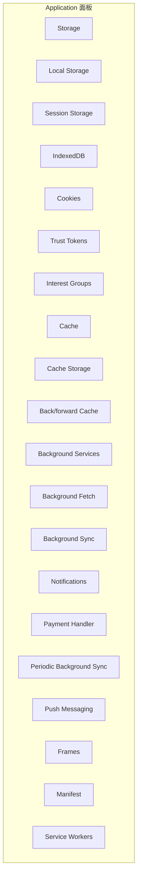
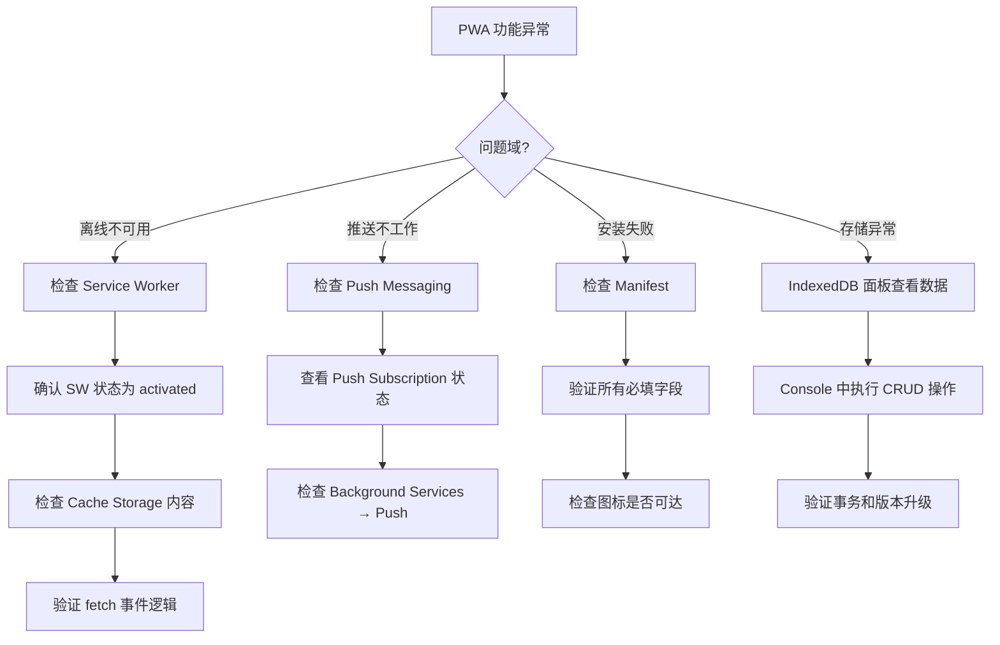

# Chrome-Application篇

Application 面板是处理**持久化数据**和**浏览器服务**的中央控制台。从 Cookie 到 Service Worker，从 LocalStorage 到 IndexedDB，这个面板让你能够检查、修改和管理浏览器端的全部数据存储。

## 8.1 Application 面板全景



---

## 8.2 Storage：存储概览与清理

### 8.2.1 Storage 面板

Storage 面板显示了当前网站使用的**所有存储的总大小**，以及各存储类型的明细：

- Total Usage
- Cookies
- Local Storage
- Session Storage
- IndexedDB
- Cache Storage
- Service Workers

### 8.2.2 一键清除存储

`Clear site data` 按钮会清除当前域名的**所有**存储数据。这等同于：

1. 清除所有 Cookies
2. 清除 Local Storage 和 Session Storage
3. 删除所有 IndexedDB 数据库
4. 清除 Cache Storage
5. 注销所有 Service Worker

> 💡 **PWA 调试必用**：在调试 Service Worker 更新和缓存策略时，`Clear site data` 是最干净的重置方式。

---

## 8.3 Cookies：不止于查看

### 8.3.1 Cookies 面板

选择 Application → Storage → Cookies → 选择域名，你会看到该域名下所有 Cookie 的表格：

| 字段 | 含义 |
|------|------|
| Name | Cookie 名称 |
| Value | Cookie 值（双击可编辑） |
| Domain | 生效域名 |
| Path | 生效路径 |
| Expires / Max-Age | 过期时间 |
| Size | Cookie 大小 |
| HttpOnly | 是否无法通过 `document.cookie` 访问 |
| Secure | 是否只通过 HTTPS 发送 |
| SameSite | Strict / Lax / None |
| Priority | Low / Medium / High |
| Partition Key | 🆕 CHIPS (Cookies Having Independent Partitioned State) 分区键 |

### 8.3.2 实战操作

- **编辑 Cookie**：双击任意列的值即可编辑
- **添加 Cookie**：点击表格底部的空行，输入 Name 和 Value
- **删除 Cookie**：选中行 → 按 Delete 键，或右键 → Delete
- **过滤 Cookie**：顶部的过滤框支持按名称或值搜索

### 8.3.3 🆕 CHIPS (Partitioned Cookies)

Chrome 114+ 引入了 CHIPS，Cookie 添加了 `Partition Key` 字段。分区 Cookie 只能在设置它们的顶级站点上下文中访问，跨站点追踪将无法读取。在 DevTools 中可以通过 `Partition Key` 列查看 Cookie 的分区归属。

---

## 8.4 Local Storage 与 Session Storage

### 8.4.1 区别

| 特性 | Local Storage | Session Storage |
|------|--------------|----------------|
| 生命周期 | 永久（直到手动清除） | 标签页关闭后清除 |
| 跨标签页共享 | ✅ 同源所有标签页 | ❌ 仅当前标签页 |
| 容量 | ~5-10 MB | ~5-10 MB |
| 数据类型 | 字符串 | 字符串 |

### 8.4.2 DevTools 中的操作

- **查看**：以 Key-Value 表格展示
- **编辑**：双击 Value 列即可编辑
- **添加**：双击空行添加新键值对
- **删除**：选中行按 Delete
- **刷新**：顶部的刷新按钮实时更新

> 💡 在 Console 中直接操作 Storage 更高效：
> ```javascript
> // 查看所有数据
> copy(localStorage)  // 复制到剪贴板
>
> // 批量操作
> Object.entries(localStorage).filter(([k]) => k.startsWith('app_'))
>   .forEach(([k]) => localStorage.removeItem(k))
> ```

---

## 8.5 IndexedDB：浏览器端数据库

### 8.5.1 IndexedDB 面板

选择 Application → IndexedDB → 选择数据库，可以看到：

- **Object Stores**（对象仓库，类似数据库表）
- **Indexes**（索引）
- **具体数据记录**

### 8.5.2 实战：查询和编辑

**查看数据**：
- 展开 Object Store → 所有记录以表格展示
- 点击任意记录可以展开详细内容
- 支持通过 Index 进行索引查询

**编辑数据**：
- 双击表格中的值进行编辑
- 🆕 Chrome 130+ 中支持**批量删除**

**Console 中操作 IndexedDB**：

```javascript
// 打开数据库并查看数据
const req = indexedDB.open('MyDatabase', 1)
req.onsuccess = (e) => {
  const db = e.target.result
  const tx = db.transaction('users', 'readonly')
  const store = tx.objectStore('users')
  const getAll = store.getAll()
  getAll.onsuccess = () => console.table(getAll.result)
}
```

---

## 8.6 Cache Storage

### 8.6.1 Cache Storage 面板

Cache Storage 是 Service Worker Cache API 的存储位置。选择 Application → Cache → Cache Storage：

- 每个命名缓存显示为一个文件夹
- 点击文件夹展开所有缓存的响应（URL + Size + Response Headers）
- 选择具体条目可以预览响应内容

### 8.6.2 实战操作

- **查看缓存内容**：展开缓存 → 点击条目
- **删除缓存项**：选中 → Delete
- **清空整个缓存**：右键缓存名称 → Delete
- **检查是否命中**：Network 面板中 Size 列显示 `(ServiceWorker)` 表示命中缓存

---

## 8.7 Service Workers

### 8.7.1 Service Worker 调试面板

选择 Application → Service Workers，你会看到：

- **当前 Service Worker 的状态**：activated / installing / waiting / redundant
- **Scope**（作用域）
- **Source**（来源文件，点击可跳转到 Sources 面板）
- **Update cycle**：Update / Unregister 按钮

### 8.7.2 关键操作

| 按钮/功能 | 作用 |
|-----------|------|
| **Update** | 强制触发 Service Worker 更新检测 |
| **Unregister** | 注销当前 Service Worker |
| **Bypass for network** | 跳过 Service Worker 直接从网络获取 |
| **Show all** | 显示注册到该源的所有 Service Worker |
| **Update on reload** | 每次页面刷新时强制更新 |
| **Emulate offline** | 🆕 模拟离线环境（用于测试 SW 缓存策略） |

### 8.7.3 🆕 Service Worker 时间线

Chrome 130+ 中，点击 Service Worker 面板中的 `Inspect` 链接，会打开一个专用的 DevTools 窗口，其中包含：

- Service Worker 的 Console
- Service Worker 的 Sources（可以调试 SW 中的代码）
- Service Worker 的 Network
- SW fetch event 时间线

### 8.7.4 调试 fetch 事件

在 Service Worker 的 DevTools 中，可以：
1. 在 `fetch` 事件监听器中设置断点
2. 查看哪些请求被 SW 拦截
3. 检查 `event.request` 和 `event.respondWith` 的逻辑

---

## 8.8 Background Services

### 8.8.1 后台服务面板

Application → Background Services 提供了多种后台服务的调试能力：

| 服务 | 用途 |
|------|------|
| **Background Fetch** | 大文件后台下载 |
| **Background Sync** | 网络恢复后延迟发送数据 |
| **Notifications** | 推送通知 |
| **Payment Handler** | 支付处理 |
| **Periodic Background Sync** | 定期后台同步 |
| **Push Messaging** | 推送消息 |
| **Push Subscription** | 推送订阅状态 |

### 8.8.2 使用方式

点击任意服务类型 → 点击录制按钮 → DevTools 开始记录该类型的所有后台事件。事件日志包含：
- 事件时间
- 事件来源
- 事件数据
- 事件状态

---

## 8.9 🆕 Additional Features

### 8.9.1 BFCache (Back/Forward Cache)

Application → Back/Forward Cache 面板可以测试页面是否满足 BFCache 的条件：

- 点击 `Test back/forward cache` 按钮
- DevTools 会模拟页面的往返缓存行为
- 报告哪些因素阻止了页面进入 BFCache

### 8.9.2 Interest Groups (FLEDGE)

Chrome 115+ 中，Application → Interest Groups 面板可以查看和调试 Privacy Sandbox 中的 Interest Groups（兴趣组）。

### 8.9.3 Shared Storage

Chrome 117+ 中，Application → Shared Storage 面板可以查看和调试 Shared Storage API 的数据。

### 8.9.4 Preloading

Chrome 117+ 中，Application → Preloading 面板可以调试 Speculation Rules（预测性预加载）的状态（Chrome 120 起更名为 Speculative loads）。

---

## 8.10 Frames 面板

Application → Frames 显示了页面的框架树（包括 iframe），以及每个框架的：
- 源信息
- 安全状态
- 使用的存储

这在调试跨域 iframe 和 CSP 问题时非常有用。

---

## 8.11 Manifest 面板

如果页面配置了 Web App Manifest（PWA 的必备要素），Manifest 面板会展示：
- 应用名称、图标
- 启动 URL、显示模式
- 主题色、背景色
- Screenshots（🆕 丰富的截图集）
- 图标预览（每个尺寸的图标都会渲染出来）

Manifest 面板还会检查常见问题，如缺少必填字段、图标尺寸不合适等。

---

## 8.12 实战：PWA 调试工作流



---

## 8.13 参考资料

- [Chrome DevTools Application Panel](https://developer.chrome.com/docs/devtools/application/)
- [View, edit, and delete cookies](https://developer.chrome.com/docs/devtools/storage/cookies/)
- [Service Worker Debugging](https://developer.chrome.com/docs/devtools/progressive-web-apps/)