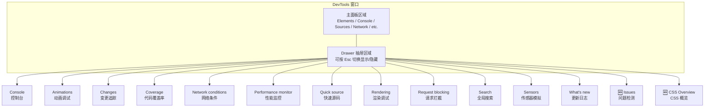

# Chrome-Drawer与命令菜单篇

Drawer（抽屉面板）和 Command Menu（命令菜单）是 DevTools 中被严重低估的两大效率利器。它们不常出现在主面板中，但提供了从动画调试到传感器模拟、从代码覆盖率到性能监控等一系列关键功能。

## 10.1 Drawer 是什么？

Drawer 是 DevTools 底部的隐藏面板区域。它独立于主面板，可以在任何主面板上叠加使用。



- **打开 Drawer**：按 `Esc` 键
- **关闭 Drawer**：再按 `Esc` 键
- **切换 Drawer 面板**：点击左上角的 `⋮` 菜单，或使用 Command Menu

---

## 10.2 Command Menu：DevTools 的万能入口

### 10.2.1 打开方式

按 `Cmd + Shift + P` (Mac) / `Ctrl + Shift + P` (Windows/Linux)，你会看到一个类似 VS Code 命令面板的搜索框。

### 10.2.2 Command Menu 可以做什么

**基本操作**：

| 命令类别 | 示例 | 功能 |
|----------|------|------|
| 面板切换 | `Show Console` | 打开任意面板 |
| 主题切换 | `Switch to dark theme` | 切换深色/浅色主题 |
| 布局切换 | `Dock to bottom` | 切换停靠位置 |
| 截图 | `Capture full size screenshot` | 全页/节点/视口截图 |

**高级操作**：

| 命令 | 功能 |
|------|------|
| `Disable JavaScript` | 一键禁用 JS，测试无脚本环境 |
| `Go offline` / `Go online` | 快速切换离线/在线状态 |
| `Clear browser cache` | 清除浏览器缓存 |
| `Clear browser cookies` | 清除当前站点 Cookies |
| `Emulate CSS print media type` | 模拟打印样式 |
| `Emulate a focused page` | 模拟页面获得焦点 |
| `Emulate CSS prefers-color-scheme: dark` | 模拟深色模式偏好 |
| `Emulate CSS prefers-reduced-motion` | 模拟减少动画偏好 |
| `Run snippet` | 运行已保存的 Snippets |

### 10.2.3 隐藏功能发现

许多 Drawer 面板没有默认按钮，只能通过 Command Menu 打开：

- `Show Coverage` → 代码覆盖率分析
- `Show Changes` → 修改追踪
- `Show Animations` → 动画调试
- `Show Rendering` → 渲染调试选项
- `Show Performance monitor` → 实时性能监控
- `Show Network request blocking` → 请求拦截管理
- `Show Sensors` → 传感器模拟
- `Show CSS Overview` → CSS 全局分析
- `Show Issues` → 页面问题检测

---

## 10.3 Drawer 工具详解

### 10.3.1 Animations（动画调试器）

Animations 面板可以：
- 录制和播放页面上的 CSS 动画和 Web Animation
- 查看动画的时间线，包括 animation-delay 和 animation-duration
- 拖动时间轴来查看动画的任意帧
- 调整动画速度（25%、50%、100%、200%）
- 暂停/播放动画

**实战**：调试复杂的 CSS 动画序列时，将动画速度调慢至 25%，可以逐帧观察过渡效果，精确定位动画不流畅的位置。

### 10.3.2 Changes（变更追踪）

每当你在 Elements 面板中修改 CSS 或在 Sources 面板中修改代码，Changes 面板会以 **diff 对比**的形式记录所有变更。

**关键操作**：
- 查看所有修改过的文件列表
- 点击文件查看 diff
- 右键 → `Copy` 将变更复制为代码
- 右键 → `Revert` 撤销变更

> 💡 **工作流提示**：在 Elements 面板中完成 CSS 调试后，打开 Changes 面板，将所有修改一键复制到源码中。

### 10.3.3 Coverage（代码覆盖率）

Coverage 面板分析页面加载的 CSS 和 JS 文件中，哪些代码被执行了，哪些是"死代码"。

**使用方式**：
1. 打开 Coverage 面板
2. 点击 `Start instrumenting coverage and reload page`
3. 在页面上执行各种操作（点击、滚动、表单提交等）
4. 点击 `Stop instrumenting coverage`

**报告解读**：

| 颜色 | 含义 |
|------|------|
| 🟦 蓝色 | 已执行的代码 |
| 🟥 红色 | 未执行的代码（Dead Code） |

**应用场景**：
- 发现未使用的 CSS 规则，减小样式表体积
- 识别未调用的 JS 函数，优化代码分割
- 评估代码分割策略的有效性（某个 chunk 是否大部分未被使用）

### 10.3.4 Network conditions（网络条件）

独立的网络条件控制面板，不受 Network 面板关闭的影响：

- **Network throttling**：选择预设或自定义网络速度
- **User agent**：手动设置 UA 字符串
- **Accepted Content-Encodings**：🆕 设置可接受的编码格式

### 10.3.5 Performance Monitor（性能监控）

实时性能仪表盘，显示：

| 指标 | 含义 |
|------|------|
| **CPU usage** | 当前 CPU 使用率 |
| **JS heap size** | JS 堆内存大小 |
| **DOM Nodes** | 当前 DOM 节点数量 |
| **JS event listeners** | 事件监听器数量 |
| **Documents** | 文档数量（含 iframe） |
| **Document Frames** | 文档帧数 |
| **Layouts / sec** | 每秒布局次数 |
| **Style recalcs / sec** | 每秒样式重计算次数 |

> 💡 在开发过程中保持 Performance Monitor 打开，可以实时感知页面的性能变化。当 DOM Nodes 或 JS event listeners 异常增长时，立即发现潜在的内存泄漏。

### 10.3.6 Quick source（快速源码）

轻量级代码编辑器，适合在不离开当前面板的情况下快速查看和编辑代码：

- 与主 Sources 面板共享文件系统
- 可以设置断点（但断点触发时跳转到主 Sources 面板）
- 不包含 Scope、Call Stack 等调试侧栏

### 10.3.7 Rendering（渲染调试）

最重要的渲染问题诊断工具集：

| 选项 | 功能 | 使用场景 |
|------|------|----------|
| **Paint flashing** | 绿色高亮所有重绘区域 | 发现不必要的重绘 |
| **Layout Shift Regions** | 蓝色高亮布局偏移 | 定位 CLS 问题 |
| **Layer borders** | 橙色边框标记合成层 | 检查合成层策略 |
| **FPS meter** | 实时帧率显示 | 性能感知 |
| **Scrolling performance issues** | 高亮滚动性能问题 | 滚动优化 |
| **Core Web Vitals** | 🆕 实时显示 LCP/INP/CLS | 实时指标监控 |
| **Frame Rendering Stats** | 🆕 帧渲染统计 | 深入帧分析 |

### 10.3.8 Request blocking（请求拦截）

统一管理被拦截的网络请求：

- 添加 URL 模式或域名模式
- 启用/禁用单个拦截规则
- 删除不再需要的规则

这与 Network 面板中右键 → `Block request URL` 是同一个功能，但这里可以集中管理。

### 10.3.9 Sensors（传感器模拟）

模拟设备传感器数据：

- **Geolocation**：设置经纬度（或从预设城市选择）
- **Orientation**：模拟设备三维旋转（α/β/γ 角度）
- **Touch**：🆕 模拟触摸事件
- **Idle Detector**：🆕 模拟空闲/活跃状态

---

## 10.4 实战：三个高效的 Drawer 组合

### 组合 1：样式调试 + Changes

```text
主面板: Elements（调试 CSS）
Drawer: Changes（追踪所有修改）
```

在 Elements 中随意调整样式，Changes 面板自动记录 diff。调试完成后，从 Changes 面板复制所有改动到代码文件。

### 组合 2：性能巡检 + Performance Monitor

```text
主面板: Network / Sources（正常开发）
Drawer: Performance Monitor（实时监控）
```

在开发过程中保持 Performance Monitor 打开，实时监控 JS heap size 和 DOM Nodes 数量。异常增长立即发现。

### 组合 3：网络分析 + Network conditions

```text
主面板: Network（分析请求）
Drawer: Network conditions（随时切换网络环境）
```

在 Network 面板分析请求的同时，通过 Drawer 中的 Network conditions 快速切换网络节流设置，无需关闭 Network 面板。

---

## 10.5 参考资料

- [Chrome DevTools Command Menu](https://developer.chrome.com/docs/devtools/command-menu/)
- [Chrome DevTools Drawer](https://developer.chrome.com/docs/devtools/customize/#drawer)