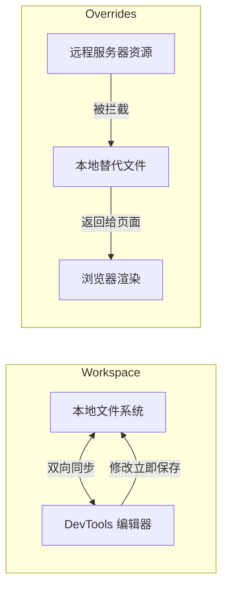
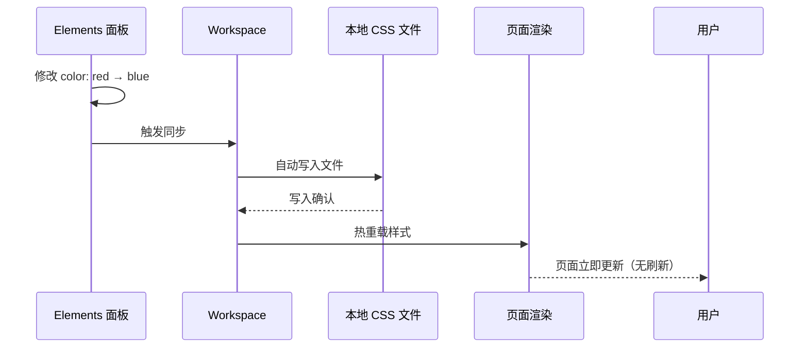
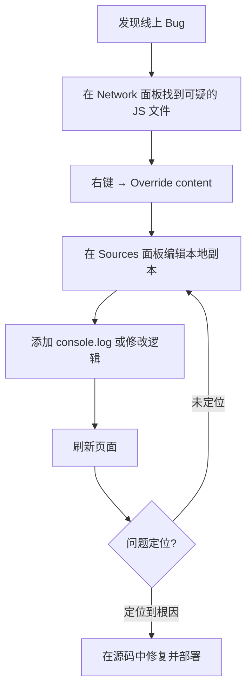

# Chrome-Workspace与Overrides篇

Workspace 和 Overrides 是 DevTools 中两个互补的持久化机制。Workspace 让你在浏览器中编辑本地文件并实时同步；Overrides 让你拦截远程资源并用本地文件替代。两者结合，可以实现"在浏览器中直接编码"的终极体验。

## 11.1 Workspace vs Overrides

| 特性 | Workspace | Overrides |
|------|-----------|-----------|
| **数据流向** | 双向同步 | 单向（本地 → 页面） |
| **适用资源** | 本地开发项目的源文件 | 任何远程资源（含第三方） |
| **需要本地服务器** | ✅ 是 | ❌ 否 |
| **修改持久化** | ✅ 自动保存到本地文件 | ✅ 保存到本地 Overrides 目录 |
| **典型场景** | 本地开发、CSS 热重载 | 线上调试、第三方资源替换 |
| **Source Map 支持** | ✅ 直接编辑源码 | ✅ 覆盖编译后的文件 |

---

## 11.2 Workspace：浏览器即 IDE

### 11.2.1 设置 Workspace

1. 打开 Sources 面板
2. 点击左侧的 `Filesystem` 标签页
3. 点击 `+ Add folder to workspace`
4. 选择你的本地项目文件夹
5. 浏览器会请求权限，点击 `Allow`

设置完成后，Sources 面板的 `Filesystem` 标签页会显示你的本地文件树。

### 11.2.2 文件映射

DevTools 会自动将本地文件与页面加载的资源进行映射。映射成功的文件在 `Page` 标签页中会显示绿色圆点标记。

如果映射失败，右键文件 → `Map to File System Resource...` → 选择对应的本地文件。

### 11.2.3 CSS 即时同步

这是 Workspace 最惊艳的功能：在 Elements 面板的 Styles 窗格中修改的任何 CSS，会**立即自动保存**到本地 CSS 文件，无需 `Cmd + S`。

### 11.2.4 为新选择器选择目标文件

当你在 Styles 窗格中点击 `+`（New Style Rule）添加新样式规则时：

- **单击**：新规则添加到 `inspector-stylesheet`（临时样式表）
- **长按**：弹出所有可用 CSS 文件列表，选择目标文件

长按 `+` 按钮后选择 Workspace 中的 CSS 文件，新规则会直接写入该文件。

### 11.2.5 编辑其他文件类型

Workspace 不仅支持 CSS，还支持：
- **HTML**：编辑后保存，刷新页面生效
- **JavaScript**：编辑后保存，刷新页面生效
- **TypeScript / JSX / SCSS**：配合 Source Map，可以直接编辑源码
- **JSON**：编辑配置文件后刷新生效

### 11.2.6 限制与注意事项

- 必须通过**本地 HTTP 服务器**运行项目（`http://localhost:...`），`file://` 协议不支持 Workspace
- 修改 JS 文件后需要**手动刷新**页面才能生效（CSS 除外，CSS 支持热重载）
- 某些构建工具（Webpack/Vite）的 HMR 可能与 Workspace 的 CSS 热重载冲突

---

## 11.3 Overrides：拦截与替换

### 11.3.1 设置 Overrides

1. 打开 Sources 面板 → `Overrides` 标签页
2. 点击 `+ Select folder for overrides`
3. 选择一个本地文件夹作为 Overrides 存储目录
4. 浏览器请求权限，点击 `Allow`

### 11.3.2 使用 Overrides 替换资源

**方式一：Network 面板**

1. 在 Network 面板中找到要替换的请求
2. 右键 → `Override content`
3. 资源自动保存到 Overrides 目录
4. 在 Sources → Overrides 中编辑该文件
5. 刷新页面，本地版本替代远程版本

**方式二：Sources 面板**

1. 在 Sources → Page 中找到要替换的文件
2. 右键 → `Override content`
3. 编辑并保存
4. 刷新页面生效

### 11.3.3 实战：线上 Bug 调试

> 💡 Overrides 是线上调试的终极武器：你可以在不部署的情况下，在本地修改任何远程资源来验证修复方案。

### 11.3.4 实战：模拟 API 响应

1. 在 Network 面板找到 API 请求
2. 右键 → `Override content`
3. 编辑 Response 标签页中的 JSON 数据
4. 修改为测试所需的数据（例如：模拟空列表、错误状态）
5. 刷新页面，前端接收到的是你修改后的数据

这比搭建 Mock Server 快得多，适合快速验证前端对各种数据状态的响应。

### 11.3.5 管理 Overrides

- 在 Sources → Overrides 标签页查看所有被覆盖的文件
- 右键文件 → `Delete` 移除覆盖
- 取消勾选 `Enable Local Overrides` 可以临时禁用所有覆盖

---

## 11.4 Workspace + Overrides 组合策略

| 场景 | 推荐方案 |
|------|----------|
| 本地开发项目 | Workspace（双向同步） |
| 调试线上 Bug | Overrides（拦截远程资源） |
| 修改第三方库 | Overrides（本地替换） |
| CSS 快速迭代 | Workspace（热重载） |
| Mock API 数据 | Overrides（修改响应） |
| 编辑 TypeScript 源码 | Workspace + Source Map |
| 修改生产环境 JS | Overrides（本地替换） |

---

## 11.5 常见问题

**Q: Workspace 的 CSS 修改没有同步到文件？**

检查：
1. 文件是否在 Filesystem 标签页中显示绿色圆点（映射成功）
2. 项目是否通过 `http://localhost` 运行（非 `file://`）
3. 是否在 Elements → Styles 窗格中修改（而非 Sources 面板）

**Q: Overrides 不生效？**

检查：
1. `Enable Local Overrides` 是否勾选
2. Network 面板中该请求的 Initiator 列是否显示 Local Overrides 徽标（Chrome 117+ 也会在 Response Headers 中标注 `local`）
3. 是否有其他拦截规则（如 Service Worker）优先级更高

**Q: Workspace 和 Overrides 可以同时使用吗？**

可以。对于本地开发项目，使用 Workspace 管理源码；对于项目中引用的 CDN 资源或第三方库，使用 Overrides 进行临时替换。

---

## 11.6 参考资料

- [Chrome DevTools Workspaces](https://developer.chrome.com/docs/devtools/workspaces/)
- [Override web content and HTTP response headers](https://developer.chrome.com/docs/devtools/overrides/)