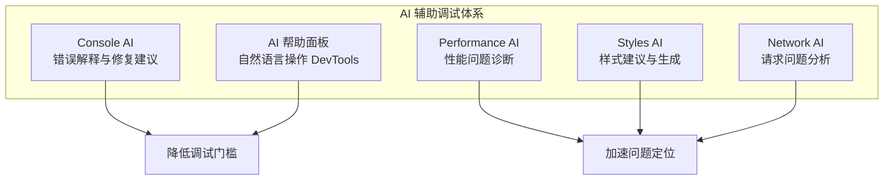
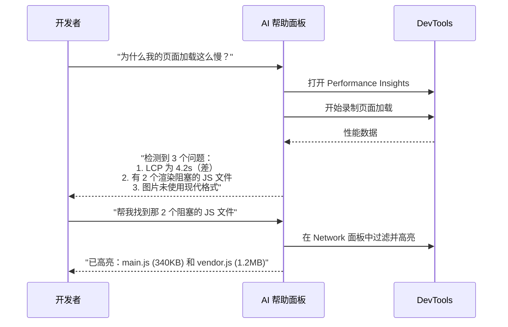
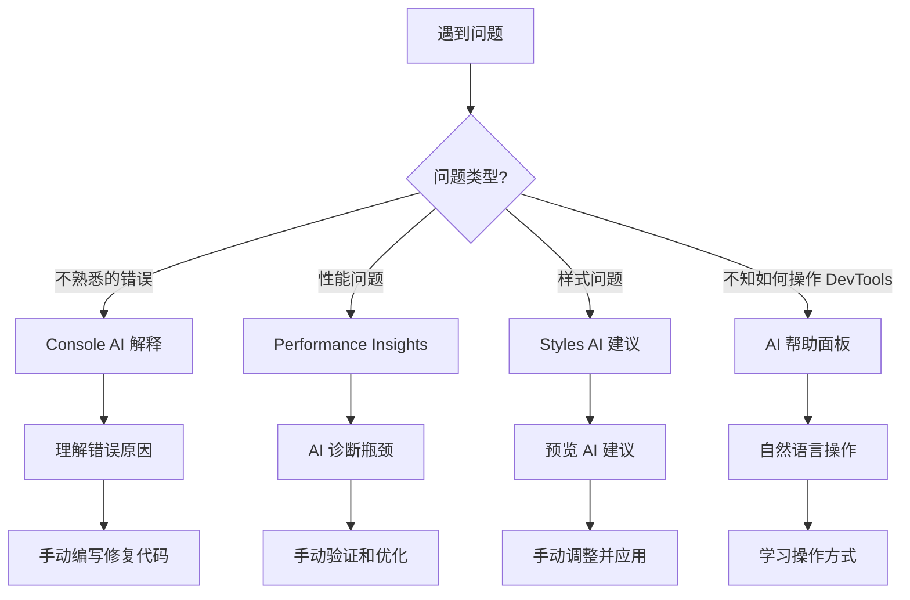

# Chrome-AI辅助调试篇

AI 正在改变前端调试的方式。Chrome DevTools 在 2024-2025 年间引入了多项 AI 驱动的功能，从 Console 错误解释到性能分析建议，从 CSS 样式生成到网络请求诊断。

## 12.1 AI 在 DevTools 中的定位



AI 在 DevTools 中的角色是**辅助而非替代**——它帮助开发者更快地理解问题、找到解决方案，但最终的判断和决策仍然由开发者做出。

---

## 12.2 Console AI：智能错误解释

### 12.2.1 功能概述

当 Console 中出现错误或警告时，Chrome DevTools 现在会提供 AI 驱动的解释和建议。

**触发方式**：
- 点击 Console 错误消息旁边的 💡 图标
- 右键错误 → `Explain this error`
- 右键错误 → `Ask AI`（🆕 更通用的 AI 查询）

### 12.2.2 提供的信息

| 信息类型 | 说明 | 示例 |
|----------|------|------|
| **错误原因** | 用自然语言解释错误含义 | "`TypeError: Cannot read property 'id' of undefined` 表示你试图访问一个 undefined 值的 id 属性..." |
| **常见原因** | 列出导致该错误的典型场景 | "1. API 返回了意外的数据结构\n2. 异步数据尚未加载完成\n3. 对象在某个分支中未被正确初始化" |
| **修复建议** | 提供具体的代码修复方案 | "在访问属性前添加可选链操作符：`data?.id`" |
| **相关资源** | 链接到 MDN 等文档 | 指向相关 API 的文档页面 |

### 12.2.3 实战：理解模糊的错误消息

**场景**：你遇到一个不熟悉的错误：

```text
Uncaught (in promise) TypeError: Failed to execute 'json' on 'Response': body stream already read
```

**传统方式**：复制错误消息 → 打开 Google → 搜索 → 阅读 StackOverflow → 理解问题

**AI 辅助方式**：点击错误旁边的 💡 → 立即获得解释：

> 这个错误表示 Response 对象的 body 流已经被读取过一次了。`response.json()` 等方法只能调用一次，因为 body stream 在被消费后就会锁定。如果你需要多次访问响应数据，可以在第一次读取后缓存结果。

并提供修复建议：

```javascript
// ❌ 错误
const data = await response.json()
const text = await response.text() // Error: body stream already read

// ✅ 正确
const data = await response.json()
// 如果需要再次使用，使用已解析的 data
```

---

## 12.3 AI 帮助面板

### 12.3.1 功能概述

AI 帮助面板（🆕 Chrome 130+ 实验性功能）允许你用**自然语言**操作 DevTools。

**打开方式**：
- `Cmd + Shift + P` → `Show AI assistance`
- 点击 DevTools 右上角的 ✨ 图标（如果有）

### 12.3.2 支持的自然语言操作

| 自然语言输入 | DevTools 执行的操作 |
|-------------|-------------------|
| "Show me all 404 requests" | 在 Network 面板中过滤 `status-code:404` |
| "Find elements with class 'active'" | 在 Elements 面板中执行 `.active` 搜索 |
| "Block all requests to google-analytics.com" | 添加请求拦截规则 |
| "Take a full page screenshot" | 执行全页截图 |
| "Show me unused CSS" | 打开 Coverage 面板 |
| "What's slowing down my page?" | 打开 Performance Insights |
| "Find where the login button click handler is defined" | 定位事件监听器 |
| "Show me all cookies for this site" | 打开 Application → Cookies |

### 12.3.3 工作流示例



---

## 12.4 Performance AI：智能性能诊断

### 12.4.1 Performance Insights 中的 AI

Performance Insights 面板（第 6 章已介绍）本身就是 AI 驱动的性能分析工具。它会自动识别：

- LCP 瓶颈（TTFB / Load Delay / Load Duration / Render Delay）
- 渲染阻塞请求
- 布局偏移来源
- 长任务及其影响

### 12.4.2 AI 性能建议

在 Performance Insights 中，每个洞察都附带 AI 生成的优化建议：

- **具体到代码行**的建议（而非泛泛的"优化 JS 执行"）
- **优先级排序**（先优化什么影响最大）
- **预期改善效果**（优化后 LCP 预计降低多少）

---

## 12.5 Styles AI：智能样式辅助

### 12.5.1 🆕 AI 样式建议

在 Elements 面板的 Styles 窗格中，AI 可以提供：

- **样式补全**：根据已有样式上下文推荐下一个属性
- **颜色建议**：基于页面配色方案推荐协调的颜色
- **布局建议**：检测到布局问题时推荐修复方案

### 12.5.2 CSS 问题自动修复

当 DevTools 检测到常见 CSS 问题（如对比度不足、溢出隐藏不当等），Styles 窗格中会出现 AI 修复建议：

```text
⚠️ 该元素的文本与背景对比度为 2.8:1，未达到 WCAG AA 标准（4.5:1）
💡 建议将文本颜色从 #999 改为 #767676
[Apply Fix]
```

---

## 12.6 隐私与数据安全

### 12.6.1 数据去向

理解 AI 功能的数据处理方式很重要：

| 功能 | 数据处理方式 | 需要网络? |
|------|-------------|-----------|
| Console AI 错误解释 | 错误消息发送到 Google 服务器 | ✅ 是 |
| AI 帮助面板 | 自然语言查询发送到 Google 服务器 | ✅ 是 |
| Performance Insights | 性能数据本地分析 | ❌ 否（本地 AI 模型） |
| Styles AI 建议 | 样式数据本地分析 | ❌ 否（本地 AI 模型） |

### 12.6.2 安全建议

- **敏感项目**：在涉及商业机密的项目中，可以关闭需要网络传输的 AI 功能
- **本地 AI 功能**：Performance Insights 和 Styles AI 使用本地模型，数据不出浏览器
- **设置入口**：Settings → AI features → 管理各项 AI 功能的开关

---

## 12.7 AI 辅助调试的最佳实践

### 12.7.1 AI 能做什么（很好）

- ✅ 解释不熟悉的错误消息
- ✅ 提供常见问题的修复模板
- ✅ 自动发现性能瓶颈
- ✅ 生成 CSS 样式建议
- ✅ 自然语言操作 DevTools

### 12.7.2 AI 不能做什么（限制）

- ❌ 理解你的业务逻辑
- ❌ 发现复杂的异步竞态条件
- ❌ 替代你对代码的深入理解
- ❌ 100% 准确的建议（始终需要人工验证）

### 12.7.3 高效使用 AI 的策略



> 💡 **核心原则**：AI 是**加速器**而非**替代品**。用它来缩短"理解问题"的时间，但"解决问题"的决策权始终在你手中。

---

## 12.8 未来展望

Chrome DevTools 的 AI 功能正在快速演进。以下是一些已经在实验阶段或计划中的方向：

- **AI 断点建议**：根据代码上下文建议在哪里设置断点
- **智能代码审查**：在 Sources 面板中提供实时代码质量建议
- **自动化回归测试生成**：从 Recorder 录制中自动生成完整的测试套件
- **跨面板关联分析**：AI 关联 Network、Performance、Memory 的数据，提供全局诊断

---

## 12.9 参考资料

- [AI assistance](https://developer.chrome.com/docs/devtools/ai-assistance/)
- [Console features reference](https://developer.chrome.com/docs/devtools/console/reference/)
- [Performance Insights](https://developer.chrome.com/docs/devtools/performance-insights/)