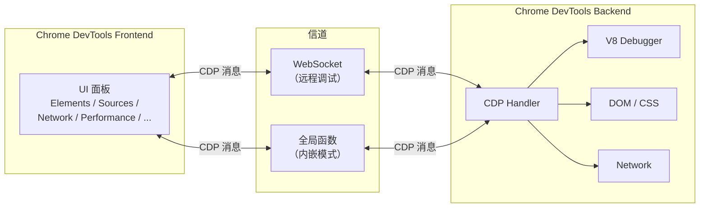
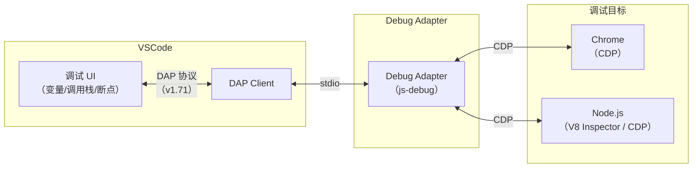
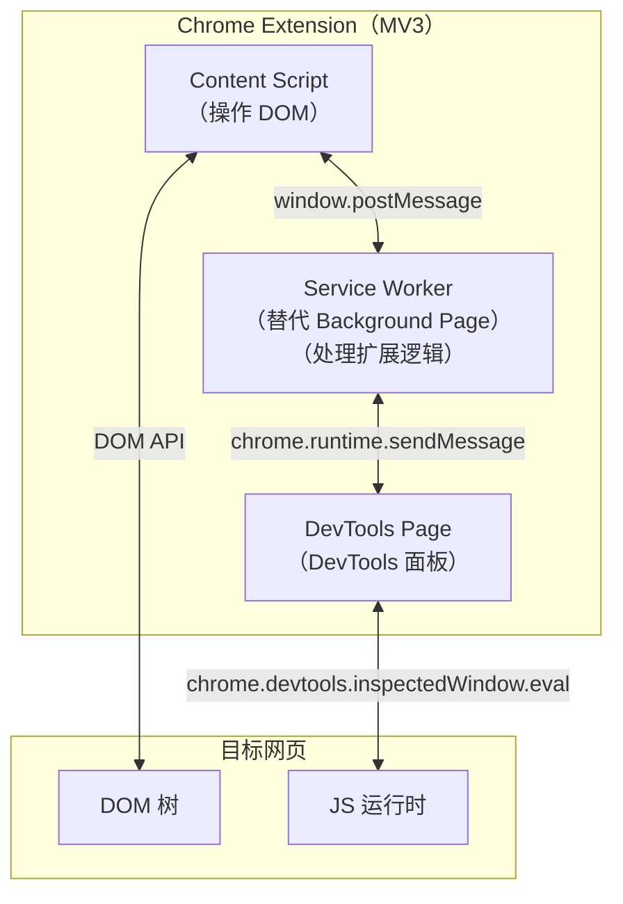
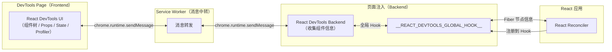
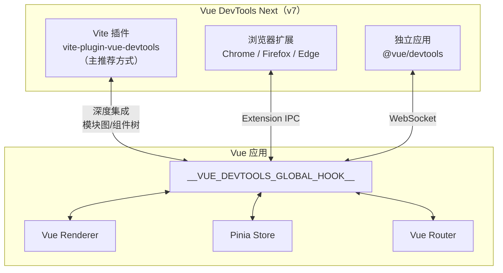
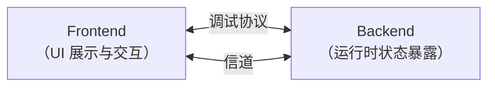

# 调试工具原理总论

调试（Debugging）指代码在某个平台运行时，把运行时的状态通过某种方式暴露出来，传递给开发工具做 UI 的展示和交互，辅助开发者排查问题、梳理流程、了解代码运行状态。

- 网页调试：用 Chrome DevTools 查看元素、网络请求、断点运行 JS，用 Performance 分析性能，还能用 AI Console Insights 智能解释错误。
- Node.js 调试：用 VSCode Debugger 调试 Node.js，可以同时调试多个进程的代码。
- 组件调试：用 React DevTools、Vue DevTools 浏览器扩展调试组件，Vue DevTools 还可作为 Vite 插件深度集成到开发流程。

调试的平台可以是浏览器、Node.js、Electron、小程序等任何能执行 JS 代码的平台；暴露的运行时状态可能是调用栈、执行上下文、DOM 结构或组件状态；暴露数据的方式一般是基于 WebSocket 的调试协议。

常见的调试工具在实现上遵循统一原理，分别来看：

## Chrome DevTools 原理

Chrome DevTools 分为两部分，backend 和 frontend：

- backend 和 Chrome 集成，负责把 Chrome 的网页运行时状态通过调试协议暴露出来。

- frontend 是独立的，负责对接调试协议，做 UI 的展示和交互。

两者之间的调试协议叫做 Chrome DevTools Protocol，简称 CDP。

传输协议数据的方式叫做信道（message channel），有很多种，比如 Chrome DevTools 嵌入在 Chrome 里时，两者通过全局的函数通信；当 Chrome DevTools 远程调试某个目标的代码时，两者通过 WebSocket 通信。

frontend、backend、调试协议（CDP）、信道，这是 Chrome DevTools 的 4 个组成部分。

backend 可以是 Chromium，也可以是 Node.js 或者 V8，这些 JS 的运行时都支持 Chrome DevTools Protocol。

这就是 Chrome DevTools 的调试原理。

> **2024-2026 更新**：Chrome DevTools 在近年新增了多个重要功能，包括 AI Console Insights（基于 Gemini 模型智能解释 Console 错误）、Recorder 面板（录制用户交互并导出为 Playwright/Puppeteer 脚本）、Performance 面板的 Interactions 轨道（可视化 INP 性能指标）等。CDP 协议也持续扩展，新增了 `Preload`、`FedCm`、`Storage Buckets` 等域。

除了 Chrome DevTools 之外，VSCode Debugger 也是常用的调试工具：

## VSCode Debugger 原理

VSCode Debugger 的原理和 Chrome DevTools 差不多，也是分为 frontend、backend、调试协议这几部分，只不过它多了一层适配器协议。

为了能直接用 Chrome DevTools 调试 Node.js 代码，Node.js 6 以上就使用 Chrome DevTools Protocol 作为调试协议了，所以 VSCode Debugger 要调试 Node.js 也是通过这个协议。

但是中间多了一层适配器协议 Debug Adapter Protocol（DAP），这是为什么？

因为 VSCode 不是 JS 专用编辑器，它可能用来调试 Python 代码、Rust 代码等等，自然不能和某一种语言的调试协议深度耦合，所以多了一个适配器层。

这样 VSCode Debugger 就可以用同一套 UI 和逻辑来调试各种语言的代码，只要对接不同的 Debug Adapter 做协议转换即可。

这还有另一个好处：别的编辑器也可以用这个 Debug Adapter Protocol 来实现调试，直接复用 VSCode 的各种语言的 Debug Adapter。比如 Neovim 的 `nvim-dap`、Emacs 的 `dap-mode` 都是基于 DAP 实现的。

VSCode Debugger 的 UI 的部分算是 frontend，而调试的目标语言算是 backend 部分，中间也是通过 stdio 传递 DAP 协议消息（Debug Adapter 作为独立进程运行，与 VSCode 之间通过 stdin/stdout 通信）。

整体和 Chrome DevTools 的调试原理差不多，只不过为了支持 frontend 的跨语言复用，多了一层适配器层。

> **2024-2026 更新**：VSCode 早已内置了 JavaScript Debugger（`js-debug`），替代了已废弃的 `Debugger for Chrome` 扩展。`js-debug` 同时支持 Chrome 和 Node.js 的调试，配置更简单，sourcemap 解析更准确，尤其是在 Vite/esbuild 等现代构建工具场景下。DAP 协议也已演进到 v1.71（`writeMemory` 等内存读写能力在 v1.48 引入，v1.71 进一步规范了整数大小/范围与调试控制台相关行为）。

除了 Chrome DevTools 和 VSCode Debugger 外，平时我们开发 Vue 或 React 应用，还会用 Vue DevTools 和 React DevTools：

## React DevTools

React DevTools 以浏览器扩展（Chrome/Firefox/Edge Extension）的形式存在，要理解它的原理就需要了解 Chrome 扩展的机制——以及近年来从 Manifest V2 到 Manifest V3 的重大迁移。

### Chrome 扩展架构（Manifest V3）

Chrome 扩展在 MV3 中的架构如下：

**MV2 → MV3 关键变化：**

| 方面 | Manifest V2 | Manifest V3 |
|------|------------|------------|
| 后台脚本 | Background Page / Scripts（持久运行） | Service Worker（按需激活，无持久状态） |
| 代码执行 | 允许 `eval()` 和远程代码加载 | 禁止 `eval()` 和远程代码加载 |
| 通信方式 | `chrome.extension.sendMessage` | `chrome.runtime.sendMessage` |
| DevTools API | `chrome.devtools.*` 可用 | `chrome.devtools.*` 仍然可用，无需迁移 |
| CSP | 相对宽松 | 更严格的 CSP 策略 |

**对 DevTools 扩展的影响：** `chrome.devtools.*` API 在 MV3 中完全保留，DevTools 面板可以正常创建和使用。但 Background Script 必须迁移为 Service Worker，这意味着 DevTools 面板与 Background 之间的通信需要考虑 Service Worker 的生命周期管理（Service Worker 可能在空闲时被终止，需要通过 `chrome.runtime.sendMessage` 保持活跃）。

### React DevTools 的实现架构

React DevTools 基于 Chrome 扩展架构实现，分为 backend 和 frontend：

**工作流程：**

1. **Hook 注入**：React DevTools 在页面加载时注入 `__REACT_DEVTOOLS_GLOBAL_HOOK__` 全局变量
2. **Reconciler 注册**：React 的 Reconciler 在初始化时检测到该 Hook，将自身注册进去
3. **信息收集**：Backend 通过 Hook 获取 Fiber 节点树、组件 props/state、渲染时间等信息
4. **消息传递**：Backend 将收集的信息通过 Service Worker 转发给 DevTools Page
5. **UI 渲染**：DevTools Page 根据数据渲染组件树、Props/State 编辑器、Profiler 火焰图等

> **2024-2026 更新**：独立 Electron 应用（`react-devtools` npm 包）并未废弃，仍用于 React Native 等非浏览器环境的调试；对 React Native，官方已转向基于 Hermes 与 CDP 的 React Native DevTools。React 19 的 DevTools 新增了对 Server Components、Actions、`use()` hook 的调试支持，以及改进的 Owner Stack 功能。

## Vue DevTools Next

Vue DevTools 经历了重大架构演进，从 v6 的纯浏览器扩展形态，升级为 v7（Vue DevTools Next）的多形态架构：

**三种形态对比：**

| 形态 | 包名 | 优势 | 适用场景 |
|------|------|------|---------|
| Vite 插件 | `vite-plugin-vue-devtools` | 可访问 Vite 模块图、更深层运行时数据 | Vite 项目开发（**主推荐**） |
| 浏览器扩展 | Vue.js devtools | 无需修改项目配置、支持独立窗口模式 | 非 Vite 项目 / 快速调试 |
| 独立应用 | `@vue/devtools` | 可远程连接、独立运行 | 远程调试 / CI 环境 |

**Vue DevTools Next 新增功能：**

- **Inspector 面板**：检查组件的 props、emits、slots 等详细信息
- **Timeline 面板**：记录组件事件、路由变化、Pinia 状态变化等时间线
- **Component Graph**：可视化组件依赖关系图
- **Pinia DevTools Plugin**：直接在 DevTools 中查看和编辑 Pinia store 状态

## 调试工具的共性——四要素

梳理了 Chrome DevTools、VSCode Debugger、React DevTools、Vue DevTools Next 的原理，可以发现它们存在以下共性：

可以看到，都有 backend 部分负责拿到运行时的信息，有 frontend 部分负责渲染和交互，也有调试协议用来规定不同数据的格式，还有不同的信道，比如 WebSocket、Chrome 扩展的 Service Worker 转发、Vite 插件的直接集成等。

**frontend、backend、调试协议、信道，这是调试工具的四要素。**

不过，不同的调试工具都会有不同的设计，比如 VSCode Debugger 为了跨语言复用，多了一层 Debugger Adapter；React DevTools 通过全局 Hook 注入 backend，通过 Service Worker 转发消息；Vue DevTools Next 以 Vite 插件形态直接在开发服务器中集成，省去了扩展通信的开销。

| 调试工具 | Frontend | Backend | 调试协议 | 信道 |
|---------|----------|---------|---------|------|
| Chrome DevTools | DevTools Frontend | Chromium / Node.js / V8 | CDP | WebSocket / 全局函数 |
| VSCode Debugger | VSCode 调试 UI | js-debug → CDP Backend | DAP → CDP | stdio → WebSocket |
| React DevTools | DevTools Panel | React Reconciler（Hook 注入） | 自定义协议 | Extension Service Worker IPC |
| Vue DevTools Next | Vite 插件 UI / 扩展 Panel | Vue Renderer（Hook 注入） | 自定义协议 | Vite 直连 / Extension IPC |

抓住它们相同的部分来分析，理解不同的部分的设计原因，就很容易掌握各种调试工具的原理。
