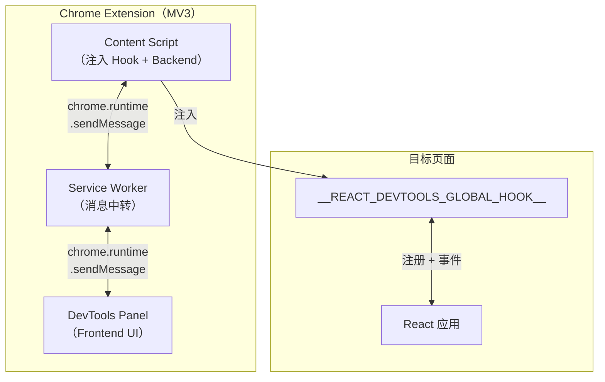
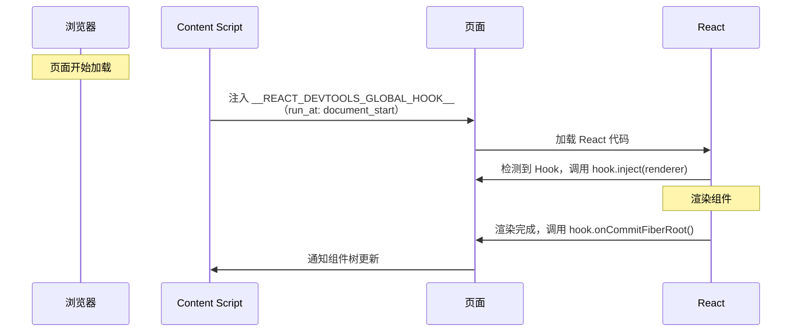
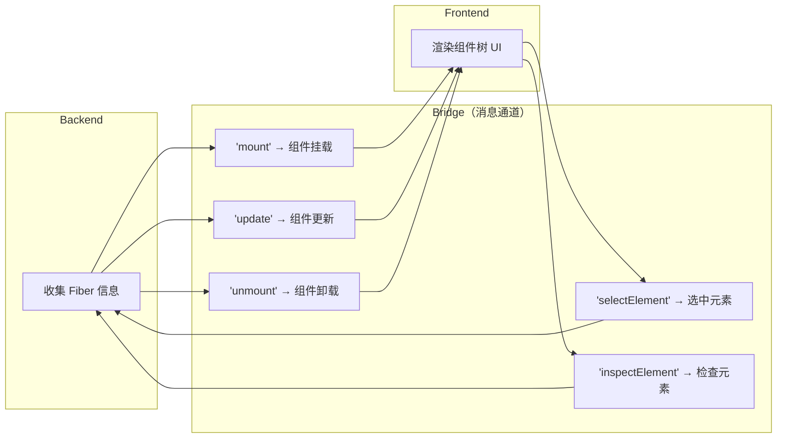
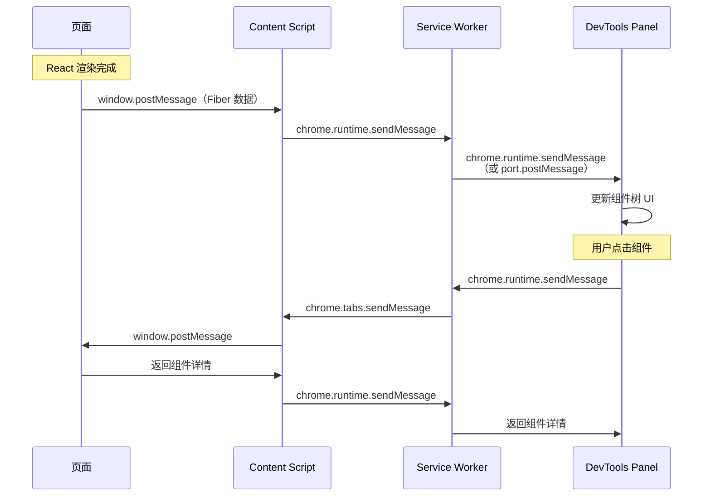
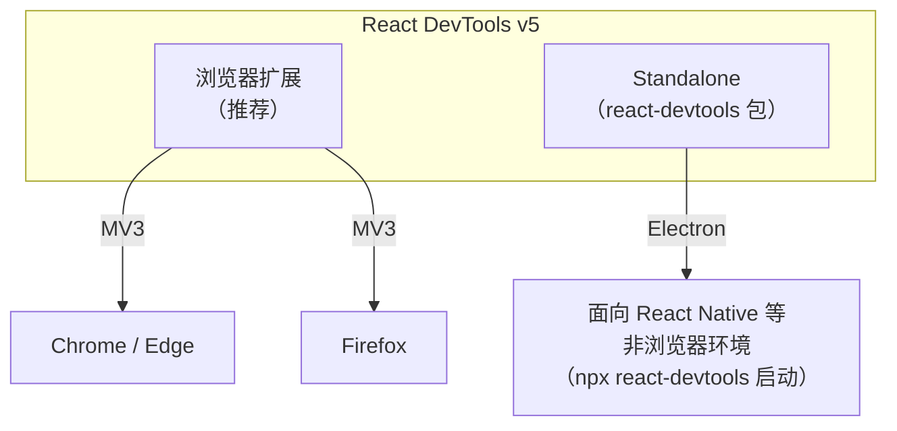
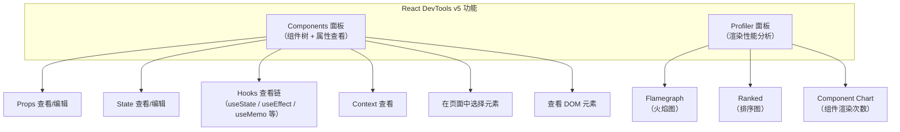
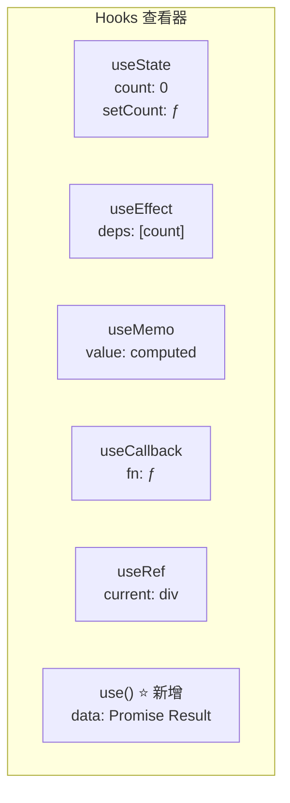
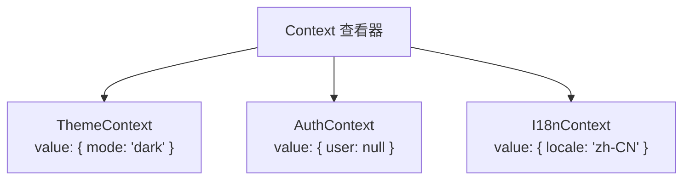
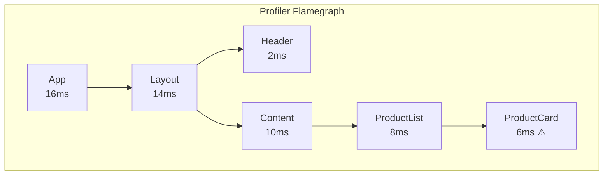
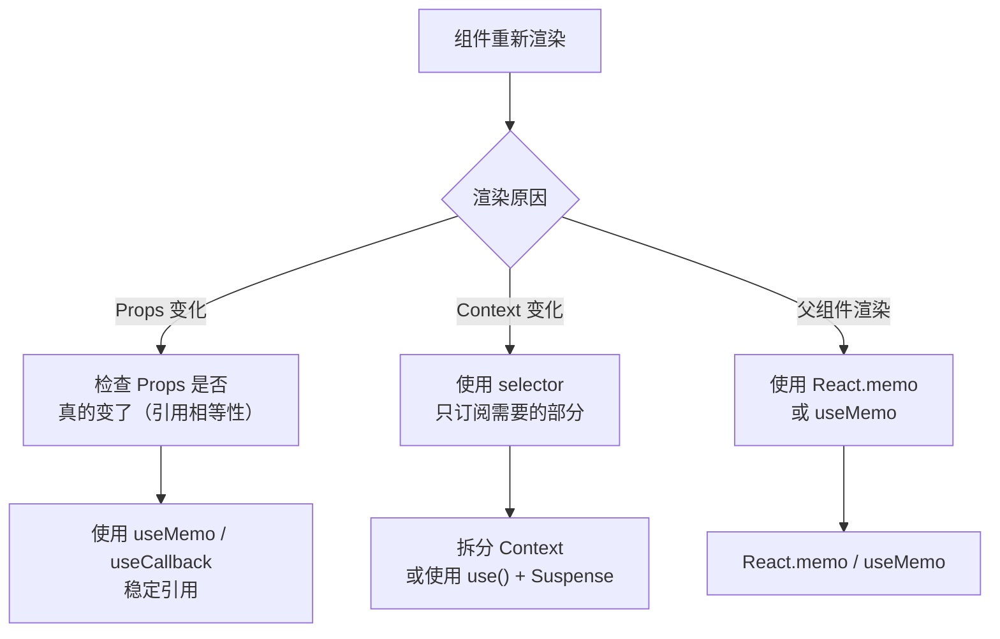

# React-DevTools原理、实现与使用技巧

本节深入探究 React DevTools 的实现原理，并讲解最新功能与调试技巧。

> **2024-2026 更新**：React DevTools 的浏览器扩展已迁移到 Manifest V3，Background Page 替换为 Service Worker。

## React DevTools 的架构

React DevTools 由三部分组成：

1. **Hook**：注入到页面中，拦截 React 的渲染过程
2. **Backend**：收集 Fiber 树信息，通过 Bridge 通道与 Frontend 通信
3. **Frontend**：DevTools 面板 UI，展示组件树和属性



## 步骤一：注入 Hook

React DevTools 通过 Content Script 在页面最早阶段注入一个全局对象 `__REACT_DEVTOOLS_GLOBAL_HOOK__`。React 初始化时会检测这个对象并注册自己。

### Hook 的注入时机



### Hook 的关键接口

```javascript
const hook = {
    // React 实例注册
    _renderers: new Map(),
    inject(renderer) {
        const id = this._renderers.size + 1;
        this._renderers.set(id, renderer);
        return id;
    },

    // Fiber Root 集合
    _fiberRoots: new Map(),
    getFiberRoots(rendererID) {
        return this._fiberRoots.get(rendererID);
    },

    // 渲染完成回调
    onCommitFiberRoot(rendererID, root, priorityLevel) {
        // 通知 Backend 组件树更新
    },

    // 组件卸载回调
    onCommitFiberUnmount(rendererID, fiber) {
        // 通知 Backend 组件卸载
    },

    // 子树渲染回调（React 18+ Concurrent Mode）
    onPostCommitFiberRoot(rendererID, root) {
        // 通知 Backend 子树渲染完成
    },
};
```

## 步骤二：Backend 收集 Fiber 信息

Backend 通过 Hook 的回调收集 Fiber 树信息，并将其转换为 DevTools 可以理解的格式。

### Fiber 树遍历

```javascript
function traverseFiberTree(fiber, depth = 0) {
    if (!fiber) return null;

    // Fiber 的 tag 对应不同类型的组件
    // 0: FunctionComponent
    // 1: ClassComponent
    // 2: IndeterminateComponent
    // 5: HostComponent (DOM 元素)
    // 6: HostText (文本节点)

    const node = {
        id: fiber._debugID,
        name: getDisplayName(fiber),
        type: fiber.tag,
        depth,
        key: fiber.key,
        props: fiber.memoizedProps,
        state: fiber.memoizedState,
        children: [],
    };

    // 遍历子节点
    let child = fiber.child;
    while (child) {
        const childNode = traverseFiberTree(child, depth + 1);
        if (childNode) {
            node.children.push(childNode);
        }
        child = child.sibling;
    }

    return node;
}
```

### React 19 的变化

> **2024-2026 更新**：React 19 引入了新的 Fiber 类型：

| Fiber Tag | 类型 | 说明 |
|-----------|------|------|
| 0 | FunctionComponent | 函数组件 |
| 1 | ClassComponent | 类组件 |
| 11 | ForwardRef | forwardRef 组件 |
| 14 | Memo | React.memo 组件 |
| 15 | SimpleMemoComponent | 简单 memo 组件 |
| 22 | OffscreenComponent | **新增**：Offscreen API |
| 31 | ActivityComponent | **新增**：Activity（Suspense 活动状态） |

## 步骤三：消息通信（Bridge）

Frontend 和 Backend 之间通过 Bridge 通信，消息格式如下：



### MV3 下的消息通信

> **2024-2026 更新**：MV3 使用 Service Worker 替代 Background Page，消息通信方式有变化：



**MV3 的关键变化**：

| 方面 | MV2 | MV3 |
|------|-----|-----|
| 后台脚本 | Background Page（持久） | Service Worker（非持久） |
| 生命周期 | 始终运行 | 空闲 30s 后终止 |
| 消息通信 | chrome.runtime.connect | chrome.runtime.sendMessage + port |
| eval | 允许 | 禁止 |
| 远程代码 | 允许 | 禁止 |

**Service Worker 生命周期问题**：Service Worker 空闲 30 秒后会被终止，React DevTools 需要保持活跃才能持续通信——保持一条 `chrome.runtime.connect` 长连接、或定期调用扩展 API / 心跳消息来重置空闲计时。

## 步骤四：Frontend 渲染组件树

Frontend 使用 React 自身渲染 DevTools 面板 UI：

- **组件树**：虚拟化的树形列表（支持大规模组件树）
- **Props Viewer**：JSON 树查看器，支持编辑
- **State Viewer**：支持 Hooks 链查看
- **Profiler**：火焰图展示渲染性能

### React DevTools v5 的架构

> **2024-2026 更新**：浏览器扩展是 Web 开发的主要使用方式；standalone Electron 版本（`react-devtools` 包）仍可使用，主要用于 React Native 等非浏览器环境。



## 动手实现简易版 React DevTools

掌握了上述原理后，下面动手实现一个简易版。

> **2024-2026 更新**：本节基于 React 19 + Manifest V3 实现。React 19 的 DevTools Hook 接口与 React 18 基本兼容。

简易版 React DevTools 具备以下功能：

1. 展示 React 组件树
2. 点击组件查看 Props 和 State
3. 修改 State 并触发重新渲染

## 步骤一：创建 Chrome Extension

### manifest.json（MV3）

```json
{
    "manifest_version": 3,
    "name": "Simple React DevTools",
    "version": "1.0",
    "devtools_page": "devtools.html",
    "content_scripts": [
        {
            "matches": ["<all_urls>"],
            "js": ["content-script.js"],
            "run_at": "document_start"
        }
    ],
    "background": {
        "service_worker": "background.js"
    },
    "permissions": ["activeTab"]
}
```

### devtools.html

```html
<!DOCTYPE html>
<html>
<body>
<script src="devtools.js"></script>
</body>
</html>
```

### devtools.js

```javascript
// 创建 DevTools 面板
chrome.devtools.panels.create(
    "Simple React DevTools",
    "",  // 图标
    "panel.html",  // 面板页面
    function(panel) {
        console.log("Simple React DevTools panel created");
    }
);
```

## 步骤二：注入 Hook 并收集组件信息

### content-script.js

```javascript
// 注入 Hook 到页面
const script = document.createElement('script');
script.src = chrome.runtime.getURL('inject-hook.js');
script.onload = () => script.remove();
(document.head || document.documentElement).appendChild(script);

// 监听来自页面的消息（通过 window.postMessage）
window.addEventListener('message', (event) => {
    if (event.source !== window) return;
    if (event.data.type === '__SIMPLE_REACT_DEVTOOLS__') {
        // 转发给 Service Worker
        chrome.runtime.sendMessage({
            type: 'FROM_PAGE',
            data: event.data.payload,
        });
    }
});

// 监听来自 Service Worker 的消息
chrome.runtime.onMessage.addListener((message) => {
    if (message.type === 'FROM_DEVTOOLS') {
        // 转发给页面
        window.postMessage({
            type: '__SIMPLE_REACT_DEVTOOLS_COMMAND__',
            payload: message.data,
        }, '*');
    }
});
```

### inject-hook.js

```javascript
// 在页面上下文中执行
(function() {
    const hook = {
        _renderers: new Map(),
        _fiberRoots: new Map(),
        _listeners: new Set(),

        inject(renderer) {
            const id = this._renderers.size + 1;
            this._renderers.set(id, renderer);
            return id;
        },

        onCommitFiberRoot(rendererID, root) {
            const fiberRoots = this._fiberRoots.get(rendererID) || new Set();
            fiberRoots.add(root);
            this._fiberRoots.set(rendererID, fiberRoots);

            // 通知 Content Script
            this._notifyListeners(root);
        },

        onCommitFiberUnmount() {
            // 处理组件卸载
        },

        getFiberRoots(rendererID) {
            return this._fiberRoots.get(rendererID) || new Set();
        },

        _notifyListeners(root) {
            const tree = this._traverseFiber(root.current);
            window.postMessage({
                type: '__SIMPLE_REACT_DEVTOOLS__',
                payload: {
                    event: 'render',
                    tree,
                },
            }, '*');
        },

        _traverseFiber(fiber, depth = 0) {
            if (!fiber) return null;
            // 组件类型节点：构建 node；其余节点跳过自身、继续遍历子节点
            if (fiber.tag === 0 || fiber.tag === 1 || fiber.tag === 2) {
                const name = fiber.type?.displayName ||
                             fiber.type?.name ||
                             (typeof fiber.type === 'string' ? fiber.type : 'Anonymous');

                const node = {
                    id: fiber._debugID || Math.random().toString(36).slice(2),
                    name,
                    depth,
                    props: fiber.memoizedProps,
                    state: fiber.memoizedState,
                    children: [],
                };

                let child = fiber.child;
                while (child) {
                    const childNode = this._traverseFiber(child, depth + 1);
                    if (childNode) {
                        node.children.push(childNode);
                    }
                    child = child.sibling;
                }

                return node;
            } else {
                // 跳过中间节点，继续遍历子节点
                let child = fiber.child;
                const children = [];
                while (child) {
                    const childNode = this._traverseFiber(child, depth);
                    if (childNode) {
                        children.push(childNode);
                    }
                    child = child.sibling;
                }
                return children.length === 1 ? children[0] : (children.length > 1 ? { children, name: 'Fragment' } : null);
            }
        },
    };

    // 注入全局 Hook
    Object.defineProperty(window, '__REACT_DEVTOOLS_GLOBAL_HOOK__', {
        value: hook,
        writable: false,
    });

    console.log('[Simple React DevTools] Hook injected');
})();
```

## 步骤三：消息中转（Service Worker）

### background.js

```javascript
let devToolsPort = null;

chrome.runtime.onConnect.addListener((port) => {
    if (port.name === 'devtools') {
        devToolsPort = port;

        devToolsPort.onMessage.addListener((message) => {
            // 从 DevTools 转发到 Content Script
            chrome.tabs.sendMessage(message.tabId, {
                type: 'FROM_DEVTOOLS',
                data: message.data,
            });
        });

        // Service Worker 生命周期管理
        port.onDisconnect.addListener(() => {
            devToolsPort = null;
        });
    }
});

chrome.runtime.onMessage.addListener((message, sender, sendResponse) => {
    if (message.type === 'FROM_PAGE') {
        // 从 Content Script 转发到 DevTools
        if (devToolsPort) {
            devToolsPort.postMessage({
                type: 'FROM_PAGE',
                data: message.data,
            });
        }
    }
});
```

## 步骤四：实现 Frontend UI

### panel.js

```javascript
const port = chrome.runtime.connect({ name: 'devtools' });

// 监听来自 Backend 的组件树更新
port.onMessage.addListener((message) => {
    if (message.type === 'FROM_PAGE' && message.data.event === 'render') {
        renderTree(message.data.tree);
    }
});

function renderTree(tree) {
    const container = document.getElementById('component-tree');
    container.innerHTML = '';
    renderNode(tree, container, 0);
}

function renderNode(node, container, depth) {
    const div = document.createElement('div');
    div.style.paddingLeft = `${depth * 16}px`;
    div.style.cursor = 'pointer';
    div.textContent = `<${node.name} />`;
    div.style.padding = '4px 8px';

    div.addEventListener('click', () => {
        showComponentDetail(node);
    });

    div.addEventListener('mouseenter', () => {
        div.style.backgroundColor = '#e3f2fd';
    });

    div.addEventListener('mouseleave', () => {
        div.style.backgroundColor = 'transparent';
    });

    container.appendChild(div);

    if (node.children) {
        node.children.forEach(child => renderNode(child, container, depth + 1));
    }
}

function showComponentDetail(node) {
    const detail = document.getElementById('component-detail');
    detail.innerHTML = `
        <h3>&lt;${node.name} /&gt;</h3>
        <h4>Props:</h4>
        <pre>${JSON.stringify(node.props, null, 2)}</pre>
        <h4>State:</h4>
        <pre>${JSON.stringify(simplifyState(node.state), null, 2)}</pre>
    `;
}

// 简化 State 显示（过滤掉 Hook 内部属性）
function simplifyState(state) {
    if (!state) return null;
    const result = {};
    let current = state;
    let index = 0;
    while (current) {
        if (current.memoizedState !== undefined) {
            result[`hook_${index}`] = current.memoizedState;
        }
        current = current.next;
        index++;
        if (index > 20) break; // 防止无限循环
    }
    return result;
}
```

### panel.html

```html
<!DOCTYPE html>
<html>
<head>
    <style>
        body { font-family: monospace; font-size: 13px; margin: 0; }
        #app { display: flex; height: 100vh; }
        #component-tree { flex: 1; overflow: auto; border-right: 1px solid #ddd; }
        #component-detail { flex: 1; overflow: auto; padding: 8px; }
        h3 { margin: 8px 0; color: #1565c0; }
        h4 { margin: 4px 0; color: #666; }
        pre { background: #f5f5f5; padding: 8px; overflow: auto; font-size: 12px; }
    </style>
</head>
<body>
    <div id="app">
        <div id="component-tree"></div>
        <div id="component-detail"></div>
    </div>
    <script src="panel.js"></script>
</body>
</html>
```

## 完整的文件结构

```text
simple-react-devtools/
├── manifest.json
├── devtools.html
├── devtools.js
├── panel.html
├── panel.js
├── content-script.js
├── inject-hook.js
└── background.js
```

## MV3 的关键注意事项

> **2024-2026 更新**：开发 MV3 扩展时需要注意以下问题：

### Service Worker 生命周期

Service Worker 在空闲 30 秒后会自动终止，需要处理重新连接的逻辑：

```javascript
// background.js 中保持活跃
chrome.runtime.onConnect.addListener((port) => {
    if (port.name === 'devtools') {
        // 长连接存在时会重置 Service Worker 空闲计时；
        // 也可以定期调用任意扩展 API（如 storage）来重置计时
        chrome.storage.local.set({ devtoolsConnected: true });
    }
});

// 或使用定期 alarm
chrome.alarms.create('keepAlive', { periodInMinutes: 0.5 });
chrome.alarms.onAlarm.addListener(() => {
    // 保持 Service Worker 活跃
});
```

### 禁止 eval 和远程代码

MV3 不允许使用 `eval()` 和加载远程代码，所有脚本必须打包在扩展中：

```javascript
// ❌ MV2 允许但 MV3 禁止
eval('console.log("hello")');

// ❌ MV3 禁止远程脚本
chrome.scripting.executeScript({
    code: 'fetch("https://example.com/script.js").then(...)'
});
```

### 消息通信的可靠性

Service Worker 可能随时被终止，需要确保消息不丢失：

```javascript
// 使用 chrome.storage.local 作为消息缓存
async function sendMessageWithRetry(message) {
    // 先缓存消息
    await chrome.storage.local.set({ pendingMessage: message });
    // 尝试发送
    try {
        await chrome.runtime.sendMessage(message);
        await chrome.storage.local.remove('pendingMessage');
    } catch (e) {
        // Service Worker 可能已终止，等待重新连接
    }
}
```


## 功能使用与调试技巧

> **2024-2026 更新**：React DevTools v5 支持 React 19 的所有新特性，包括 Actions、use() Hook、Server Components 等。

## React DevTools v5 的功能



## Components 面板

### 查看 Hooks 链

React 19 的 Hooks 查看更加清晰，每个 Hook 都有独立标识：



### React 19 新增：use() Hook 调试

React 19 的 `use()` Hook 可以在渲染时读取 Promise 或 Context：

```javascript
function UserProfile({ userPromise }) {
    // use() 可以在 if 语句中使用
    const user = use(userPromise);

    return <div>{user.name}</div>;
}
```

在 React DevTools 中，`use()` Hook 会显示：
- 如果 Promise 还在 pending，显示 "Pending"
- 如果 Promise 已 resolved，显示 resolved 的值
- 如果 Promise 已 rejected，显示错误信息

### React 19 新增：Actions 调试

React 19 引入了 Actions 概念，`useActionState` Hook 用于管理异步操作的状态：

```javascript
import { useActionState } from 'react';

function Form() {
    const [state, submitAction, isPending] = useActionState(
        async (prevState, formData) => {
            const result = await submitForm(formData);
            return result;
        },
        { status: 'idle' }
    );

    return (
        <form action={submitAction}>
            <input name="name" />
            <button type="submit" disabled={isPending}>
                {isPending ? 'Submitting...' : 'Submit'}
            </button>
        </form>
    );
}
```

在 React DevTools 中，`useActionState` 会显示：
- 当前 state
- action 函数
- isPending 状态

### Context 查看器

React DevTools 可以查看组件接收的所有 Context：



## Profiler 面板

### Flamegraph（火焰图）

火焰图展示每次渲染的组件调用层级和耗时：



**颜色含义**：
- 绿色/黄色：正常耗时
- 红色：耗时较长（需要优化）
- 灰色：本次渲染没有更新

### Ranked（排序图）

按渲染耗时从高到低排列，快速找到最慢的组件。

### 为什么组件重新渲染？

点击 Profiler 中的组件，即可查看其重新渲染的原因：

| 原因 | 说明 |
|------|------|
| Props changed | 父组件传入了新的 Props |
| State changed | 组件内部 State 变化 |
| Hooks changed | 依赖项变化触发 Hook 重新执行 |
| Context changed | 接收的 Context 值变化 |
| Parent re-rendered | 父组件重新渲染导致子组件也渲染 |

### 避免不必要的渲染



## React 调试最佳实践

### 1. 使用 React.memo 避免不必要的渲染

```javascript
// 用 React DevTools Profiler 发现 ProductCard 不必要地渲染
// 解决：用 React.memo 包裹
const ProductCard = React.memo(function ProductCard({ product }) {
    return <div>{product.name}</div>;
});
```

### 2. 使用 useMemo / useCallback 稳定引用

```javascript
function ProductList({ products, onSelect }) {
    // ❌ 每次渲染都创建新引用
    const sortedProducts = products.sort((a, b) => a.price - b.price);

    // ✅ 使用 useMemo 缓存
    const sortedProducts = useMemo(
        () => products.sort((a, b) => a.price - b.price),
        [products]
    );

    // ❌ 每次渲染都创建新函数
    const handleClick = (id) => onSelect(id);

    // ✅ 使用 useCallback 缓存
    const handleClick = useCallback((id) => onSelect(id), [onSelect]);
}
```

### 3. 使用 key 属性帮助 React 识别组件

```javascript
// ❌ 使用 index 作为 key
{items.map((item, index) => <Item key={index} item={item} />)}

// ✅ 使用稳定的 ID 作为 key
{items.map(item => <Item key={item.id} item={item} />)}
```

### 4. 使用 Suspense 调试异步加载

```javascript
import { Suspense } from 'react';

function App() {
    return (
        <Suspense fallback={<Loading />}>
            <UserProfile userPromise={fetchUser()} />
        </Suspense>
    );
}
```

React DevTools 会显示 Suspense 边界及其内部的 loading 状态。

### 5. Server Components 调试

> **2024-2026 新增**：React 19 的 Server Components 在 DevTools 中有特殊标识：

在 React DevTools 的组件树中：
- Server Components 显示为普通组件，但有 "Server Component" 标记
- Client Components 显示 "use client" 标记
- 可以查看 Server Components 传递给 Client Components 的 Props

## React DevTools 的快捷键

| 快捷键 | 功能 |
|--------|------|
| `Ctrl/Cmd + F` | 搜索组件名 |
| `Ctrl/Cmd + Shift + C` | 在页面中选择元素 |
| `Ctrl/Cmd + P` | 切换 Profiler 录制 |

