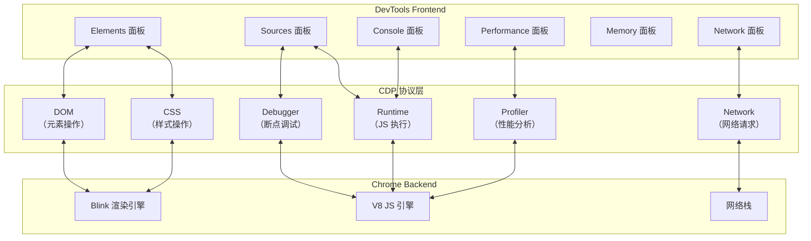
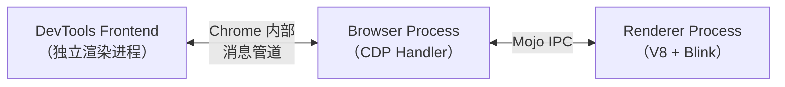
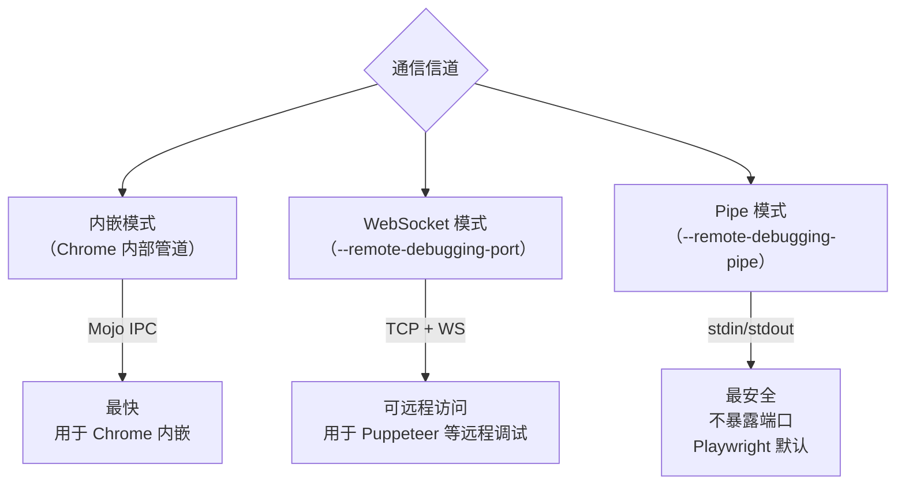
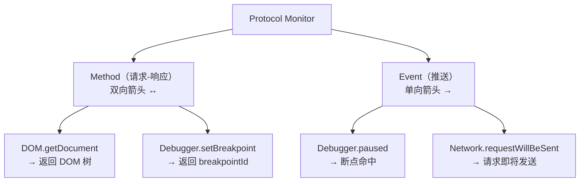
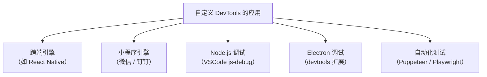
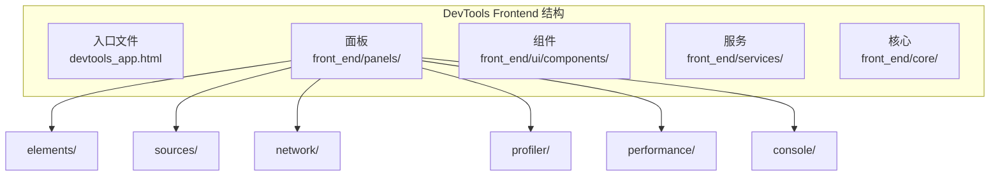
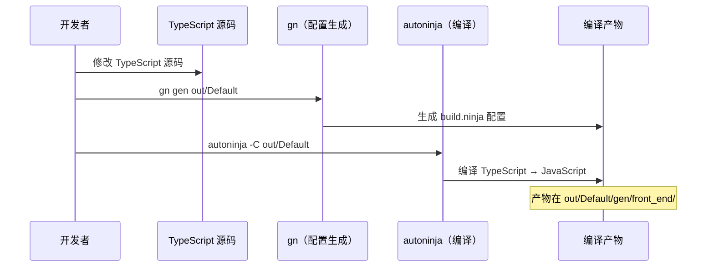

# Chrome-DevTools原理与定制

Chrome DevTools 是前端最常用的调试工具，掌握其实现原理对于深入理解调试机制至关重要。

## Chrome DevTools 的架构

Chrome DevTools 由三大部分组成：

1. **Frontend**：UI 展示和交互
2. **Backend**：运行时状态暴露
3. **CDP**：Chrome DevTools Protocol（通信协议）



### Frontend

DevTools Frontend 是一个独立的 Web 应用，源码在 [Chrome DevTools Frontend 仓库](https://chromium.googlesource.com/devtools/devtools-frontend/)。它由 HTML、CSS、JavaScript 编写，运行在独立的渲染进程中。

### Backend

Backend 集成在 Chromium 中，负责将 V8 和 Blink 的运行时状态通过 CDP 暴露出来。不同的 CDP Domain 对应不同的 Backend 实现：

| CDP Domain | Backend 实现 | 功能 |
|-----------|-------------|------|
| DOM | Blink 的 DOM 树 | 元素查询、修改 |
| CSS | Blink 的 CSS 引擎 | 样式查询、修改 |
| Debugger | V8 Inspector | 断点、单步执行 |
| Runtime | V8 Inspector | JS 表达式求值 |
| Network | Chromium 网络栈 | 请求拦截、修改 |
| Profiler | V8 CPU Profiler | 性能分析 |
| HeapProfiler | V8 Heap Profiler | 内存分析 |
| Page | Blink | 页面导航、截图 |
| Emulation | Blink | 设备模拟 |

> **2024-2026 更新**：CDP 持续扩展新域，如 `Preload`（预加载控制）、`FedCm`（联邦身份管理）、`Storage`（存储桶）等。CDP 的完整文档在 [Chrome DevTools Protocol 官网](https://chromedevtools.github.io/devtools-protocol/)。

### CDP（Chrome DevTools Protocol）

CDP 是 Frontend 和 Backend 之间的通信协议，基于 JSON-RPC 格式：

```json
// 请求
{
    "id": 1,
    "method": "Debugger.setBreakpointByUrl",
    "params": {
        "lineNumber": 10,
        "url": "http://localhost:5173/src/App.jsx"
    }
}

// 响应
{
    "id": 1,
    "result": {
        "breakpointId": "1:10:0:http://localhost:5173/src/App.jsx"
    }
}

// 事件
{
    "method": "Debugger.paused",
    "params": {
        "callFrames": [...],
        "reason": "breakpoint"
    }
}
```

## DevTools 的通信信道

### 1. 内嵌模式（Embedded）

当 DevTools 嵌入在 Chrome 中时，Frontend 和 Backend 通过 Chrome 的内部消息管道通信：



### 2. 远程调试模式（Remote Debugging）

当通过 `--remote-debugging-port` 启动 Chrome 时，Backend 暴露 WebSocket 服务，Frontend 通过 WebSocket 连接：

```bash
# 启动 Chrome 并暴露调试端口
chrome --remote-debugging-port=9222
```

访问 `http://localhost:9222/json` 可以看到所有可调试的 Target：

```json
[
    {
        "description": "",
        "devtoolsFrontendUrl": "devtools://devtools/bundled/inspector.html?ws=...",
        "id": "ABC123",
        "title": "New Tab",
        "type": "page",
        "url": "chrome://newtab/",
        "webSocketDebuggerUrl": "ws://localhost:9222/devtools/page/ABC123"
    }
]
```

`webSocketDebuggerUrl` 就是连接到该 Target 的 WebSocket 地址。

### 3. Pipe 模式

> **2024-2026 新增**：Chrome 还支持通过 `--remote-debugging-pipe` 启动，使用标准输入/输出管道而非 WebSocket 通信。这种方式更安全（不暴露网络端口），Playwright 默认使用 pipe 模式（Puppeteer 默认走 WebSocket，可通过 `pipe: true` 切换）。



## CDP 的核心 Domain 详解

### Debugger Domain（断点调试）

```javascript
// 启用 Debugger
{ "method": "Debugger.enable" }

// 设置断点
{ "method": "Debugger.setBreakpointByUrl", "params": { "lineNumber": 10, "url": "..." } }

// 单步执行
{ "method": "Debugger.stepOver" }
{ "method": "Debugger.stepInto" }
{ "method": "Debugger.stepOut" }
{ "method": "Debugger.resume" }

// 断点命中事件
{ "method": "Debugger.paused", "params": { "callFrames": [...], "reason": "breakpoint" } }
```

### Runtime Domain（JS 执行）

```javascript
// 启用 Runtime
{ "method": "Runtime.enable" }

// 执行表达式
{ "method": "Runtime.evaluate", "params": { "expression": "document.title" } }

// 获取对象属性
{ "method": "Runtime.getProperties", "params": { "objectId": "..." } }

// Console 消息事件
{ "method": "Runtime.consoleAPICalled", "params": { "type": "log", "args": [...] } }
```

### DOM Domain（元素操作）

```javascript
// 获取文档
{ "method": "DOM.getDocument" }

// 查询节点
{ "method": "DOM.querySelector", "params": { "nodeId": 1, "selector": ".app" } }

// 设置节点属性
{ "method": "DOM.setAttributeValue", "params": { "nodeId": 3, "name": "class", "value": "active" } }
```

### Network Domain（网络请求）

```javascript
// 启用 Network
{ "method": "Network.enable" }

// 请求即将发送事件
{ "method": "Network.requestWillBeSent", "params": { "requestId": "...", "request": {...} } }

// 响应接收事件
{ "method": "Network.responseReceived", "params": { "requestId": "...", "response": {...} } }
```

## Protocol Monitor 查看 CDP 交互

Chrome DevTools 内置了 Protocol Monitor 面板，可以实时查看所有 CDP 数据交互：

1. 打开 DevTools 设置 → Experiments → 勾选 Protocol Monitor
2. More Tools → Protocol Monitor



## 用 CDP 自定义 DevTools Frontend

Chrome DevTools Frontend 是一个独立的项目，可以用自己的 Backend 对接它。

### 从 npm 获取 Frontend

> **2024-2026 更新**：Chrome DevTools Frontend 现在可以从 [npm](https://www.npmjs.com/package/chrome-devtools-frontend) 获取，也可以直接使用 devtools://devtools/bundled/inspector.html。

### 用 WebSocket Backend 对接 Frontend

```javascript
const { WebSocketServer } = require('ws');

const wss = new WebSocketServer({ port: 8080 });

wss.on('connection', (ws) => {
    ws.on('message', (data) => {
        const message = JSON.parse(data);

        // 处理 CDP 请求
        if (message.method === 'DOM.getDocument') {
            ws.send(JSON.stringify({
                id: message.id,
                result: {
                    root: {
                        nodeId: 1,
                        nodeName: '#document',
                        children: [...]
                    }
                }
            }));
        }
    });
});
```

在 Frontend 的 URL 中加上 `ws=localhost:8080` 参数即可对接。

### 自定义 DevTools 的应用场景



**跨端引擎**：需要自己实现 CDP Backend，将原生组件的信息通过 CDP 格式传给 Frontend。

**小程序引擎**：渲染用 WebView，有现成的 CDP Backend，只需对接 Frontend 即可。

**Electron**：直接使用 `BrowserWindow.webContents.setDevToolsWebContents()` API。

## 编译和定制 DevTools Frontend 源码

Chrome DevTools Frontend 是一个独立项目，可以下载源码、修改、编译，此后让 Chrome 使用定制版本。

> **2024-2026 更新**：Chrome DevTools Frontend 源码已迁移到 [chromium.googlesource.com](https://chromium.googlesource.com/devtools/devtools-frontend/)，编译工具链也有更新。

### 为什么要定制 Chrome DevTools？

- 添加自定义的调试面板
- 修改现有面板的 UI 或功能
- 集成团队内部的调试工具
- 学习 Chrome DevTools 的实现方式

## 下载和编译

### 步骤一：下载 depot_tools

Chrome DevTools Frontend 使用 Chromium 的工具链（depot_tools）：

```bash
# 克隆 depot_tools（需要科学上网）
git clone https://chromium.googlesource.com/chromium/tools/depot_tools.git

# 添加到 PATH
export PATH=/path/to/depot_tools:$PATH
```

depot_tools 提供了 `fetch`、`gn`、`autoninja`、`gclient` 等命令。

### 步骤二：下载 DevTools Frontend 源码

```bash
mkdir devtools && cd devtools

# 下载源码（需要科学上网，耗时较长）
fetch devtools-frontend
```

下载完成后，`front_end` 目录下就是 DevTools 的前端代码。

### 步骤三：修改源码

例如修改 Profiler 面板的按钮文字：

```typescript
// front_end/panels/profiler/ProfileLauncherView.ts
this.controlButton.textContent = "快照测试";
this.controlButton.style.backgroundColor = "red";
```

### 步骤四：编译

```bash
cd devtools-frontend

# 生成编译配置
gn gen out/Default --args='devtools_skip_typecheck=true'

# 编译
autoninja -C out/Default
```

编译完成后，产物在 `out/Default/gen/front_end` 目录下。

### 步骤五：使用自定义 Frontend

```bash
# 直接在浏览器中打开
cd out/Default/gen/front_end
npx http-server .

# 或让 Chrome 使用自定义 Frontend
"/Applications/Google Chrome.app/Contents/MacOS/Google Chrome" \
  --custom-devtools-frontend=file:///path/to/devtools-frontend/out/Default/gen/front_end
```

## 在 VSCode Debugger 中使用自定义 Frontend

```json
{
    "name": "Launch Chrome with Custom DevTools",
    "request": "launch",
    "type": "chrome",
    "runtimeArgs": [
        "--auto-open-devtools-for-tabs",
        "--custom-devtools-frontend=file:///path/to/devtools-frontend/out/Default/gen/front_end"
    ],
    "url": "http://localhost:5173",
    "webRoot": "${workspaceFolder}"
}
```

## DevTools Frontend 的项目结构



## 定制 DevTools 的常见场景

### 场景一：添加自定义面板

```javascript
// 在 front_end/panels/ 下创建新面板
// my-panel/

// 1. 创建面板入口
export class MyPanel extends UI.Panel.Panel {
    constructor() {
        super('my-panel');
        const contentElement = this.contentElement;
        contentElement.textContent = 'My Custom Panel';
    }
}

// 2. 注册面板
UI.ActionRegistration.registerActionExtension({
    actionId: 'my-panel.show',
    category: UI.ActionRegistration.ActionCategory.DEVTOOLS,
    title: 'My Panel',
    bindings: [],
});

// 3. 在 Manager 中注册
UI.ViewManager.registerViewExtension({
    location: UI.ViewManager.ViewLocationValues.PANEL,
    id: 'my-panel',
    title: 'My Panel',
    commandPrompt: 'Show My Panel',
    order: 100,
    creator: () => new MyPanel(),
});
```

### 场景二：修改现有面板

直接修改 `front_end/panels/` 下对应面板的 TypeScript 源码，此后重新编译。

### 场景三：添加 Console 命令

DevTools Frontend 并没有公开的「自定义 Console 命令」注册 API（不存在 `Runtime.CRC.registerCustomCommand` 之类的接口）。如果需要类似能力，常见的替代做法是：

- 直接修改 Console 相关源码（见场景二）后重新编译；
- 在自定义面板（场景一）中实现自己的命令输入与执行逻辑；
- 使用 Console 面板内置的 Snippets（代码片段）保存常用调试脚本。

## 编译流程



