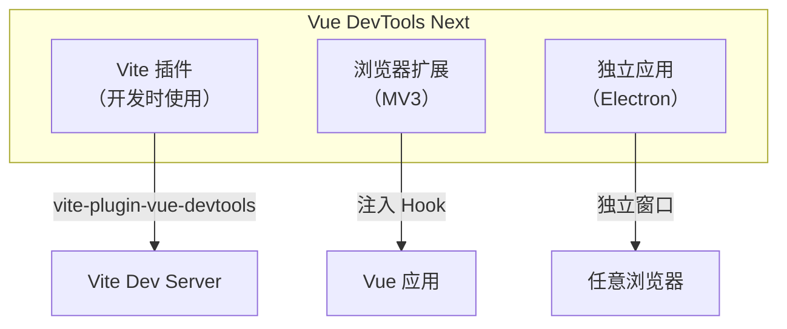
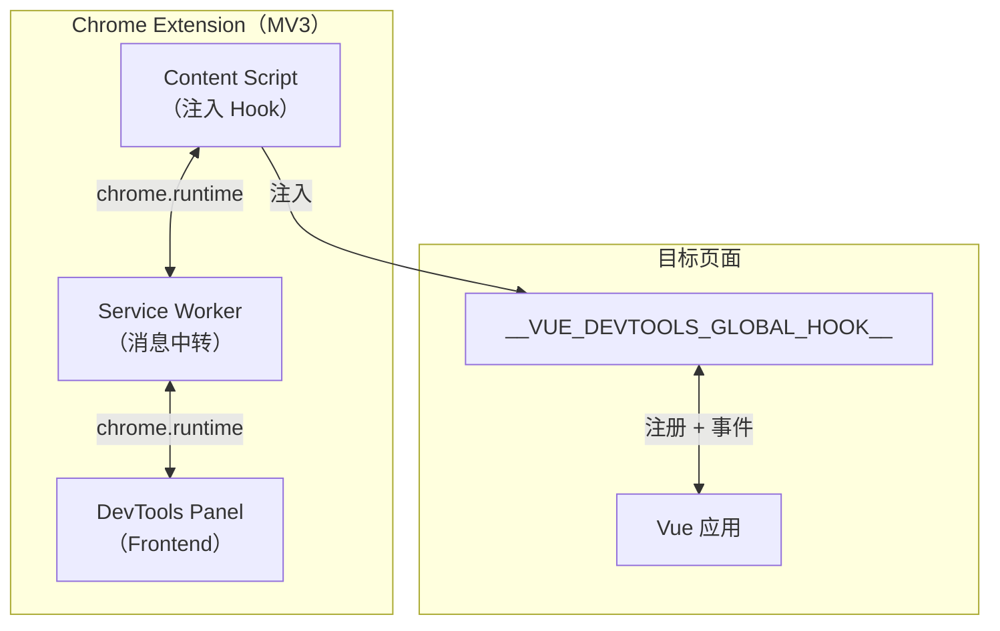
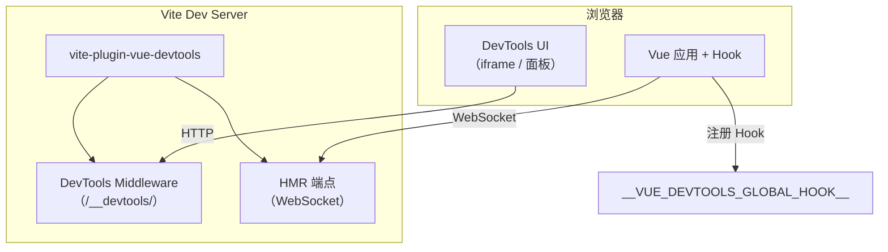
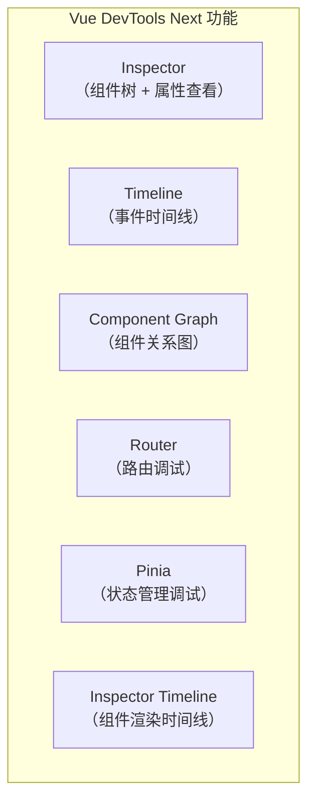
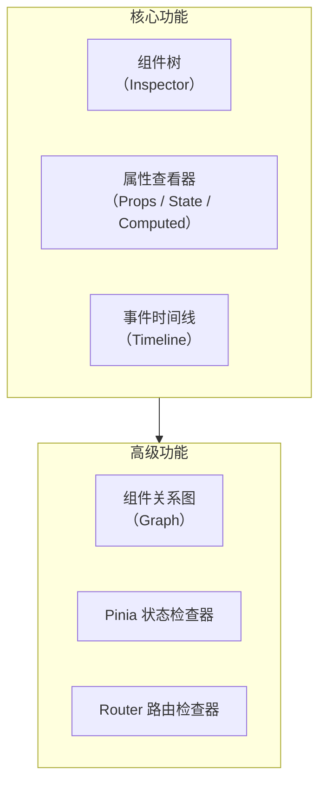
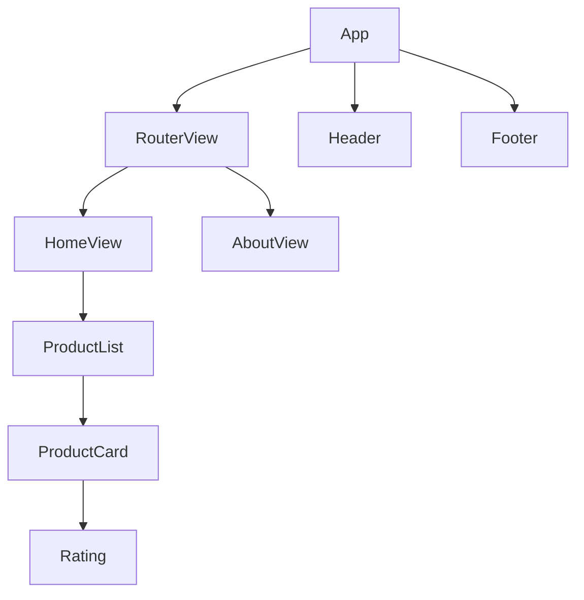
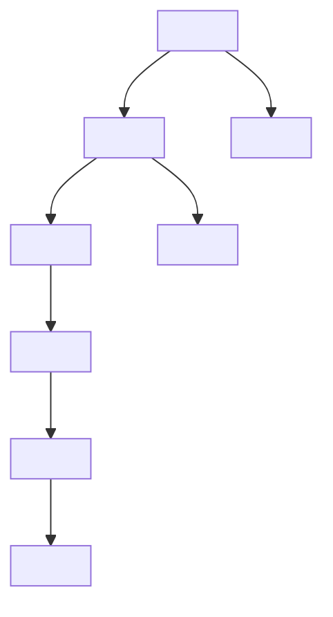
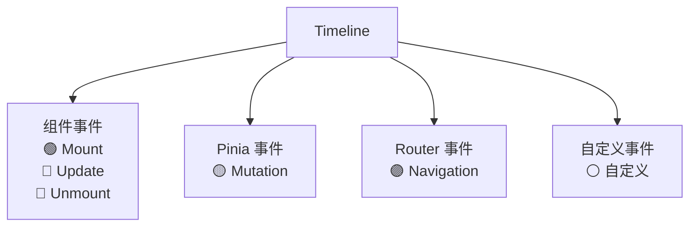
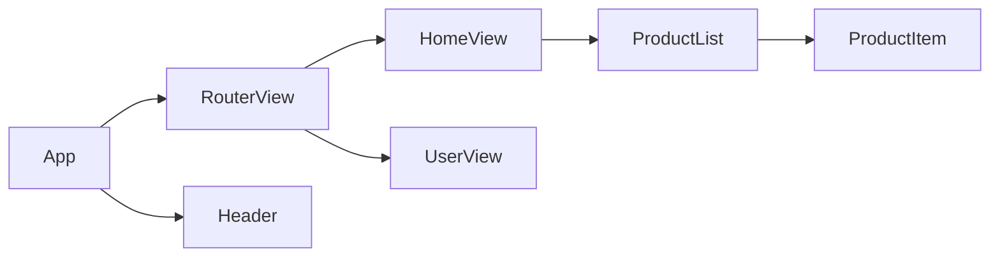
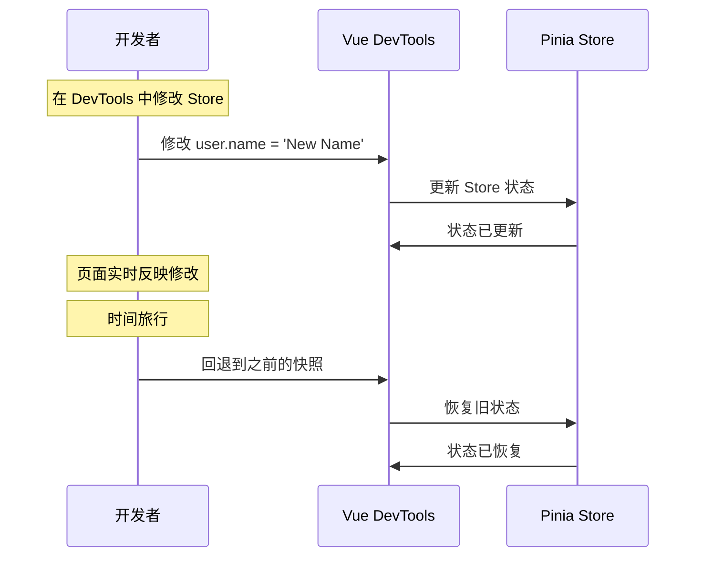

# Vue-DevTools原理、实现与使用技巧

本节深入 Vue DevTools 的实现原理，并讲解最新功能与调试技巧。

> **2024-2026 更新**：Vue DevTools 已全面升级为 Vue DevTools Next，支持三种使用方式：Vite 插件、浏览器扩展、独立应用。

## Vue DevTools Next 的三种形态



| 形态 | 适用场景 | 优点 | 缺点 |
|------|---------|------|------|
| Vite 插件 | Vite 项目开发 | 无需安装扩展，集成在 DevServer | 仅支持 Vite |
| 浏览器扩展 | 任意 Vue 项目 | 支持所有构建工具 | 需安装扩展 |
| 独立应用 | 调试任意浏览器 | 可调试移动端 | Electron 体积大 |

## Vue DevTools 的架构

### 浏览器扩展架构（MV3）



### Vite 插件架构



## Vue DevTools Hook 的工作原理

Vue DevTools 通过全局 Hook `__VUE_DEVTOOLS_GLOBAL_HOOK__` 拦截 Vue 的渲染过程。

### Hook 的注入

Vue 3 在初始化时会检测 `__VUE_DEVTOOLS_GLOBAL_HOOK__` 并注册自己：

```javascript
// Vue 3 源码中的 DevTools Hook 注册
if (typeof __VUE_DEVTOOLS_GLOBAL_HOOK__ !== 'undefined') {
    hook = __VUE_DEVTOOLS_GLOBAL_HOOK__;
    // 注册 Vue 实例
    hook.app = app;
    // 监听组件事件
    hook.on('component:added', (app, uid) => {
        // 通知 DevTools 新组件创建
    });
    hook.on('component:removed', (app, uid) => {
        // 通知 DevTools 组件销毁
    });
    hook.on('component:updated', (app, uid) => {
        // 通知 DevTools 组件更新
    });
}
```

### Vue 3 组件实例结构

Vue 3 的组件实例（`ComponentInternalInstance`）包含 DevTools 需要的所有信息：

```javascript
const instance = {
    uid,                    // 组件唯一 ID
    type,                   // 组件定义对象
    vnode,                  // 虚拟 DOM 节点
    props,                  // 组件 Props
    attrs,                  // 非 Prop 的属性
    setupState,             // setup() 返回的状态
    data,                   // data() 返回的状态
    ctx,                    // 渲染上下文
    refs,                   // template refs
    emit,                   // 事件触发函数
    subTree,                // 渲染的子树
    component,              // 组件定义
    parent,                 // 父组件实例
    appContext,             // 应用上下文
    // ...
};
```

## Vue DevTools Next 的功能模块

> **2024-2026 更新**：Vue DevTools Next 提供了更丰富的功能模块：



### Inspector（组件检查器）

Inspector 是最核心的功能，可以：
- 查看组件树
- 点击组件查看 Props、Data、Setup State、Computed、Inject/Provide
- 在页面中高亮组件（点击"在页面中选择元素"按钮）

### Timeline（时间线）

> **2024-2026 新增**：Vue DevTools Next 的 Timeline 可以记录：
- 组件渲染事件（mount、update、unmount）
- Pinia 状态变更
- Router 路由变更
- 自定义事件

## Vue DevTools 与 React DevTools 的对比

| 方面 | React DevTools | Vue DevTools Next |
|------|---------------|-------------------|
| 组件树数据源 | Fiber 树 | ComponentInternalInstance |
| 状态查看 | Props + State + Hooks | Props + Data + SetupState + Computed |
| 状态管理调试 | 无内置 | Pinia 集成 |
| 路由调试 | 无内置 | Vue Router 集成 |
| 时间线 | Profiler（渲染性能） | Timeline（多维度事件） |
| Vite 集成 | 无 | Vite 插件形式 |
| 扩展版本 | MV3 | MV3 |
| 独立应用 | 已废弃 | 支持 |

## 动手实现 Vue DevTools 面板

> **2024-2026 更新**：Vue DevTools Next 基于 Vite 插件实现时，UI 直接内嵌在页面中，无需浏览器扩展。

## 面板的核心功能



## 功能一：组件树（Inspector）

### 组件数据结构

```javascript
// 组件节点数据结构
const componentNode = {
    uid: 0,              // 唯一 ID
    name: 'App',         // 组件名
    filePath: 'src/App.vue',  // 文件路径
    isFragment: false,   // 是否 Fragment
    children: [],        // 子组件列表

    // 属性数据
    props: {},           // Props
    data: {},            // Data
    setupState: {},      // Setup 返回的状态
    computed: [],        // 计算属性列表
    inject: {},          // Inject
    provides: {},        // Provide
    emits: [],           // Emits 列表
    refs: {},            // Template Refs
};
```

### 组件树遍历算法

Vue 3 的组件树遍历需要处理多种特殊情况：

```javascript
function traverseComponentTree(instance, depth = 0) {
    if (!instance) return null;

    const node = {
        uid: instance.uid,
        name: getComponentName(instance),
        depth,
        children: [],
    };

    // 遍历子树
    const subTree = instance.subTree;

    // 处理 Fragment（多根节点组件）
    if (subTree.type === Symbol.for('v-fgt')) {
        // Fragment 有多个子节点
        const children = subTree.children || [];
        for (const child of children) {
            if (child.component) {
                node.children.push(
                    traverseComponentTree(child.component, depth + 1)
                );
            }
        }
    } else if (subTree.component) {
        // 单子组件
        node.children.push(
            traverseComponentTree(subTree.component, depth + 1)
        );
    }

    // 处理 KeepAlive 缓存的组件
    if (instance.type.__keepAlive) {
        const deactivated = instance.keepAliveInstance?.deactivated || [];
        for (const cached of deactivated) {
            node.children.push(
                traverseComponentTree(cached, depth + 1)
            );
        }
    }

    return node;
}

function getComponentName(instance) {
    // 优先级：name 属性 > displayName > 文件名 > Anonymous
    if (instance.type.name) return instance.type.name;
    if (instance.type.displayName) return instance.type.displayName;
    if (instance.type.__file) {
        return instance.type.__file
            .split('/')
            .pop()
            .replace(/\.\w+$/, '');
    }
    return 'Anonymous';
}
```

### 组件树 UI 渲染

```javascript
function renderComponentTree(tree) {
    const container = document.getElementById('component-tree');
    container.innerHTML = '';
    renderNode(tree, container, 0);
}

function renderNode(node, container, depth) {
    const div = document.createElement('div');
    div.style.paddingLeft = `${depth * 16}px`;
    div.style.cursor = 'pointer';
    div.textContent = `<${node.name} />`;
    div.className = 'component-node';

    // 点击选中
    div.addEventListener('click', () => {
        document.querySelectorAll('.component-node.selected')
            .forEach(el => el.classList.remove('selected'));
        div.classList.add('selected');
        showComponentDetail(node);
    });

    container.appendChild(div);

    if (node.children) {
        node.children.forEach(child => renderNode(child, container, depth + 1));
    }
}
```

## 功能二：属性查看器

### 获取组件属性

```javascript
async function getComponentState(instance) {
    const state = {};

    // Props
    if (instance.props && Object.keys(instance.props).length) {
        state.props = instance.props;
    }

    // Data
    if (instance.data && Object.keys(instance.data).length) {
        state.data = instance.data;
    }

    // Setup State（Composition API）
    if (instance.setupState && Object.keys(instance.setupState).length) {
        state.setupState = filterSetupState(instance.setupState);
    }

    // Computed
    const computed = getComputedProperties(instance);
    if (computed.length) {
        state.computed = computed;
    }

    // Inject
    if (instance.provides) {
        state.inject = instance.provides;
    }

    // Provide
    if (instance.provides) {
        state.provides = filterProvides(instance.provides);
    }

    return state;
}

// 过滤 Setup State（去除内部属性）
function filterSetupState(setupState) {
    const filtered = {};
    for (const [key, value] of Object.entries(setupState)) {
        // 跳过以 _ 开头的内部属性和 template ref
        if (key.startsWith('_') || key.startsWith('__')) continue;
        if (isRef(value)) {
            filtered[key] = value.value;  // 自动解包 Ref
        } else if (isReactive(value)) {
            filtered[key] = toRaw(value);  // 转为原始对象
        } else {
            filtered[key] = value;
        }
    }
    return filtered;
}

// 获取计算属性
function getComputedProperties(instance) {
    const computed = [];
    const type = instance.type;

    if (type.computed) {
        for (const [key, getter] of Object.entries(type.computed)) {
            try {
                computed.push({
                    key,
                    value: getter.call(instance.proxy),
                    type: 'computed',
                });
            } catch (e) {
                computed.push({ key, value: '[Error]', type: 'computed' });
            }
        }
    }

    return computed;
}
```

### 属性查看器 UI

```javascript
function showComponentDetail(node) {
    const detail = document.getElementById('component-detail');
    const state = node._rawState;  // 原始状态：由 getComponentState(instance) 获取后挂到节点上

    let html = `<h3>&lt;${node.name} /&gt;</h3>`;

    // 按类别展示属性
    const categories = [
        { key: 'props', label: 'Props', icon: '📦' },
        { key: 'data', label: 'Data', icon: '📄' },
        { key: 'setupState', label: 'Setup State', icon: '⚙️' },
        { key: 'computed', label: 'Computed', icon: '🔄' },
        { key: 'inject', label: 'Inject', icon: '💉' },
        { key: 'provides', label: 'Provide', icon: '🤝' },
    ];

    for (const { key, label, icon } of categories) {
        if (state[key]) {
            html += `<h4>${icon} ${label}</h4>`;
            html += renderValueTree(state[key], key);
        }
    }

    detail.innerHTML = html;
}

// 递归渲染值树
function renderValueTree(obj, path, depth = 0) {
    if (depth > 3) return '<span class="max-depth">...</span>';

    let html = '<div class="value-tree">';
    for (const [key, value] of Object.entries(obj)) {
        const currentPath = `${path}.${key}`;
        const type = getType(value);

        html += `<div class="value-item" style="padding-left: ${depth * 16}px">`;
        html += `<span class="key">${key}</span>`;
        html += `<span class="separator">: </span>`;

        if (type === 'object' && value !== null) {
            html += `<span class="type">{${Object.keys(value).length}}</span>`;
            html += renderValueTree(value, currentPath, depth + 1);
        } else if (type === 'array') {
            html += `<span class="type">[${value.length}]</span>`;
            html += renderValueTree(
                Object.fromEntries(value.map((v, i) => [i, v])),
                currentPath, depth + 1
            );
        } else {
            html += `<span class="value ${type}">${formatValue(value)}</span>`;
        }

        html += '</div>';
    }
    html += '</div>';

    return html;
}
```

## 功能三：在页面中高亮组件

点击"选择元素"按钮后，可以在页面中高亮对应的组件区域：

```javascript
// 在页面中高亮组件
function highlightComponent(instance) {
    const el = instance.subTree.el;
    if (!el) return;

    // 移除之前的高亮
    const existingOverlay = document.getElementById('__vue_devtools_overlay__');
    if (existingOverlay) existingOverlay.remove();

    // 创建高亮覆盖层
    const rect = el.getBoundingClientRect();
    const overlay = document.createElement('div');
    overlay.id = '__vue_devtools_overlay__';
    overlay.style.cssText = `
        position: fixed;
        top: ${rect.top}px;
        left: ${rect.left}px;
        width: ${rect.width}px;
        height: ${rect.height}px;
        border: 2px solid #42b883;
        background: rgba(66, 184, 131, 0.1);
        pointer-events: none;
        z-index: 999999;
    `;

    // 添加组件名标签
    const label = document.createElement('div');
    label.style.cssText = `
        position: absolute;
        top: -20px;
        left: 0;
        background: #42b883;
        color: white;
        font-size: 12px;
        padding: 2px 6px;
        border-radius: 2px;
    `;
    label.textContent = `<${getComponentName(instance)} />`;
    overlay.appendChild(label);

    document.body.appendChild(overlay);
}

// 清除高亮
function clearHighlight() {
    const overlay = document.getElementById('__vue_devtools_overlay__');
    if (overlay) overlay.remove();
}
```

## 功能四：Timeline（事件时间线）

> **2024-2026 新增**：Vue DevTools Next 的 Timeline 可以记录多种事件：

```javascript
// Timeline 事件类型
const TIMELINE_EVENTS = {
    'component:added': { color: '#42b883', label: 'Mount' },
    'component:updated': { color: '#35495e', label: 'Update' },
    'component:removed': { color: '#ff6b6b', label: 'Unmount' },
    'pinia:mutation': { color: '#ffd859', label: 'Pinia' },
    'router:change': { color: '#6366f1', label: 'Router' },
};

class Timeline {
    constructor() {
        this.events = [];
        this.startTime = performance.now();
    }

    addEvent(type, data) {
        this.events.push({
            type,
            data,
            time: performance.now() - this.startTime,
            color: TIMELINE_EVENTS[type]?.color || '#999',
            label: TIMELINE_EVENTS[type]?.label || type,
        });

        this.render();
    }

    render() {
        const container = document.getElementById('timeline');
        if (!container) return;

        container.innerHTML = this.events.map(event => `
            <div class="timeline-event" style="border-left: 3px solid ${event.color}">
                <span class="time">${event.time.toFixed(1)}ms</span>
                <span class="label">${event.label}</span>
                <span class="detail">${event.data}</span>
            </div>
        `).join('');
    }
}
```

## 功能五：Component Graph（组件关系图）



Component Graph 可以可视化组件之间的嵌套和引用关系，帮助理解项目结构。

## Vite 插件形式的实现

> **2024-2026 更新**：Vue DevTools Next 作为 Vite 插件时的实现更简洁：

```javascript
// vite-plugin-vue-devtools 简化实现
export default function vueDevToolsPlugin() {
    return {
        name: 'vite-plugin-vue-devtools',

        configureServer(server) {
            // 添加 DevTools 中间件
            server.middlewares.use('/__devtools/', devToolsMiddleware());

            // 添加 WebSocket 通信
            server.ws.on('devtools:component-tree', (data) => {
                // 接收组件树数据
            });

            server.ws.on('devtools:select-component', (data) => {
                // 选中组件
            });
        },

        transformIndexHtml(html) {
            // 在 HTML 中注入 DevTools Hook 和 UI
            // （Hook 初始化代码由插件内置，此处以占位注释示意）
            return html.replace(
                '</body>',
                `
                <script>
                    window.__VUE_DEVTOOLS_GLOBAL_HOOK__ = { /* ... */ };
                </script>
                <script type="module" src="/@id/vite-plugin-vue-devtools/client"></script>
                </body>
                `
            );
        },
    };
}
```


## 功能使用与调试技巧

> **2024-2026 更新**：Vue DevTools Next 支持 Vite 插件、浏览器扩展、独立应用三种形态，功能更加丰富。三种形态的详细介绍见上文「Vue DevTools Next 的三种形态」章节。

## Inspector（组件检查器）

### 组件树

Inspector 展示组件的层级结构：



### 属性查看

选中组件后，可以查看以下属性分类：

| 分类 | 说明 |
|------|------|
| Props | 组件接收的属性 |
| Data | data() 返回的状态 |
| Setup State | setup() / `<script setup>` 中的状态 |
| Computed | 计算属性及其值 |
| Inject | 注入的依赖 |
| Provide | 提供的依赖 |
| Refs | Template Refs |
| Emits | 触发的事件 |

### 在页面中选择元素

点击 Inspector 工具栏中的"选择元素"按钮，此后在页面中点击元素，DevTools 会自动定位到对应的组件。

### 跳转到源码

在 Inspector 中右键组件 → "Open in Editor"，可以跳转到对应的 `.vue` 文件（需要 Vite 插件形式）。

## Timeline（事件时间线）

> **2024-2026 新增**：Vue DevTools Next 的 Timeline 是一个强大的事件记录工具。

### 记录的事件类型



### 使用 Timeline 分析性能问题

1. 点击 Timeline 面板的录制按钮
2. 执行操作（如切换路由、点击按钮）
3. 停止录制
4. 查看事件列表，找到耗时的操作

### 自定义 Timeline 事件

```javascript
// 通过 @vue/devtools-api 注册自定义 Timeline 层并记录事件
import { setupDevtoolsPlugin } from '@vue/devtools-api';

setupDevtoolsPlugin(
    { id: 'my-plugin', label: 'My Plugin' },
    (api) => {
        // 注册 Timeline 层
        api.addTimelineLayer({ id: 'my-layer', label: 'My Events', color: 0x42b883 });

        // 记录自定义事件
        api.addTimelineEvent({
            layerId: 'my-layer',
            event: {
                time: Date.now(),
                title: 'Data loaded',
                data: { count: 42 },
            },
        });
    }
);
```

## Component Graph（组件关系图）

Component Graph 以图形方式展示组件之间的关系：



Component Graph 可以帮助：
- 快速理解项目结构
- 找到组件之间的依赖关系
- 定位组件嵌套层级过深的问题

## Pinia 调试

Vue DevTools Next 内置了 Pinia 调试功能：

### 查看 Store 状态

在 DevTools 的 Pinia 标签中，可以：
- 查看所有 Store 的状态
- 修改 Store 的状态（实时更新）
- 查看 Action 的执行历史
- 时间旅行（回退到之前的状态）



### Pinia 调试配置

```javascript
// stores/user.js
import { defineStore } from 'pinia';

export const useUserStore = defineStore('user', {
    state: () => ({
        name: 'Guest',
        age: 0,
    }),
    actions: {
        setName(name) {
            this.name = name;
        },
    },
});
```

> Pinia 会自动向 Vue DevTools 注册 Store，DevTools 调试默认开启，不需要（也没有）`pinia: { devtools: true }` 这样的额外配置项。

## Vue Router 调试

Vue DevTools Next 内置了 Vue Router 调试功能：

- 查看当前路由信息（path、params、query、hash）
- 查看路由匹配的组件
- 查看导航守卫的执行
- 手动导航到指定路由

## Vue 调试最佳实践

### 1. 使用 Vite 插件形式

Vite 插件形式提供了最佳体验：
- 无需安装浏览器扩展
- 支持"Open in Editor"跳转
- 支持文件路径显示

### 2. 使用 reactive() 而非 ref() 便于调试

```javascript
// ❌ ref 的值需要 .value，调试时不够直观
const count = ref(0);
const name = ref('');

// ✅ reactive 对象在 DevTools 中更易读
const state = reactive({
    count: 0,
    name: '',
});
```

### 3. 给组件设置 name 属性

```javascript
// ❌ 匿名组件在 DevTools 中显示为 <Anonymous>
export default {
    setup() { /* ... */ },
};

// ✅ 有名组件在 DevTools 中显示为 <UserCard>
export default {
    name: 'UserCard',
    setup() { /* ... */ },
};
```

```vue
<!-- Vue 3.2.34+ 自动推断 name -->
<script setup>
// 自动使用文件名作为组件名
</script>
```

### 4. 使用 addCustomTab 自定义调试面板

> **2024-2026 新增**：Vue DevTools Next 支持自定义调试面板（通过 `@vue/devtools-api` 的 `addCustomTab` 注册，`vite-plugin-vue-devtools` 本身只默认导出插件）：

```javascript
import { addCustomTab } from '@vue/devtools-api';

addCustomTab({
    name: 'my-custom-tab',        // 唯一标识
    title: 'My Custom Tab',       // 标签页标题
    icon: '🔧',                   // 图标（支持 Iconify 图标或图片 URL）
    view: {
        type: 'iframe',
        src: 'https://example.com/panel.html',  // 面板页面
    },
});
```

### 5. 使用 watchEffect 调试响应式数据

```javascript
// 在 DevTools 的 Timeline 中查看 watchEffect 的执行
watchEffect(() => {
    console.log('User changed:', user.name);
    // DevTools Timeline 中会显示这次 watchEffect 的执行
});
```

## Vue DevTools Next vs 旧版对比

| 功能 | 旧版 | Vue DevTools Next |
|------|------|-------------------|
| 组件树 | ✅ | ✅ 更详细 |
| Timeline | ❌ | ✅ 多维度事件 |
| Component Graph | ❌ | ✅ |
| Pinia 集成 | ❌ | ✅ |
| Router 集成 | ❌ | ✅ |
| Vite 插件 | ❌ | ✅ |
| Open in Editor | ❌ | ✅ |
| MV3 支持 | ❌ | ✅ |
| 独立应用 | Electron（重） | Electron（保留） |

