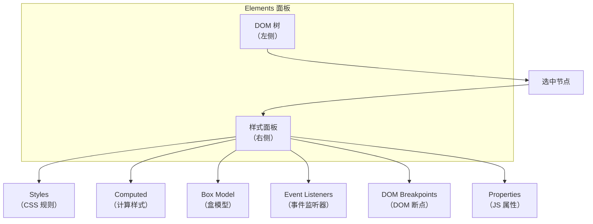
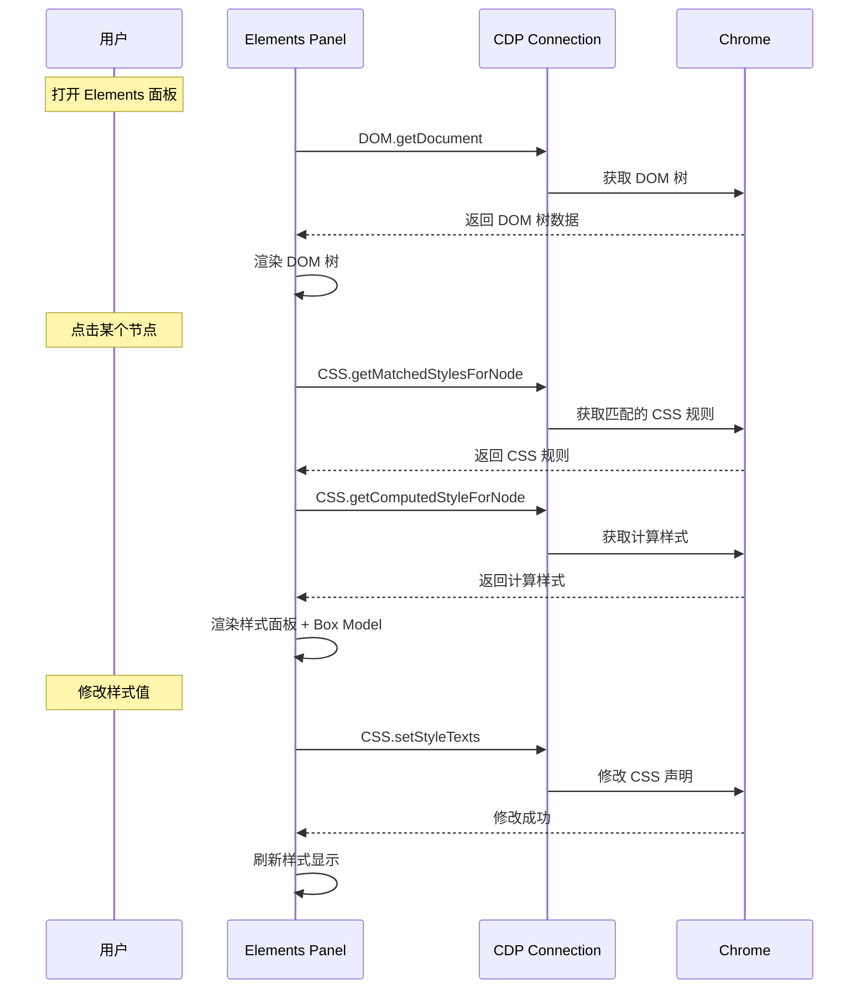

# 实现Chrome-DevTools的Elements面板

本节实现 Chrome DevTools 最常用的面板——Elements。

## Elements 面板的功能

Elements 面板可以：

1. 查看 DOM 树
2. 修改 DOM 节点的属性
3. 查看和修改 CSS 样式
4. 查看 CSS Box Model
5. 查看事件监听器



## 实现 DOM 树查看

### 使用 CDP 的 DOM Domain

```javascript
class ElementsPanel {
    constructor(connection) {
        this._connection = connection;
        this._selectedNodeId = null;
    }

    // 获取 DOM 树
    async getDocument() {
        const { root } = await this._connection.send('DOM.getDocument', {
            depth: -1,  // 获取完整 DOM 树
            pierce: true,  // 穿透 Shadow DOM 和 iframe
        });
        return root;
    }

    // 渲染 DOM 树
    async render() {
        const root = await this.getDocument();
        const container = document.getElementById('dom-tree');
        container.innerHTML = '';
        this._renderNode(root, container, 0);
    }

    _renderNode(node, container, depth) {
        if (node.nodeType !== 1) return;  // 只显示元素节点

        const div = document.createElement('div');
        div.style.paddingLeft = `${depth * 16}px`;
        div.className = 'dom-node';
        div.dataset.nodeId = node.nodeId;

        // 展开箭头
        const arrow = document.createElement('span');
        arrow.className = 'arrow';
        arrow.textContent = node.children?.length ? '▶' : '';
        div.appendChild(arrow);

        // 标签名
        const tag = document.createElement('span');
        tag.className = 'tag';
        tag.textContent = `<${node.nodeName.toLowerCase()}`;
        div.appendChild(tag);

        // 属性
        if (node.attributes) {
            for (let i = 0; i < node.attributes.length; i += 2) {
                const attr = document.createElement('span');
                attr.className = 'attr';
                attr.textContent = ` ${node.attributes[i]}="${node.attributes[i + 1]}"`;
                div.appendChild(attr);
            }
        }

        // 闭合标签
        const closeTag = document.createElement('span');
        closeTag.className = 'tag';
        closeTag.textContent = '>';
        div.appendChild(closeTag);

        // 点击选中
        div.addEventListener('click', () => this._selectNode(node));

        // 双击展开/收起
        arrow.addEventListener('click', (e) => {
            e.stopPropagation();
            this._toggleNode(node, div);
        });

        container.appendChild(div);

        // 渲染子节点
        if (node.children) {
            const childContainer = document.createElement('div');
            childContainer.className = 'children';
            childContainer.style.display = 'none';  // 默认收起
            node.children.forEach(child => {
                this._renderNode(child, childContainer, depth + 1);
            });
            container.appendChild(childContainer);
        }
    }
}
```

## 实现 CSS 样式查看

### 使用 CDP 的 CSS Domain

```javascript
class StylePane {
    constructor(connection) {
        this._connection = connection;
    }

    // 获取节点的所有 CSS 规则
    async getStyles(nodeId) {
        // 启用 CSS Domain
        await this._connection.send('CSS.enable');

        // 获取匹配的 CSS 规则
        const { matchedCSSRules } = await this._connection.send(
            'CSS.getMatchedStylesForNode',
            { nodeId }
        );

        // 获取内联样式
        const { inlineStyle } = await this._connection.send(
            'CSS.getInlineStylesForNode',
            { nodeId }
        );

        // 获取计算样式
        const { computedStyle } = await this._connection.send(
            'CSS.getComputedStyleForNode',
            { nodeId }
        );

        return {
            matchedRules: matchedCSSRules,
            inlineStyle,
            computedStyle,
        };
    }

    // 渲染样式面板
    async render(nodeId) {
        const styles = await this.getStyles(nodeId);
        const container = document.getElementById('style-pane');
        container.innerHTML = '';

        // 1. element.style（内联样式）
        if (styles.inlineStyle) {
            this._renderStyleSection(
                container,
                'element.style',
                styles.inlineStyle.cssProperties
            );
        }

        // 2. 匹配的 CSS 规则（按优先级从高到低）
        for (const rule of styles.matchedRules) {
            const selector = rule.rule.selectorList.selectors
                .map(s => s.text)
                .join(', ');
            const sourceURL = rule.rule.styleSheetId ?
                ` (${rule.rule.origin})` : '';
            this._renderStyleSection(
                container,
                `${selector}${sourceURL}`,
                rule.rule.style.cssProperties
            );
        }
    }

    _renderStyleSection(container, title, properties) {
        const section = document.createElement('div');
        section.className = 'style-section';

        // 标题（选择器）
        const header = document.createElement('div');
        header.className = 'style-header';
        header.textContent = title;
        section.appendChild(header);

        // 属性列表
        for (const prop of properties) {
            if (!prop.range) continue;  // 跳过 shorthand

            const row = document.createElement('div');
            row.className = 'style-property';

            const name = document.createElement('span');
            name.className = 'property-name';
            name.textContent = prop.name;

            const separator = document.createElement('span');
            separator.textContent = ': ';

            const value = document.createElement('span');
            value.className = 'property-value';
            value.textContent = prop.value;

            row.appendChild(name);
            row.appendChild(separator);
            row.appendChild(value);

            // 点击修改属性值
            value.addEventListener('dblclick', () => {
                this._editProperty(prop, value);
            });

            section.appendChild(row);
        }

        container.appendChild(section);
    }
}
```

## 实现 CSS 样式修改

### 通过 CDP 修改样式

```javascript
class StylePane {
    // ... 前面的代码

    async _editProperty(prop, element) {
        // 替换为 input
        const input = document.createElement('input');
        input.value = prop.value;
        input.style.width = '100%';
        element.replaceWith(input);
        input.focus();
        input.select();

        const commit = async () => {
            const newValue = input.value;
            if (newValue !== prop.value) {
                // 通过 CDP 修改样式（setStyleTexts 按范围替换声明文本）
                await this._connection.send('CSS.setStyleTexts', {
                    edits: [
                        {
                            styleSheetId: prop.styleSheetId,
                            range: prop.range,
                            text: `${prop.name}: ${newValue};`,
                        },
                    ],
                });
            }
            // 恢复显示
            const newValueEl = document.createElement('span');
            newValueEl.className = 'property-value';
            newValueEl.textContent = newValue;
            input.replaceWith(newValueEl);
        };

        input.addEventListener('blur', commit);
        input.addEventListener('keydown', (e) => {
            if (e.key === 'Enter') commit();
            if (e.key === 'Escape') {
                const origValue = document.createElement('span');
                origValue.className = 'property-value';
                origValue.textContent = prop.value;
                input.replaceWith(origValue);
            }
        });
    }
}
```

## 实现 Box Model 可视化

```javascript
function renderBoxModel(computedStyle) {
    const getValue = (name) => {
        const prop = computedStyle.find(p => p.name === name);
        return prop ? parseInt(prop.value) : 0;
    };

    const margin = {
        top: getValue('margin-top'),
        right: getValue('margin-right'),
        bottom: getValue('margin-bottom'),
        left: getValue('margin-left'),
    };
    const padding = {
        top: getValue('padding-top'),
        right: getValue('padding-right'),
        bottom: getValue('padding-bottom'),
        left: getValue('padding-left'),
    };
    const border = {
        top: getValue('border-top-width'),
        right: getValue('border-right-width'),
        bottom: getValue('border-bottom-width'),
        left: getValue('border-left-width'),
    };
    const width = getValue('width');
    const height = getValue('height');

    // 渲染盒模型图
    return `
        <div class="box-model">
            <div class="margin" style="padding: ${margin.top}px ${margin.right}px ${margin.bottom}px ${margin.left}px">
                <div class="border" style="padding: ${border.top}px ${border.right}px ${border.bottom}px ${border.left}px">
                    <div class="padding" style="padding: ${padding.top}px ${padding.right}px ${padding.bottom}px ${padding.left}px">
                        <div class="content" style="width: ${width}px; height: ${height}px">
                            ${width} × ${height}
                        </div>
                    </div>
                </div>
            </div>
        </div>
    `;
}
```

## 实现事件监听器查看

### 使用 CDP 的 DOMDebugger Domain

```javascript
async function getEventListeners(connection, nodeId) {
    // 通过 DOM.resolveNode 把 nodeId 解析为 Runtime 的 RemoteObjectId
    const { listeners } = await connection.send('DOMDebugger.getEventListeners', {
        objectId: await getObjectId(connection, nodeId),
    });

    return listeners.map(listener => ({
        type: listener.type,
        useCapture: listener.useCapture,
        passive: listener.passive,
        once: listener.once,
        location: `${listener.scriptId}:${listener.lineNumber}:${listener.columnNumber}`,
    }));
}
```

## Elements 面板的 CDP 调用流程


