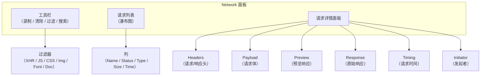
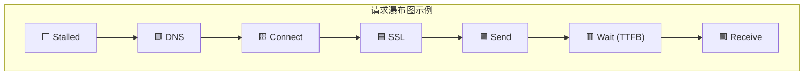
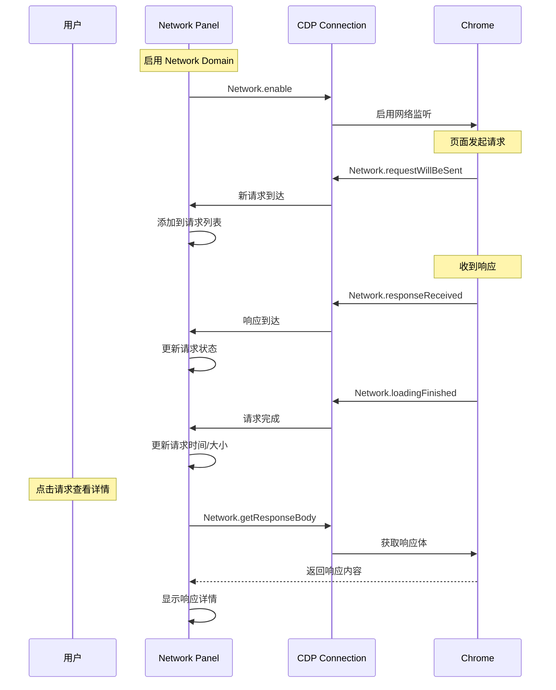

# 实现Chrome-DevTools的Network面板

本节实现 Chrome DevTools 的另一个核心面板——Network。

## Network 面板的功能

Network 面板可以：

1. 查看所有网络请求
2. 查看请求和响应的详细信息
3. 过滤请求
4. 模拟网络条件
5. 拦截和修改请求



## 使用 CDP 的 Network Domain

### 启用 Network Domain

```javascript
async function enableNetwork(connection) {
    await connection.send('Network.enable');

    // 监听请求即将发送事件
    connection.on('Network.requestWillBeSent', (params) => {
        addRequest(params);
    });

    // 监听响应接收事件
    connection.on('Network.responseReceived', (params) => {
        updateResponse(params);
    });

    // 监听请求完成事件
    connection.on('Network.loadingFinished', (params) => {
        finishRequest(params);
    });

    // 监听请求失败事件
    connection.on('Network.loadingFailed', (params) => {
        failRequest(params);
    });
}
```

## 请求列表的实现

### 请求数据结构

```javascript
const requests = new Map();

function addRequest(params) {
    const request = {
        requestId: params.requestId,
        url: params.request.url,
        method: params.request.method,
        type: params.type,  // Document, Script, Stylesheet, Image, etc.
        initiator: params.initiator,
        timestamp: params.timestamp,
        wallTime: params.wallTime,
        headers: params.request.headers,
        postData: params.request.postData,
        status: null,
        statusText: null,
        responseHeaders: null,
        mimeType: null,
        resourceSize: null,
        transferSize: null,
        timing: null,
        remoteAddress: null,
        fromCache: false,
        finished: false,
        failed: false,
    };

    requests.set(params.requestId, request);
    renderRequestList();
}

function updateResponse(params) {
    const request = requests.get(params.requestId);
    if (!request) return;

    const response = params.response;
    request.status = response.status;
    request.statusText = response.statusText;
    request.responseHeaders = response.headers;
    request.mimeType = response.mimeType;
    // CDP 的 Response 没有 decoded 后的资源大小字段，此处以传输大小近似
    request.resourceSize = response.encodedDataLength;
    request.transferSize = response.encodedDataLength;
    request.remoteAddress = response.remoteAddress;
    request.fromCache = response.fromDiskCache || response.fromServiceWorker || response.fromPrefetchCache;

    renderRequestList();
}

function finishRequest(params) {
    const request = requests.get(params.requestId);
    if (!request) return;

    request.finished = true;
    request.encodedDataLength = params.encodedDataLength;

    renderRequestList();
}

function failRequest(params) {
    const request = requests.get(params.requestId);
    if (!request) return;

    request.failed = true;
    request.errorType = params.type;
    request.errorText = params.errorText;

    renderRequestList();
}
```

### 请求列表渲染

```javascript
function renderRequestList() {
    const container = document.getElementById('request-list');
    container.innerHTML = '';

    // 过滤
    const filtered = filterRequests(requests.values());
    const sorted = sortRequests(filtered);

    // 渲染表格头
    const header = document.createElement('tr');
    const columns = ['Name', 'Status', 'Type', 'Size', 'Time', 'Waterfall'];
    columns.forEach(col => {
        const th = document.createElement('th');
        th.textContent = col;
        th.addEventListener('click', () => sortBy(col));
        header.appendChild(th);
    });
    container.appendChild(header);

    // 渲染请求行
    sorted.forEach(req => {
        const row = document.createElement('tr');
        row.className = 'request-row';
        row.dataset.requestId = req.requestId;

        // Name
        const nameCell = document.createElement('td');
        nameCell.textContent = getFileName(req.url);
        nameCell.title = req.url;
        row.appendChild(nameCell);

        // Status
        const statusCell = document.createElement('td');
        statusCell.textContent = `${req.status || '...'} ${req.statusText || ''}`;
        statusCell.className = `status-${getStatusClass(req.status)}`;
        row.appendChild(statusCell);

        // Type
        const typeCell = document.createElement('td');
        typeCell.textContent = req.mimeType?.split('/').pop() || req.type;
        row.appendChild(typeCell);

        // Size
        const sizeCell = document.createElement('td');
        sizeCell.textContent = formatSize(req.transferSize || req.resourceSize);
        if (req.fromCache) sizeCell.textContent += ' (cache)';
        row.appendChild(sizeCell);

        // Time
        const timeCell = document.createElement('td');
        timeCell.textContent = req.timing ? formatTiming(req.timing) : '...';
        row.appendChild(timeCell);

        // Waterfall
        const waterfallCell = document.createElement('td');
        waterfallCell.innerHTML = renderWaterfall(req);
        row.appendChild(waterfallCell);

        // 点击显示详情
        row.addEventListener('click', () => showRequestDetail(req));

        container.appendChild(row);
    });
}
```

## 瀑布图（Waterfall）的实现

瀑布图是 Network 面板最直观的功能，它展示了每个请求的时间分布：

```javascript
function renderWaterfall(req) {
    if (!req.timing) return '';

    const timing = req.timing;
    // ResourceTiming 只有 receiveHeadersEnd，没有 receiveEnd；
    // 响应体下载完成时间需结合 Network.loadingFinished 的 timestamp，此处简化处理
    const receiveEnd = timing.receiveHeadersEnd;
    const totalDuration = receiveEnd - timing.sendStart;

    // 各阶段的时间比例（Stalled 为排队/等待时间，即从发起请求到开始发送之间除去 DNS/连接/SSL 的部分）
    const stages = [
        { name: 'Stalled', start: 0, duration: Math.max(timing.sendStart - Math.max(timing.connectEnd, timing.dnsEnd), 0), color: '#f5f5f5' },
        { name: 'DNS', start: timing.dnsStart, duration: timing.dnsEnd - timing.dnsStart, color: '#e8f5e9' },
        { name: 'Connect', start: timing.connectStart, duration: timing.connectEnd - timing.connectStart, color: '#fff3e0' },
        { name: 'SSL', start: timing.sslStart, duration: timing.sslEnd - timing.sslStart, color: '#e3f2fd' },
        { name: 'Send', start: timing.sendStart, duration: timing.sendEnd - timing.sendStart, color: '#f3e5f5' },
        { name: 'Wait', start: timing.sendEnd, duration: timing.receiveHeadersEnd - timing.sendEnd, color: '#ffebee' },
        { name: 'Receive', start: timing.receiveHeadersEnd, duration: receiveEnd - timing.receiveHeadersEnd, color: '#e8f5e9' },
    ];

    // 渲染为 SVG 或 Canvas
    let svg = `<svg width="200" height="16">`;
    stages.forEach(stage => {
        if (stage.duration > 0) {
            const x = (stage.start / totalDuration) * 200;
            const width = (stage.duration / totalDuration) * 200;
            svg += `<rect x="${x}" y="2" width="${width}" height="12" fill="${stage.color}" rx="2"/>`;
        }
    });
    svg += '</svg>';

    return svg;
}
```



## 请求详情面板

### Headers Tab

```javascript
async function showHeaders(requestId) {
    const req = requests.get(requestId);

    let html = '<h4>General</h4>';
    html += `<div>Request URL: ${req.url}</div>`;
    html += `<div>Request Method: ${req.method}</div>`;
    html += `<div>Status Code: ${req.status} ${req.statusText}</div>`;
    html += `<div>Remote Address: ${req.remoteAddress}</div>`;

    // Request Headers
    html += '<h4>Request Headers</h4>';
    for (const [name, value] of Object.entries(req.headers || {})) {
        html += `<div>${name}: ${value}</div>`;
    }

    // Response Headers
    if (req.responseHeaders) {
        html += '<h4>Response Headers</h4>';
        for (const [name, value] of Object.entries(req.responseHeaders)) {
            html += `<div>${name}: ${value}</div>`;
        }
    }

    document.getElementById('detail-content').innerHTML = html;
}
```

### Timing Tab

```javascript
function showTiming(req) {
    if (!req.timing) return;

    const timing = req.timing;
    // receiveEnd 同瀑布图一节的简化：以 receiveHeadersEnd 近似（真实下载完成时间来自 loadingFinished）
    const receiveEnd = timing.receiveHeadersEnd;
    const html = `<h4>Request Timing</h4>`;

    const stages = [
        { name: 'Stalled', duration: Math.max(timing.sendStart - Math.max(timing.connectEnd, timing.dnsEnd), 0) },
        { name: 'DNS Lookup', duration: timing.dnsEnd - timing.dnsStart },
        { name: 'Initial Connection', duration: timing.connectEnd - timing.connectStart },
        { name: 'SSL/TLS', duration: timing.sslEnd - timing.sslStart },
        { name: 'Request Sent', duration: timing.sendEnd - timing.sendStart },
        { name: 'Waiting (TTFB)', duration: timing.receiveHeadersEnd - timing.sendEnd },
        { name: 'Content Download', duration: receiveEnd - timing.receiveHeadersEnd },
    ];

    const total = stages.reduce((sum, s) => sum + (s.duration > 0 ? s.duration : 0), 0);

    for (const stage of stages) {
        if (stage.duration > 0) {
            const pct = ((stage.duration / total) * 100).toFixed(1);
            html += `
                <div class="timing-row">
                    <span class="name">${stage.name}</span>
                    <span class="bar" style="width: ${pct}%"></span>
                    <span class="duration">${stage.duration.toFixed(1)} ms (${pct}%)</span>
                </div>
            `;
        }
    }

    document.getElementById('detail-content').innerHTML = html;
}
```

### Response Tab

```javascript
async function showResponse(connection, requestId) {
    // 获取响应体
    const { body, base64Encoded } = await connection.send(
        'Network.getResponseBody',
        { requestId }
    );

    const content = base64Encoded ?
        atob(body) :
        body;

    document.getElementById('detail-content').innerHTML =
        `<pre class="response-body">${escapeHtml(content)}</pre>`;
}
```

## 请求拦截与修改

### 使用 CDP 拦截请求

> **2024-2026 更新**：CDP 的 `Fetch` Domain 提供了更强大的请求拦截能力，替代了旧的 `Network.requestIntercepted`。

```javascript
async function enableRequestInterception(connection) {
    await connection.send('Fetch.enable', {
        patterns: [
            { urlPattern: '*', requestStage: 'Request' },  // 拦截请求
            { urlPattern: '*', requestStage: 'Response' },  // 拦截响应
        ],
    });

    // 监听请求拦截事件
    connection.on('Fetch.requestPaused', async (params) => {
        const { requestId, request, responseStatusCode } = params;

        // 判断是否需要修改
        if (shouldModify(request.url)) {
            // 修改请求
            await connection.send('Fetch.continueRequest', {
                requestId,
                url: modifyUrl(request.url),
                headers: modifyHeaders(request.headers),
            });
        } else if (shouldModifyResponse(request.url)) {
            // 修改响应
            const modifiedBody = getModifiedResponse(request.url);
            await connection.send('Fetch.fulfillRequest', {
                requestId,
                responseCode: responseStatusCode || 200,
                body: btoa(modifiedBody),
            });
        } else {
            // 不修改，继续
            await connection.send('Fetch.continueRequest', {
                requestId,
            });
        }
    });
}
```

### CDP Fetch Domain vs Network Domain

| 功能 | Network Domain | Fetch Domain |
|------|---------------|-------------|
| 查看请求 | ✅ `requestWillBeSent` | ✅ |
| 查看响应 | ✅ `responseReceived` | ✅ |
| 获取响应体 | ✅ `getResponseBody` | ✅ `fulfillRequest` |
| 拦截请求 | ❌ 已废弃 | ✅ `requestPaused` |
| 修改请求 | ❌ 已废弃 | ✅ `continueRequest` |
| 修改响应 | ❌ 已废弃 | ✅ `fulfillRequest` |
| Mock 响应 | ❌ | ✅ `fulfillRequest` |

> **2024-2026 更新**：`Network.requestIntercepted` 已被废弃，使用 `Fetch` Domain 替代。

## Network 面板的 CDP 调用流程


