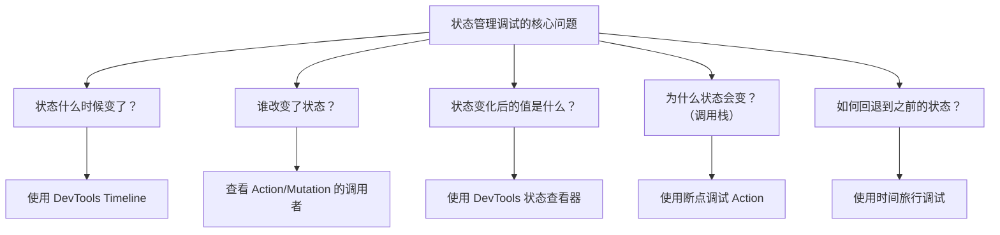
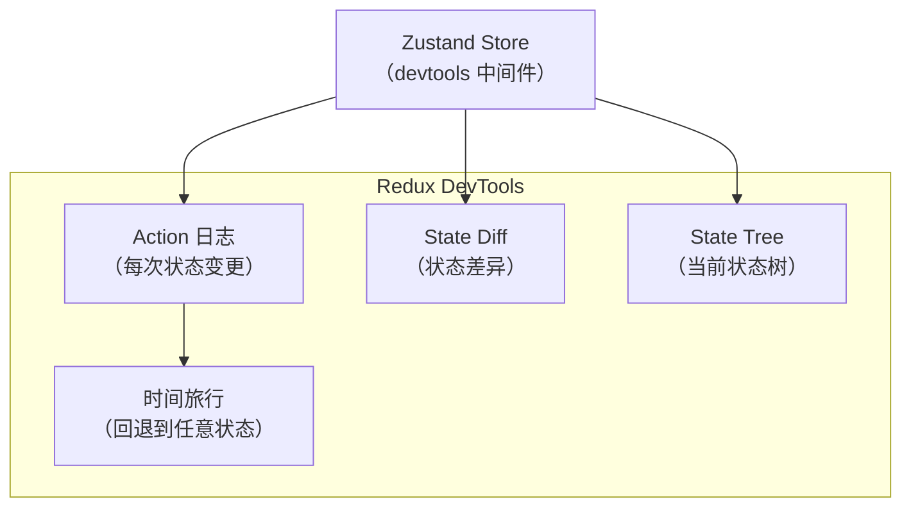
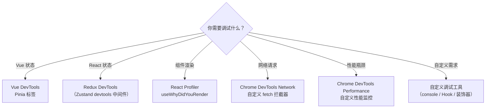

# 状态管理调试与自定义调试工具

现代前端应用中，状态管理是最复杂的部分之一。本节讲解如何调试 Pinia、Zustand、Redux 等状态管理库，以及如何开发自定义调试工具。

> **2024-2026 更新**：Pinia 已成为 Vue 3 官方推荐的状态管理库，Zustand 成为 React 社区最受欢迎的轻量状态管理方案。

## 状态管理调试的核心问题



## Pinia 调试（Vue 3）

### Vue DevTools 中的 Pinia 调试

Vue DevTools Next 内置了 Pinia 标签，可以：
- 查看所有 Store 的当前状态
- 修改 Store 状态（实时更新页面）
- 查看 Action 执行历史
- 时间旅行调试

### Pinia 的调试钩子

Pinia 提供了 `$onAction` 和 `$subscribe` 方法用于调试：

```javascript
// 监听所有 Action
const userStore = useUserStore();

userStore.$onAction(({ name, args, after, onError }) => {
    const startTime = Date.now();

    console.log(`[Pinia] Action "${name}" started`, args);

    after((result) => {
        console.log(`[Pinia] Action "${name}" finished in ${Date.now() - startTime}ms`, result);
    });

    onError((error) => {
        console.error(`[Pinia] Action "${name}" failed`, error);
    });
});

// 监听状态变化
userStore.$subscribe((mutation, state) => {
    console.log('[Pinia] State changed:', {
        type: mutation.type,      // 'direct' | 'patch object' | 'patch function'
        storeId: mutation.storeId,
        events: mutation.events,  // 具体变化的属性
    });
});
```

### Pinia 插件实现日志

```javascript
// plugins/pinia-logger.js
export function piniaLogger({ store }) {
    store.$onAction(({ name, args, after, onError }) => {
        console.group(`🍍 ${store.$id}/${name}`);
        console.log('Args:', args);

        after((result) => {
            console.log('Result:', result);
            console.log('State:', store.$state);
            console.groupEnd();
        });

        onError((error) => {
            console.error('Error:', error);
            console.groupEnd();
        });
    });
}

// main.js
const pinia = createPinia();
pinia.use(piniaLogger);
```

## Zustand 调试（React）

### Zustand DevTools

Zustand 提供了 `devtools` 中间件用于调试：

```javascript
import { create } from 'zustand';
import { devtools } from 'zustand/middleware';

const useStore = create(
    devtools(
        (set) => ({
            count: 0,
            name: 'Guest',
            increment: () => set((state) => ({ count: state.count + 1 })),
            setName: (name) => set({ name }),
        }),
        {
            name: 'MyStore',  // 在 Redux DevTools 中显示的名称
            enabled: process.env.NODE_ENV === 'development',
        }
    )
);
```

### 使用 Redux DevTools 调试 Zustand

Zustand 的 devtools 中间件兼容 Redux DevTools 扩展：

1. 安装 Redux DevTools 浏览器扩展
2. 在代码中使用 `devtools` 中间件包裹 store
3. 打开 Redux DevTools 面板
4. 查看 Action 日志、状态变化、时间旅行



### Zustand 的 subscribe 调试

```javascript
// 监听状态变化
const unsub = useStore.subscribe((state, prevState) => {
    console.log('State changed:', {
        from: prevState,
        to: state,
        diff: getObjectDiff(prevState, state),
    });
});

// 取消监听
unsub();
```

## Redux 调试（React）

### Redux DevTools

Redux DevTools 是最成熟的状态管理调试工具：

```javascript
import { configureStore } from '@reduxjs/toolkit';

const store = configureStore({
    reducer: rootReducer,
    devTools: process.env.NODE_ENV !== 'production',  // 开发环境启用
});
```

### Redux DevTools 的功能

| 功能 | 说明 |
|------|------|
| Action 日志 | 查看每次 dispatch 的 Action |
| State 查看器 | 查看当前全局状态 |
| Diff 查看器 | 查看状态变更的差异 |
| 时间旅行 | 回退到任意历史状态 |
| 导入/导出 | 导出状态快照用于分享 |
| 持久化 | 将调试会话保存到本地 |

### RTK Query 调试

> **2024-2026 更新**：Redux Toolkit 的 RTK Query 提供了内置的调试能力：

```javascript
import { createApi, fetchBaseQuery } from '@reduxjs/toolkit/query/react';

const api = createApi({
    reducerPath: 'api',
    baseQuery: fetchBaseQuery({ baseUrl: '/api/' }),
    endpoints: (builder) => ({
        getUsers: builder.query({
            query: () => 'users',
        }),
    }),
});
```

RTK Query 在 Redux DevTools 中会自动记录：
- 请求开始（pending）
- 请求成功（fulfilled）
- 请求失败（rejected）
- 缓存命中/失效

## 自定义调试工具

### 1. 自定义 console 调试工具

```javascript
// utils/debug.js
const DEBUG_MODE = import.meta.env.DEV;

export const debug = {
    group(label, fn) {
        if (!DEBUG_MODE) return fn();
        console.group(`🔍 ${label}`);
        fn();
        console.groupEnd();
    },

    state(storeName, key, oldValue, newValue) {
        if (!DEBUG_MODE) return;
        console.log(`📦 [${storeName}] ${key}:`, oldValue, '→', newValue);
    },

    action(storeName, actionName, args, duration) {
        if (!DEBUG_MODE) return;
        console.log(
            `⚡ [${storeName}] ${actionName}(${JSON.stringify(args)}) → ${duration}ms`
        );
    },

    render(componentName, reason) {
        if (!DEBUG_MODE) return;
        console.log(`🎨 <${componentName}/> re-rendered: ${reason}`);
    },

    performance(label, fn) {
        if (!DEBUG_MODE) return fn();
        const start = performance.now();
        const result = fn();
        const duration = performance.now() - start;
        console.log(`⏱️ ${label}: ${duration.toFixed(2)}ms`);
        return result;
    },
};
```

### 2. React 渲染调试 Hook

```javascript
// hooks/useWhyDidYouRender.js
import { useEffect, useRef } from 'react';

export function useWhyDidYouRender(componentName, props) {
    const previousProps = useRef(props);

    useEffect(() => {
        const changedProps = {};
        let hasChanged = false;

        for (const key of Object.keys({ ...previousProps.current, ...props })) {
            if (previousProps.current[key] !== props[key]) {
                changedProps[key] = {
                    from: previousProps.current[key],
                    to: props[key],
                };
                hasChanged = true;
            }
        }

        if (hasChanged) {
            console.log(`[WhyDidYouRender] <${componentName}>`, changedProps);
        }

        previousProps.current = props;
    });
}

// 使用
function ProductCard({ product, onSelect }) {
    useWhyDidYouRender('ProductCard', { product, onSelect });
    // ...
}
```

### 3. Vue 响应式调试工具

```javascript
// utils/vue-debug.js
import { watch } from 'vue';

export function debugReactive(reactiveObj, label = '') {
    for (const [key, value] of Object.entries(reactiveObj)) {
        if (typeof value === 'object' && value !== null && '__v_isRef' in value) {
            // ref 类型
            watch(
                () => value.value,
                (newVal, oldVal) => {
                    console.log(`📦 [${label}] ${key}.value:`, oldVal, '→', newVal);
                },
                { deep: true }
            );
        }
    }
}

// 使用
const state = reactive({ count: 0, name: '' });
debugReactive(state, 'MyComponent');
```

### 4. 网络请求调试工具

```javascript
// utils/api-debug.js
const originalFetch = window.fetch;

window.fetch = async function (...args) {
    const [url, options] = args;
    const startTime = performance.now();

    console.group(`🌐 ${options?.method || 'GET'} ${url}`);

    try {
        const response = await originalFetch(...args);
        const duration = performance.now() - startTime;

        console.log(`Status: ${response.status} (${duration.toFixed(0)}ms)`);

        if (response.ok) {
            console.log('Response:', await response.clone().json());
        } else {
            console.warn('Error:', response.statusText);
        }

        console.groupEnd();
        return response;
    } catch (error) {
        const duration = performance.now() - startTime;
        console.error(`Failed (${duration.toFixed(0)}ms):`, error);
        console.groupEnd();
        throw error;
    }
};
```

### 5. 性能监控装饰器

```javascript
// utils/performance-decorator.js
export function measure(target, propertyKey, descriptor) {
    const originalMethod = descriptor.value;

    descriptor.value = function (...args) {
        const start = performance.now();
        const result = originalMethod.apply(this, args);

        if (result instanceof Promise) {
            return result.then((value) => {
                console.log(`⏱️ ${propertyKey}: ${(performance.now() - start).toFixed(2)}ms`);
                return value;
            });
        }

        console.log(`⏱️ ${propertyKey}: ${(performance.now() - start).toFixed(2)}ms`);
        return result;
    };

    return descriptor;
}

// 使用
class UserService {
    @measure
    async fetchUsers() {
        const response = await fetch('/api/users');
        return response.json();
    }
}
```

## 调试工具的选择指南


