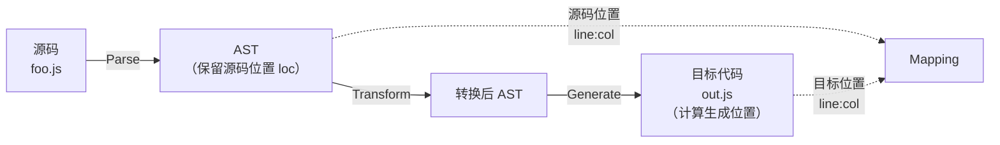
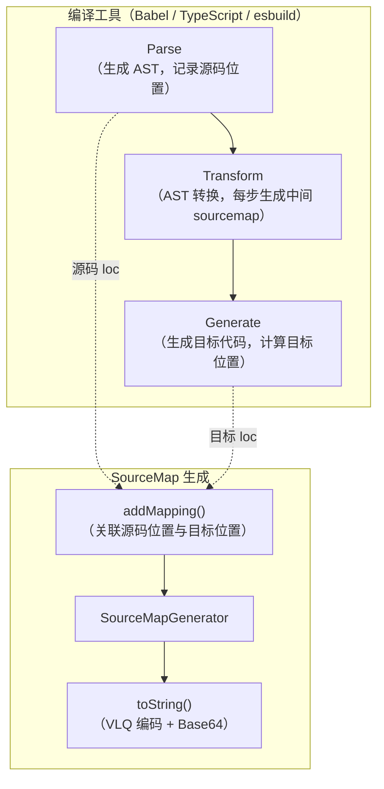
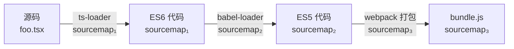
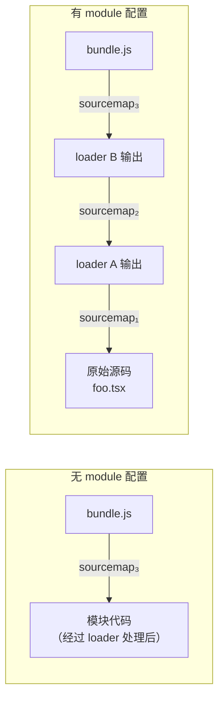
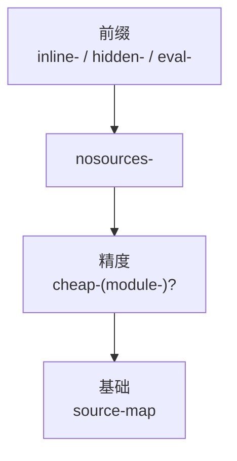

# SourceMap原理与构建配置

sourcemap 是调试绕不开的概念，有了它才能直接调试源码。

## 什么是 sourcemap

**sourcemap 是关联编译后的代码和源码的，通过一个个行列号的映射。**

比如编译后代码的第 3 行第 4 列，对应着源码里的第 8 行第 5 列这种，这叫做一个 mapping。

sourcemap 的格式如下：

```javascript
{
  version: 3,
  file: "out.js",
  sourceRoot: "",
  sources: ["foo.js", "bar.js"],
  names: ["a", "b"],
  mappings: "AAgBC,SAAQ,CAAEA;AAAEA",
  sourcesContent: ['const a = 1; console.log(a)', 'const b = 2; console.log(b)']
}
```

| 字段 | 含义 |
|------|------|
| `version` | sourcemap 的版本，当前为 3 |
| `file` | 编译后的文件名 |
| `sourceRoot` | 源码根目录（已较少使用，现代工具通常在 sources 中使用绝对或相对路径） |
| `sources` | 源码文件名列表 |
| `names` | 转换前的变量名列表 |
| `mappings` | 位置映射数据（VLQ 编码） |
| `sourcesContent` | 每个 sources 对应的源码内容 |

为什么 sources 可以有多个？

因为可能编译产物是多个源文件合并的，比如打包，一个 `bundle.js` 就对应了 n 个 sources 源文件。

### mappings 的结构

重点是 mappings 部分：

mappings 部分是通过分号 `;` 和逗号 `,` 分隔的：

```javascript
mappings: "AAAAA,BBBBB;CCCCC"
```

一个分号就代表一行，这样就免去了行的映射。

然后每一行可能有多个位置的映射，用 `,` 分隔。

### VLQ 编码

那么具体的每一个 mapping 都是什么内容？

比如 `AAAAA` 一共五位，分别有不同的含义：

| 位序 | 含义 | 说明 |
|------|------|------|
| 第 1 位 | 转换后代码的列号 | 行号通过分号 `;` 确定 |
| 第 2 位 | 源码文件索引 | 对应 sources 数组的下标 |
| 第 3 位 | 源码行号 | — |
| 第 4 位 | 源码列号 | — |
| 第 5 位 | 变量名索引 | 对应 names 数组的下标（可选） |

然后经过编码之后，就成了 `AAAAA` 这种，这种编码方式叫做 **VLQ（Variable-Length Quantity）编码**。

#### VLQ 编码原理

VLQ 编码是一种可变长编码，用于将整数压缩为更短的字符串表示。其核心原理如下：


**关键步骤：**

1. **增量编码**：mappings 中的数值不是绝对位置，而是与前一个 mapping 的**差值**。比如第一个 mapping 的列号是 0，第二个 mapping 的列号是 5，那存储的是 0 和 5（其中 5 是相对前一个 mapping 的差值）。这样做的好处是差值通常比绝对值小，编码后更短。

2. **符号处理**：VLQ 编码支持负数。最低位（第 0 位）是符号位，0 表示正数，1 表示负数。所以实际数值 =（剩余位组成的值右移一位，即除以 2）× (符号位 ? -1 : 1)。

3. **分组与续接**：每 6 位为一组，最高位（第 5 位）是 continuation 位，1 表示后面还有续接的组，0 表示这是最后一组。

4. **Base64 映射**：每 6 位的值映射到 Base64 字符表（`A-Z`, `a-z`, `0-9`, `+`, `/`）。

**编码示例：**

以数值 `16` 为例：
- 16 先左移一位腾出符号位（正数，最低位补 0）：`100000`（即 32）
- 低 5 位是 `00000`，更高位还有剩余，所以 continuation 位置 1：`1` + `00000` = `100000` = 32 → Base64 字符 `g`
- 剩余的 `1` 补足 5 位是 `00001`，没有剩余了，continuation 位为 0：`000001` = 1 → Base64 字符 `B`
- 所以 16 编码后是 `gB`

以数值 `1000000` 为例（需要多组续接）：
- 1000000 左移一位是 2000000，二进制：`111101000010010000000`
- 从低位开始，每 5 位一组，除最后一组外都把 continuation 位置 1：
  - 第 1 组：值=`00000` → `100000` = 32 → `g`
  - 第 2 组：值=`00100` → `100100` = 36 → `k`
  - 第 3 组：值=`00001` → `100001` = 33 → `h`
  - 第 4 组：值=`11101` → `111101` = 61 → `9`
  - 第 5 组（剩余 1 位）：值=`1` → `000001` = 1 → `B`
- 所以 1000000 编码后是 `gkh9B`

sourcemap 的格式还是很容易理解的，就是一一映射编译后代码的位置和源码的位置。

各种调试工具一般都支持 sourcemap 的解析，只要在文件末尾加上这样一行：

```javascript
//# sourceMappingURL=/path/to/source.js.map
```

运行时就会关联到源码。

## sourcemap 的应用场景

除了调试的时候会使用 sourcemap，线上报错定位源码也需要用到：

### 场景一：开发时调试源码

开发时会使用 sourcemap 来调试，这样可以直接在源码打断点调试。

### 场景二：生产时定位源码

生产环境不会暴露 sourcemap，但是线上报错时也需要定位到源码，这种情况一般都是单独上传 sourcemap 到错误收集平台。

比如 Sentry 就提供了 `@sentry/webpack-plugin` 支持在打包完成后把 sourcemap 自动上传到 Sentry 后台，然后把本地 sourcemap 删掉。还提供了 `@sentry/cli` 让用户可以手动上传。

> **2024-2026 更新**：Sentry 的 SourceMap 上传方式已演进。对于 Vite 项目，推荐使用 `@sentry/vite-plugin`；对于 Webpack 5 项目，使用 `@sentry/webpack-plugin`。此外，Sentry 还支持通过 `sourcemap upload` 命令行工具在 CI/CD 流程中上传。我们会在下一节《SourceMap线上调试与Sentry监控》中详细讲解。

### 场景三：类型声明与源码关联

sourcemap 只是位置的映射，可以用在任何代码上，比如 JS、TS、CSS 等，而且 TS 的类型也支持 sourcemap：

指定了 `declaration` 会生成 `.d.ts` 的声明文件，还可以指定 `declarationMap` 来生成 sourcemap：

```json
{
  "compilerOptions": {
    "declaration": true,
    "declarationMap": true
  }
}
```

这样在 VSCode 里我们就可以直接点击某个类型来跳转到源码里对应的地方了。

这也算 sourcemap 应用的另一个场景，用于**生成的类型和源码中定义的关联**。

### 场景四：CSS Sourcemap

> **补充**：CSS 预处理器（Sass、Less）和 PostCSS 也支持生成 sourcemap。在 Chrome DevTools 的 Elements 面板中，如果 CSS 有 sourcemap，点击样式规则会跳转到源文件（如 `.scss` 文件）而不是编译后的 `.css` 文件。Tailwind CSS 在开发模式下也会生成 sourcemap，方便定位工具类对应的源码位置。

## sourcemap 的生成

编译工具在生成代码的时候也会生成 sourcemap：

实际上 sourcemap 就是由一个个位置的映射组成的，关键就是要知道源码的哪个位置对应到了编译后代码的哪个位置：

通过 [astexplorer.net](https://astexplorer.net/) 可以看到，AST 中保留了源码中的位置，这是 parser 在 parse 源码的时候记录的。

然后进行 AST 的各种转换之后会打印成目标代码，打印的时候是一行行一列列的拼接字符串，这时候就有了目标代码中的位置。

这两个位置一关联，就形成了一个 mapping。



这样就生成了 sourcemap。

需要注意的是 sourcemap 有对应的格式和编码，自己生成较为复杂，我们会用 [source-map](https://www.npmjs.com/package/source-map) 这个包：

`source-map` 可以用于生成和解析 sourcemap，它暴露了 `SourceMapConsumer`、`SourceMapGenerator`、`SourceNode` 3 个类，分别用于消费 sourcemap、生成 sourcemap、创建源码节点。

### 生成 sourcemap

生成 sourcemap 的流程是：

1. 创建一个 `SourceMapGenerator` 对象
2. 通过 `addMapping` 方法添加一个映射
3. 通过 `toString` 转为 sourcemap 字符串

```javascript
const { SourceMapGenerator } = require('source-map');

const map = new SourceMapGenerator({
    file: "source-mapped.js"
});

map.addMapping({
    generated: {
        line: 10,
        column: 35
    },
    source: "foo.js",
    original: {
        line: 33,
        column: 2
    },
    name: "christopher"
});

console.log(map.toString());
```

### 消费 sourcemap

消费 sourcemap 用 `SourceMapConsumer` 的 API。

可以调用 `originalPositionFor` 和 `generatedPositionFor` 分别用目标代码位置查源码位置和用源码位置查目标代码位置。

还可以通过 `eachMapping` 遍历所有 mapping，对每个进行处理。

```javascript
const { SourceMapConsumer } = require('source-map');

const rawSourceMap = {
    version: 3,
    file: "min.js",
    names: ["bar", "baz", "n"],
    sources: ["one.js", "two.js"],
    sourceRoot: "http://example.com/www/js/",
    mappings: "CAAC,IAAI,IAAM,SAAUA,GAClB,OAAOC,IAAID;CCDb,IAAI,IAAM,SAAUE,GAClB,OAAOA"
};

(async function() {
    await SourceMapConsumer.with(rawSourceMap, null, consumer => {
        // 目标代码位置查询源码位置
        consumer.originalPositionFor({
            line: 2,
            column: 28
        })
        // { source: 'http://example.com/www/js/two.js',
        //   line: 2,
        //   column: 10,
        //   name: 'n' }

        // 源码位置查询目标代码位置
        consumer.generatedPositionFor({
            source: "http://example.com/www/js/two.js",
            line: 2,
            column: 10
        })
        // { line: 2, column: 28 }

        // 遍历 mapping
        consumer.eachMapping(function(m) {
            console.log(m);
        });
    });
})();
```

> **2024-2026 更新**：`source-map` 包的 API 在 v0.7+ 版本中已改为异步（`SourceMapConsumer.with` 替代了直接 `new SourceMapConsumer`），上面的代码已使用最新 API。此外，社区还有更轻量的替代实现 `source-map-js`（PostCSS 等工具在用），性能也优于 `source-map`。

### sourcemap 生成的完整链路



知道了位置从哪里来，知道了怎么用 source-map 的包生成 sourcemap，就理解了平时我们用的 sourcemap 是怎么来的了。

我们用到的 webpack、babel 等等工具的 sourcemap 的生成和消费都是用的 source-map 这个包（或其高性能替代品），读者也可以把[小册仓库的代码](https://github.com/QuarkGluonPlasma/fe-debug-exercize)下载下来运行验证。

更详细的介绍可以看 source-map 这个包的[文档](https://www.npmjs.com/package/source-map#consuming-a-source-map)。


webpack 和 Vite 分别对 sourcemap 做了不同的封装和配置，本节介绍它们的配置方式。

## Webpack 的 SourceMap 配置

webpack 的 sourcemap 配置较为复杂，比如 `eval-nosources-cheap-module-source-map` 与 `hidden-source-map` 这两个配置的区别：

实际上它是有规律的。

你把配置写错的时候，webpack 会提示你一个正则：

`^(inline-|hidden-|eval-)?(nosources-)?(cheap-(module-)?)?source-map$`

这个就是配置的规律，是几种基础配置的组合。

掌握了每一种基础配置，比如 eval、nosources、cheap、module，按照规律组合起来，也就掌握了整体的配置。

那么这每一种配置分别是什么意思？

我们分别来看一下。

(可以用[后面一节的项目代码](https://github.com/QuarkGluonPlasma/fe-debug-exercize/tree/main/react-source-debug)来测试)

### eval

eval 的 API 是动态执行 JS 代码的，比如 `eval('console.log(1)')`。

但有个问题，eval 的代码打不了断点。

如何解决这个问题？

浏览器支持了这样一种特性，只要在 eval 代码的最后加上 `//# sourceURL=xxx`，就会以 xxx 为名字把这段代码加到 sources 里，这样就可以打断点了。

除了指定 source 文件外，还可以进一步指定 sourcemap 来映射到源码。

这样，动态 eval 的代码也能关联到源码，并且能打断点了！

webpack 就利用了 eval 这个特性来优化 sourcemap 生成的性能，比如你可以指定 devtool 为 `eval`。

生成的代码就是每个模块都被 eval 包裹的，并且有 sourceUrl 来指定文件名。

这种方式有什么好处？

这种方式的优势在于速度快，因为只要指定个文件名就行，不用生成 sourcemap。sourcemap 的生成还是较慢的，需要逐个处理 mapping 并做编码。

每个模块的代码都被 eval 包裹，那么执行的时候就会在 sources 里生成对应的文件，这样就可以打断点了：

不过这样只是把每个模块的代码分了出去，并没有做源码的关联，如果想关联源码，可以再开启 sourcemap（即 `eval-source-map`）。

你会发现生成的代码也是用 eval 包裹的，但除了 sourceUrl 外，还有 sourceMappingUrl。

再运行的时候除了 eval 的代码会生成文件放在 sources 外，还会做 sourcemap 的映射：

webpack 的 sourcemap 的配置就利用了浏览器对 eval 代码的调试支持。

所以为什么这个配置项不叫 sourcemap 而叫 devtool？

因为不只是 sourcemap，eval 的方式也行。

### source-map

source-map 的配置是生成独立的 sourcemap 文件：

可以关联，也可以不关联，比如加上 hidden，就是生成 sourcemap 但是不关联。

生产环境就不需要关联 sourcemap，但是可能要生成 sourcemap 文件，把它上传到错误管理平台之类的，用来映射线上代码报错位置到对应的源码。

此外，还可以配置成 inline 的：

这个就是通过 dataUrl 的方式内联在打包后的文件里。

### cheap

sourcemap 慢主要是处理映射比较慢，很多情况下我们不需要映射到源码的行和列，只要精确到行就行，这时候就可以用 cheap。

不精确到列能提升 sourcemap 生成速度，但是会牺牲一些精准度：

### module

webpack 中对一个模块会进行多次处理，比如经过 loader A 做一次转换，再用 loader B 做一次转换，之后打包到一起。

每次转换都会生成 sourcemap，那也就是有多个 sourcemap。



默认 sourcemap 只是能从 bundle 关联到模块的代码，也就是只关联了最后那个 sourcemap。

如果想调试最初的源码，就需要把每一次的 loader 的 sourcemap 也关联起来，这就是 module 配置的作用。这样就能一次性映射回最初的源码。



当你想调试最初的源码的时候，module 的配置就很有用了。

### nosources

sourcemap 里是有 sourcesContent 部分的，也就是直接把源码贴在这里，这样的好处是根据文件路径查不到文件也可以映射，但这样会增加 sourcemap 的体积。

如果你确定根据文件路径能查找到源文件，那不生成 sourcesContent 也行。

比如 devtool 配置为 `source-map`，生成的 sourcemap 是有 sourcesContent 的。

当你加上 nosources 之后，生成的 sourcemap 就没有 sourcesContent 部分了，sourcemap 文件大小会小很多。

### 组合规则

基础配置讲完了，接下来就是各种组合了，这个就比较简单了，就算组合错了，webpack 也会提示你应该按照什么顺序来组合。

它是按照这个正则来校验的：`^(inline-|hidden-|eval-)?(nosources-)?(cheap-(module-)?)?source-map$`



这种配置方式是否过于麻烦？能否用 true、false 的方式逐项配置？

这是可行的，有这样一个插件：**SourceMapDevToolPlugin**

它有很多 option，比如 module、columns、noSources 等。

相当于是 devtool 的另一种配置方式，启用它需要把 devtool 设置为 `false`。

而且它可以控制更多东西，比如修改 sourcemap 的 url 和文件名等。

当你需要做更细致的 sourcemap 生成方式的控制的时候，可以使用这个 webpack 插件。

### Webpack devtool 配置速查表

| devtool 值 | 构建速度 | 重建速度 | 生产环境 | 品质 | 说明 |
|------------|---------|---------|---------|------|------|
| `(none)` | 最快 | 最快 | ✅ 安全 | — | 不生成 sourcemap |
| `eval` | 快 | 最快 | ❌ | 行/编译后 | 每个模块用 eval 包裹 |
| `eval-cheap-source-map` | 较快 | 更快 | ❌ | 行/转换后 | 精确到行，映射到 loader 处理后 |
| `eval-cheap-module-source-map` | 中等 | 更快 | ❌ | 行/原始源码 | 精确到行，映射回原始源码 |
| `eval-source-map` | 慢 | 更快 | ❌ | 行列/原始源码 | 精确到行列，映射回原始源码 |
| `cheap-source-map` | 较快 | 中等 | ❌ | 行/转换后 | 独立 .map 文件 |
| `cheap-module-source-map` | 中等 | 较慢 | ❌ | 行/原始源码 | 独立 .map 文件 |
| `source-map` | 慢 | 慢 | ✅ 可用 | 行列/原始源码 | 完整独立 .map 文件 |
| `hidden-source-map` | 慢 | 慢 | ✅ 推荐 | 行列/原始源码 | 生成但不关联，适合上传 Sentry |
| `hidden-nosources-cheap-module-source-map` | 中等 | 较慢 | ✅ 推荐 | 行/原始源码 | 最小体积，适合生产 |

> **开发环境推荐**：`eval-cheap-module-source-map`（快速重建，映射到原始源码）
> **生产环境推荐**：`hidden-source-map`（生成完整 sourcemap 但不关联到 bundle，上传到 Sentry 后删除本地文件）

## Vite 的 SourceMap 配置

> **2024-2026 更新**：Vite 作为现代构建工具，其 sourcemap 配置方式与 webpack 有显著不同。Vite 7 及之前在开发模式和生产模式下使用不同的构建引擎（esbuild/Rollup），且 Vite 8 已用 **Rolldown**（Rust 实现，兼容 Rollup API）取代 Rollup 作为打包引擎：

### 开发模式

Vite 开发模式下使用 esbuild（Vite 7 及之前）或 Rolldown/oxc（Vite 8 起）进行预构建和转换，都原生支持 sourcemap 生成，速度极快。

```typescript
// vite.config.ts
export default defineConfig({
  build: {
    sourcemap: true,  // 或 'hidden' 或 'inline'
  },
  // 开发模式下 sourcemap 默认开启
  // 转换器的 sourcemap 处理是内置的，无需额外配置
})
```

### 生产模式（Vite 8+）

Vite 8 生产模式下使用 Rolldown（Rust 实现的打包器）进行打包和压缩，sourcemap 配置不变：

```typescript
// vite.config.ts
export default defineConfig({
  build: {
    sourcemap: true,
    // sourcemap: 'hidden',  // 生成但不关联，适合上传 Sentry
    // sourcemap: 'inline',  // 内联到产物中
  },
})
```

### Webpack vs Vite SourceMap 对比

| 方面 | Webpack | Vite |
|------|---------|------|
| 配置项 | `devtool`（多种组合） | `build.sourcemap`（true/hidden/inline） |
| 开发模式 | 使用 webpack 的 sourcemap 链 | esbuild/oxc 原生 sourcemap（极快） |
| 生产模式 | 使用 webpack 的 sourcemap 链 | Rolldown 的 sourcemap 链（Vite 8，Rust 实现） |
| 精度控制 | cheap/module/nosources 组合 | 无精度控制选项（始终完整映射） |
| eval 模式 | 支持 eval-* 前缀 | 不支持（Vite 不使用 eval 包裹） |
| SourceMapDevToolPlugin | 支持细粒度控制 | 无对应功能（使用 Rolldown 插件） |
| 性能 | 较慢（尤其是 module 模式） | 极快（原生 sourcemap 支持） |

```mermaid
graph TB
    subgraph Webpack_Flow["Webpack Sourcemap 链"]
        W_Src["源码"] -->|"loader A<br/>sourcemap₁"| W_Mid1["中间产物₁"]
        W_Mid1 -->|"loader B<br/>sourcemap₂"| W_Mid2["中间产物₂"]
        W_Mid2 -->|"webpack<br/>sourcemap₃"| W_Bundle["bundle.js + .map"]
    end

    subgraph Vite_Dev_Flow["Vite 开发模式（esbuild / oxc）"]
        V_Src1["源码"] -->|"esbuild / oxc<br/>sourcemap"| V_Served["dev server<br/>（按需编译）"]
    end

    subgraph Vite_Prod_Flow["Vite 生产模式（Rolldown）"]
        V_Src2["源码"] -->|"Rolldown 转换 + minify<br/>sourcemap₁"| V_Transformed["转换后代码"]
        V_Transformed -->|"Rolldown<br/>sourcemap₂"| V_Bundle["dist/ + .map"]
    end

```



### Vite + Sentry SourceMap 上传

```typescript
// vite.config.ts
import { sentryVitePlugin } from "@sentry/vite-plugin";

export default defineConfig({
  build: {
    sourcemap: "hidden",  // 生成 hidden sourcemap
  },
  plugins: [
    sentryVitePlugin({
      authToken: process.env.SENTRY_AUTH_TOKEN,
      org: "your-org",
      project: "your-project",
      release: process.env.SENTRY_RELEASE,
    }),
  ],
});
```

