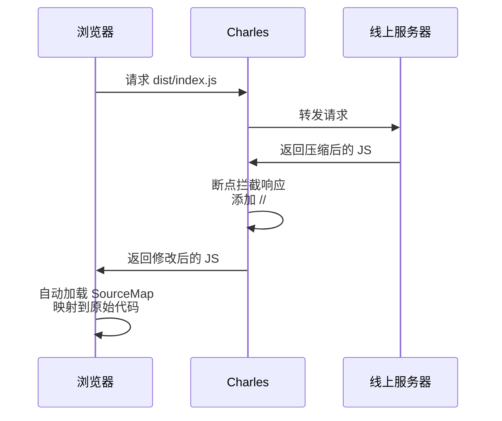
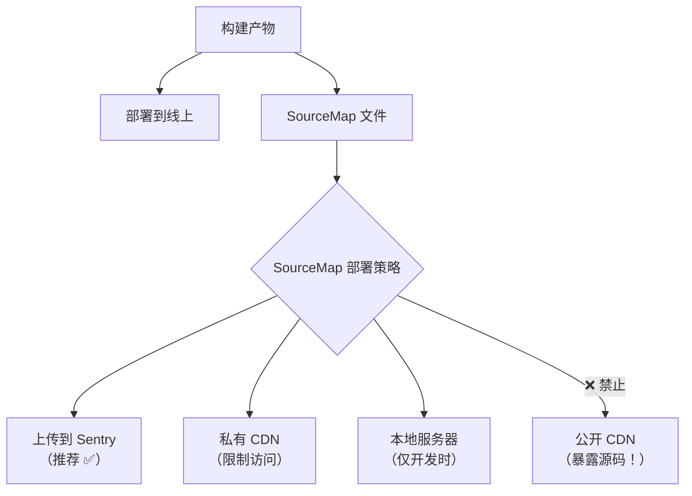
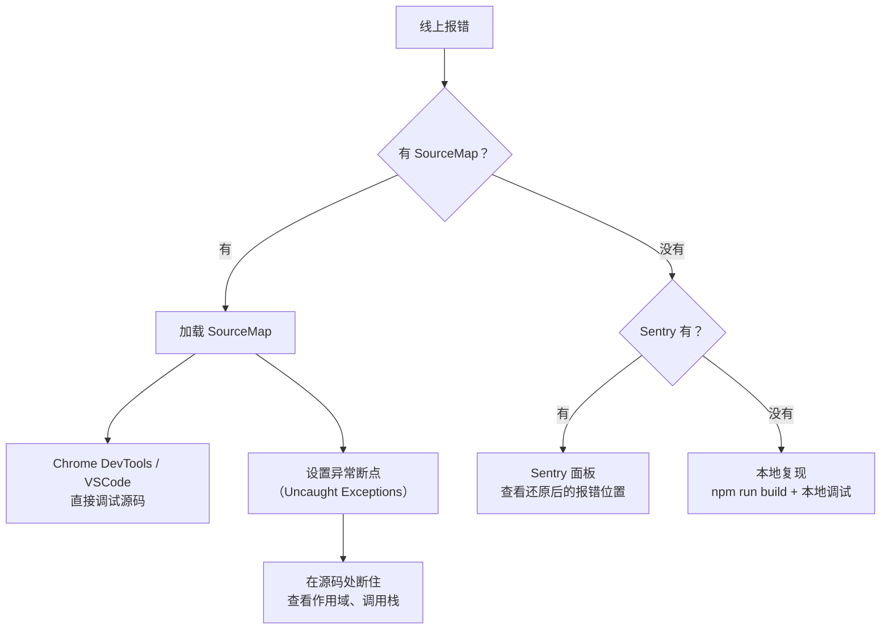
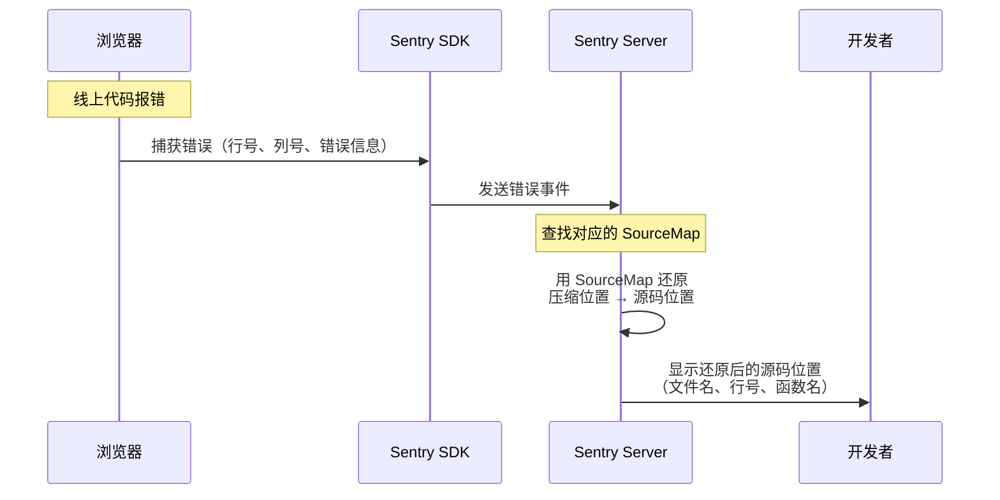
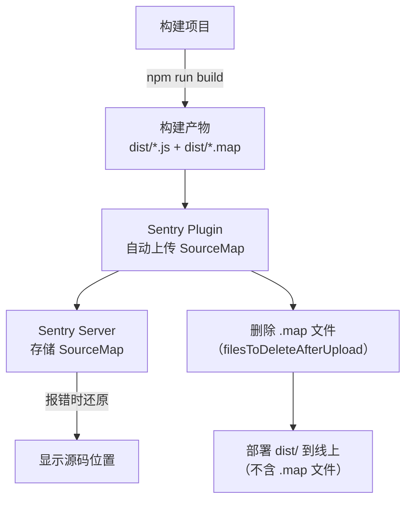
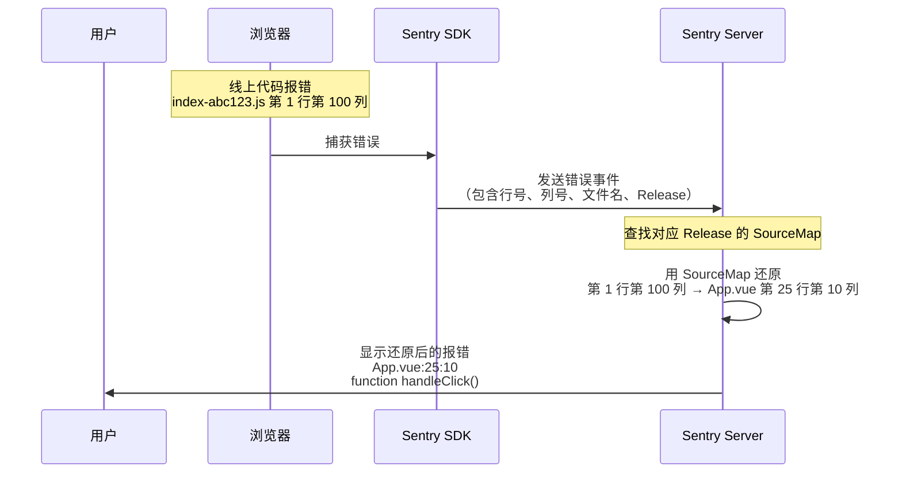
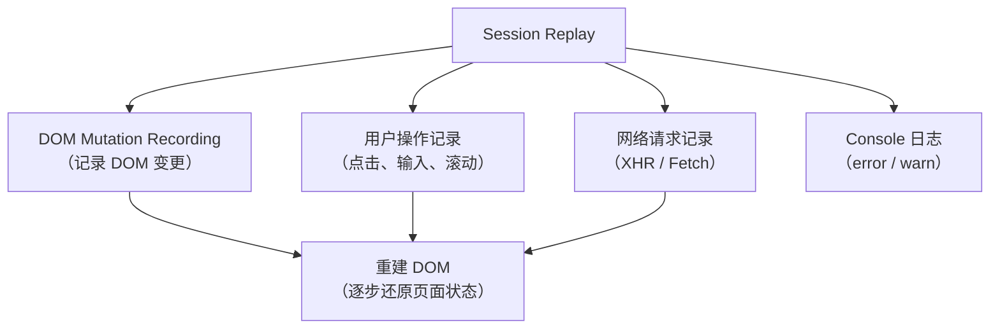

# SourceMap线上调试与Sentry监控

当线上出现报错时，代码是被压缩过的，变量名都变成了 `a`、`b`、`c`，难以直接定位问题。通过 SourceMap，可以像本地开发一样调试线上代码。

> **2024-2026 更新**：Vite 8 已用 Rolldown 取代 Rollup 作为生产构建引擎（sourcemap 配置不变），Sentry 提供了 `@sentry/vite-plugin` 自动上传 SourceMap。

## 问题场景

线上代码经过压缩和混淆后：

```javascript
// 原始代码
function calculateTotal(items) {
    const total = items.reduce((sum, item) => sum + item.price * item.quantity, 0);
    if (total > 10000) {
        throw new Error('Total exceeds limit');
    }
    return total;
}

// 压缩后的代码
function a(e){const t=e.reduce((e,t)=>e+t.price*t.quantity,0);if(t>1e4)throw new Error("Total exceeds limit");return t}
```

直接调试压缩代码极为困难，但通过 SourceMap 即可映射回原始代码。

## 方案一：通过 Chrome DevTools 手动关联 SourceMap

### 步骤

1. 确保 SourceMap 文件可访问（部署到 CDN 或本地服务器）
2. 在 Sources 面板中右键压缩文件 → Add source map
3. 输入 SourceMap URL
4. Chrome 自动映射到原始代码

> **注意**：这种方式是一次性的，刷新页面后需要重新关联。

## 方案二：通过 Charles 断点修改响应

### 原理

压缩文件的末尾通常没有 `//# sourceMappingURL=xxx.js.map`（使用 `hidden-source-map` 配置）。通过 Charles 断点加上这行注释，即可让浏览器自动加载 SourceMap。

### 步骤



1. 使用 Charles 代理线上请求
2. 对 JS 文件设置响应断点
3. 在响应内容末尾添加 `//# sourceMappingURL=http://localhost:8080/index.js.map`
4. 本地启动一个 SourceMap 文件服务
5. 刷新页面，Chrome 自动关联 SourceMap

## 方案三：VSCode 异常断点 + SourceMap

### 步骤

1. 创建 VSCode 调试配置：

```json
{
    "version": "0.2.0",
    "configurations": [
        {
            "type": "chrome",
            "request": "launch",
            "name": "Debug Production",
            "url": "https://your-site.com",
            "sourceMaps": true,
            "webRoot": "${workspaceFolder}",
            "resolveSourceMapLocations": [
                "https://your-site.com/**"
            ]
        }
    ]
}
```

2. 在 VSCode 中勾选 Uncaught Exceptions
3. 启动调试，代码会在异常处中断
4. 如果 SourceMap 配置正确，VSCode 会自动映射到源码

## SourceMap 的生成与部署

### Webpack 配置

```javascript
// webpack.config.js
module.exports = {
    devtool: 'hidden-source-map',  // 生成 SourceMap 但不关联
    // ...
};
```

### Vite 配置

```javascript
// vite.config.js
export default defineConfig({
    build: {
        sourcemap: 'hidden',  // 生成 SourceMap 但不关联
    },
});
```

### SourceMap 部署策略



> **警告**：切勿将 SourceMap 文件部署到公开的 CDN，否则任何人都可以通过浏览器 DevTools 查看原始源码。

> **说明**：Sentry 的完整接入（SDK 安装、SourceMap 上传、Release 管理、CI/CD 配置、Session Replay 与性能监控）见下文「Sentry 错误监控」章节。

## 线上报错调试的完整流程



## SourceMap 调试的最佳实践

### 1. 开发环境

```javascript
// Vite
build: { sourcemap: true }

// Webpack
devtool: 'eval-cheap-module-source-map'
```

### 2. 生产环境

```javascript
// Vite
build: { sourcemap: 'hidden' }  // 生成但不关联

// Webpack
devtool: 'hidden-source-map'  // 生成但不关联
```

### 3. SourceMap 不生效的排查

| 问题 | 原因 | 解决方案 |
|------|------|---------|
| Sources 面板看不到源码 | SourceMap 未被加载 | 检查 `sourceMappingURL` 是否正确 |
| 源码路径不对 | `sources` 字段与实际路径不匹配 | 配置 `webRoot` / `sourceRoot` |
| 断点不命中 | 路径映射错误 | 检查 VSCode 的 `sourceMapPathOverrides` |
| SourceMap 加载失败 | 跨域或文件不存在 | 确保 SourceMap 文件可访问 |
| VSCode 不识别 | `resolveSourceMapLocations` 配置不当 | 添加对应的 URL 模式 |

### 4. SourceMap 相关的 Webpack devtool 对照

| devtool 值 | 构建速度 | 重建速度 | SourceMap 质量 | 适用场景 |
|------------|---------|---------|--------------|---------|
| `eval` | 最快 | 最快 | 行映射 | 开发环境 |
| `eval-cheap-module-source-map` | 快 | 快 | 行映射（不含列） | 开发环境（推荐） |
| `source-map` | 最慢 | 最慢 | 完整映射 | 生产环境 |
| `hidden-source-map` | 最慢 | 最慢 | 完整映射（不关联） | 生产环境 + Sentry |


## Sentry 错误监控

线上代码报错时，需要快速定位问题。Sentry 是应用广泛的前端错误监控平台，它通过 SourceMap 将压缩代码的报错还原到源码位置。

> **2024-2026 更新**：Sentry 提供了 `@sentry/vite-plugin` 和 `@sentry/webpack-plugin`，可以在构建时自动上传 SourceMap。

## Sentry 的工作原理



## Sentry SDK 安装

### Vite 项目

```javascript
// vite.config.js
import { defineConfig } from 'vite';
import vue from '@vitejs/plugin-vue';
import { sentryVitePlugin } from '@sentry/vite-plugin';

export default defineConfig({
    plugins: [
        vue(),
        sentryVitePlugin({
            org: 'your-org',
            project: 'your-project',
            authToken: process.env.SENTRY_AUTH_TOKEN,

            // SourceMap 配置
            sourcemaps: {
                filesToDeleteAfterUpload: ['dist/**/*.map'],  // 上传后删除
            },

            // Release 配置
            release: {
                name: process.env.SENTRY_RELEASE || '1.0.0',
                create: true,
                finalize: true,
                setCommits: {
                    auto: true,  // 自动关联 Git commits
                },
            },
        }),
    ],

    build: {
        sourcemap: true,  // 必须生成 SourceMap
    },
});
```

### Webpack 项目

```javascript
// webpack.config.js
const { sentryWebpackPlugin } = require('@sentry/webpack-plugin');

module.exports = {
    devtool: 'source-map',  // 必须生成 SourceMap

    plugins: [
        sentryWebpackPlugin({
            org: 'your-org',
            project: 'your-project',
            authToken: process.env.SENTRY_AUTH_TOKEN,
            release: { name: process.env.SENTRY_RELEASE },
        }),
    ],
};
```

## Sentry SDK 初始化

```javascript
// src/main.js（Vue 项目）
import * as Sentry from '@sentry/vue';

Sentry.init({
    dsn: 'https://your-dsn@sentry.io/your-project-id',
    integrations: [
        Sentry.browserTracingIntegration(),  // 性能监控
        Sentry.replayIntegration(),           // Session Replay
    ],
    tracesSampleRate: 0.1,    // 10% 的请求追踪性能
    replaysSessionSampleRate: 0.1,  // 10% 的正常 Session 录制
    replaysOnErrorSampleRate: 1.0,  // 100% 的错误 Session 录制
    release: '1.0.0',         // 对应上传的 SourceMap Release
});
```

> **2024-2026 更新**：Sentry 新增了 Session Replay 功能，可以录制报错前用户的所有操作。

## SourceMap 上传流程



**关键步骤**：
1. 构建时生成 SourceMap（`sourcemap: true` 或 `devtool: 'source-map'`）
2. Sentry Plugin 自动上传 SourceMap 到 Sentry Server
3. 上传后删除 `.map` 文件（避免暴露源码）
4. 部署不含 SourceMap 的构建产物到线上
5. 报错时 Sentry 自动用 SourceMap 还原位置

## Release 管理

Release 是 Sentry 的核心概念，它将 SourceMap 与特定版本的代码关联：

```javascript
// 创建 Release
const release = process.env.SENTRY_RELEASE || 'my-app-1.0.0';

// Sentry.init 中设置
Sentry.init({
    release,
});

// Sentry Plugin 中设置
sentryVitePlugin({
    release: {
        name: release,
        create: true,     // 自动创建 Release
        finalize: true,   // 自动标记为已部署
        setCommits: {
            auto: true,   // 自动关联 Git commits
        },
    },
});
```

### Release 的生命周期


## CI/CD 配置

### GitHub Actions

```yaml
name: Build and Deploy

on: [push]

jobs:
    build:
        runs-on: ubuntu-latest
        steps:
            - uses: actions/checkout@v4
            - uses: actions/setup-node@v4
              with:
                  node-version: 22

            - run: npm install

            # 设置环境变量
            - name: Set Sentry Release
              run: echo "SENTRY_RELEASE=${{ github.sha }}" >> $GITHUB_ENV

            - run: npm run build
              env:
                  SENTRY_AUTH_TOKEN: ${{ secrets.SENTRY_AUTH_TOKEN }}
                  SENTRY_RELEASE: ${{ env.SENTRY_RELEASE }}

            - run: npm run deploy
```

### SourceMap 上传失败的排查

| 问题 | 原因 | 解决方案 |
|------|------|---------|
| 报错位置未还原 | SourceMap 未上传 | 检查 `SENTRY_AUTH_TOKEN` 是否配置 |
| 还原位置不准确 | Release 名称不一致 | 确保 Sentry.init 的 release 与 Plugin 的 release 一致 |
| 多个版本报错混杂 | 未设置 Release | 所有上报事件必须带 release |
| SourceMap 找不到 | 部署路径与上传路径不一致 | 配置 `urlPrefix` 使路径匹配 |
| 构建太慢 | SourceMap 生成耗时 | 开发环境用 `hidden-source-map` |

## urlPrefix 配置

如果部署路径与构建路径不一致，需要配置 `urlPrefix`：

```javascript
sentryVitePlugin({
    urlPrefix: '~/static/js',  // 线上 JS 的路径前缀
});
```

例如：
- 构建产物路径：`dist/assets/index-abc123.js`
- 线上路径：`https://example.com/static/js/index-abc123.js`
- urlPrefix：`~/static/js`（`~` 代表线上域名）

## Sentry 的报错还原流程



## Session Replay（报错回放）

> **2024-2026 新增**：Sentry Session Replay 可以录制报错前用户的操作：

```javascript
Sentry.init({
    integrations: [
        Sentry.replayIntegration({
            maskAllText: true,       // 遮罩敏感文字
            maskAllInputs: true,     // 遮罩输入框
            blockAllMedia: true,     // 阻止媒体元素
        }),
    ],
    replaysSessionSampleRate: 0.1,   // 正常 Session：10%
    replaysOnErrorSampleRate: 1.0,   // 错误 Session：100%
});
```

Session Replay 的原理是基于 DOM Mutation Recording：



## Sentry 性能监控

> **2024-2026 更新**：Sentry 支持 Core Web Vitals 性能监控：

```javascript
Sentry.init({
    integrations: [
        Sentry.browserTracingIntegration(),
    ],
    tracesSampleRate: 0.1,
});
```

Sentry 会自动收集：
- **LCP**（Largest Contentful Paint）
- **INP**（Interaction to Next Paint）
- **CLS**（Cumulative Layout Shift）
- **FCP**（First Contentful Paint）
- **TTFB**（Time to First Byte）

## Sentry 报警配置

Sentry 支持多种报警渠道：

| 渠道 | 说明 |
|------|------|
| Email | 邮件通知 |
| Slack | Slack 频道通知 |
| Discord | Discord 频道通知 |
| Webhook | 自定义 HTTP 通知 |
| PagerDuty | 紧急报警 |
| Jira / GitHub | 创建 Issue |

### 报警规则

```javascript
// Sentry 项目设置 → Alerts → Rules
// 示例：当一个 Release 的错误数超过阈值时报警
{
    conditions: [
        { type: 'error-count', value: 10 },  // 10 次报错
        { type: 'release', value: '1.0.0' },  // 特定 Release
    ],
    actions: [
        { type: 'slack', channel: '#alerts' },
    ],
}
```

