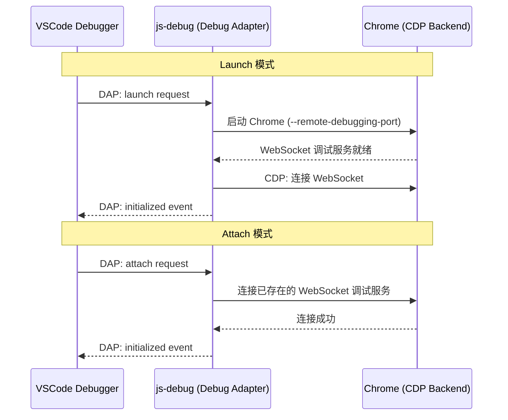

# VSCode-Chrome-Debugger配置详解

VSCode Debugger 除了基础调试外还有很多有用的配置项，本节一起详细讲解：

调试配置文件不用自己创建，可以直接点击 Debug 窗口的 `create a launch.json file` 快速创建：

## launch / attach

创建 Chrome Debug 配置有两种方式：launch 和 attach：

它们只是 request 的配置不同：

调试就是把浏览器跑起来访问目标网页，此时会有一个 ws 的调试服务，用 frontend 的 ws 客户端连接上这个 ws 服务，就可以进行调试。



VSCode 的 Debugger 会多一层适配器协议的转换，但是原理差不多。

**launch** 的意思是把 url 对应的网页跑起来，指定调试端口，然后 frontend 自动 attach 到这个端口。

但如果你已经有一个在调试模式跑的浏览器了，直接连接上就行，这时候就用 **attach**。

比如我们手动把 Chrome 跑起来，指定调试端口 remote-debugging-port 为 9222，指定用户数据保存目录 user-data-dir 为你自己创建一个目录。

在命令行执行下面的命令：

```bash
# macOS
/Applications/Google\ Chrome.app/Contents/MacOS/Google\ Chrome --remote-debugging-port=9222 --user-data-dir=/tmp/chrome-debug-profile

# Windows
"C:\Program Files\Google\Chrome\Application\chrome.exe" --remote-debugging-port=9222 --user-data-dir=C:\temp\chrome-debug-profile

# Linux
google-chrome --remote-debugging-port=9222 --user-data-dir=/tmp/chrome-debug-profile
```

> **安全提示**：Node.js 22 中 `--inspect` 标志默认仅绑定到 `127.0.0.1`（本地回环地址），Chrome 的 `--remote-debugging-port` 同样建议仅在本地使用。如果绑定到 `0.0.0.0`，任何能访问该端口的设备都可以通过 CDP 控制你的浏览器，存在严重安全风险。

Chrome 跑起来之后，你可以打开几个网页，比如百度、掘金，然后访问 `http://localhost:9222/json`，此时可以看到所有的 ws 服务的地址。

为什么每个页面有单独的 ws 服务？

每个页面拥有独立的 ws 服务，原因是每个页面的调试都是独立的，自然就需要单独的 ws 服务。每个标签页（Tab）对应一个独立的 `Target`，每个 Target 有自己的 CDP WebSocket 端点。

接下来你创建一个 attach 的 Chrome Debug 配置：

```json
{
  "type": "chrome",
  "request": "attach",
  "name": "Attach to Chrome",
  "port": 9222
}
```

点击启动，就会看到 VSCode Debugger 和每一个页面的 ws 调试服务建立起了链接。比如访问之前的 React 项目，就可以进行调试了。

可以多个页面一起调试，每个页面都有独立的调试上下文。

## userDataDir

不知道你有没有注意到刚才手动启动 Chrome 的时候，除了指定调试端口 remote-debugging-port 外，还指定了用户数据目录 user-data-dir。

为什么要指定这个？

user data dir 是保存用户数据的地方，比如你的浏览记录、cookies、插件、书签、网站的数据等等，在 macOS 下是保存在这个位置：

```bash
~/Library/Application\ Support/Google/Chrome
```

比如你打开 `Default/Bookmarks` 查看，里面保存的都是书签数据：

```bash
open ~/Library/Application\ Support/Google/Chrome/Default/Bookmarks
```

你还可以删掉 `Default/Cookies`，之后再访问之前登录过的网站，会发现都需要重新登录。

这就是用户数据目录的作用。

启动 Chrome 必须手动指定用户数据目录，因为用户数据目录只能被一个 Chrome 实例访问：如果你之前启动了 Chrome 使用了默认的 user data dir，那就不能再启动另一个 Chrome 实例使用它。

如果用户数据目录已经跑了一个 Chrome 实例，再跑一个时会报错。

所以我们用调试模式启动 Chrome 的时候，需要单独指定一下 user data dir 的位置。或者你也把之前的 Chrome 实例关掉，这样才能用默认的。

launch 的配置项里也有 userDataDir 的配置：

```json
{
  "type": "chrome",
  "request": "launch",
  "name": "Launch Chrome",
  "url": "http://localhost:5173",
  "userDataDir": true  // 默认值：创建临时目录
}
```

默认是 `true`，代表创建一个临时目录来保存用户数据。

你也可以设置为 `false`，使用默认 user data dir 启动 chrome。这样的好处是登录状态、历史记录等都保留。

把 `userDataDir` 设置为 `true` 就每次都需要登录了。

你也可以指定一个自定义的路径，这样用户数据就会保存在那个目录下：

```json
{
  "userDataDir": "/path/to/custom/profile"
}
```

更重要的是，你安装的 React DevTools、Vue DevTools 插件都是在默认用户数据目录的，如果用临时数据目录跑调试，这些插件就都没有了。

比如你 `userDataDir` 设置为 `true` 的时候，React DevTools 插件是没有的，需要再安装。

`userDataDir` 设置为 `false` 的时候，安装过的插件都可以直接用。

但是除了调试用之外，平时也会用到 Chrome，同一个 user data dir 只能跑一个 Chrome 实例的话，就会产生冲突。

这个问题可以用下面的配置解决：

## runtimeExecutable

调试网页的 JS，需要先把 Chrome 跑起来，默认跑的是 Google Chrome，实际上它还有另外一个版本 Canary：

这是给开发者用的每日构建版，能够快速体验新特性，但是不稳定。

而 Google Chrome 是给普通用户用的，比较稳定。

这俩是独立的，相互之间没影响，可以都用同一个 user data dir 来启动。

你可以在[官网](https://www.google.com/intl/zh-CN/chrome/canary/)把 canary 下载下来。

接下来指定 runtimeExecutable 为 canary，使用默认的用户数据目录启动：

```json
{
  "type": "chrome",
  "request": "launch",
  "name": "Launch Chrome Canary",
  "url": "http://localhost:5173",
  "runtimeExecutable": "canary",
  "userDataDir": false
}
```

这样你就可以调试用 canary，平时用 chrome 了，两者都有各自的默认数据目录。

（注意，一定要先安装了 canary，才能指定 canary 跑）

此外，runtimeExecutable 还可以指定用别的浏览器跑：

可以是 `stable`，也就是稳定的 Google Chrome，或者 `canary`，也就是每日构建版的 Google Chrome Canary，还可以是 `custom`，然后用 `CHROME_PATH` 环境变量指定浏览器的地址。

不过常用的还是 Chrome 和 Canary。

> **2024-2026 更新**：js-debug 还内置了 Edge 调试类型，把 launch.json 的 `"type"` 设置为 `"msedge"` 即可直接调试 Edge 浏览器。

### runtimeArgs

启动 Chrome 的时候，可以指定启动参数，比如每次打开网页都默认调起 Chrome DevTools，就可以加一个 `--auto-open-devtools-for-tabs` 的启动参数：

```json
{
  "runtimeArgs": ["--auto-open-devtools-for-tabs"]
}
```

想要无痕模式启动，也就是不加载插件，没有登录状态，就可以加一个 `--incognito` 的启动参数：

```json
{
  "runtimeArgs": ["--incognito"]
}
```

调试用的浏览器就会以无痕模式启动了。

实际上我们设置的 `userDataDir` 就是指定了 `--user-data-dir` 的启动参数。

**常用的 Chrome 调试启动参数：**

| 参数 | 作用 |
|------|------|
| `--auto-open-devtools-for-tabs` | 自动打开 DevTools |
| `--incognito` | 无痕模式 |
| `--disable-extensions` | 禁用所有扩展 |
| `--disable-gpu` | 禁用 GPU 加速（调试渲染问题时有用） |
| `--headless` | 无头模式（CI 环境调试） |
| `--disable-web-security` | 禁用同源策略（调试跨域问题时有用，**仅限开发**） |
| `--auto-select-desktop-capture-source` | 自动选择屏幕共享源（调试 WebRTC 时有用） |

## sourceMapPathOverrides

代码是经过编译打包然后在浏览器运行的，但我们却可以直接调试源码，这是通过 sourcemap 做到的。

调试工具都支持 sourcemap，并且是默认开启的。

也可以关掉：

Chrome DevTools 里这么关（按 `F1` 打开 Settings，在 Preferences > Sources 里取消勾选 "Enable JavaScript source maps"）。

VSCode Debugger 这么关（在 launch.json 中设置 `"sourceMaps": false`）。

这样调试的就是编译后的代码了。

在开启 sourcemap 的情况下，用 Chrome DevTools 可以看到，源文件的路径是 `/static/js/bundle.js`，被 sourcemap 到了 `/Users/guang/code/test-react-debug/src/index.js`。

而在 VSCode 里，这个路径是有对应的文件的，所以就会打开对应文件的编辑器，这样就可以边调试边修改代码。

但有的时候，sourcemap 到的文件路径在本地里找不到，这时候代码就只读了，因为没有地方保存：

这种情况就需要对 sourcemap 到的路径再做一次映射，通过 `sourceMapPathOverrides` 这个配置项。

默认有这么几个配置：

```json
{
  "sourceMapPathOverrides": {
    "webpack:///./src/*": "${workspaceFolder}/src/*",
    "webpack://?:*/*": "${workspaceFolder}/*",
    "webpack:///./~/*": "${workspaceFolder}/node_modules/*"
  }
}
```

分别是把 webpack 开头的 path 映射到了本地的目录下。（注：js-debug 内置的默认映射集合随版本会略有调整，以官方文档为准；默认映射中使用的 `${webRoot}` 变量默认值就是 `${workspaceFolder}`，两者效果一致。）

其中 `?:*` 代表匹配任意字符，但不映射，而 `*` 是用于匹配字符并映射的。

比如最后一个 `webpack://?:*/*` 到 `${workspaceFolder}/*` 的映射，就是把 webpack:// 开头，后面接任意字符 + `/` 然后是任意字符的路径映射到了本地的项目目录。（`workspaceFolder` 是一个内置变量，代表项目根目录）

把调试的文件 sourcemap 到的路径映射到本地的文件，这样调试的代码就不再只读了。

> **2024-2026 更新**：Vite 项目的 sourcemap 路径格式与 webpack 不同。Vite 生成的 sourcemap 中源文件路径通常是 `../src/xxx.tsx` 这样的相对路径，js-debug 已经内置了对 Vite sourcemap 的优化支持，大多数情况下不需要手动配置 `sourceMapPathOverrides`。但如果遇到路径映射问题，可以添加如下配置：
>
> ```json
> {
>   "sourceMapPathOverrides": {
>     "../../*": "${workspaceFolder}/*"
>   }
> }
> ```

## file

除了启动开发服务器然后连上 url 调试之外，也可以直接指定某个文件，VSCode Debugger 会启动静态服务器提供服务：

```json
{
  "type": "chrome",
  "request": "launch",
  "name": "Launch File",
  "file": "${workspaceFolder}/index.html"
}
```

打了个断点，然后启动调试，这样就可以直接调试静态网页了。

同样，要修改调试的内容需要把 url 映射到本地文件才行，所以有这样一个 `pathMapping` 的配置：

```json
{
  "pathMapping": {
    "/": "${workspaceFolder}"
  }
}
```

`webRoot` 实际上就相当于把 `/` 的 url 映射到了 `${workspaceFolder}/`。

这些配置使用较少，一般还是启动 dev server，再调试某个 url 更多一些。

## serverReadyAction

> **补充**：`serverReadyAction` 是 VSCode 内置的通用调试配置项（并非 js-debug 专属），可以在开发服务器启动后自动打开浏览器并附加调试：

```json
{
  "type": "chrome",
  "request": "launch",
  "name": "Launch Chrome",
  "url": "http://localhost:5173",
  "webRoot": "${workspaceFolder}",
  "serverReadyAction": {
    "pattern": "Local:.*(https?://.+)",
    "uriFormat": "%s",
    "action": "openExternally"
  }
}
```

这个配置会监听 Debug Console 的输出，当匹配到开发服务器启动的 URL 模式时，自动在调试浏览器中打开该 URL。对于 Vite 项目特别有用，因为 Vite 的启动输出格式是 `Local: http://localhost:5173/`。

## 完整配置参考

```json
{
  "version": "0.2.0",
  "configurations": [
    {
      "type": "chrome",
      "request": "launch",
      "name": "Launch Chrome (Vite)",
      "url": "http://localhost:5173",
      "webRoot": "${workspaceFolder}",
      "userDataDir": false,
      "runtimeExecutable": "stable",
      "runtimeArgs": [],
      "sourceMaps": true,
      "sourceMapPathOverrides": {
        "../../*": "${workspaceFolder}/*"
      }
    },
    {
      "type": "chrome",
      "request": "attach",
      "name": "Attach to Chrome",
      "port": 9222,
      "webRoot": "${workspaceFolder}"
    }
  ]
}
```
