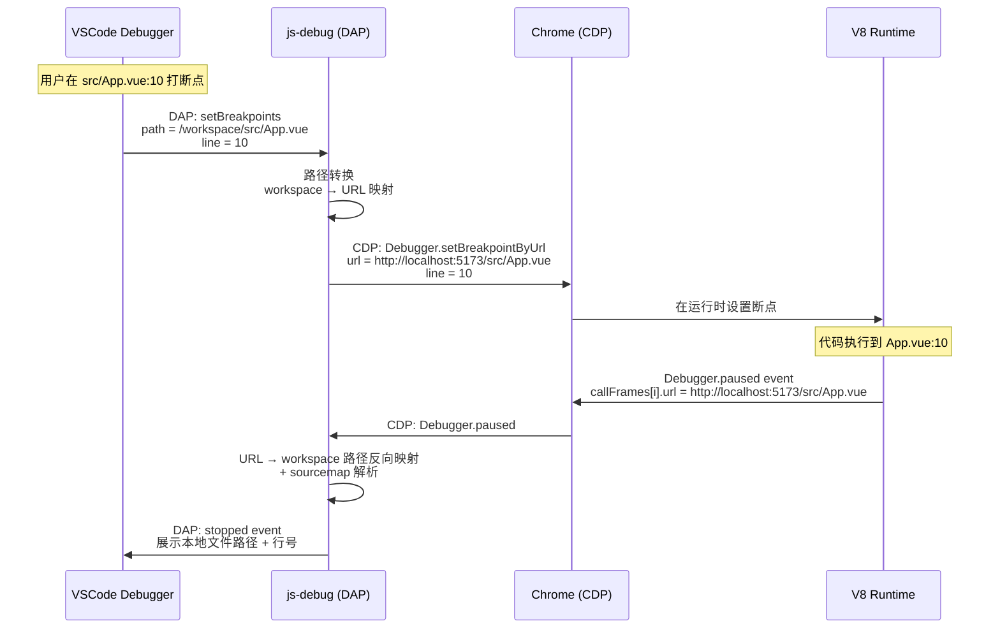
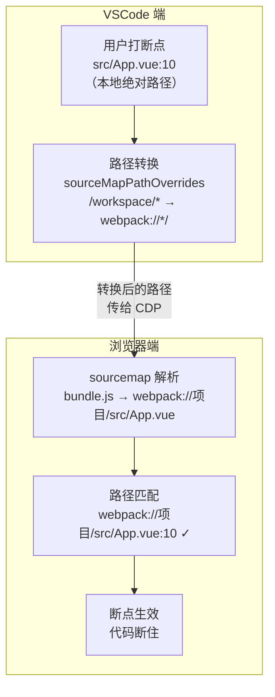
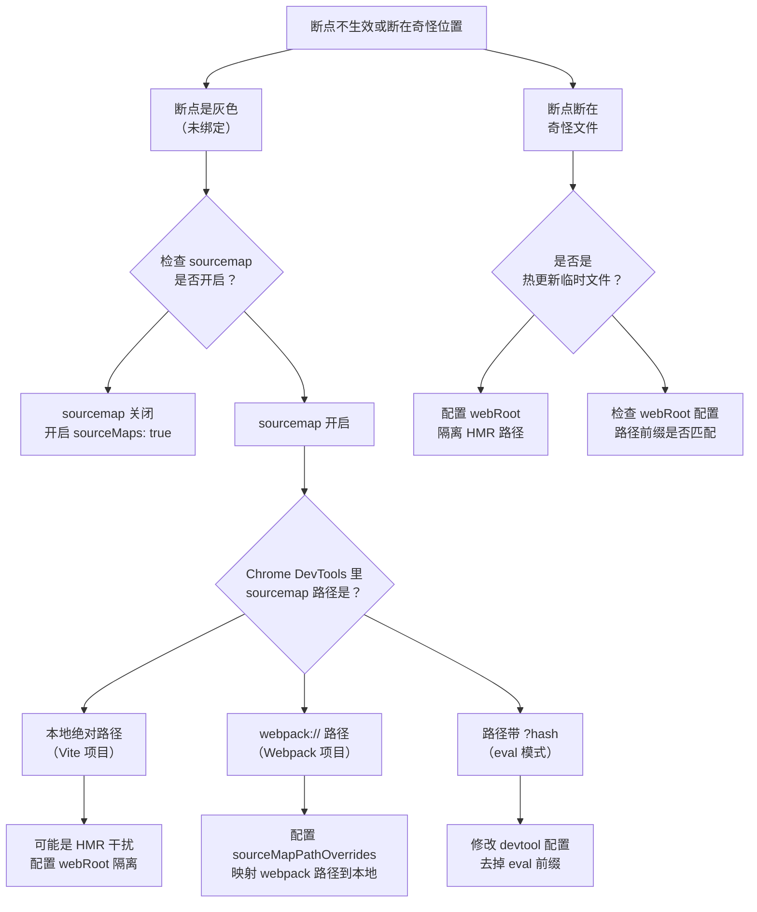

# VSCode-Debugger断点映射的原理与常见问题

开发者经常会遇到一些断点相关的问题，比如：

- 在文件里打的断点是灰的，一直不生效
- 断点断在了奇怪的文件和位置

这是因为不清楚 VSCode Debugger 里打的断点是怎么在网页里生效的。

## 断点映射的原理

我们在 VSCode 里打的断点，VSCode 会记录你在哪个文件哪行打了个断点。在 BREAKPOINTS 面板可以看到。

代码经过编译打包之后，网页里运行的是 bundle.js 等产物文件。我们打的断点最终还是在代码的运行时，也就是网页里断住的，所以在 VSCode 里打的断点会被传递给浏览器，通过 CDP 调试协议。

但是问题来了，我们本地打的断点是一个绝对路径，也就是包含 `${workspaceFolder}` 的路径，而网页里根本没有这个路径，那怎么断住的？

这是因为有的文件是关联了 sourcemap 的，也就是文件末尾的 `//# sourceMappingURL=xxx` 注释。它会把文件路径映射到源码路径。

如果映射到的源码路径直接就是本地的文件路径，这样路径就能匹配上，断点就生效了。



Vite 的项目，sourcemap 都是绝对路径，所以断点直接就生效了。

但是 webpack 的项目，sourcemap 到的路径不是绝对路径，而是 `webpack://项目名/src/App.vue` 这种。

那么怎么办？本地打的断点都是绝对路径，而 sourcemap 到的路径不是绝对路径，无法直接匹配。

所以 VSCode Chrome Debugger 支持了 `sourceMapPathOverrides` 的配置，这是默认生成的几个配置，最后一个就是映射 webpack 路径的，实际上是把以 `${workspaceFolder}` 开头的本地路径映射成了 `webpack://` 开头的路径传给浏览器。

这样就和浏览器里的 sourcemap 后的文件路径对上了，那断点也就生效了。

## 断点映射的完整流程



具体配置方法：加个 `debugger` 查看 Chrome DevTools 里的路径，然后映射到本地的路径即可。

React 和 Vue 3 项目不用单独配置，用默认的配置就行。

Vue 2 项目需要配一下：

```json
"sourceMapPathOverrides": {
    "webpack://你的项目名/src/*": "${workspaceFolder}/src/*"
}
```

或者：

```json
"sourceMapPathOverrides": {
    "webpack://*/src/*": "${workspaceFolder}/src/*"
}
```

都是为了让打断点的文件路径和 sourcemap 之后的文件路径对上。

## webRoot 的作用

上面都是把项目根目录（workspaceFolder）映射到 URL 的 `/` 的，有的时候映射的不是 `/`，会出现断点断在错误路径的情况。

这就需要 `webRoot` 的配置了，默认是 `${workspaceFolder}`，也就是把项目根目录映射到 URL 的 `/`。

如果 sourcemap 到的路径前面多了几层目录（比如 `/mobile/js/src/App.vue`），说明要把 `/mobile/js/` 这个路径映射到项目根目录，所以要配置：

```json
{
  "webRoot": "${workspaceFolder}/mobile/js"
}
```

## Vite 项目的 HMR 文件干扰

为什么调试 Vite + Vue 项目时，webRoot 要配置为 `${workspaceFolder}/_debug_placeholder`（一个本地不存在的目录）？

因为 Vite 项目有一些热更新的文件，这些临时文件没有对应的本地文件，但路径刚好是 VSCode Debugger 传递过去的断点文件路径，就断住了，所以你会发现断点断在了奇怪的文件。

为了避免这种情况，我们配置了 webRoot，那实际上传过去的断点信息就是 `/_debug_placeholder/src/App.vue`。

这样热更新的文件和这个路径就不一样了，也就不会断住。

而有 sourcemap 的文件，因为 sourcemap 到的是绝对路径，不受 webRoot 的影响，依然能映射到本地，所以那些断点能生效。

## 断点问题排查决策树


