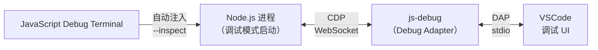
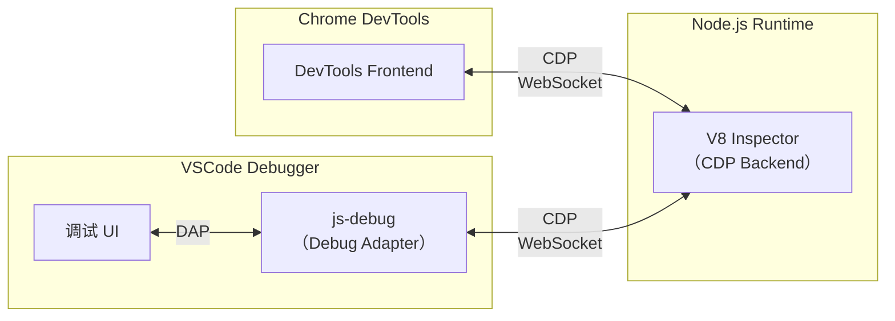
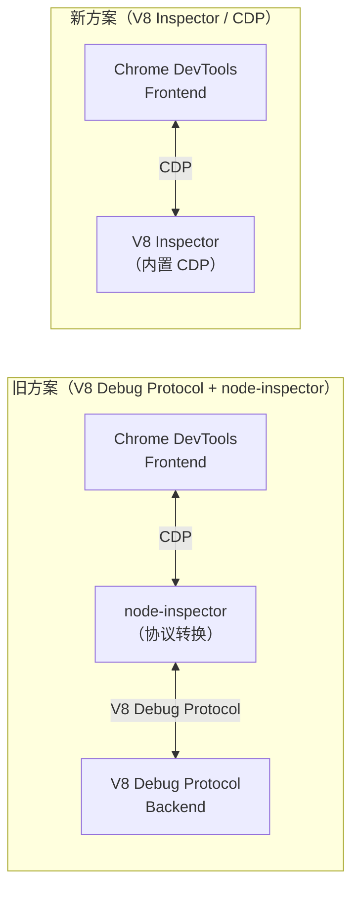

# VSCode Node调试完整指南

本节介绍 Node.js 代码的调试方法，涵盖调试原理、launch.json 配置与实战。

## 准备 Node.js 代码

准备一段 Node.js 的代码：

```javascript
const fs = require('fs/promises');

(async function() {
    const fileContent = await fs.readFile('./package.json', {
        encoding: 'utf-8'
    });

    await fs.writeFile('./package2.json', fileContent);
})();
```

这段代码实现了简单的文件读写，先用 `node index.js` 运行验证确认正常运行。

此后以调试模式启动，加个 `--inspect-brk` 参数：

```bash
node --inspect-brk ./index.js
```

`--inspect` 是以调试模式启动，`--inspect-brk` 是以调试模式启动并且在首行断住。

> **2024-2026 更新**：Node.js 22 新增了 `--inspect-wait` 标志，行为类似 `--inspect-brk`，但更精确——它等待调试器连接后再执行代码，而不是在首行断住。此外，`--inspect` 默认仅绑定到 `127.0.0.1`（本地回环地址），增强了安全性。Node.js 6.4 之前的版本默认绑定到 `0.0.0.0`，存在远程操控风险。

启动后会打印 ws 的地址：

```
Debugger listening on ws://127.0.0.1:9229/xxx
```

这就是调试的服务端。

接下来找一个对接该调试协议的客户端连接即可。

Node.js 可以用 Chrome DevTools 来调试：

## 用 Chrome DevTools 调试 Node.js 代码

打开 [chrome://inspect/#devices](chrome:/inspect#devices)，下面列出的是所有可以调试的目标，也就是 ws 服务端：

这里会列出启动的 Node.js 脚本。

这是因为我们在 chrome://inspect 的网络目标配置（Discover network targets）里加上了 Node.js 的 ws 调试服务的端口：

Node.js 调试服务默认运行在 9229 端口，也可以更换：

```bash
node --inspect-brk=8888 ./index.js
```

只要把它的端口加入到配置里即可。

点击 inspect 就可以调试这个 Node.js 脚本了。

但是这种方式与调试网页存在同样的问题：在 Chrome DevTools 里调试，在 VSCode 里写代码，两者是分离的，切换起来不够便捷。

VSCode 可以调试 Node.js 代码：

## 用 VSCode Debugger 调试 Node.js 代码

创建 `.vscode/launch.json` 的调试配置文件。VSCode Debugger 支持 `launch`（自动以调试模式运行脚本）和 `attach`（连接已运行的调试服务）两种模式，完整的配置项见下文「VSCode Node Debugger 配置详解」章节。

### JavaScript Debug Terminal

> **2024-2026 新增**：VSCode 内置的 js-debug 提供了一个非常实用的功能——**JavaScript Debug Terminal**。在该终端中运行的任何 Node.js 命令都会自动进入调试模式：



使用方式：

1. 在 VSCode 的 Terminal 面板中，点击 `+` 旁边的下拉箭头，选择 **JavaScript Debug Terminal**
2. 在这个终端中运行任何 Node.js 命令，比如 `node index.js`、`npm run dev`、`npx xxx`
3. VSCode 会自动识别并进入调试模式，无需手动配置 launch.json

**这对调试 npm scripts 特别有用**——在 Debug Terminal 中执行 `npm run dev`，就可以直接调试 npm scripts 了。

### Auto Attach

另一个相关功能是 **Auto Attach**——当在 VSCode 的集成终端中运行 Node.js 进程时，VSCode 会自动检测并附加调试器。

在 VSCode 设置中搜索 `debug.javascript.autoAttachFilter`，可以配置为：

| 选项 | 含义 |
|------|------|
| `always` | 所有 Node.js 进程都自动附加 |
| `onlyWithFlag` | 只有带 `--inspect` 标志的进程才附加 |
| `smart` | 只附加非第三方工具启动的 Node.js 进程 |
| `disabled` | 不自动附加 |

推荐设置为 `smart`，这样调试 npm scripts 等场景时会自动附加，但不会误调试 node_modules 下的工具进程。

## 为什么 VSCode 和 Chrome DevTools 都能调试 Node.js

这是因为两者都对接了 Node.js 的调试协议，只是实现了各自的 UI：



图中展示的是 Chrome DevTools Protocol。Node.js 也是基于 CDP 调试的。

至于为什么要用 CDP 来调试 Node.js 代码，这就涉及到一段历史了：

## Node.js Debugger 的历史

Node.js 是基于 V8 的，V8 本身有调试协议 **V8 Debug Protocol**，所以 Node.js 最早的调试协议也就是 V8 Debug Protocol。

当时调试是这样的：

通过 `node debug` 来运行 js 文件，会在首行断住：

然后可以通过 `run`、`cont`、`next`、`step` 等命令来实现单步调试，通过 `backtrace` 打印调用栈，通过 `setBreakPoint` 等设置断点。

虽然该有的调试功能都有，但是命令行调试还是比较费力的。

如何不用命令行调试，而是用 UI 来调试呢？

当时 Node 就瞄准了 Chrome DevTools，它的调试 UI 就很不错。

但是 Chrome DevTools 的调试协议是 Chrome DevTools Protocol，和 V8 Debug Protocol 还是有些差距的，如何用上 Chrome DevTools 的调试工具来调试 Node 呢？

实际上解决方案并不复杂，就是加一个中间的服务来做协议转换：

这个服务是 **node-inspector** 这个包提供的。

所以当时 Node.js 调试服务跑起来之后，还要再跑一个 node-inspector 服务，这样才能用 Chrome DevTools 来调试 Node.js 代码。



后来维护 Node.js 的团队觉得这样过于繁琐，于是让 Node.js 提供的调试协议直接兼容 Chrome DevTools Protocol。

当时就有了这样一个 PR，把 **V8 Inspector** 集成到 Node.js 中：

V8 Inspector 就是从 Chrome 的内核 Blink 里剥离出来的让 V8 支持 Chrome DevTools Protocol 的部分。

这需要 V8 团队的配合，因此 Node.js 的发展还是很依赖 V8 团队的支持。

之后 Node.js 就在 **v6.3** 中加入了这个功能。

并且在成熟之后去掉了对 V8 Debug Protocol 的支持，也就是废弃了 `node debug` 命令，改为了 `node inspect`。

启动 ws 调试服务的方式就是 `node --inspect` 或者 `node --inspect-brk`。

此前作为两个协议中转的服务 node-inspector 也就退出了历史舞台。

所以今天，我们可以直接用 Chrome DevTools 来调试 Node.js 代码。

需要注意的是，这里只是说 Chrome DevTools 调试 Node.js，在 VSCode 里调试 Node.js 的话还要做一些额外的处理：

调试的原理我们已经知道了，就是 ws 客户端和服务器的通信，然后基于调试协议来完成不同的功能。Node.js 是这样，其他语言也是这样。

VSCode 是一个通用的编辑器，是要支持多种语言的，也就是它的调试 UI 要支持多种调试协议。

要同一个调试工具同时支持不同的协议不太现实，如何解决呢？

可以加一个中间层，VSCode 的调试 UI 只要支持这个中间的调试协议就可以了，其余的调试协议适配到这个调试协议上来：

这就是 **DAP 协议（Debug Adapter Protocol）**，版本已演进到 v1.71。

Node.js 在把调试工具的协议换成 Chrome DevTools Protocol 之后，只要实现个 DAP 的 adapter 就可以对接到 VSCode 的调试工具了。这个 adapter 就是内置的 **js-debug**。

这样我们就可以在 VSCode 里调试 Node.js 了。


## VSCode Node Debugger 配置详解

调试 Node.js 代码时有很多配置项，本节详细梳理这些配置。

### 创建调试配置

在 `.vscode/launch.json` 中添加 Node 类型的配置，可以通过点击右下角的 **Add Configuration...** 按钮快速添加。

### Launch Program

最基本的配置，以调试模式启动某个 Node.js 文件：

```json
{
  "type": "node",
  "request": "launch",
  "name": "Launch Program",
  "program": "${workspaceFolder}/index.js"
}
```

### Launch via npm

> **2024-2026 更新**：js-debug 对 npm scripts 调试的支持更加完善。推荐使用 `JavaScript Debug Terminal` 直接运行 npm scripts，而不再需要复杂的 `runtimeExecutable` 配置。

不过，launch.json 的方式仍然可用：

```json
{
  "type": "node",
  "request": "launch",
  "name": "Launch via npm",
  "runtimeExecutable": "npm",
  "runtimeArgs": ["run", "dev"],
  "cwd": "${workspaceFolder}"
}
```

但更推荐使用 **JavaScript Debug Terminal**：在 Debug Terminal 中直接执行 `npm run dev`，就能自动进入调试模式。

### Attach

连接到一个已经以调试模式运行的 Node.js 进程：

```json
{
  "type": "node",
  "request": "attach",
  "name": "Attach to Node",
  "port": 9229,
  "restart": true
}
```

## 核心配置项

### program

指定要调试的文件路径，支持变量：

```json
{
  "program": "${workspaceFolder}/src/index.js"
}
```

### args

传递给程序的命令行参数：

```json
{
  "program": "${workspaceFolder}/cli.js",
  "args": ["--config", "dev.config.js", "--verbose"]
}
```

这相当于执行 `node cli.js --config dev.config.js --verbose`。

### cwd

指定程序的工作目录，默认是项目根目录：

```json
{
  "program": "${workspaceFolder}/index.js",
  "cwd": "${workspaceFolder}/packages/cli"
}
```

### env / envFile

设置环境变量：

```json
{
  "program": "${workspaceFolder}/index.js",
  "env": {
    "NODE_ENV": "development",
    "DEBUG": "app:*"
  }
}
```

或者从文件加载环境变量：

```json
{
  "program": "${workspaceFolder}/index.js",
  "envFile": "${workspaceFolder}/.env.development"
}
```

> **实用技巧**：调试不同环境时，可以创建多个配置项，每个使用不同的 `envFile`，比如 `.env.development` 和 `.env.production`。

### runtimeExecutable / runtimeArgs

指定运行时和启动参数：

```json
{
  "type": "node",
  "request": "launch",
  "name": "Launch with custom runtime",
  "runtimeExecutable": "${workspaceFolder}/node_modules/.bin/ts-node",
  "runtimeArgs": ["--esm"],
  "program": "${workspaceFolder}/src/index.ts"
}
```

> **2024-2026 更新**：如果你使用 `tsx` 来运行 TypeScript 文件（比 `ts-node` 更快），可以这样配置：
>
> ```json
> {
>   "runtimeExecutable": "${workspaceFolder}/node_modules/.bin/tsx",
>   "program": "${workspaceFolder}/src/index.ts"
> }
> ```

### sourceMaps

是否启用 sourcemap 支持，默认为 `true`：

```json
{
  "sourceMaps": true
}
```

### resolveSourceMapLocations

> **2024-2026 新增**：精确控制哪些路径的 sourcemap 会被解析。当调试时遇到 sourcemap 解析错误或性能问题时，可以用这个配置来限制：

```json
{
  "resolveSourceMapLocations": [
    "${workspaceFolder}/**",
    "!**/node_modules/**"
  ]
}
```

### outFiles

`outFiles` 指定编译产物的位置，帮助 VSCode 找到 sourcemap 文件：

```json
{
  "outFiles": [
    "${workspaceFolder}/dist/**/*.js"
  ]
}
```

> **注意**：`outFiles` 在新版 js-debug 中已逐步被 `resolveSourceMapLocations` 替代。如果你同时设置了两者，`resolveSourceMapLocations` 优先级更高。

### restart

当被调试的进程退出时，是否自动重新启动调试：

```json
{
  "restart": true
}
```

对于 attach 模式特别有用——当 Node.js 进程因代码修改而重启（如 nodemon）时，VSCode 会自动重新连接。

### stopOnEntry

是否在程序入口处断住：

```json
{
  "stopOnEntry": true
}
```

相当于 `node --inspect-brk`。

### console

指定程序输出的控制台：

```json
{
  "console": "integratedTerminal"
}
```

| 值 | 说明 |
|----|------|
| `internalConsole` | VSCode 的 Debug Console（不支持 stdin 输入） |
| `integratedTerminal` | VSCode 集成终端（支持 stdin，推荐） |
| `externalTerminal` | 外部终端 |

> **重要**：如果你的程序需要从 stdin 读取输入（如命令行交互工具），必须使用 `integratedTerminal` 或 `externalTerminal`，因为 `internalConsole` 不支持 stdin。

### skipFiles

跳过不需要调试的文件：

```json
{
  "skipFiles": [
    "<node_internals>/**",
    "${workspaceFolder}/node_modules/**"
  ]
}
```

`<node_internals>` 是内置变量，代表 Node.js 内部代码。

> **2024-2026 更新**：js-debug 默认会跳过 `node_modules` 中的文件（智能跳过策略）。如果你需要调试 `node_modules` 中的某个包，可以在调试时右键调用栈中的帧，选择 "Toggle Skipping this File" 来取消跳过。

## TypeScript 调试

调试 TypeScript 文件有几种方式：

### 方式一：直接使用 tsx 运行

```json
{
  "type": "node",
  "request": "launch",
  "name": "Debug TypeScript",
  "runtimeExecutable": "${workspaceFolder}/node_modules/.bin/tsx",
  "program": "${workspaceFolder}/src/index.ts"
}
```

这是最简单的方式，`tsx` 会自动处理 TypeScript 编译和 sourcemap。

### 方式二：先编译再调试

```json
{
  "type": "node",
  "request": "launch",
  "name": "Debug Compiled TS",
  "program": "${workspaceFolder}/dist/index.js",
  "sourceMaps": true,
  "outFiles": ["${workspaceFolder}/dist/**/*.js"]
}
```

### 方式三：使用 --loader 标志（Node.js 22+ ESM）

```json
{
  "type": "node",
  "request": "launch",
  "name": "Debug ESM TypeScript",
  "runtimeArgs": ["--loader", "tsx"],
  "program": "${workspaceFolder}/src/index.ts"
}
```

## 完整配置参考

```json
{
  "version": "0.2.0",
  "configurations": [
    {
      "type": "node",
      "request": "launch",
      "name": "Launch Program",
      "program": "${workspaceFolder}/src/index.ts",
      "runtimeExecutable": "${workspaceFolder}/node_modules/.bin/tsx",
      "args": [],
      "cwd": "${workspaceFolder}",
      "env": {},
      "console": "integratedTerminal",
      "sourceMaps": true,
      "resolveSourceMapLocations": ["${workspaceFolder}/**"],
      "skipFiles": ["<node_internals>/**"],
      "restart": false,
      "stopOnEntry": false
    },
    {
      "type": "node",
      "request": "attach",
      "name": "Attach to Node",
      "port": 9229,
      "restart": true,
      "skipFiles": ["<node_internals>/**"]
    }
  ]
}
```

