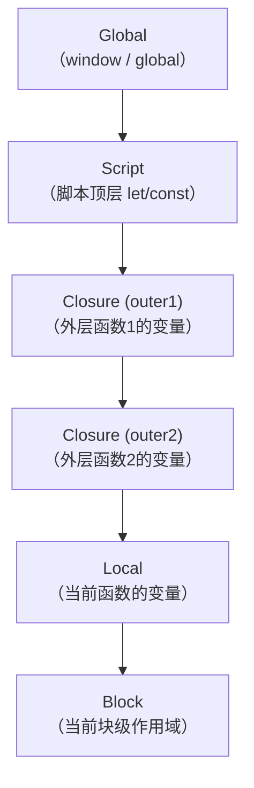
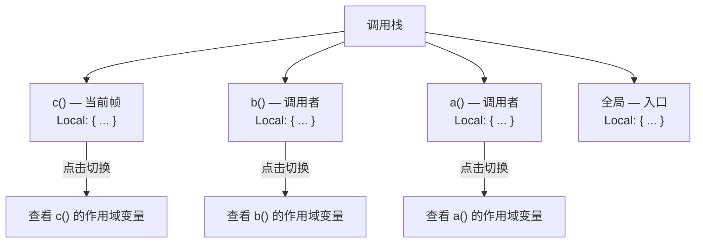
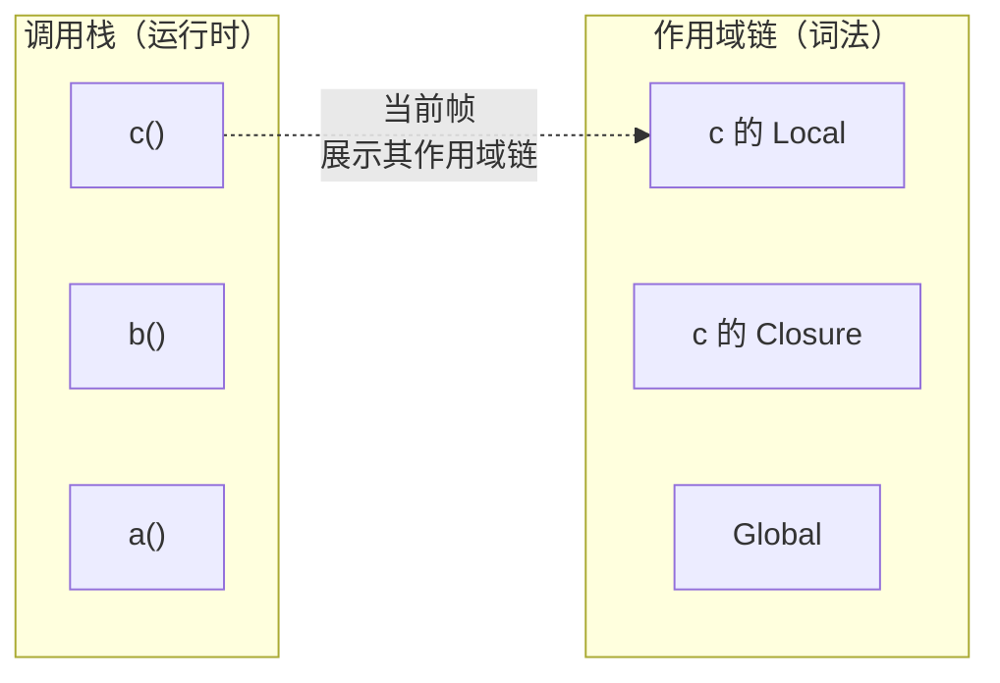

# 调试时查看作用域和调用栈的含义

本节将理解调试时的两个核心概念：作用域和调用栈。

## 作用域

调试的时候，在断点处断住之后，VSCode Debugger 会在左侧展示当前作用域的变量。

作用域有几种：

| 类型 | 含义 | 说明 |
|------|------|------|
| Local | 局部作用域 | 当前函数内的变量 |
| Closure | 闭包作用域 | 外层函数中定义的变量，被内层函数引用 |
| Global | 全局作用域 | 全局变量（浏览器中是 window，Node.js 中是 global） |
| Block | 块级作用域 | `{}` 块内的 let/const 变量 |
| Script | 脚本作用域 | 脚本顶层 let/const/class 声明的变量（不挂到全局对象上） |
| With | with 作用域 | with 语句创建的作用域 |
| Catch | catch 作用域 | catch 语句中的 error 变量 |

其中 Local、Closure、Global 是最常见的。

### Local 局部作用域

函数内部声明的变量就在 Local 作用域里。

```javascript
function foo() {
    const a = 1;  // Local
    let b = 2;    // Local
    var c = 3;    // Local

    console.log(a, b, c);
}
```

调试时断在 `console.log` 那行，可以看到 Local 下有 `a`、`b`、`c` 三个变量。

### Closure 闭包作用域

```javascript
function outer() {
    const x = 'hello';

    function inner() {
        const y = 'world';
        console.log(x, y);  // 断在这里
        // Local: { y }
        // Closure (outer): { x }
    }

    return inner;
}

const fn = outer();
fn();
```

在 `inner` 函数中，`y` 是局部变量（Local），`x` 是外层函数 `outer` 的变量，通过闭包引用（Closure）。

闭包作用域的名称就是外层函数名（如 `Closure (outer)`），如果有多层嵌套，就会有多个 Closure 作用域。

### Block 块级作用域

```javascript
function foo() {
    if (true) {
        let a = 1;    // Block 作用域
        const b = 2;  // Block 作用域
        var c = 3;    // 不在 Block 作用域，在 Local 作用域

        console.log(a, b, c);
    }
    // console.log(a); // ReferenceError
    // console.log(c); // 3 — var 不受块级作用域限制
}
```

`let` 和 `const` 声明的变量受块级作用域限制，`var` 不受。

### Script 脚本作用域

```javascript
// 在浏览器的脚本顶层
var x = 1;  // Global 作用域（同时挂到 window 上）
let y = 2;  // Script 作用域（不挂到 window 上）

console.log(x, y);
```

`Script` 作用域存放的是脚本顶层用 `let`、`const`、`class` 声明的变量，它们不属于全局对象，也不属于任何函数。

而在 Node.js 模块中，`var` 声明的变量不会进入 Global 作用域。这是因为 Node.js 的模块代码被包裹在一个函数中：

```javascript
(function(exports, require, module, __filename, __dirname) {
    var x = 1;  // 在这个函数作用域内，不是全局
});
```

所以 Node.js 模块顶层的 `var`、`let`、`const` 都在包装函数的作用域里：断在模块顶层时显示为 Local，断在模块内的函数里时显示为 Closure，不会出现在 Global 作用域中。

### 作用域链

调试时展示的作用域形成了一条链：



查找变量时，从最内层作用域开始往外查找，找到第一个匹配的变量名就停止。

## 调用栈

调用栈是函数调用的路径，展示的是程序执行到当前位置都经历了哪些函数调用。

```javascript
function a() {
    b();
}

function b() {
    c();
}

function c() {
    debugger;  // 断在这里
}

a();
```

调试时的调用栈是：

```
c  (index.js:10)
b  (index.js:6)
a  (index.js:2)
<anonymous>  (index.js:13)
```

最上面是当前函数，下面是调用它的函数，以此类推。

### 调用栈的重要作用

1. **理解执行路径**：通过调用栈可以清楚地知道代码是怎么执行到当前位置的

2. **切换栈帧**：点击调用栈中的不同函数，可以查看该函数被调用时的作用域变量

3. **排查递归问题**：递归调用时，调用栈会非常深，可以帮助发现无限递归

4. **异步调用栈**：现代调试器支持异步调用栈，可以追踪 `Promise`、`async/await`、`setTimeout` 等异步操作的调用链



### 异步调用栈

> **2024-2026 更新**：Chrome DevTools 和 VSCode 的 js-debug 都支持异步调用栈（Async Call Stack）。在 Chrome DevTools 的 Sources 面板中勾选 "Async" 复选框，或在 VSCode 中默认开启，就可以看到跨越 `async/await`、`Promise.then`、`setTimeout` 等异步边界的完整调用链。

```javascript
async function fetchData() {
    const response = await fetch('/api/data');
    const data = await response.json();
    processData(data);  // 断点
}

async function processData(data) {
    console.log(data);
}

fetchData();
```

开启异步调用栈后，调用栈中会显示：

```
processData (app.js:8)
[async] fetchData (app.js:3)
[async] <anonymous> (app.js:11)
```

`[async]` 标记表示这是一个异步调用边界。

## 调用栈与作用域的关系

调用栈和作用域是两个不同但相关的概念：

- **调用栈**：函数的调用顺序，每进入一个函数就压入一个栈帧
- **作用域链**：变量的查找路径，由函数定义时的位置决定（词法作用域）



调用栈决定的是"谁调用了谁"（运行时信息），作用域链决定的是"变量在哪里可以访问"（词法信息）。
