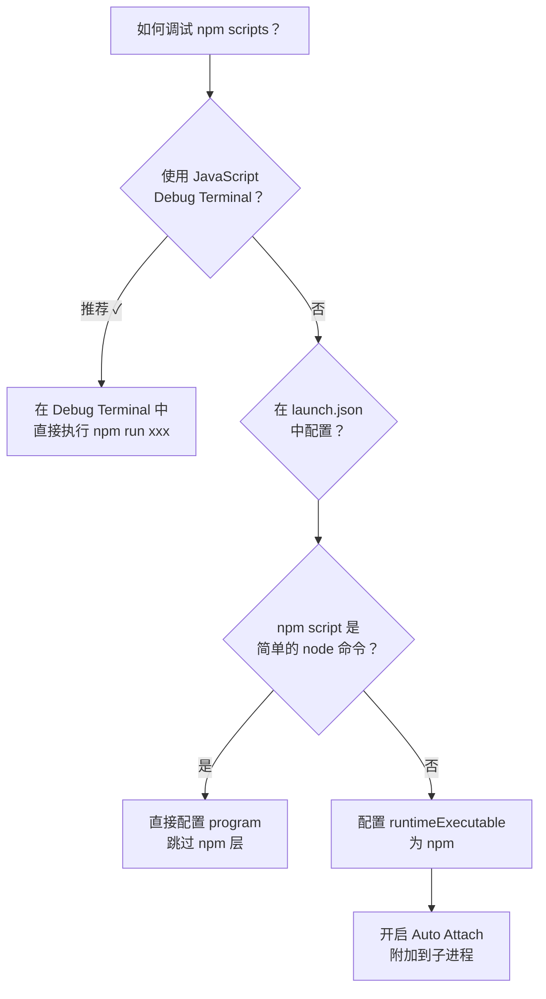
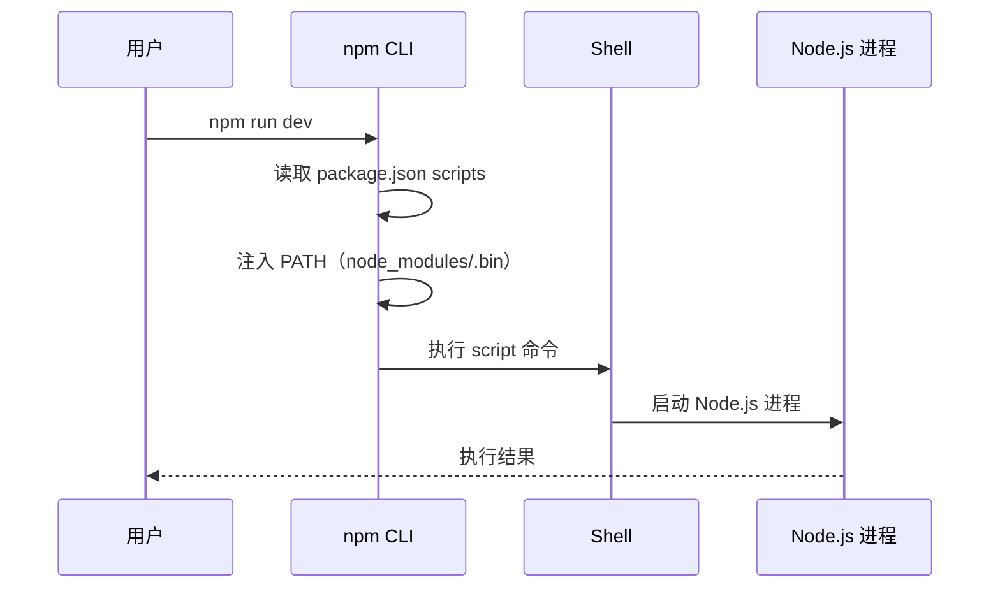

# npm-scripts的调试方式

npm scripts 是前端项目中最常用的脚本管理方式，常用 `npm run dev`、`npm run build`、`npm run lint` 等命令执行各种任务。本节介绍如何在 VSCode 里调试 npm scripts。

## JavaScript Debug Terminal 方式（推荐）

> **2024-2026 更新**：这是最简单、最推荐的调试 npm scripts 的方式。

1. 在 VSCode 的 Terminal 面板中，点击 `+` 旁边的下拉箭头，选择 **JavaScript Debug Terminal**
2. 在该终端中运行 npm scripts，比如 `npm run dev`
3. VSCode 会自动检测到 Node.js 进程并附加调试器

这样就可以在任何 npm script 运行的代码中打断点了。

> **原理**：JavaScript Debug Terminal 在创建终端时，会设置环境变量让 Node.js 以调试模式启动，并通过 js-debug 自动附加。

## launch.json 方式

如果想用 launch.json 配置来调试 npm scripts，可以这样做：

### 配置 npm 为 runtimeExecutable

```json
{
  "type": "node",
  "request": "launch",
  "name": "Debug npm script",
  "runtimeExecutable": "npm",
  "runtimeArgs": ["run", "dev"],
  "cwd": "${workspaceFolder}",
  "console": "integratedTerminal"
}
```

这里 `runtimeExecutable` 设置为 `npm`，`runtimeArgs` 设置为 `["run", "dev"]`，相当于执行 `npm run dev`。

**但是有一个问题**：这样跑起来之后，VSCode Debugger 会附加到 npm 进程上，而不是实际要调试的 Node.js 子进程。

如何解决这个问题呢？

### 解决方案：开启 Auto Attach 自动附加到子进程

> **2024-2026 更新**：js-debug 的 **Auto Attach** 功能已经可以自动附加到子进程了。在 VSCode 设置中，将 `debug.javascript.autoAttachFilter` 设置为 `smart` 或 `onlyWithFlag`，这样当 npm scripts 启动的 Node.js 子进程带有 `--inspect` 标志时，VSCode 会自动附加。

### 更简单的方式：直接使用 node 命令

如果 npm script 只是简单地执行一个 node 命令，比如：

```json
{
  "scripts": {
    "dev": "node server.js"
  }
}
```

可以直接在 launch.json 中配置：

```json
{
  "type": "node",
  "request": "launch",
  "name": "Debug dev script",
  "program": "${workspaceFolder}/server.js"
}
```

跳过 npm 这一层，直接调试目标文件。

## 调试 package.json 中的各种 scripts



### 常见 npm scripts 的调试配置

| npm script | launch.json 配置方式 | 推荐方式 |
|-----------|---------------------|---------|
| `npm run dev`（Vite） | `runtimeExecutable: npm`, `runtimeArgs: ["run", "dev"]` | JavaScript Debug Terminal |
| `npm run dev`（Next.js） | 同上 | JavaScript Debug Terminal |
| `npm run start:dev`（Nest.js） | 同上 | JavaScript Debug Terminal |
| `npx eslint ./src` | `program: node_modules/.bin/eslint` | JavaScript Debug Terminal |
| `npx tsx src/index.ts` | `runtimeExecutable: tsx`, `program: src/index.ts` | JavaScript Debug Terminal |
| `npm run test`（Jest） | `runtimeExecutable: npm`, `runtimeArgs: ["run", "test"]` | JavaScript Debug Terminal |
| `npm run test`（Vitest） | 同上 | JavaScript Debug Terminal |

## 调试 npm scripts 的执行流程

通过调试 npm 本身的代码，可以了解 npm scripts 是如何执行的：

1. npm 读取 `package.json` 中的 `scripts` 字段
2. 将 script 命令交给 shell 执行
3. shell 启动对应的进程
4. 进程执行实际的代码



npm scripts 的一个关键机制是：npm 会在执行 script 之前，把 `node_modules/.bin` 加入到 `PATH` 环境变量中。这就是为什么可以在 npm scripts 中直接使用 `vite`、`eslint`、`tsc` 等命令，而不用写完整路径。

## 调试 npm link 的本地包

当使用 `npm link` 或 `pnpm link` 来开发本地包时，也可以用 JavaScript Debug Terminal 来调试：

```bash
# 在包目录中
cd my-package
npm link

# 在项目目录中
cd my-project
npm link my-package

# 在 JavaScript Debug Terminal 中调试
npm run dev
```

这样在 `my-package` 的代码中打断点也能生效，因为 link 后的代码就是本地的文件。
