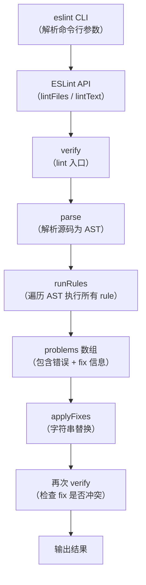
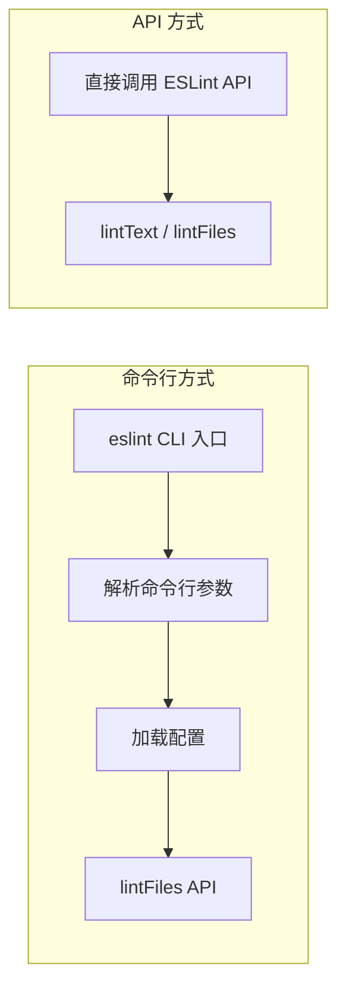

# 命令行工具的两种调试方式

webpack、vite、babel、tsc、eslint 等前端命令行工具都提供了两种入口：命令行和 API。

命令行用于手动执行，如 `eslint xxx --fix`；API 供其他工具集成，更灵活。相应地，调试这些工具也有两种方式：**通过命令行调试和通过 API 调试**。

本节以 ESLint 为例尝试两种调试方式。

## 命令行方式调试 ESLint 源码

### JavaScript Debug Terminal 方式（推荐）

> **2024-2026 更新**：最推荐的方式是使用 JavaScript Debug Terminal。在 Debug Terminal 中直接执行 `npx eslint ./index.js --fix`，就可以自动进入调试模式，无需配置 launch.json。

### launch.json 方式

创建一个调试配置，指定 program 为 eslint 的入口文件：

```json
{
  "type": "node",
  "request": "launch",
  "name": "Debug ESLint CLI",
  "program": "${workspaceFolder}/node_modules/.bin/eslint",
  "args": ["./index.js", "--fix"],
  "skipFiles": ["<node_internals>/**"],
  "console": "integratedTerminal",
  "cwd": "${workspaceFolder}"
}
```

在 `node_modules/.bin/eslint` 的入口文件打个断点，然后 Debug 启动。

代码执行到这里断住了，会发现它引入了 `lib/cli` 的模块。进入该模块，会发现它创建了 ESLint 实例，然后调用了 `lintFiles` 方法。

### ESLint 的核心工作流程

通过调试可以梳理出 ESLint 的核心流程：



**关键发现：**

1. **lint 的实现是基于 AST 的**：先把源码解析成 AST，然后遍历 AST 节点，调用每个 rule 进行检查

2. **fix 的实现就是字符串替换**：每个 problem 会带一个 fix 对象（包含 range 和 text），`applyFixes` 函数就是把指定范围的字符串替换成新文本

3. **fix 会循环多次**：因为多个 rule 的 fix 可能冲突（比如一个 fix 修改了 9-10 行，另一个 fix 要修改 9-11 行），冲突的 fix 被保留，然后重新 lint 再 fix。最多循环 10 次

## API 方式调试 ESLint 源码

通过命令行方式调试时，前面的命令行参数解析流程是不必要的。如果我们知道 ESLint 最终调用的是 `lintText` 的 API，可以从 API 入口开始调试：

```javascript
const { ESLint } = require("eslint");

const engine = new ESLint({
    fix: true
});

(async function main() {
    const results = await engine.lintText(`
    function add (a, b)
{
  return a + b
}
  `);

    console.log(results[0].output);

    const formatter = await engine.loadFormatter("stylish");
    const resultText = formatter.format(results);
    console.log(resultText);
})();
```

创建调试配置：

```json
{
  "type": "node",
  "request": "launch",
  "name": "Debug ESLint API",
  "program": "${workspaceFolder}/api-test.js",
  "skipFiles": ["<node_internals>/**"],
  "console": "integratedTerminal"
}
```

可以直接从实现 lint 的部分开始调试，跳过了命令行参数解析的部分，更有针对性。

## ESLint Flat Config（新配置系统）

> **2024-2026 更新**：ESLint 已从 `.eslintrc` 配置系统迁移到 **Flat Config**（`eslint.config.js`）。新配置系统使用 JS 对象数组代替 JSON/YAML 配置文件，更加灵活和可编程。

```javascript
// eslint.config.js（Flat Config）
import js from '@eslint/js';
import tsPlugin from '@typescript-eslint/eslint-plugin';
import tsParser from '@typescript-eslint/parser';

export default [
    js.configs.recommended,
    {
        files: ['**/*.ts'],
        languageOptions: {
            parser: tsParser,
        },
        plugins: {
            '@typescript-eslint': tsPlugin,
        },
        rules: {
            '@typescript-eslint/no-unused-vars': 'error',
        },
    },
];
```

调试 Flat Config 的方式与调试旧配置方式相同——在 ESLint 实例创建和 `lintText` 调用处打断点即可。

## 两种调试方式对比



| 方式 | 优点 | 缺点 | 适用场景 |
|------|------|------|---------|
| 命令行 | 完整模拟真实使用场景 | 需要经历参数解析等无关流程 | 了解工具完整启动流程 |
| API | 精准、高效 | 需要先知道 API 入口 | 深入了解核心功能实现 |

**推荐策略**：先用命令行方式运行一遍，了解完整流程并找到核心 API 入口；然后用 API 方式从核心入口开始调试，深入理解实现细节。
