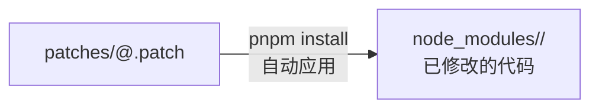
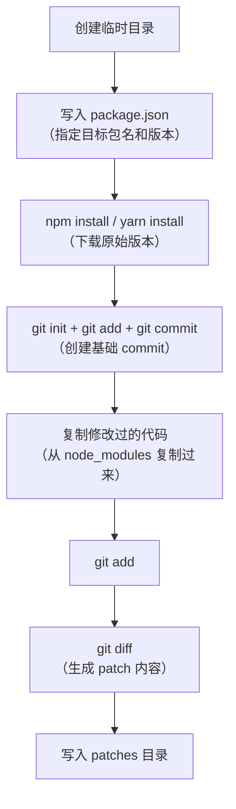

# 用pnpm-patch修改node-modules

`node_modules` 下的代码不会提交到 git 仓库，改动无法保存。本节介绍通过 pnpm patch 持久化修改 `node_modules` 的方式。

> **2024-2026 更新**：原版推荐的 `patch-package` 已不再维护，且不支持 pnpm。现在推荐使用 pnpm 内置的 `pnpm patch` 命令（如果你使用 pnpm），或者继续使用 `patch-package`（如果你使用 npm/yarn）。

## 方式一：使用 pnpm patch（推荐）

pnpm 内置了 patch 功能，比 `patch-package` 更简洁：

### 创建 patch

```bash
# 1. 启动 patch 编辑模式
pnpm patch acorn@8.11.3

# pnpm 会输出一个临时目录路径：
# You can now edit the following folder: /tmp/acorn-8.11.3-patch
```

### 编辑代码

在临时目录中修改需要的代码，比如添加一个新文件或修改某个函数。

### 提交 patch

```bash
# 2. 完成编辑后，提交 patch
pnpm patch-commit /tmp/acorn-8.11.3-patch
```

这会在 `patches/` 目录下生成一个 patch 文件：

```
patches/acorn@8.11.3.patch
```

### patch 文件的内容

patch 文件就是标准的 git diff 格式：

```diff
diff --git a/dist/acorn.mjs.js b/dist/acorn.mjs.js
index 1234567..abcdef 100644
--- a/dist/acorn.mjs.js
+++ b/dist/acorn.mjs.js
@@ -1,3 +1,4 @@
 // existing line
+// new line added by patch
 // another existing line
```

### 自动应用 patch

`pnpm install` 时会自动应用 `patches/` 目录下的所有 patch 文件，无需手动执行命令。



### 配置记录

`pnpm patch-commit` 会在 `package.json` 中添加 `pnpm.patchedDependencies` 字段：

```json
{
  "pnpm": {
    "patchedDependencies": {
      "acorn@8.11.3": "patches/acorn@8.11.3.patch"
    }
  }
}
```

## 方式二：使用 patch-package（npm / yarn）

如果你使用 npm 或 yarn，仍然可以使用 `patch-package`：

```bash
# 1. 安装 patch-package
npm install patch-package --save-dev

# 2. 修改 node_modules 下的代码

# 3. 生成 patch
npx patch-package acorn

# 4. 配置 postinstall 自动应用
# package.json:
# "scripts": {
#   "postinstall": "patch-package"
# }
```

> **注意**：`patch-package` 不支持 pnpm，且项目已不再活跃维护。

## pnpm patch vs patch-package 对比

| 方面 | pnpm patch | patch-package |
|------|-----------|--------------|
| 包管理器 | pnpm（内置） | npm / yarn（第三方） |
| 维护状态 | 活跃维护（pnpm 官方） | 不再活跃维护 |
| 生成方式 | 编辑临时目录 → `pnpm patch-commit` | 编辑 node_modules → `npx patch-package xxx` |
| 应用方式 | `pnpm install` 自动应用 | 需手动执行或配置 `postinstall` |
| patch 文件格式 | git diff | git diff |
| patch 文件位置 | `patches/<pkg>@<version>.patch` | `patches/<pkg>+<version>.patch` |
| 版本锁定 | 精确版本号 | 范围版本号 |

## 调试 patch-package 源码（学习目的）

如果想通过调试来理解 patch 机制的工作原理，可以调试 `patch-package` 的源码：

### patches 文件生成原理



patches 文件的生成就是在临时目录中创建一个基础 commit，然后把修改后的代码复制过去，两者做 `git diff`，就得到了 patch 内容。

### patches 文件应用原理

patches 文件的应用则是：

1. 读取 patch 文件
2. 解析 git diff 格式（识别增删改的行号和内容）
3. 根据不同的类型做不同的文件操作
