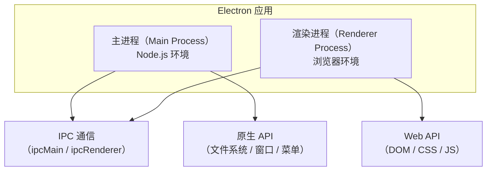
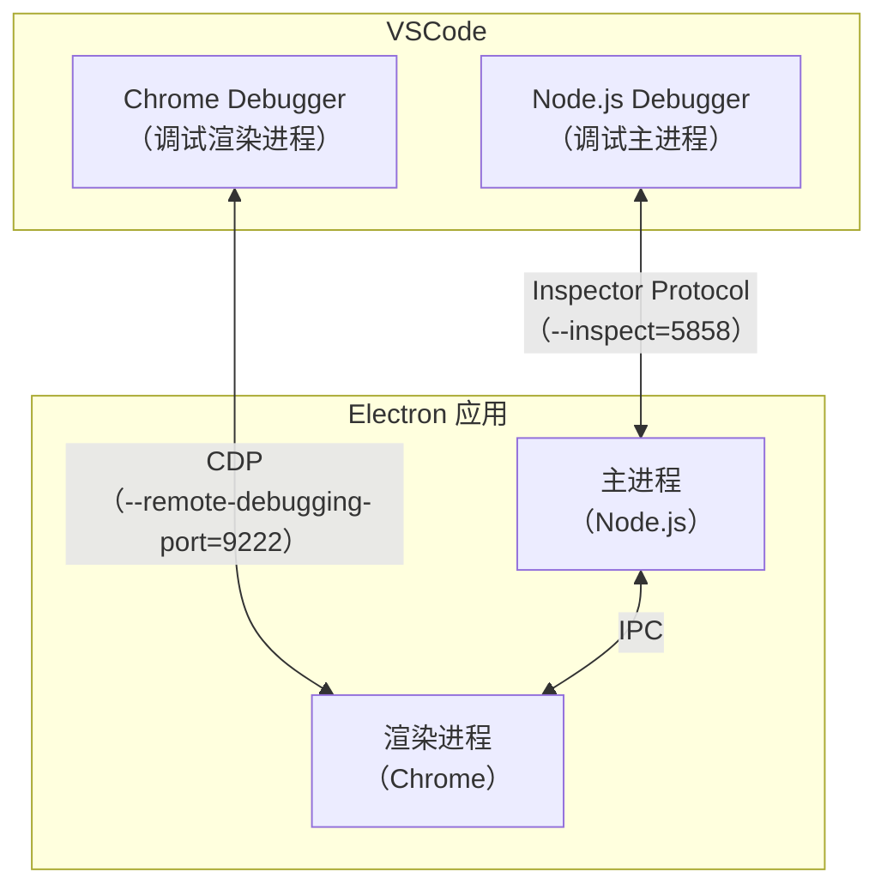
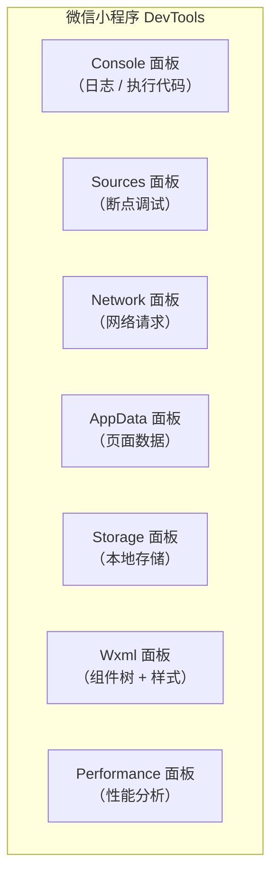
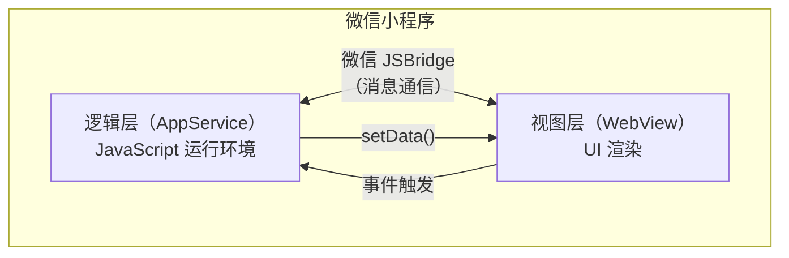
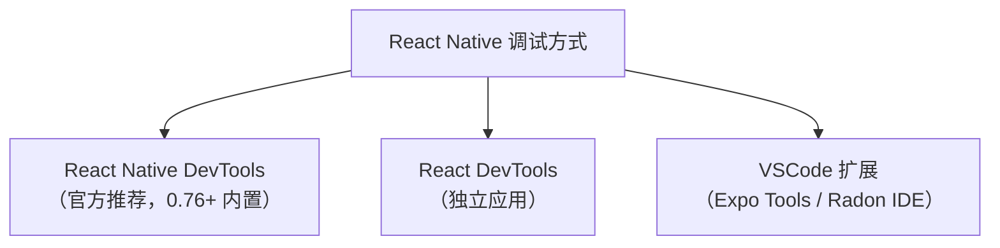

# Electron与小程序调试

本节学习 Electron 应用和小程序的调试方法。

## Electron 应用调试

### Electron 的架构



Electron 有两种进程：
- **主进程**：Node.js 环境，负责窗口管理、原生 API 调用
- **渲染进程**：浏览器环境，负责 UI 渲染

### 调试渲染进程

渲染进程即浏览器页面，使用 Chrome DevTools 调试：

```javascript
// 主进程中打开 DevTools
mainWindow.webContents.openDevTools();
```

或使用快捷键：`Cmd+Option+I`（macOS）/ `Ctrl+Shift+I`（Windows/Linux）

### 调试主进程

#### 方式一：VSCode launch 配置

```json
{
    "version": "0.2.0",
    "configurations": [
        {
            "name": "Debug Main Process",
            "type": "node",
            "request": "launch",
            "cwd": "${workspaceFolder}",
            "runtimeExecutable": "${workspaceFolder}/node_modules/.bin/electron",
            "args": ["."],
            "outputCapture": "std"
        }
    ]
}
```

#### 方式二：使用 --inspect 标志

```bash
# 启动 Electron 主进程调试
electron --inspect=5858 .

# 接下来在 VSCode 中 attach
```

```json
{
    "name": "Attach to Electron Main",
    "type": "node",
    "request": "attach",
    "port": 5858
}
```

### 同时调试主进程和渲染进程

```json
{
    "version": "0.2.0",
    "configurations": [
        {
            "name": "Debug Main Process",
            "type": "node",
            "request": "launch",
            "cwd": "${workspaceFolder}",
            "runtimeExecutable": "${workspaceFolder}/node_modules/.bin/electron",
            "args": ["--remote-debugging-port=9222", "."],
            "outputCapture": "std"
        },
        {
            "name": "Attach to Renderer",
            "type": "chrome",
            "request": "attach",
            "port": 9222,
            "webRoot": "${workspaceFolder}"
        }
    ],
    "compounds": [
        {
            "name": "Electron: All",
            "configurations": ["Debug Main Process", "Attach to Renderer"]
        }
    ]
}
```

启动时主进程带上 `--remote-debugging-port=9222`，渲染进程就可以通过 CDP 附加调试；`compounds` 复合配置会把两个调试会话一起启动。

> **2024-2026 更新**：VSCode js-debug 支持同时调试主进程和渲染进程的复合配置。

### Electron 调试架构



### 使用 Chrome DevTools 扩展

Electron 支持安装 Chrome DevTools 扩展（如 Vue DevTools、React DevTools），但需要通过 `electron-devtools-installer` 手动安装：

```javascript
// 主进程中安装 Vue DevTools 扩展
const { app } = require('electron');
const installExtension = require('electron-devtools-installer');

app.whenReady().then(async () => {
    // 安装 Vue DevTools
    const name = await installExtension('nhdogjmejiglipccpnnnanhbledajbpd');
    console.log(`Added Extension: ${name}`);

    // 安装 React DevTools
    const name2 = await installExtension('fmkadmapgofadopljbjfkapdkoienihi');
    console.log(`Added Extension: ${name2}`);

    createWindow();
});
```

> **2024-2026 更新**：`electron-devtools-installer` 需要更新到支持 MV3 扩展的版本。

## 小程序调试

### 微信小程序调试

微信小程序 DevTools 提供了以下调试功能：



### 小程序调试原理

微信小程序使用双线程架构：



**调试逻辑层**：在 Sources 面板中设置断点，调试 JS 逻辑

**调试视图层**：在 Wxml 面板中查看组件树和样式

### 小程序真机调试

1. 微信小程序 DevTools → 真机调试
2. 扫码后在手机上打开小程序
3. DevTools 自动连接，可以调试真机上的代码

### 小程序远程调试

> **2024-2026 更新**：微信小程序真机调试时自带 vConsole，可以在真机上查看 console 日志和网络请求。也可以通过 `wx.setEnableDebug` 在代码中开启调试模式：

```javascript
// 在 app.js 中开启（开启后真机会出现 vConsole 调试窗口，仅建议开发调试时使用）
wx.setEnableDebug({
    enableDebug: true
});
```

## WebView 调试

### Android WebView 调试

```java
// Android 代码中启用 WebView 调试
if (Build.VERSION.SDK_INT >= Build.VERSION_CODES.KITKAT) {
    WebView.setWebContentsDebuggingEnabled(true);
}
```

接下来在 Chrome 的 `chrome://inspect/#devices` 中找到 WebView 页面调试。

### iOS WKWebView 调试

```swift
// iOS 16.4+ 需要显式启用
if #available(iOS 16.4, *) {
    webView.isInspectable = true
}
```

接下来在 Safari → 开发 → [设备] → [WebView] 中调试。

### React Native WebView 调试

```javascript
// React Native WebView
import { WebView } from 'react-native-webview';

<WebView
    source={{ uri: 'https://example.com' }}
    onMessage={(event) => {
        console.log('WebView message:', event.nativeEvent.data);
    }}
/>
```

React Native WebView 的调试方式：
1. iOS：Safari Web Inspector
2. Android：Chrome DevTools Remote Debugging

## 跨端框架的调试

### React Native 调试

> **2024-2026 更新**：React Native 新架构（Fabric + TurboModules）调试方式有变化。

> **2025-2026 更新**：Flipper 已被官方弃用（RFC0641），**React Native DevTools**（RN 0.76+ 内置、基于 Chrome DevTools 前端）取代了 Flipper、旧实验调试器和 Hermes 调试器（Chrome）。通过 `chrome://inspect` 远程连接 RN 已不再支持；VSCode 也不再提供官方调试扩展，社区方案（Expo Tools、Radon IDE）兼容性更好。



### VSCode React Native Tools

> **注意**：微软官方的 `vscode-react-native` 扩展已于 2025 年 4 月宣布停止演进（进入维护模式，调试功能被弃用），以下配置仅适用于仍在使用旧版 RN 与旧扩展的存量项目。新项目建议直接使用 React Native DevTools，或安装 Expo Tools / Radon IDE。

```json
{
    "name": "Debug React Native",
    "type": "reactnative",
    "request": "launch",
    "platform": "ios",
    "runArguments": ["--port=8081"]
}
```

### Flutter 调试

Flutter 使用 Dart VM Service Protocol 调试：

```bash
# 启动 Flutter 调试
flutter run --debug

# 在 VSCode 中调试（安装 Flutter 扩展后）
# 按 F5 启动调试
```

Flutter DevTools 提供了：
- Widget Inspector（组件检查器）
- Performance（性能分析）
- Memory（内存分析）
- Network（网络请求）
- Debugger（断点调试）
