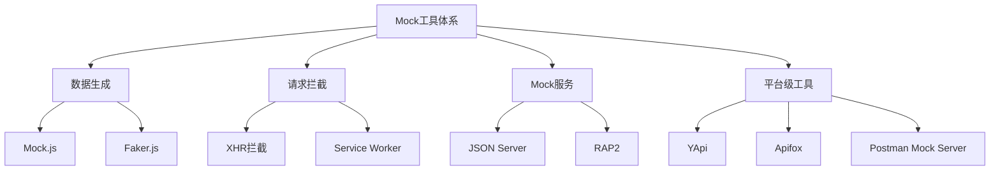
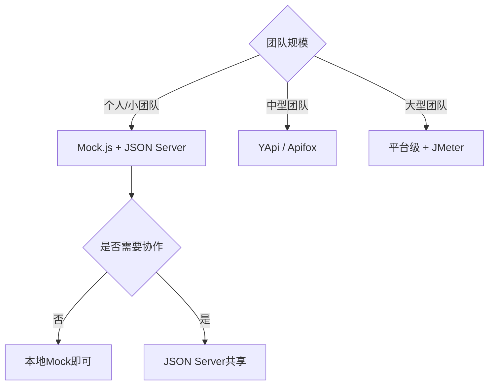
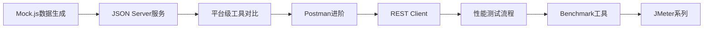

# Mock 数据方案与工具选型

## 概述

前后端分离开发模式下，前端往往需要在后端接口尚未就绪时独立推进页面开发。Mock 数据技术通过模拟接口响应，使前端能够脱离后端依赖进行开发与联调。本文系统梳理 Mock 数据的四个阶段、主流工具分类及接口测试体系，为后续各工具的深入学习提供全局视角。

## 前置知识

- HTTP 请求/响应基本模型
- RESTful API 设计规范
- 前端工程化基础（Vite/Webpack 构建流程）

## 学习目标

- 理解 Mock 数据在前后端分离开发中的定位与价值
- 掌握 Mock 数据四阶段演进模型
- 能够根据项目规模选择合适的 Mock 工具
- 建立接口测试体系的完整认知框架

---

## 一、Mock 数据的四个阶段

前后端协作中，Mock 数据的需求随项目推进呈现明显的阶段特征：

| 阶段 | 时机 | 核心任务 | 典型工具 |
|------|------|----------|----------|
| 接口约定 | 需求评审后 | 确定字段、路径、状态码 | Swagger / YApi |
| 本地 Mock | 前端开发期 | 拦截请求返回假数据 | Mock.js / Faker.js |
| Mock 服务 | 多人协作期 | 独立 HTTP 服务提供响应 | JSON Server / RAP2 |
| 联调切换 | 后端就绪后 | 无缝切换到真实接口 | 代理配置 / 环境变量 |

### 阶段切换的关键原则

- **接口契约先行**：先约定数据结构，再各自开发
- **Mock 与真实接口同构**：字段名、嵌套层级、状态码保持一致
- **切换零成本**：通过代理或环境变量切换，无需修改业务代码

---

## 二、Mock 工具分类

### 2.1 数据生成类

| 工具 | 特点 | 适用场景 |
|------|------|----------|
| Mock.js | 模板语法、XHR 拦截、零后端依赖 | 前端独立开发 |
| Faker.js | 多语言、海量数据模板 | 国际化项目、大数据量 |

### 2.2 请求拦截类

通过劫持 `XMLHttpRequest` 或 `fetch`，在浏览器层面拦截请求并返回预设数据，无需启动额外服务。

### 2.3 Mock 服务类

独立运行的 HTTP 服务器，提供完整的 RESTful 能力（CRUD、过滤、分页），适合多人共享同一套 Mock 接口。

### 2.4 平台级工具

集接口文档、Mock 服务、接口测试于一体的协作平台，适合中大型团队长期维护。

---

## 三、接口测试体系

Mock 解决的是"开发期数据从哪来"的问题，而接口测试解决的是"接口质量如何保障"的问题。

### 3.1 测试类型

| 类型 | 目标 | 关注点 |
|------|------|--------|
| 功能测试 | 验证接口逻辑正确性 | 状态码、返回结构、边界值 |
| 性能测试 | 验证高并发下的表现 | 响应时间、吞吐量、错误率 |
| 压力测试 | 找到系统极限 | 最大并发、崩溃阈值 |
| 负载测试 | 验证持续负载下的稳定性 | 长时间运行、内存泄漏 |

### 3.2 测试工具矩阵

| 工具 | 定位 | 学习成本 | 适用团队 |
|------|------|----------|----------|
| Postman | 接口调试 + 功能测试 | 低 | 所有团队 |
| REST Client | VS Code 内接口调试 | 低 | 前端团队 |
| JMeter | 性能/压力测试 | 中 | 有专职 QA |
| k6 | 现代化性能测试 | 低 | DevOps 团队 |
| autocannon / wrk | 快速基准测试 | 低 | 技术选型评估 |

---

## 四、工具选型决策

### 选型核心考量

| 维度 | 评估要点 |
|------|----------|
| 开发效率 | 能否快速生成符合接口契约的假数据 |
| 协作成本 | 是否支持团队共享、版本管理 |
| 切换成本 | 从 Mock 切换到真实接口的改动量 |
| 测试覆盖 | 是否兼顾功能测试与性能测试 |
| 维护成本 | 接口变更后 Mock 数据的同步难度 |

---

## 五、本系列学习路径

| 序号 | 主题 | 核心内容 |
|------|------|----------|
| 02 | [Mock.js 数据生成与接口拦截](01-Mock.js完整指南.md) | 模板语法、XHR 拦截、项目集成 |
| 03 | [JSON Server 实战指南](02-JSON%20Server实战指南.md) | RESTful API、自定义中间件、代理 |
| 04 | [平台级 Mock 工具对比与选型](03-平台级与桌面端Mock工具对比与实战.md) | RAP2 / YApi / Apifox / Postman |
| 05 | [Postman 进阶功能与使用技巧](04-Postman进阶功能与使用技巧.md) | 环境变量、Monitor、Flows、CLI |
| 06 | [REST Client 插件实战](05-REST%20Client插件实战.md) | .http 文件、环境变量、项目集成 |
| 07 | [接口性能测试流程与工具详解](../../../08-测试/07-性能测试/16-接口性能测试流程与工具详解.md) | 六大环节、工具对比 |
| 08 | [Benchmark 工具与框架性能对比](../../../08-测试/07-性能测试/17-Benchmark工具与框架性能对比.md) | autocannon / wrk / hey、选型矩阵 |
| 09 | [JMeter 安装配置与基础入门](../../../08-测试/07-性能测试/18-JMeter安装配置与基础入门.md) | 环境搭建、组件体系 |
| 10 | [JMeter 插件安装与图形化监控](../../../08-测试/07-性能测试/19-JMeter插件安装与图形化监控.md) | 插件管理器、TPS/RT 图表 |
| 11 | [JMeter 性能测试实战指南](../../../08-测试/07-性能测试/20-JMeter性能测试实战指南.md) | 定时器、并发控制、报告输出 |

---

## 常见问题

| 问题 | 解答 |
|------|------|
| Mock.js 和 JSON Server 如何选择？ | 单人开发用 Mock.js（零配置）；多人协作或需要 CRUD 用 JSON Server |
| 平台级工具是否必须？ | 小团队不必引入，接口少于 20 个时本地方案更高效 |
| 性能测试何时介入？ | 建议在预发布环境部署后、正式上线前执行 |
| Mock 数据如何与真实接口保持同步？ | 以接口文档（Swagger/YApi）为单一数据源，Mock 规则引用文档定义 |

## 最佳实践

1. **接口契约先行**：在需求评审阶段即产出接口文档，前后端基于文档并行开发
2. **Mock 数据贴近真实**：字段命名、数据量级、边界情况都应模拟真实场景
3. **环境隔离**：Mock 服务与真实服务使用不同端口/域名，通过代理切换
4. **自动化测试前置**：核心接口在 Mock 阶段即编写测试用例，联调后直接回归

## 延伸阅读

- [Mock.js 数据生成与接口拦截](01-Mock.js完整指南.md)
- [JSON Server 实战指南](02-JSON%20Server实战指南.md)
- [接口性能测试流程与工具详解](../../../08-测试/07-性能测试/16-接口性能测试流程与工具详解.md)
