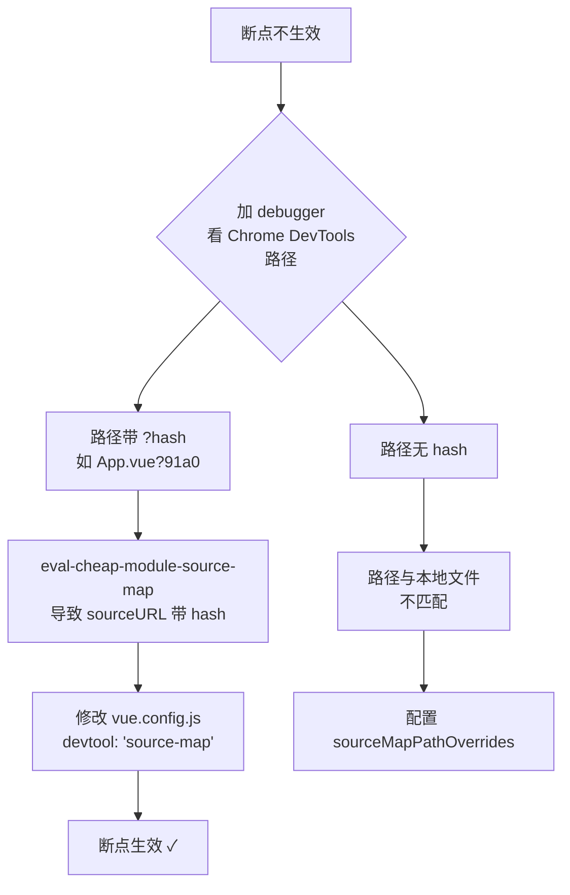

# 调试Vue项目实战

本节结合 VSCode Debugger 与 sourcemap，进行 Vue 项目调试实战。

> **2024-2026 更新**：`@vue/cli` 已不再推荐使用，Vue 官方推荐使用 `create-vue`（基于 Vite）创建项目。但仍有不少存量项目使用 webpack，所以我们仍然保留 webpack 项目的调试讲解，但重心已转向 Vite 项目。

## 调试 create-vue 创建的 Vite 项目（推荐方式）

[create-vue](https://github.com/vuejs/create-vue) 是创建 Vite 作为构建工具的 Vue 项目的官方推荐方式。

直接执行：

```bash
npm create vue@latest
```

按提示选择需要的特性（TypeScript、Router、Pinia 等），然后进入项目目录，安装依赖并启动开发服务器：

```bash
cd vue-demo
npm install
npm run dev
```

浏览器访问 `http://localhost:5173`，可以看到渲染出的页面。

添加调试配置：

```json
{
  "version": "0.2.0",
  "configurations": [
    {
      "type": "chrome",
      "request": "launch",
      "name": "调试 Vue Vite 项目",
      "url": "http://localhost:5173",
      "webRoot": "${workspaceFolder}/_debug_placeholder",
      "userDataDir": false,
      "runtimeArgs": ["--auto-open-devtools-for-tabs"]
    }
  ]
}
```

> **为什么 webRoot 配置为 `${workspaceFolder}/_debug_placeholder`？** 这是为了避免 Vite HMR 的临时文件断住了我们的断点。Vite 项目有一些热更新的文件，这些临时文件没有对应的本地文件，但路径刚好和 VSCode Debugger 传递的断点文件路径匹配，就会导致断点断在奇怪的文件上。配置了 webRoot 后，实际传递的断点信息变成 `/_debug_placeholder/src/App.vue`，这样热更新文件的路径就和这个不一致了。而有 sourcemap 的文件，sourcemap 到的是绝对路径，不受 webRoot 影响，依然能映射到本地。

打个断点，然后 Debug 启动，断点能生效，代码也能直接修改。

为什么 Vite 项目不需要配置 `sourceMapPathOverrides`？

因为 Vite 的 sourcemap 到的文件路径直接就是本地的绝对路径：

运行代码的文件路径 → sourcemap 到的本地绝对路径

这已经能对应到本地的文件了，自然不需要 `sourceMapPathOverrides` 配置。

## 调试 @vue/cli 创建的 webpack 项目（存量项目）

> **注意**：`@vue/cli` 已处于维护模式，仅作为存量项目的调试参考。

如果你有一个 webpack 构建的 Vue 项目，调试时可能遇到断点不生效的问题。这是因为 `vue-cli` 默认的 devtool 设置是 `eval-cheap-module-source-map`，会导致 sourcemap 路径后带有 `?hash`。

**问题诊断流程：**



**解决方案：**

修改 `vue.config.js`：

```javascript
module.exports = {
  configureWebpack: {
    devtool: 'source-map'
  }
}
```

从 `eval-cheap-module-source-map` 改为 `source-map`：

- 去掉 `eval`：避免生成 `?hash` 的路径
- 去掉 `cheap`：保留列的映射
- 去掉 `module`：这里不需要合并 loader 的转换

然后重启 dev server，再次调试，断点就能生效了。

对于 Vue 2 项目，可能还需要配置 `sourceMapPathOverrides`：

```json
{
  "sourceMapPathOverrides": {
    "webpack://你的项目名/src/*": "${workspaceFolder}/src/*"
  }
}
```

具体配置方法：加个 `debugger` 查看 Chrome DevTools 里的路径，然后映射到本地的路径即可。

## Vite vs Webpack 项目调试对比

| 方面 | Vite 项目 | Webpack 项目 |
|------|----------|-------------|
| sourcemap 路径 | 本地绝对路径（无需额外映射） | webpack:// 路径（需要 sourceMapPathOverrides） |
| HMR 文件干扰 | 需要 webRoot 做隔离 | 无此问题 |
| devtool 配置 | 默认即可 | 需改为 `source-map` |
| 断点生效难度 | 简单 | 可能需要额外配置 |
