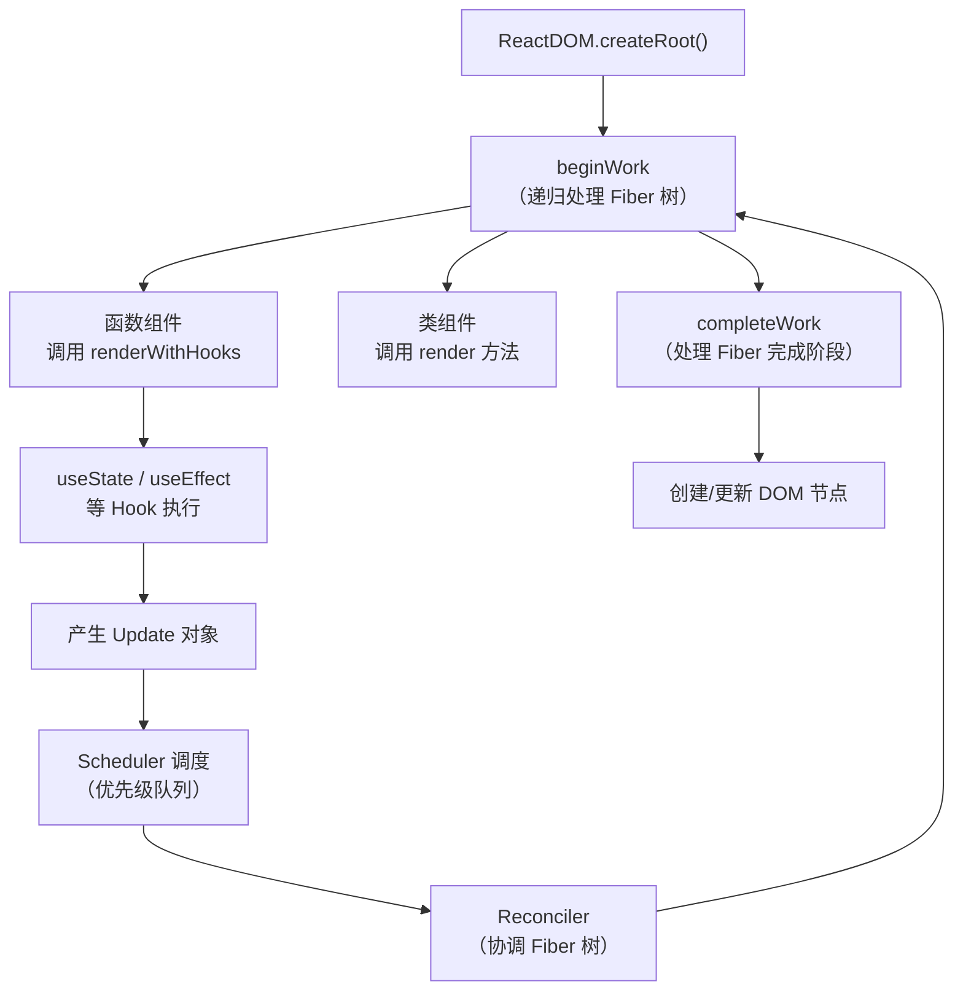

# 调试React源码

本节进入源码调试实战，调试 React 源码。

## 为什么需要调试 React 源码

React 的源码并不是按照模块顺序执行的，有很多异步调用、调度逻辑、优先级队列，光看代码很难理清执行流程。而通过调试可以一步步跟踪代码的执行路径，看到每一步的变量值和调用栈，这才是理解 React 源码最有效的方式。

## 准备 React 源码调试项目

React 的源码是 monorepo 架构，包很多，并且用 yarn workspace 管理。直接在源码里写代码调试不太方便。

因此我们可以采用这种方式：用 Vite 创建一个 React 项目，然后把 React 源码下载下来，做一下构建，让项目引用构建后的 React 代码，这样就可以打断点调试 React 源码了。

### 步骤一：创建 React 项目

```bash
npm create vite@latest react-source-debug -- --template react
cd react-source-debug
npm install
```

### 步骤二：下载并构建 React 源码

```bash
git clone https://github.com/facebook/react.git
cd react
# 切换到稳定版本
git checkout stable
# 安装依赖（React 仓库使用 yarn workspaces）
yarn install
# 构建
yarn build
```

> **2024-2026 更新**：React 源码仓库已从 `facebook/react` 迁移到 `react/react`（原地址会自动重定向，clone 命令仍可用）。构建系统仍是 yarn workspaces，安装依赖用 `yarn install`、构建用 `yarn build`。React 19 的源码结构有了一些变化，新增了 `react-server` 相关的包，但核心 `react`、`react-dom`、`react-reconciler` 的结构基本不变。

构建完之后产物在 `build/node_modules` 下：

- `build/node_modules/react` —— react 包
- `build/node_modules/react-dom` —— react-dom 包
- `build/node_modules/scheduler` —— scheduler 包

### 步骤三：替换项目的 React 依赖

我们要让 Vite 项目使用构建后的 React 代码，而不是 npm 上的 React。

在项目的 `vite.config.ts` 中配置 `resolve.alias`：

```typescript
import { defineConfig } from 'vite'
import react from '@vitejs/plugin-react'
import path from 'path'

export default defineConfig({
  plugins: [react()],
  resolve: {
    alias: {
      'react': path.resolve(__dirname, '../react/build/node_modules/react'),
      'react-dom': path.resolve(__dirname, '../react/build/node_modules/react-dom'),
      'react/jsx-runtime': path.resolve(__dirname, '../react/build/node_modules/react/jsx-runtime.js'),
      'react-dom/client': path.resolve(__dirname, '../react/build/node_modules/react-dom/client.js'),
    }
  },
  build: {
    sourcemap: true
  }
})
```

> **注意**：`react/jsx-runtime` 和 `react-dom/client` 需要单独配置 alias，因为它们不是主入口文件，而是子路径导出。如果不配置，Vite 会从 npm 包加载这些文件，导致调试的还是发布版本的 React。

### 步骤四：创建调试配置

```json
{
  "version": "0.2.0",
  "configurations": [
    {
      "type": "chrome",
      "request": "launch",
      "name": "调试 React 源码",
      "url": "http://localhost:5173",
      "webRoot": "${workspaceFolder}/_debug_placeholder",
      "userDataDir": false,
      "runtimeArgs": ["--auto-open-devtools-for-tabs"]
    }
  ]
}
```

### 步骤五：开始调试

在 `App.jsx` 中写一些 React 代码：

```jsx
import { useState } from 'react'

function App() {
  const [count, setCount] = useState(0)

  return (
    <div>
      <button onClick={() => setCount(c => c + 1)}>
        count is {count}
      </button>
    </div>
  )
}

export default App
```

然后在 React 源码中打断点。比如你想了解 `useState` 的执行流程，可以在 `react/build/node_modules/react/cjs/react.development.js` 中搜索 `useState`，打断点：

然后启动调试，点击按钮触发 `setCount`，就可以一步步跟踪 React 的执行流程了。

## React 源码的核心执行流程

调试 React 源码时，理解其核心执行流程可以帮你快速定位到关键位置：



**关键断点位置推荐：**

| 你想了解的 | 断点位置 |
|-----------|---------|
| 组件渲染过程 | `react-dom` 的 `beginWork` 函数 |
| Hook 执行机制 | `react` 的 `useState` / `useEffect` 入口 |
| 状态更新调度 | `scheduler` 的 `scheduleCallback` |
| Fiber 树协调 | `react-reconciler` 的 `performConcurrentWorkOnRoot` |
| DOM 更新 | `react-dom` 的 `completeWork` |
| React 19 Actions | `react` 的 `useActionState` 入口 |

## 调试 React 19 新特性

> **2024-2026 新增**：React 19 引入了多项新特性，可以通过源码调试来理解其实现原理。

### 调试 `use()` Hook

```jsx
import { use, Suspense } from 'react'

function Note({ promise }) {
  const note = use(promise)  // 断点在这里
  return <div>{note.title}</div>
}

function App() {
  const promise = fetch('/api/note').then(r => r.json())
  return (
    <Suspense fallback={<p>Loading...</p>}>
      <Note promise={promise} />
    </Suspense>
  )
}
```

在 `react.development.js` 中搜索 `use` 函数的实现，打断点即可跟踪 `use()` Hook 的执行流程，理解它是如何与 Suspense 边界交互的。

### 调试 Server Components（概念层面）

Server Components 的源码涉及 React Server Bundler 和 React Flight 协议，较难直接在浏览器中调试。但你可以通过调试客户端的反序列化逻辑来理解其工作原理——在 `react-client` 相关的代码中搜索 `parseModel` 函数。
