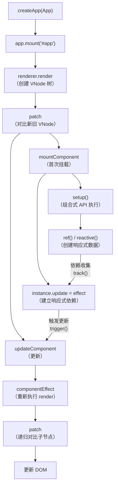
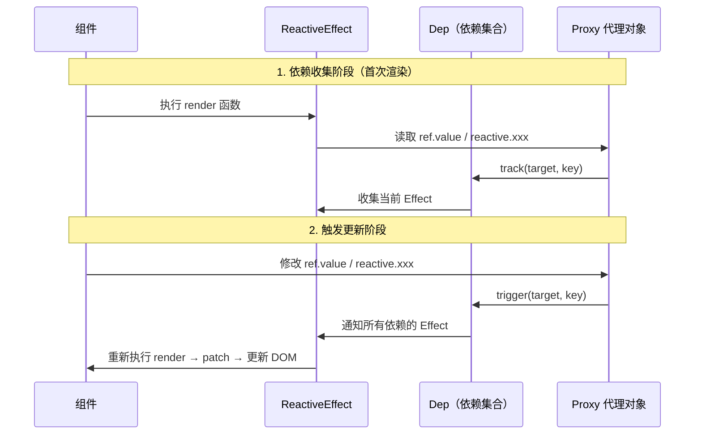

# 调试Vue源码

本节学习如何调试 Vue 源码。

## 准备 Vue 源码调试项目

### 步骤一：创建 Vue 项目

```bash
npm create vue@latest vue-source-debug
cd vue-source-debug
npm install
```

### 步骤二：下载并构建 Vue 源码

```bash
git clone https://github.com/vuejs/core.git
cd core
# 切换到稳定版本(当前最新: v3.5.42)
git checkout v3.5.42
# 安装依赖
pnpm install
# 构建（生成带 sourcemap 的开发版本）
pnpm build
```

> **2024-2026 更新**：Vue 3 源码的包管理器已从 `yarn` 迁移到 `pnpm`。构建命令从 `yarn build` 改为 `pnpm build`。构建产物位于 `packages/vue/dist/` 目录下。Vue 3.5 系列新增了 `useTemplateRef()`、响应式 props 解构默认启用等特性，调试时可重点关注 `runtime-core` 中对应实现。

构建完成后的产物在 `packages/` 下各个包的 `dist/` 目录中：

| 包 | 关键文件 | 说明 |
|----|---------|------|
| `vue` | `dist/vue.global.js` | 完整运行时 + 编译器 |
| `runtime-dom` | `dist/runtime-dom.global.js` | DOM 运行时 |
| `reactivity` | `dist/reactivity.global.js` | 响应式系统 |
| `compiler-sfc` | `dist/compiler-sfc.cjs.js` | SFC 编译器 |

### 步骤三：替换项目的 Vue 依赖

在项目的 `vite.config.ts` 中配置 `resolve.alias`：

```typescript
import { defineConfig } from 'vite'
import vue from '@vitejs/plugin-vue'
import path from 'path'

export default defineConfig({
  plugins: [vue()],
  resolve: {
    alias: {
      'vue': path.resolve(__dirname, '../core/packages/vue/dist/vue.runtime.esm-bundler.js'),
      '@vue/runtime-dom': path.resolve(__dirname, '../core/packages/runtime-dom/dist/runtime-dom.esm-bundler.js'),
      '@vue/runtime-core': path.resolve(__dirname, '../core/packages/runtime-core/dist/runtime-core.esm-bundler.js'),
      '@vue/reactivity': path.resolve(__dirname, '../core/packages/reactivity/dist/reactivity.esm-bundler.js'),
    }
  },
  build: {
    sourcemap: true
  }
})
```

> **为什么需要配置多个 alias？** Vue 3 的包之间有依赖关系：`vue` 依赖 `@vue/runtime-dom`，`@vue/runtime-dom` 依赖 `@vue/runtime-core`，`@vue/runtime-core` 依赖 `@vue/reactivity`。如果不单独配置，Vite 可能会从 `node_modules` 加载某些子包，导致调试的不是源码版本。

### 步骤四：创建调试配置

```json
{
  "version": "0.2.0",
  "configurations": [
    {
      "type": "chrome",
      "request": "launch",
      "name": "调试 Vue 源码",
      "url": "http://localhost:5173",
      "webRoot": "${workspaceFolder}/_debug_placeholder",
      "userDataDir": false,
      "runtimeArgs": ["--auto-open-devtools-for-tabs"]
    }
  ]
}
```

### 步骤五：开始调试

在 `App.vue` 中写一些 Vue 代码：

```vue
<template>
  <button @click="increment">count is {{ count }}</button>
</template>

<script setup>
import { ref } from 'vue'

const count = ref(0)

function increment() {
  count.value++
}
</script>
```

然后在 Vue 源码中打断点。比如你想了解 `ref` 的响应式机制，可以在 `core/packages/reactivity/dist/reactivity.esm-bundler.js` 中搜索 `function ref`，打断点。

点击按钮触发 `increment`，就可以一步步跟踪 Vue 的响应式更新流程。

## Vue 3 源码的核心执行流程



**关键断点位置推荐：**

| 你想了解的 | 断点位置 |
|-----------|---------|
| 应用创建和挂载 | `runtime-dom` 的 `createApp` |
| VNode 对比和更新 | `runtime-core` 的 `patch` 函数 |
| 响应式原理 | `reactivity` 的 `ref` / `reactive` |
| 依赖收集 | `reactivity` 的 `track` 函数 |
| 触发更新 | `reactivity` 的 `trigger` 函数 |
| 组件 setup 执行 | `runtime-core` 的 `mountComponent` |
| 调度器 | `runtime-core` 的 `queueJob` |
| 模板编译 | `compiler-sfc` + `compiler-dom` |

## Vue 响应式系统的调试深入

Vue 3 的响应式系统是理解 Vue 的核心。通过调试可以清晰地看到依赖收集和触发更新的过程：



在 `reactivity.esm-bundler.js` 中找到 `track` 和 `trigger` 函数，打上断点，然后操作页面触发响应式数据的变化，就可以看到完整的依赖收集和触发更新过程。
