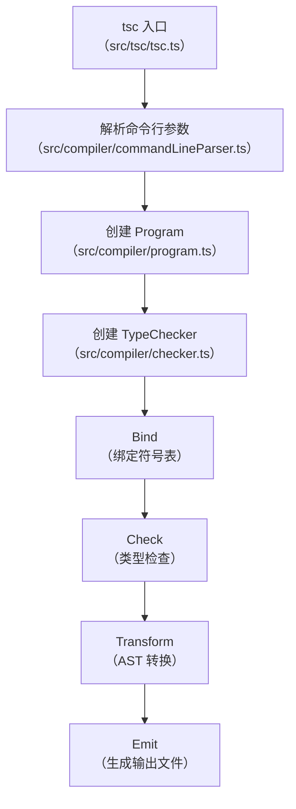
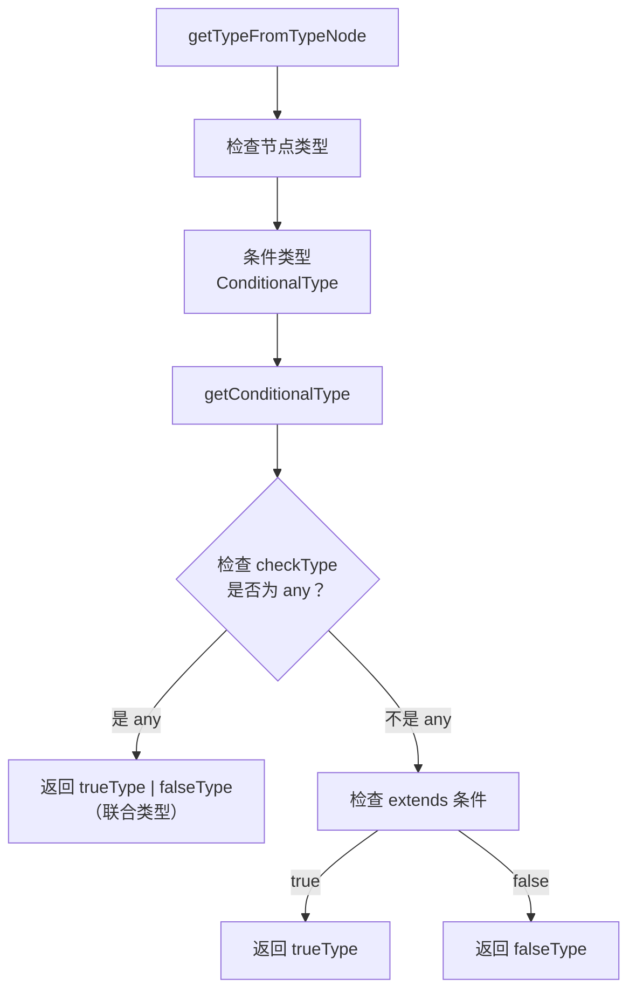

# 调试TypeScript源码

TypeScript 是日常开发中广泛使用的工具，通过调试可以深入理解它的类型检查和编译过程。

本节将讲解如何调试 TypeScript 源码。

## TypeScript 的源码结构

TypeScript 源码在 [github.com/microsoft/TypeScript](https://github.com/microsoft/TypeScript) 上，是单体仓库结构，核心代码集中在 `src/` 目录下，编译后放在 `lib/` 下，也就是我们用的 `typescript` 包里实际运行的代码。

## 调试 TypeScript 的编译流程

TypeScript 的编译流程大致如下：



### 方式一：命令行方式调试

准备一段 TypeScript 代码：

```typescript
// test.ts
interface Person {
    name: string;
    age: number;
}

function greet(person: Person): string {
    return `Hello, ${person.name}! You are ${person.age} years old.`;
}

const result = greet({ name: "Tom", age: 18 });
console.log(result);
```

使用 JavaScript Debug Terminal 执行：

```bash
npx tsc test.ts --outDir ./dist
```

在 `node_modules/typescript/lib/tsc.js` 中找到入口，打断点。

### 方式二：API 方式调试（推荐）

TypeScript 提供了编译 API，可以更精准地调试特定功能：

```javascript
const ts = require('typescript');

const sourceCode = `
interface Person {
    name: string;
    age: number;
}

function greet(person: Person): string {
    return "Hello, " + person.name;
}
`;

// 1. 创建 SourceFile
const sourceFile = ts.createSourceFile(
    'test.ts',
    sourceCode,
    ts.ScriptTarget.Latest,
    true
);

// 2. 创建 Program
const program = ts.createProgram({
    rootNames: ['test.ts'],
    options: {
        strict: true,
        target: ts.ScriptTarget.ES2022,
    },
    host: {
        fileExists: () => true,
        readFile: () => sourceCode,
        getDefaultLibFileName: () => 'lib.d.ts',
        writeFile: () => {},
        getCurrentDirectory: () => process.cwd(),
        getDirectories: () => [],
        getCanonicalFileName: (f) => f,
        getNewLine: () => '\n',
        useCaseSensitiveFileNames: () => true,
        getSourceFile: (fileName) => sourceFile,
    }
});

// 3. 获取 TypeChecker 并进行类型检查
const checker = program.getTypeChecker();
const diagnostics = ts.getPreEmitDiagnostics(program);

diagnostics.forEach(diagnostic => {
    if (diagnostic.file) {
        const { line, character } = ts.getLineAndCharacterOfPosition(diagnostic.file, diagnostic.start);
        const message = ts.flattenDiagnosticMessageText(diagnostic.messageText, '\n');
        console.log(`${diagnostic.file.fileName} (${line + 1},${character + 1}): ${message}`);
    } else {
        console.log(ts.flattenDiagnosticMessageText(diagnostic.messageText, '\n'));
    }
});
```

创建调试配置：

```json
{
  "type": "node",
  "request": "launch",
  "name": "Debug TypeScript API",
  "program": "${workspaceFolder}/ts-api-test.js",
  "skipFiles": ["<node_internals>/**"],
  "console": "integratedTerminal"
}
```

在 `node_modules/typescript/lib/typescript.js` 中搜索 `function createTypeChecker` 打断点，就可以跟踪类型检查的全过程。

## TypeScript 核心概念与调试位置

| 你想了解的 | 断点位置 | 关键文件 |
|-----------|---------|---------|
| AST 节点类型 | `createNode` | `src/compiler/factory.ts` |
| Scanner（词法分析） | `scan` | `src/compiler/scanner.ts` |
| Parser（语法分析） | `parseSourceFile` | `src/compiler/parser.ts` |
| Binder（绑定） | `bind` | `src/compiler/binder.ts` |
| TypeChecker（类型检查） | `createTypeChecker` | `src/compiler/checker.ts` |
| 类型推断 | `getTypeFromTypeNode` | `src/compiler/checker.ts` |
| 条件类型求值 | `getConditionalType` | `src/compiler/checker.ts` |
| 分布式条件类型 | `isDistributive` | `src/compiler/checker.ts` |
| 类型推断（infer） | `inferType` | `src/compiler/checker.ts` |
| 类型兼容性 | `isTypeAssignableTo` | `src/compiler/checker.ts` |
| 映射类型 | `mappedType` | `src/compiler/checker.ts` |
| 模板字面量类型 | `getTemplateLiteralType` | `src/compiler/checker.ts` |
| Transform（转换） | `transformSourceFile` | `src/compiler/transformer.ts` |
| Emit（代码生成） | `emitFiles` | `src/compiler/emitter.ts` |

## 条件类型求值的深入探究

对于以下 TypeScript 代码，`res` 类型是什么？

```typescript
type Test<T> = T extends number ? 1 : 2;

type res = Test<any>;
```

结果是 `1 | 2` 的联合类型。这一结果可能令人困惑，原因需要从源码中寻找。本节通过调试 TypeScript 源码来探究条件类型的求值过程。

### 定位条件类型的处理逻辑

在 `node_modules/typescript/lib/typescript.js` 中搜索 `getConditionalType`，打断点。

或者更精准地，搜索处理 `any` 的逻辑：



在源码中可以找到这样的注释和代码：

```typescript
// Return union of trueType and falseType for 'any' since it matches anything
if (checkType.flags & TypeFlags.Any) {
    // ...返回 trueType 和 falseType 的联合类型
}
```

这解释了为什么 `Test<any>` 会返回 `1 | 2`——因为 `any` 既匹配 `number`（返回 `1`），又不匹配 `number`（返回 `2`），所以取联合类型。

> **调试环境注意**：调试 `node_modules` 下的 TypeScript 源码时，需要让 TypeScript npm 包自带 sourcemap，并在 VSCode 调试配置的 `resolveSourceMapLocations` 中加上 `**/node_modules/typescript/**`，否则 VSCode 不会解析其 sourcemap。

## TypeScript 5.x 新特性与调试

> **2024-2026 更新**：TypeScript 5.x 引入了多项重大改进，可以通过调试来理解其实现。

### Decorators（Stage 3）

TypeScript 5.0 正式支持了 ECMAScript Stage 3 Decorators：

```typescript
function logged(originalMethod: any, context: ClassMethodDecoratorContext) {
    const methodName = String(context.name);
    function replacementMethod(this: any, ...args: any[]) {
        console.log(`LOG: Entering method '${methodName}'.`);
        const result = originalMethod.call(this, ...args);
        console.log(`LOG: Exiting method '${methodName}'.`);
        return result;
    }
    return replacementMethod;
}

class Calculator {
    @logged
    add(a: number, b: number) {
        return a + b;
    }
}
```

在 `checker.ts` 中搜索 `decorator` 相关逻辑打断点，可以理解 TypeScript 如何处理 Decorator 的语义分析。

### `satisfies` 运算符

```typescript
type Color = 'red' | 'green' | 'blue';
type RGB = [number, number, number];

const palette = {
    red: [255, 0, 0],
    green: '#00ff00',
    blue: [0, 0, 255],
} satisfies Record<Color, string | RGB>;
```

在 `checker.ts` 中搜索 `satisfies` 打断点，可以了解类型检查如何验证 `satisfies` 表达式。

### const 类型参数

```typescript
function createRoute<const T extends readonly string[]>(paths: T) {
    return paths;
}

const route = createRoute(['/home', '/about', '/contact']);
// route 的类型是 readonly ["/home", "/about", "/contact"]
```

在 `checker.ts` 中搜索 `constTypeParameter` 打断点，可以了解 `const` 类型参数的推断逻辑。

## TypeScript 6.0 的弃用项与调试

> **2025-2026 新增**：TypeScript 6.0（2025 年末发布）开启了历史选项的大规模弃用与移除（`baseUrl`、`target: ES5`、`node10` 等为弃用告警，7.0 彻底移除；`outFile`、`classic`、旧 module 格式在 6.0 已直接移除），可以通过调试相关逻辑来观察这些变化：

| 弃用/移除项（7.0 彻底移除） | 替代方案 |
|-----------------------------|---------|
| `baseUrl` | 不再需要，直接在路径中使用相对路径或 `paths`（不带 baseUrl） |
| `target: ES5` 及以下 | 升级到 `ES2015+`（推荐 `ES2022` 或更高） |
| `moduleResolution: node10`（弃用）/ `classic`（已移除） | `bundler` / `node16` / `nodenext` |
| `outFile`（6.0 已移除） | 使用打包器（bundler）产物替代 |
| `module: none` / `amd` / `umd` / `system`（6.0 起不再支持） | `esnext` / `node16` / `nodenext` |
| `downlevelIteration` | 升级 `target` 后无需手动兼容 |
| `ignoreDeprecations` | 需要时显式传入新版本号（如 `"6.0"`） |

**types 默认行为变化**：6.0 起 `types` 选项默认不再自动包含 `node_modules/@types` 下所有包（需要显式配置 `"types": ["*"]` 或逐个列出），调试类型加载逻辑时可在 `program.ts` 的 `getAutomaticTypeDirectiveNames` 打断点。

### 调试 6.0 弃用告警

在 `program.ts` 中搜索 `verifyDeprecatedCompilerOptions` / `checkDeprecations` 打断点，即可看到当前 `tsconfig.json` 触发了哪些弃用告警及对应建议：

```bash
# 快速查看项目的弃用告警
npx tsc --noEmit 2>&1 | grep -i deprecat
```

