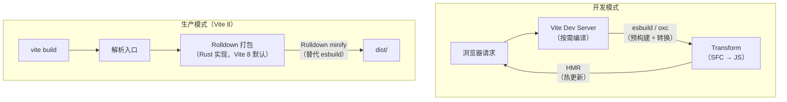
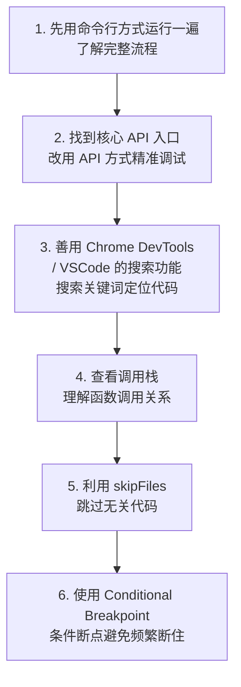

# 调试Babel-Vite源码

本节学习调试常用库的源码：Babel、Vite。

它们都提供了命令行和 API 两种使用方式，调试方式也是两种。但更推荐 API 方式，更加精准。

> **说明**：antd 组件源码调试见《调试 antd 组件源码》，Element Plus 组件源码调试见《调试 Element Plus 组件源码》。

## 调试 Babel 源码

Babel 是 JavaScript 的编译器，它把新语法转换为兼容性更好的旧语法。

### Babel 的编译流程


### API 方式调试

```javascript
const babel = require('@babel/core');

const result = babel.transformSync(
    `const fn = () => 1;`,
    {
        presets: ['@babel/preset-env'],
        sourceType: 'module'
    }
);

console.log(result.code);
```

创建调试配置：

```json
{
  "type": "node",
  "request": "launch",
  "name": "Debug Babel",
  "program": "${workspaceFolder}/babel-test.js",
  "skipFiles": ["<node_internals>/**"],
  "console": "integratedTerminal"
}
```

### 关键断点位置

| 你想了解的 | 断点位置 |
|-----------|---------|
| parse 过程 | `@babel/parser` 的 `parse` 函数 |
| AST 转换 | `@babel/traverse` 的 `traverse` 函数 |
| 插件执行 | `@babel/core` 的 `loadPluginDescriptors` |
| 代码生成 | `@babel/generator` 的 `generate` 函数 |
| preset 加载 | `@babel/core` 的 `loadPresetDescriptors` |

### Babel 的插件机制

Babel 的编译是通过插件实现的，preset 是一组插件的集合。

调试某个具体插件的执行，可以在插件的 `visitor` 函数中打断点：

```javascript
// 比如 @babel/plugin-transform-arrow-functions
// 在 node_modules/@babel/plugin-transform-arrow-functions/lib/index.js 中
// 找到 ArrowFunctionExpression 的 visitor 函数，打断点
```

> **2024-2026 更新**：Babel 7.22+ 已支持 `using` 声明（Explicit Resource Management 提案），7.23+ 支持 Decorator Metadata。调试新特性时，搜索对应的 plugin 即可。

## 调试 Vite 源码

Vite 是下一代前端构建工具，它的核心特点是开发时使用 esbuild（速度极快），生产时使用打包器完成产物构建。

> **2025-2026 重大更新**：Vite 8.0 已用 **Rolldown**（Rust 编写的打包器，兼容 Rollup API）取代 Rollup 作为生产构建引擎，并移除了对 CJS Node API 的支持（Vite 6 起 `require('vite')` 已不可用）。

### Vite 的架构



### API 方式调试

> **注意**：Vite 6+ 为纯 ESM 包，调试脚本需使用 `import` 并保存为 `.mjs` 或声明 `"type": "module"`。

```javascript
// vite-debug.mjs
import { createServer } from 'vite';

(async () => {
    const server = await createServer({
        // 配置项
        root: process.cwd(),
        logLevel: 'info',
    });

    await server.listen();
    server.printUrls();
})();
```

### 关键断点位置

| 你想了解的 | 断点位置 |
|-----------|---------|
| Dev Server 创建 | `vite/dist/node/chunks/*.js` 中搜索 `createServer` |
| 请求处理 | `transformMiddleware` |
| HMR 机制 | `handleHMRUpdate` |
| 插件执行 | `PluginContainer` |
| SFC 编译 | `vite:vue` / `vite:react` 插件 |
| 预构建 | `optimizeDeps` |

> **2024-2026 更新**：Vite 6 的 Environment API 是一个重大架构变化，支持自定义模块图和运行时；Vite 8 在此基础上落地了 Rolldown 打包与打包时 HMR。调试时可以搜索 `Environment` 类和 `rolldownVersion`（`this.meta.rolldownVersion` 可用于插件内检测）来理解这些新特性。

### 调试 Vite 插件

Vite 插件是调试 Vite 最常见的方式，因为大部分功能都是通过插件实现的：

```javascript
// vite.config.ts
import { defineConfig } from 'vite';

export default defineConfig({
    plugins: [
        {
            name: 'my-debug-plugin',
            resolveId(source) {
                console.log('resolveId:', source);
                // 在这里打断点
            },
            load(id) {
                console.log('load:', id);
                // 在这里打断点
            },
            transform(code, id) {
                console.log('transform:', id);
                // 在这里打断点
                return code;
            }
        }
    ]
});
```

## 通用调试技巧

不管调试哪个库的源码，有一些通用的技巧：



### 条件断点

当断点会频繁命中时（比如在循环中），可以使用条件断点——右键断点，选择 "Edit Breakpoint"，设置条件表达式：

```javascript
// 只有当 id 包含 'App' 时才断住
id.includes('App')

// 只有当 count > 10 时才断住
count > 10
```

### Logpoint（日志断点）

如果不需要断住代码，只是需要打印某个变量的值，可以使用 Logpoint——右键断点，选择 "Add Logpoint"：

```javascript
// 打印变量值，不会断住
"count is:", count
```
