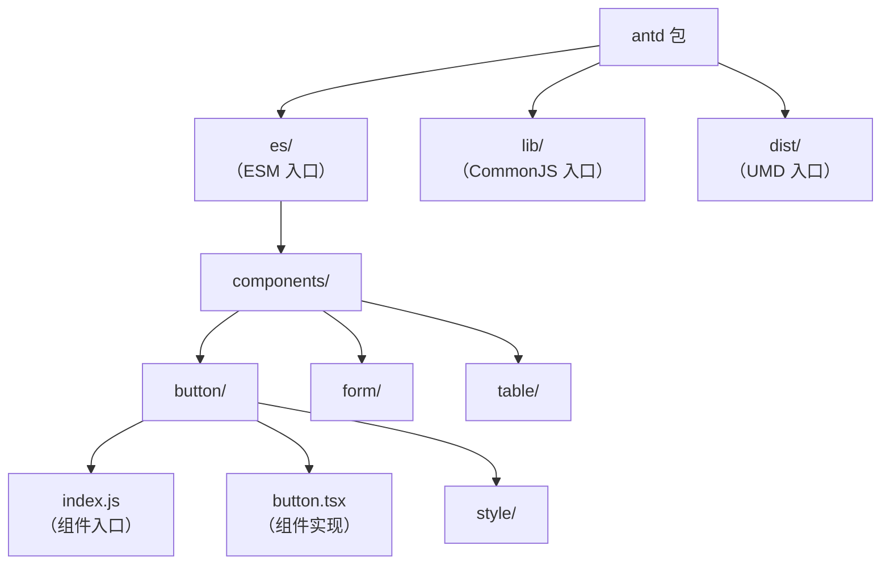

# 调试antd组件源码

antd（Ant Design）是 React 生态最流行的 UI 组件库。要深入掌握 antd，仅熟悉参数是不够的，必须深入到源码层面。

本节将介绍如何调试 antd 组件的源码。

## 准备调试项目

```bash
npm create vite@latest antd-debug -- --template react
cd antd-debug
npm install
npm install antd
```

## 在 antd 组件中打断点

### 方法一：条件断点定位组件函数

antd v5 的组件都是函数组件，React 源码中 `renderWithHooks` 是调用函数组件的地方。可以在该处添加条件断点，在特定组件被调用时断住：

1. 在 Chrome DevTools 的 Sources 面板中，找到 React 的 `react-dom.js`
2. 搜索 `renderWithHooks`
3. 在调用函数组件的那行右键 → "Add Conditional Breakpoint"
4. 输入条件：`Component.displayName?.includes('Button') || Component.name?.includes('Button')`

这样当 Button 组件被调用时就会断住，随后 step into 即可进入组件内部。

### 方法二：直接在 node_modules 中搜索（更推荐）

> **2024-2026 更新**：antd v5 的 ES 产物是未压缩、可读性好的编译代码（npm 包内未附带 sourcemap），可以直接在 Chrome DevTools 的 Sources 面板中搜索到组件源码。

1. 打开 Chrome DevTools → Sources 面板
2. 按 `Cmd+P`（macOS）或 `Ctrl+P`（Windows）打开文件搜索
3. 输入 `button` 或 `Button`，找到 antd 的 Button 组件源码
4. 直接在里面打断点

### 方法三：React DevTools 定位（最推荐）

> **2024-2026 更新**：使用 React DevTools 的 "Inspect" 功能可以直接定位到组件源码：

1. 打开 React DevTools
2. 点击左上角的 🔍 (Select an element) 按钮
3. 点击页面上的 Button 组件
4. 在 DevTools 中右键组件 → "Show source code for this element"（查看该元素的源码）

## antd v5 的源码结构



**关键源码位置：**

| 你想了解的 | 文件路径 |
|-----------|---------|
| Button 组件实现 | `antd/es/button/button.tsx` |
| Design Token 计算 | `antd/es/theme/` |
| CSS-in-JS 样式 | `@ant-design/cssinjs` |
| Form 表单逻辑 | `antd/es/form/` + `rc-field-form` |
| Table 表格逻辑 | `antd/es/table/` + `rc-table` |

## antd v6 的调试要点

> **2025-2026 新增**：Ant Design 6.0（2025 年下半年发布）已原生支持 React 19，不再需要 `@ant-design/v5-patch-for-react-19` 补丁。调试 v6 源码时注意以下变化：

1. **React 版本要求**：v6 要求 React 18+，移除 React 17 支持；项目升级后 `react-dom` 的源码结构（如 `renderWithHooks`）保持不变，原有断点方式仍适用。
2. **大量 API 弃用**：v6 将大量旧 API 标记为 deprecated（7.0 移除），调试时可在 `node_modules/antd/es/` 中搜索 `deprecate` 相关逻辑，观察弃用告警的触发条件：

```jsx
// v6 常见弃用示例（部分）
<Modal bodyStyle={{...}} />        // → styles={{ body: {...} }}
<Table size="middle" />            // → size="medium"（统一 large/medium/small）
<Menu>{children}</Menu>             // → items 数据化配置
<Tooltip overlayStyle={{...}} />    // → styles={{ root: {...} }}
<Select dropdownRender={...} />     // → popupRender
```

3. **`size` 枚举统一**：v6 统一为 `'large' | 'medium' | 'small'`，`default`/`middle` 取值已废弃，调试组件尺寸相关逻辑时可在 `size` 相关 hook 处断点观察。

## antd v6 新特性调试

> **2024-2026 更新**：antd v6 有几项重大变化，可以通过调试来理解。

### CSS-in-JS 样式系统

antd v5 使用 `@ant-design/cssinjs` 实现 CSS-in-JS，调试样式生成逻辑：

1. 在 `@ant-design/cssinjs` 的 `useStyleRegister` 函数中打断点
2. 观察样式是如何根据 Design Token 生成的

### Design Token 主题定制

```javascript
import { ConfigProvider } from 'antd';

function App() {
    return (
        <ConfigProvider
            theme={{
                token: {
                    colorPrimary: '#1890ff',
                    borderRadius: 4,
                },
            }}
        >
            <Button type="primary">Button</Button>
        </ConfigProvider>
    );
}
```

在 `@ant-design/cssinjs` 的 Theme 类的 `getDerivativeToken` 方法中打断点，可以观察 Design Token 的计算过程。

## 调试 antd 组件的实用技巧

### 使用 React DevTools 查看组件 Props/State

1. 安装 React DevTools 浏览器扩展
2. 在 Components 面板中选中 Button 组件
3. 右侧可以看到 props、hooks 的值

### 使用 VSCode Debugger 配合 Chrome DevTools

在 Chrome DevTools 中打的断点，在 VSCode Debugger 中同样会断住（通过 js-debug）。
