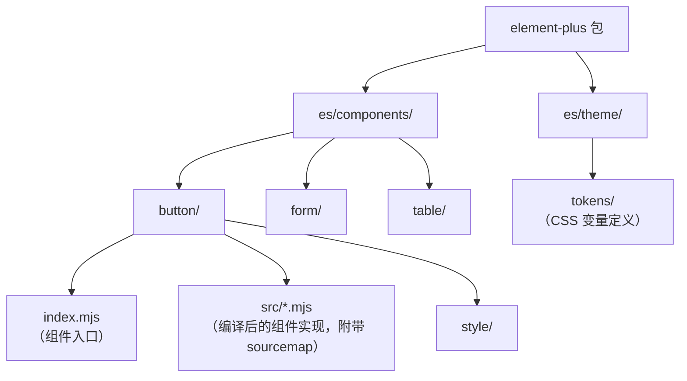

# 调试Element-Plus组件源码

本节介绍如何调试 Vue 生态的 Element Plus 组件源码。

> **2024-2026 更新**：原版使用的是 Element UI（Vue 2），现已更新为 Element Plus（Vue 3）。

## 准备调试项目

```bash
npm create vue@latest element-debug
cd element-debug
npm install
npm install element-plus
```

在 App.vue 中使用 Element Plus 的 Button 组件：

```vue
<template>
  <el-button type="primary" @click="handleClick">Click me</el-button>
</template>

<script setup>
import { ElButton } from 'element-plus'

function handleClick() {
  console.log('clicked')
}
</script>
```

## 调试 Element Plus 组件源码

### 方法一：使用 Vue DevTools 定位组件（推荐）

> **2024-2026 更新**：推荐使用 Vue DevTools Next（Vite 插件形态）来定位组件源码。

1. 安装 `vite-plugin-vue-devtools`
2. 在 `vite.config.ts` 中引入插件
3. 在 Vue DevTools 的 Inspector 面板中点击 Button 组件
4. 在组件详情中可以看到源码位置，点击即可打开源码

### 方法二：在 Chrome DevTools 中直接搜索

Element Plus 的 ES 模块也自带了 sourcemap：

1. 打开 Chrome DevTools → Sources 面板
2. 按 `Cmd+P` 搜索 `button`
3. 找到 Element Plus 的 Button 组件文件
4. 直接在组件代码中打断点

### 方法三：事件断点进入组件内部

如果无法找到组件文件，可以通过事件断点进入：

1. 在 Sources 面板的 Event Listener Breakpoints 中勾选 Mouse → click
2. 点击页面上的按钮
3. 代码会在事件处理器处断住
4. 在调用栈中找到组件的方法，step into 进入组件内部

## Element Plus 的源码结构



**关键源码位置：**

| 你想了解的 | 文件路径 |
|-----------|---------|
| Button 组件实现（编译产物，附带 sourcemap） | `element-plus/es/components/button/src/button.vue_vue_type_script_setup_true_lang.mjs` |
| Form 表单逻辑 | `element-plus/es/components/form/` + `async-validator` |
| Table 表格逻辑 | `element-plus/es/components/table/` |
| 虚拟列表 | `element-plus/es/components/virtual-list/` |
| CSS 变量 | `element-plus/es/theme/` |

## Element Plus 主题系统调试

> **2025-2026 更新**：Element Plus 2.10 新增了 **Splitter 分割面板** 组件（`es/components/splitter/`），2.11 起 `ElMessage` 支持独立的 `placement` 配置、`ElDrawer` 支持 `resizable` 拖拽调整宽度。调试新组件时可直接在对应包目录下打断点：
> - `es/components/splitter/src/` — 容器拖拽与折叠逻辑（`v-model` 双向绑定、`collapsible` 等）
> - `es/components/message/src/` — `placement` 定位与多条消息堆叠逻辑
> - `es/components/drawer/src/` — `resizable` 拖拽尺寸变化逻辑

Element Plus 使用 CSS 变量实现主题定制：

```css
:root {
    --el-color-primary: #409eff;
    --el-border-radius-base: 4px;
}
```

调试主题变量的计算逻辑：

1. 在 Chrome DevTools 的 Elements 面板中选中元素
2. 在 Styles 面板中找到 CSS 变量的定义
3. 修改变量值查看效果

## Vue DevTools Next 调试技巧

> **2024-2026 新增**：Vue DevTools Next 提供了丰富的调试能力。

### Inspector 面板

选中组件后可以看到：
- **Props**：组件接收的属性和值
- **Emits**：组件触发的自定义事件
- **Slots**：插槽内容
- **Data**：组件的响应式数据

### Timeline 面板

记录组件事件、路由变化、Pinia 状态变化的时间线，帮助理解组件的生命周期和状态变化。

### Component Graph

可视化组件依赖关系图，帮助理解组件之间的嵌套关系。
