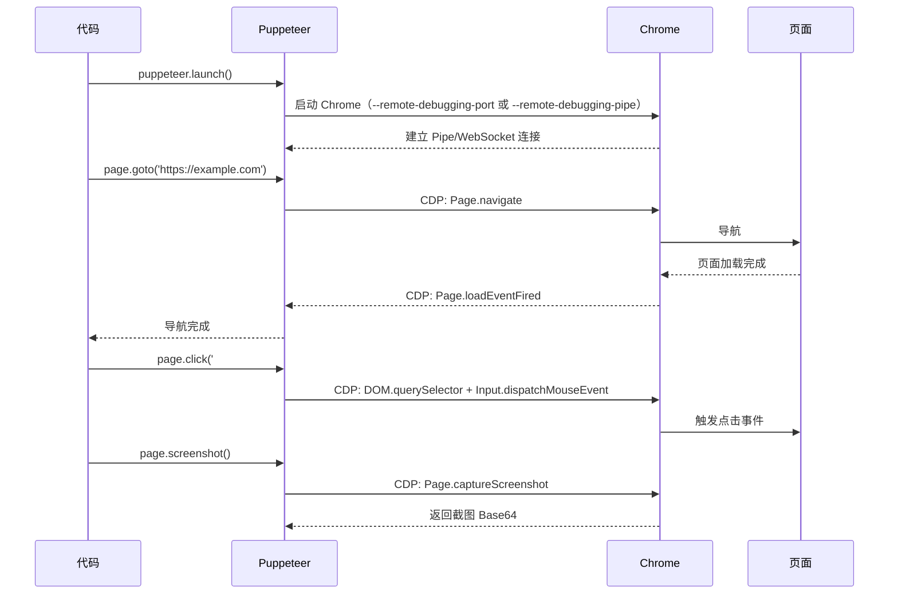
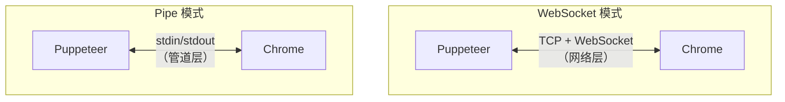

# 实现简易版Puppeteer

本节基于 CDP 实现一个简易版 Puppeteer。

> **2024-2026 更新**：WebSocket 仍是 Puppeteer 的默认连接方式，Pipe 模式需通过 `launch({ pipe: true })` 显式开启；`Browser.isConnected()` 方法已在 Puppeteer v25 移除，改用 `browser.connected` 属性。本节同时展示两种模式的实现。

## Puppeteer 的工作原理

Puppeteer 通过 CDP 控制浏览器，核心流程如下：



## 实现目标

简易版 Puppeteer 支持以下功能：

1. 启动 Chrome 并连接
2. 导航到指定 URL
3. 执行 JavaScript 表达式
4. 截图
5. 点击元素
6. 获取元素文本

## 步骤一：启动 Chrome 并连接

### 启动 Chrome 子进程

```javascript
const { spawn } = require('child_process');
const path = require('path');

function getChromePath() {
    const platform = process.platform;
    if (platform === 'darwin') {
        return '/Applications/Google Chrome.app/Contents/MacOS/Google Chrome';
    } else if (platform === 'win32') {
        return 'C:\\Program Files\\Google\\Chrome\\Application\\chrome.exe';
    } else {
        return '/usr/bin/google-chrome';
    }
}

async function launchChrome(options = {}) {
    const chromePath = options.executablePath || getChromePath();
    const port = options.port || 9222;

    const args = [
        `--remote-debugging-port=${port}`,
        '--no-first-run',
        '--no-default-browser-check',
        '--disable-extensions',
    ];

    if (options.headless !== false) {
        // v22+ 无头模式已与有头模式一致（完整 Chrome，无 UI）
        args.push('--headless');
    }

    const process = spawn(chromePath, args, {
        stdio: ['ignore', 'pipe', 'pipe'],
    });

    // 等待调试端口就绪
    await waitForDebugPort(port);

    return { process, port };
}
```

### 通过 WebSocket 连接

```javascript
const WebSocket = require('ws');

async function connectToChrome(port) {
    // 获取可调试的 Target 列表
    const res = await fetch(`http://localhost:${port}/json`);
    const targets = await res.json();

    // 找到 page 类型的 Target
    const pageTarget = targets.find(t => t.type === 'page');
    if (!pageTarget) {
        throw new Error('No page target found');
    }

    // 连接到该 Target
    const ws = new WebSocket(pageTarget.webSocketDebuggerUrl);

    return new Promise((resolve) => {
        ws.on('open', () => {
            resolve(new CDPConnection(ws));
        });
    });
}
```

### CDPConnection 类

```javascript
class CDPConnection {
    constructor(ws) {
        this._ws = ws;
        this._id = 0;
        this._callbacks = new Map();
        this._eventListeners = new Map();

        this._ws.on('message', (data) => {
            const message = JSON.parse(data);

            if (message.id) {
                // 响应
                const callback = this._callbacks.get(message.id);
                if (callback) {
                    this._callbacks.delete(message.id);
                    if (message.error) {
                        callback.reject(new Error(message.error.message));
                    } else {
                        callback.resolve(message.result);
                    }
                }
            } else if (message.method) {
                // 事件
                const listeners = this._eventListeners.get(message.method) || [];
                listeners.forEach(listener => listener(message.params));
            }
        });
    }

    // 发送 CDP 命令
    send(method, params = {}) {
        const id = ++this._id;
        return new Promise((resolve, reject) => {
            this._callbacks.set(id, { resolve, reject });
            this._ws.send(JSON.stringify({ id, method, params }));
        });
    }

    // 监听 CDP 事件
    on(event, listener) {
        if (!this._eventListeners.has(event)) {
            this._eventListeners.set(event, []);
        }
        this._eventListeners.get(event).push(listener);
    }

    // 移除事件监听
    off(event, listener) {
        const listeners = this._eventListeners.get(event) || [];
        const index = listeners.indexOf(listener);
        if (index > -1) listeners.splice(index, 1);
    }
}
```

## 步骤二：实现 Page 类

```javascript
class SimplePage {
    constructor(connection) {
        this._connection = connection;
    }

    // 导航到指定 URL
    async goto(url) {
        await this._connection.send('Page.enable');
        const { frameId } = await this._connection.send('Page.navigate', { url });

        return new Promise((resolve) => {
            const listener = (params) => {
                if (params.frameId === frameId) {
                    this._connection.off('Page.frameStoppedLoading', listener);
                    resolve();
                }
            };
            this._connection.on('Page.frameStoppedLoading', listener);
        });
    }

    // 执行 JavaScript 表达式
    async evaluate(expression) {
        const { result } = await this._connection.send('Runtime.evaluate', {
            expression,
            returnByValue: true,
        });
        return result.value;
    }

    // 截图
    async screenshot() {
        const { data } = await this._connection.send('Page.captureScreenshot', {
            format: 'png',
        });
        const buffer = Buffer.from(data, 'base64');
        return buffer;
    }

    // 点击元素
    async click(selector) {
        // 1. 查找元素
        const { nodeId } = await this._connection.send('DOM.querySelector', {
            nodeId: 1,  // document 根节点
            selector,
        });

        if (!nodeId) {
            throw new Error(`Element not found: ${selector}`);
        }

        // 2. 获取元素的位置和大小
        //    content 是扁平数组 [x1,y1, x2,y2, x3,y3, x4,y4]，四个角按 左上/右上/右下/左下 排列
        const { model } = await this._connection.send('DOM.getBoxModel', { nodeId });
        const [x1, y1, x2, , , y3] = model.content;
        const x = x1;  // 左上角坐标
        const y = y1;
        const width = x2 - x1;   // 右上角 x - 左上角 x
        const height = y3 - y1;  // 右下角 y - 左上角 y

        // 3. 计算点击位置（中心点）
        const clickX = x + width / 2;
        const clickY = y + height / 2;

        // 4. 模拟鼠标事件
        await this._connection.send('Input.dispatchMouseEvent', {
            type: 'mousePressed',
            x: clickX,
            y: clickY,
            button: 'left',
            clickCount: 1,
        });
        await this._connection.send('Input.dispatchMouseEvent', {
            type: 'mouseReleased',
            x: clickX,
            y: clickY,
            button: 'left',
            clickCount: 1,
        });
    }

    // 获取元素文本
    async $eval(selector, pageFunction) {
        const { nodeId } = await this._connection.send('DOM.querySelector', {
            nodeId: 1,
            selector,
        });

        if (!nodeId) {
            throw new Error(`Element not found: ${selector}`);
        }

        // 将 DOM 节点转为 JS 对象
        const { object } = await this._connection.send('DOM.resolveNode', { nodeId });

        // 在该对象上执行函数
        const { result } = await this._connection.send('Runtime.callFunctionOn', {
            functionDeclaration: pageFunction.toString(),
            objectId: object.objectId,
            returnByValue: true,
        });

        return result.value;
    }

    // 获取页面标题
    async title() {
        return this.evaluate('document.title');
    }

    // 获取页面 URL
    async url() {
        return this.evaluate('location.href');
    }
}
```

## 步骤三：实现 Browser 类

```javascript
class SimpleBrowser {
    constructor(process, connection) {
        this._process = process;
        this._connection = connection;
        this._pages = [];
    }

    // 获取所有页面
    async pages() {
        return this._pages;
    }

    // 新建页面
    async newPage() {
        const { targetId } = await this._connection.send('Target.createTarget', {
            url: 'about:blank',
        });

        // 连接到新 Target
        const pageConnection = await this._connectToTarget(targetId);
        const page = new SimplePage(pageConnection);
        this._pages.push(page);
        return page;
    }

    async _connectToTarget(targetId) {
        // 创建 Target 的 Session
        const { sessionId } = await this._connection.send('Target.attachToTarget', {
            targetId,
            flatten: true,
        });

        // 创建扁平化的 Session 连接
        // 简化实现：复用主连接，通过 sessionId 区分
        return this._connection;
    }

    // 关闭浏览器
    async close() {
        await this._connection.send('Browser.close');
        this._process.kill();
    }
}
```

## 步骤四：整合 API

```javascript
async function launch(options = {}) {
    const { process, port } = await launchChrome(options);
    const connection = await connectToChrome(port);
    const browser = new SimpleBrowser(process, connection);

    // 获取默认页面
    const pages = await browser.pages();
    if (pages.length === 0) {
        await browser.newPage();
    }

    return browser;
}
```

### 使用示例

```javascript
async function main() {
    const browser = await launch({ headless: true });
    const page = await browser.newPage();

    // 导航
    await page.goto('https://example.com');

    // 获取标题
    const title = await page.title();
    console.log('Title:', title);

    // 执行 JS
    const heading = await page.evaluate('document.querySelector("h1").textContent');
    console.log('Heading:', heading);

    // 截图
    const screenshot = await page.screenshot();
    require('fs').writeFileSync('screenshot.png', screenshot);
    console.log('Screenshot saved');

    // 点击
    await page.click('a');

    // 关闭
    await browser.close();
}

main().catch(console.error);
```

## CDP 命令与 Puppeteer API 对照

| Puppeteer API | CDP 命令 | 说明 |
|--------------|---------|------|
| `page.goto(url)` | `Page.navigate` | 导航 |
| `page.evaluate(expr)` | `Runtime.evaluate` | 执行 JS |
| `page.click(selector)` | `DOM.querySelector` + `Input.dispatchMouseEvent` | 点击 |
| `page.type(selector, text)` | `Input.dispatchKeyEvent` | 输入 |
| `page.screenshot()` | `Page.captureScreenshot` | 截图 |
| `page.$(selector)` | `DOM.querySelector` | 查找元素 |
| `page.setContent(html)` | `Page.setDocumentContent` | 设置内容 |
| `page.waitForSelector(sel)` | 轮询 `DOM.querySelector` | 等待元素 |
| `browser.newPage()` | `Target.createTarget` | 新建页面 |
| `browser.close()` | `Browser.close` | 关闭浏览器 |

## Pipe 模式 vs WebSocket 模式

> **2024-2026 更新**：WebSocket 仍是 Puppeteer 的默认连接方式，Pipe 模式需显式开启：



| 方面 | WebSocket 模式 | Pipe 模式 |
|------|---------------|-----------|
| 启动参数 | `--remote-debugging-port=9222` | `--remote-debugging-pipe` |
| 通信方式 | TCP + WebSocket | stdin/stdout 管道 |
| 安全性 | 暴露网络端口 | 不暴露端口 |
| 性能 | 略慢（网络层） | 更快（进程间管道） |
| 调试 | 可用浏览器访问 | 无法从外部访问 |
| 默认 | ✅（launch 默认） | ❌（需 `pipe: true` 显式开启） |

## 完整文件结构

```text
simple-puppeteer/
├── index.js          # 入口，导出 launch 函数
├── Browser.js        # Browser 类
├── Page.js           # Page 类
├── Connection.js     # CDPConnection 类
└── launch.js         # Chrome 启动逻辑
```
