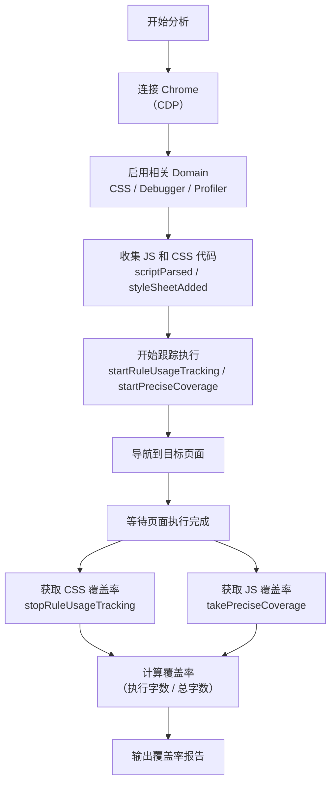
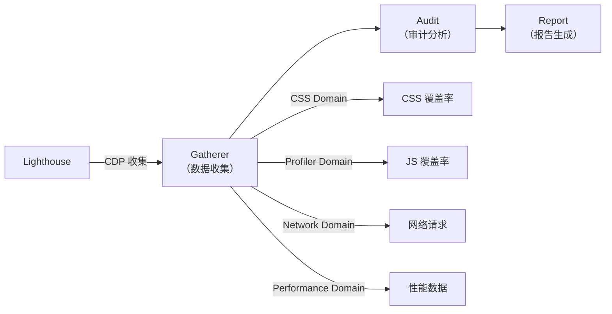
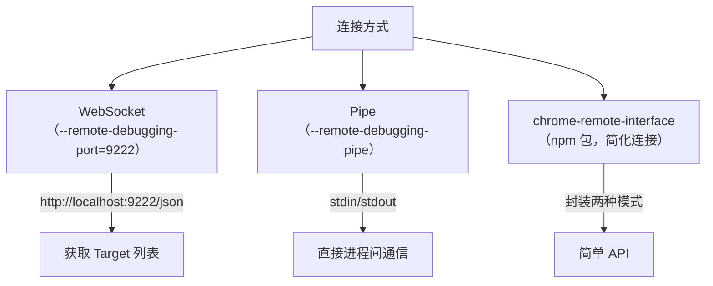

# 用CDP实现自定义DevTools功能

本节使用 CDP 实现一个实际功能——代码覆盖率检测。

> **2024-2026 更新**：WebSocket 仍是 Puppeteer 的默认连接方式（Pipe 需 `launch({ pipe: true })` 显式开启），`Browser.isConnected()` 方法已在 Puppeteer v25 移除（改用 `browser.connected` 属性）。chrome-remote-interface 目前仅支持 WebSocket 连接。

## Chrome DevTools 的 Coverage 功能

Chrome DevTools 提供了覆盖率检测功能（Coverage 面板），可以检测 JS、CSS 代码中哪些已执行、哪些未执行。在 Sources 面板中，绿色的部分是已执行的，红色的部分是未执行的。

该功能可以帮助分析哪些代码是多余的，从而进行延后加载或删除等优化。

## 用 CDP 实现覆盖率检测

### 整体流程



### 使用 chrome-remote-interface

```javascript
const CDP = require('chrome-remote-interface');

async function analyzeCoverage(url) {
    let client;
    try {
        // 连接到 Chrome（默认端口 9222）
        client = await CDP({ host: '127.0.0.1', port: 9222 });
        const { Page, Debugger, Runtime, DOM, CSS, Profiler } = client;

        // 启用相关 Domain
        await Page.enable();
        await Debugger.enable();
        await DOM.enable();
        await CSS.enable();
        await Profiler.enable();

        // 收集 JS 和 CSS 源码
        const cssMap = new Map();
        const jsMap = new Map();

        CSS.on('styleSheetAdded', async (event) => {
            const styleSheetId = event.header.styleSheetId;
            const { text } = await CSS.getStyleSheetText({ styleSheetId });
            cssMap.set(styleSheetId, {
                meta: event.header,
                content: text,
            });
        });

        Debugger.on('scriptParsed', async (event) => {
            const scriptId = event.scriptId;
            const { scriptSource } = await Debugger.getScriptSource({ scriptId });
            jsMap.set(scriptId, {
                meta: event,
                content: scriptSource,
            });
        });

        // 开始跟踪执行情况
        await CSS.startRuleUsageTracking();
        await Profiler.startPreciseCoverage({ callCount: true, detailed: true });

        // 导航到目标页面
        await Page.navigate({ url });

        // 等待页面执行完成
        await new Promise(resolve => setTimeout(resolve, 3000));

        // 获取覆盖率数据
        const cssCoverage = await CSS.stopRuleUsageTracking();
        const jsCoverage = await Profiler.takePreciseCoverage();

        // 计算覆盖率
        const report = calculateCoverage(cssMap, jsMap, cssCoverage, jsCoverage);

        return report;
    } catch (err) {
        console.error(err);
    } finally {
        if (client) await client.close();
    }
}
```

### 覆盖率计算

```javascript
function calculateCoverage(cssMap, jsMap, cssCoverage, jsCoverage) {
    const result = {
        css: [],
        js: [],
        totalUnusedBytes: 0,
        totalBytes: 0,
    };

    // CSS 覆盖率
    for (const [id, data] of cssMap) {
        const total = data.content.length;
        const used = cssCoverage.ruleUsage
            .filter(rule => rule.styleSheetId === id && rule.used)
            .reduce((sum, rule) => {
                const startOffset = rule.startOffset;
                const endOffset = rule.endOffset;
                return sum + (endOffset - startOffset);
            }, 0);

        result.css.push({
            url: data.meta.sourceURL,
            totalBytes: total,
            usedBytes: used,
            unusedBytes: total - used,
            coverage: (used / total * 100).toFixed(2) + '%',
        });

        result.totalBytes += total;
        result.totalUnusedBytes += (total - used);
    }

    // JS 覆盖率
    for (const [id, data] of jsMap) {
        const total = data.content.length;
        const usedRanges = jsCoverage.result
            .filter(entry => entry.scriptId === id)
            .flatMap(entry => entry.functions.flatMap(fn => fn.ranges));

        const used = usedRanges
            .filter(range => range.count > 0)
            .reduce((sum, range) => sum + (range.endOffset - range.startOffset), 0);

        result.js.push({
            url: data.meta.url,
            totalBytes: total,
            usedBytes: used,
            unusedBytes: total - used,
            coverage: (used / total * 100).toFixed(2) + '%',
        });

        result.totalBytes += total;
        result.totalUnusedBytes += (total - used);
    }

    return result;
}
```

### 输出覆盖率报告

```javascript
async function main() {
    const url = process.argv[2] || 'https://example.com';

    // 先启动 Chrome
    // chrome --remote-debugging-port=9222

    const report = await analyzeCoverage(url);

    console.log('=== CSS Coverage ===');
    report.css.forEach(entry => {
        console.log(`${entry.url}: ${entry.coverage} used (${entry.unusedBytes} bytes unused)`);
    });

    console.log('=== JS Coverage ===');
    report.js.forEach(entry => {
        console.log(`${entry.url}: ${entry.coverage} used (${entry.unusedBytes} bytes unused)`);
    });

    console.log(`\nTotal: ${report.totalBytes} bytes, ${report.totalUnusedBytes} unused`);
    console.log(`Overall coverage: ${((report.totalBytes - report.totalUnusedBytes) / report.totalBytes * 100).toFixed(2)}%`);
}

main();
```

## CDP Domain 对照

| 功能 | CDP Domain | 方法/事件 |
|------|-----------|----------|
| 收集 CSS 源码 | CSS | `styleSheetAdded` 事件 + `getStyleSheetText` |
| 收集 JS 源码 | Debugger | `scriptParsed` 事件 + `getScriptSource` |
| CSS 执行跟踪 | CSS | `startRuleUsageTracking` → `stopRuleUsageTracking` |
| JS 执行跟踪 | Profiler | `startPreciseCoverage` → `takePreciseCoverage` |

## Lighthouse 的数据收集原理

Lighthouse 的 CLI 版本就是通过这种方式来收集数据的：



如果需要开发网页分析工具或自定义 DevTools 功能，都可以采用类似的思路：通过 CDP 收集数据 → 分析数据 → 输出报告。

## CDP 的连接方式

> **2024-2026 更新**：CDP 有三种连接方式：



### Pipe 模式连接

> **说明**：chrome-remote-interface（0.34.x）只支持 WebSocket 连接，未提供 Pipe 模式。如需使用 Pipe 模式，应通过 Puppeteer 的 `launch({ pipe: true })`：

```javascript
const puppeteer = require('puppeteer');

// Pipe 模式：由 Puppeteer 启动 Chrome 并通过 stdin/stdout 管道通信
const browser = await puppeteer.launch({
    pipe: true,
});
```
