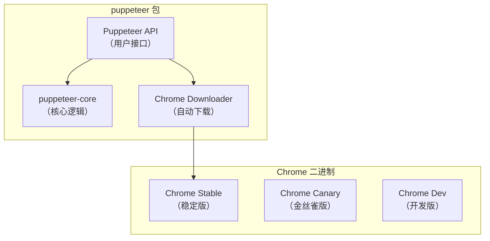
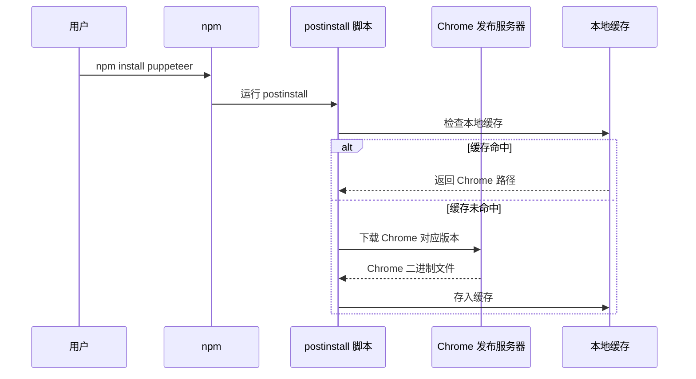
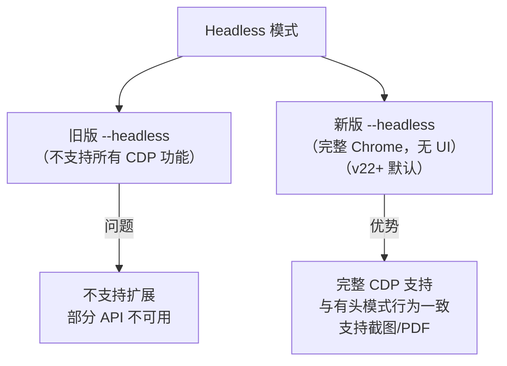
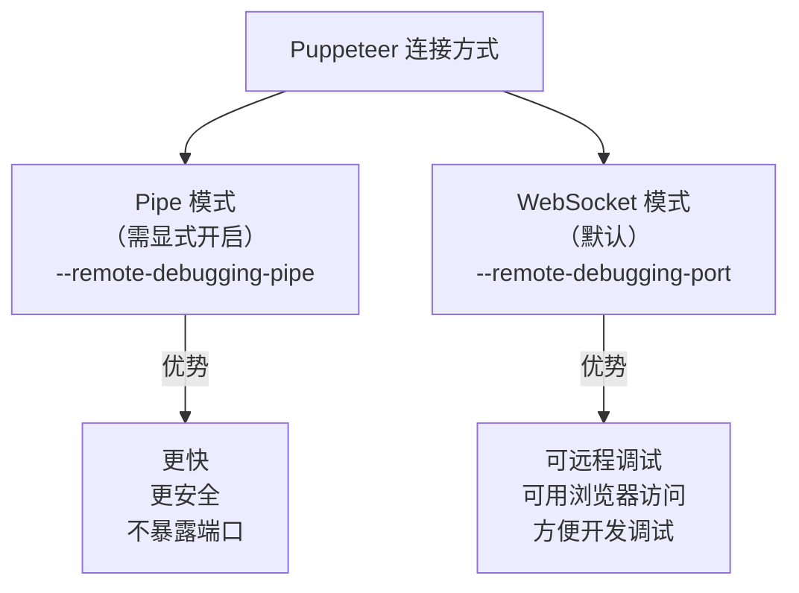
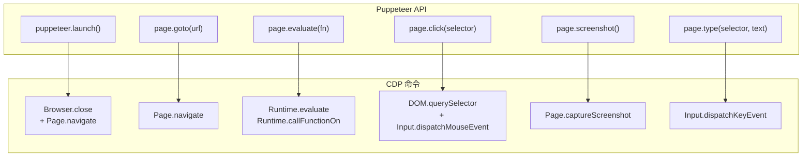

# Puppeteer的实现

本节深入 Puppeteer 的实现，分析其自动下载、启动 Chrome 以及通过 CDP 控制浏览器的机制。

> **2024-2026 更新**：Puppeteer 默认使用 WebSocket 连接（Pipe 需 `launch({ pipe: true })` 显式开启）；`puppeteer-core` 与 `puppeteer` 的区分更明确，且 v25 移除了 `Browser.isConnected()` 方法（改用 `browser.connected` 属性）。

## Puppeteer 的模块结构



## puppeteer vs puppeteer-core

| 包名 | 说明 | 自动下载 Chrome | 适用场景 |
|------|------|-----------------|---------|
| `puppeteer` | 完整版 | ✅ 是 | 通用自动化 |
| `puppeteer-core` | 精简版 | ❌ 否 | 使用已有 Chrome 安装 |

```javascript
// puppeteer：自动下载 Chrome
const puppeteer = require('puppeteer');
const browser = await puppeteer.launch();  // 使用自动下载的 Chrome

// puppeteer-core：使用已有的 Chrome
const puppeteerCore = require('puppeteer-core');
const browser = await puppeteerCore.launch({
    executablePath: '/Applications/Google Chrome.app/Contents/MacOS/Google Chrome',
});
```

## Chrome 的自动下载

### 下载逻辑

当 `npm install puppeteer` 时，`postinstall` 脚本会自动下载对应版本的 Chrome：



### Chrome 版本映射

Puppeteer 的每个版本都对应一个特定的 Chrome 版本：

```javascript
// Puppeteer 各版本对应的 Chrome 版本（revisions 配置，示意）
module.exports = {
    chrome: '131.0.6778.204',  // Puppeteer 对应的 Chrome 版本
};
```

### 缓存位置

| 平台 | 缓存路径 |
|------|---------|
| macOS | `~/Library/Caches/puppeteer/` |
| Linux | `~/.cache/puppeteer/` |
| Windows | `%LOCALAPPDATA%\puppeteer\` |

### 跳过自动下载

```bash
# 设置环境变量跳过下载
PUPPETEER_SKIP_DOWNLOAD=true npm install puppeteer

# 或在 .npmrc 中配置
puppeteer_skip_download=true
```

> **2024-2026 更新**：Puppeteer 现在支持 `PUPPETEER_CACHE_DIR` 环境变量自定义缓存目录。

## Chrome 的启动过程

### launch() 方法的实现

```javascript
// puppeteer-core/lib/cjs/puppeteer/node/BrowserLauncher.js
async launch(options = {}) {
    // 1. 解析 Chrome 路径
    const executablePath = options.executablePath || this.executablePath;

    // 2. 构建启动参数
    const chromeArguments = [];
    if (!options.ignoreDefaultArgs) {
        chromeArguments.push(...this.defaultArgs(options));
    }
    if (options.args) {
        chromeArguments.push(...options.args);
    }

    // 3. 启动 Chrome 子进程
    // 使用 WebSocket（默认，--remote-debugging-port）或 Pipe（--remote-debugging-pipe）
    const usePipe = options.pipe === true;  // 默认 false，即 WebSocket 模式

    if (usePipe) {
        chromeArguments.push('--remote-debugging-pipe');
        const { 3: pipeWrite, 4: pipeRead } = spawnChrome(executablePath, chromeArguments);
        // 连接 Pipe
        const connection = new PipeConnection(pipeRead, pipeWrite);
        return Browser.create(connection, ...);
    } else {
        chromeArguments.push(`--remote-debugging-port=${port}`);
        const process = spawnChrome(executablePath, chromeArguments);
        // 等待调试端口就绪
        const connection = await WebSocketConnection.create(port);
        return Browser.create(connection, ...);
    }
}
```

### 默认启动参数

Puppeteer 启动 Chrome 时会添加大量默认参数，确保浏览器以"干净"的状态运行：

```javascript
defaultArgs(options = {}) {
    const args = [
        '--disable-background-networking',
        '--disable-background-timer-throttling',
        '--disable-backgrounding-occluded-windows',
        '--disable-breakpad',
        '--disable-component-extensions-with-background-pages',
        '--disable-component-update',
        '--disable-default-apps',
        '--disable-dev-shm-usage',
        '--disable-extensions',
        '--disable-features=TranslateUI',
        '--disable-hang-monitor',
        '--disable-ipc-flooding-protection',
        '--disable-popup-blocking',
        '--disable-prompt-on-repost',
        '--disable-renderer-backgrounding',
        '--disable-sync',
        '--enable-features=NetworkService,NetworkServiceInProcess',
        '--force-color-profile=srgb',
        '--metrics-recording-only',
        '--no-first-run',
        '--no-default-browser-check',
        '--password-store=basic',
        '--use-mock-keychain',
    ];

    if (options.headless !== false) {
        // v22+ 无头模式与有头模式行为一致（完整 Chrome，无 UI）
        args.push('--headless');
    }

    return args;
}
```

### Headless 模式

> **2024-2026 更新**：Puppeteer v22+ 默认使用新版 Headless 模式（完整 Chrome 无 UI），它完全支持 CDP。v24 中 `headless` 选项的取值为 `boolean | 'shell'`，`'new'` 字符串已被移除，而 `'shell'` 对应旧版精简无头模式（仅 Shell Browser，用于极简场景）。



### 连接方式



## Chrome 启动参数对照

| 启动参数 | 说明 | Puppeteer 默认 |
|---------|------|----------------|
| `--headless` | 新版无头模式 | ✅ |
| `--remote-debugging-pipe` | Pipe 模式连接 | ❌（需 `pipe: true`） |
| `--remote-debugging-port=PORT` | WebSocket 模式连接 | ✅（默认） |
| `--no-first-run` | 跳过首次运行提示 | ✅ |
| `--disable-extensions` | 禁用扩展 | ✅ |
| `--disable-dev-shm-usage` | 避免 /dev/shm 问题（Docker） | ✅ |
| `--disable-gpu` | 禁用 GPU 加速 | 仅 CI 环境 |
| `--window-size=WIDTH,HEIGHT` | 设置窗口大小 | ❌ |
| `--auto-open-devtools-for-tabs` | 自动打开 DevTools | ❌ |
| `--disable-web-security` | 禁用同源策略 | ❌ |
| `--user-data-dir=DIR` | 用户数据目录 | 使用临时目录 |

## 使用 puppeteer-core 连接已有的 Chrome

> **2024-2026 更新**：连接已有的 Chrome 是调试场景中常用的方式。

```javascript
const puppeteer = require('puppeteer-core');

// 方式一：连接到已启动的 Chrome（WebSocket 模式）
const browser = await puppeteer.connect({
    browserURL: 'http://127.0.0.1:9222',
});

// 方式二：使用 WebSocket URL 连接
const browser = await puppeteer.connect({
    browserWSEndpoint: 'ws://127.0.0.1:9222/devtools/browser/ABC123',
});

// 方式三：自定义 Transport 连接（如 Pipe 双向流，需实现 ConnectionTransport 接口）
const browser = await puppeteer.connect({
    transport: new PipeTransport(pipeRead, pipeWrite),
});

// 连接后即可正常使用
const page = await browser.newPage();
await page.goto('https://example.com');
```

## 通过 CDP 控制浏览器

> **2024-2026 更新**：Puppeteer 默认通过 WebSocket 通信（Pipe 可显式开启），API 变化不大。

## Puppeteer 的核心 API 与 CDP 对照

每个 Puppeteer API 最终都会转换为一个或多个 CDP 命令：



## Puppeteer API 详解

### 1. page.goto(url)

```javascript
// Puppeteer API
await page.goto('https://example.com');

// 底层 CDP 命令
await connection.send('Page.enable');
await connection.send('Page.navigate', { url: 'https://example.com' });
// 等待 Page.loadEventFired 事件
```

### 2. page.evaluate(expression)

```javascript
// Puppeteer API
const title = await page.evaluate('document.title');
const href = await page.evaluate(() => location.href);

// 底层 CDP 命令（简单表达式）
await connection.send('Runtime.evaluate', {
    expression: 'document.title',
    returnByValue: true,
});

// 底层 CDP 命令（函数）
await connection.send('Runtime.callFunctionOn', {
    functionDeclaration: '() => location.href',
    returnByValue: true,
});
```

### 3. page.click(selector)

```javascript
// Puppeteer API
await page.click('#submit-button');

// 底层 CDP 命令
// 1. 查找元素
const { nodeId } = await connection.send('DOM.querySelector', {
    nodeId: 1,
    selector: '#submit-button',
});

// 2. 获取元素位置
// content 是扁平数组 [x1,y1, x2,y2, x3,y3, x4,y4]，四个角按 左上/右上/右下/左下 排列
const { model } = await connection.send('DOM.getBoxModel', { nodeId });
const x = model.content[0] + (model.content[2] - model.content[0]) / 2;
const y = model.content[1] + (model.content[5] - model.content[1]) / 2;

// 3. 模拟鼠标按下
await connection.send('Input.dispatchMouseEvent', {
    type: 'mousePressed', x, y, button: 'left', clickCount: 1,
});

// 4. 模拟鼠标释放
await connection.send('Input.dispatchMouseEvent', {
    type: 'mouseReleased', x, y, button: 'left', clickCount: 1,
});
```

### 4. page.type(selector, text)

```javascript
// Puppeteer API
await page.type('#search', 'hello world', { delay: 100 });

// 底层 CDP 命令（逐字符发送）
for (const char of 'hello world') {
    await connection.send('Input.dispatchKeyEvent', {
        type: 'keyDown',
        text: char,
    });
    await connection.send('Input.dispatchKeyEvent', {
        type: 'keyUp',
        text: char,
    });
    if (delay) await sleep(delay);
}
```

### 5. page.screenshot()

```javascript
// Puppeteer API
const screenshot = await page.screenshot({ path: 'screenshot.png' });

// 底层 CDP 命令
const { data } = await connection.send('Page.captureScreenshot', {
    format: 'png',
    quality: 100,
});
const buffer = Buffer.from(data, 'base64');
```

### 6. page.$(selector) / page.waitForSelector(selector)

```javascript
// Puppeteer API
const element = await page.$('.content');
await page.waitForSelector('.content');

// 底层 CDP 命令
const { nodeId } = await connection.send('DOM.querySelector', {
    nodeId: 1,
    selector: '.content',
});

// waitForSelector 实际上是轮询
while (true) {
    const { nodeId } = await connection.send('DOM.querySelector', {
        nodeId: 1,
        selector: '.content',
    });
    if (nodeId) break;
    await sleep(100);
}
```

## CDP 连接的实现

### PipeConnection（Pipe 模式）

> **2024-2026 更新**：Pipe 模式通过 stdin/stdout 与长度前缀的消息分帧通信：

```javascript
class PipeConnection {
    constructor(pipeRead, pipeWrite) {
        this._pipeRead = pipeRead;
        this._pipeWrite = pipeWrite;
        this._id = 0;
        this._callbacks = new Map();

        // 读取 CDP 消息
        this._readMessageLoop();
    }

    async _readMessageLoop() {
        while (true) {
            // 读取消息长度（4字节整数）
            const lengthBuffer = await readBytes(this._pipeRead, 4);
            const length = lengthBuffer.readInt32LE(0);

            // 读取消息内容
            const messageBuffer = await readBytes(this._pipeRead, length);
            const message = JSON.parse(messageBuffer.toString());

            this._handleMessage(message);
        }
    }

    send(method, params = {}) {
        const id = ++this._id;
        const message = JSON.stringify({ id, method, params });

        return new Promise((resolve, reject) => {
            this._callbacks.set(id, { resolve, reject });

            // 写入消息长度 + 内容
            const lengthBuffer = Buffer.alloc(4);
            lengthBuffer.writeInt32LE(message.length, 0);
            this._pipeWrite.write(lengthBuffer);
            this._pipeWrite.write(message);
        });
    }
}
```

### WebSocketConnection（默认模式）

```javascript
class WebSocketConnection {
    constructor(ws) {
        this._ws = ws;
        // ... 同 PipeConnection 的消息处理逻辑
    }

    send(method, params = {}) {
        const id = ++this._id;
        const message = JSON.stringify({ id, method, params });

        return new Promise((resolve, reject) => {
            this._callbacks.set(id, { resolve, reject });
            this._ws.send(message);  // 直接发送 JSON
        });
    }
}
```

### 消息格式对比

| 方面 | Pipe 模式 | WebSocket 模式 |
|------|-----------|----------------|
| 消息边界 | 4字节长度前缀 + JSON | WebSocket 协议自带消息边界 |
| 通信方式 | stdin/stdout 管道 | TCP + WebSocket |
| 消息编码 | UTF-8 JSON | UTF-8 JSON |
| 连接建立 | Chrome 启动时直接创建 | HTTP → WebSocket 升级 |

## CDP 完整命令对照表

| Puppeteer API | CDP 命令 | 说明 |
|--------------|---------|------|
| `puppeteer.launch()` | 启动 Chrome 子进程 | --remote-debugging-pipe/port |
| `browser.newPage()` | `Target.createTarget` | 创建新标签页 |
| `browser.close()` | `Browser.close` | 关闭浏览器 |
| `browser.version()` | `Browser.getVersion` | 获取浏览器版本 |
| `page.goto(url)` | `Page.navigate` | 导航 |
| `page.evaluate(fn)` | `Runtime.evaluate` / `Runtime.callFunctionOn` | 执行 JS |
| `page.click(sel)` | `DOM.querySelector` + `Input.dispatchMouseEvent` | 点击 |
| `page.type(sel, text)` | `Input.dispatchKeyEvent` | 输入文字 |
| `page.screenshot()` | `Page.captureScreenshot` | 截图 |
| `page.$(sel)` | `DOM.querySelector` | 查找元素 |
| `page.setContent(html)` | `Page.setDocumentContent` | 设置页面内容 |
| `page.waitForSelector(sel)` | 轮询 `DOM.querySelector` | 等待元素出现 |
| `page.cookies()` | `Network.getCookies` | 获取 Cookie |
| `page.setCookie(cookie)` | `Network.setCookie` | 设置 Cookie |
| `page.emulate(device)` | `Emulation.setDeviceMetricsOverride` | 设备模拟 |
| `page.setViewport(viewport)` | `Emulation.setDeviceMetricsOverride` | 设置视口 |
| `page.tracing.start()` | `Tracing.start` | 开始性能追踪 |
| `page.tracing.stop()` | `Tracing.end` | 结束性能追踪 |
| `page.coverage.startJSCoverage()` | `Profiler.startPreciseCoverage` | JS 覆盖率 |
| `page.coverage.startCSSCoverage()` | `CSS.startRuleUsageTracking` | CSS 覆盖率 |
| `page.setRequestInterception(true)` | `Fetch.enable` | 请求拦截 |

## Puppeteer 的请求拦截

> **2024-2026 更新**：请求拦截使用 `Fetch` Domain 替代已废弃的 `Network.requestIntercepted`：

```javascript
// Puppeteer API
await page.setRequestInterception(true);
page.on('request', (request) => {
    if (request.url().includes('ads')) {
        request.abort();  // 拦截广告请求
    } else {
        request.continue();  // 其他请求继续
    }
});

// 底层 CDP 命令
await connection.send('Fetch.enable', {
    patterns: [{ urlPattern: '*' }],
});

connection.on('Fetch.requestPaused', async (params) => {
    if (params.request.url.includes('ads')) {
        await connection.send('Fetch.failRequest', {
            requestId: params.requestId,
            errorReason: 'BlockedByClient',
        });
    } else {
        await connection.send('Fetch.continueRequest', {
            requestId: params.requestId,
        });
    }
});
```

## Playwright 的差异

> **2024-2026 新增**：Playwright 是 Puppeteer 的替代方案，支持多浏览器：

| 方面 | Puppeteer | Playwright |
|------|-----------|-----------|
| 支持浏览器 | Chrome/Chromium | Chrome/Firefox/Safari（WebKit） |
| 连接模式 | Pipe/WebSocket | Pipe/WebSocket |
| 自动等待 | 需手动 waitForSelector | 自动等待元素可操作 |
| 多页面 | 单 Context | 多 BrowserContext（隔离） |
| 语言支持 | JavaScript | JavaScript/Python/Java/.NET |
| 维护者 | Google | Microsoft |

