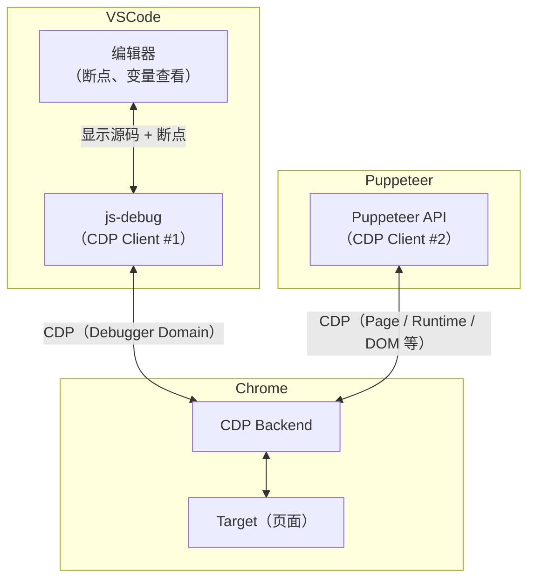
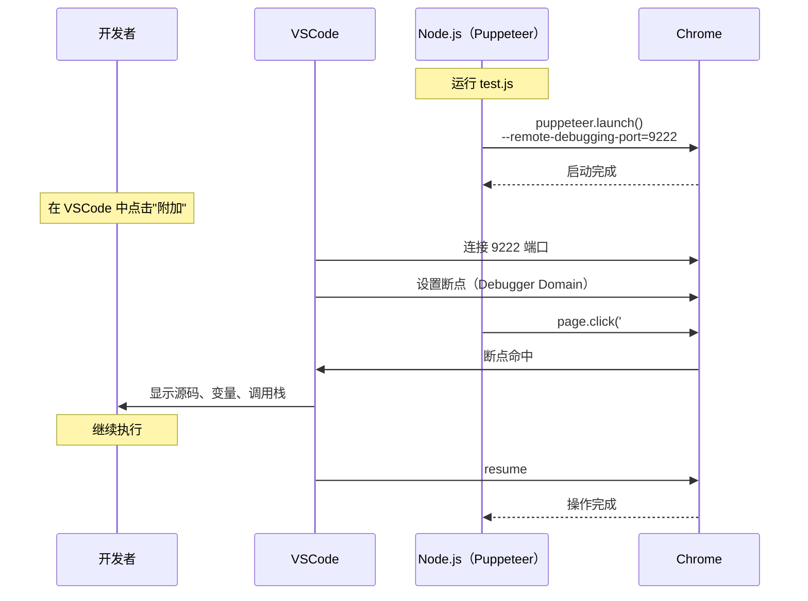
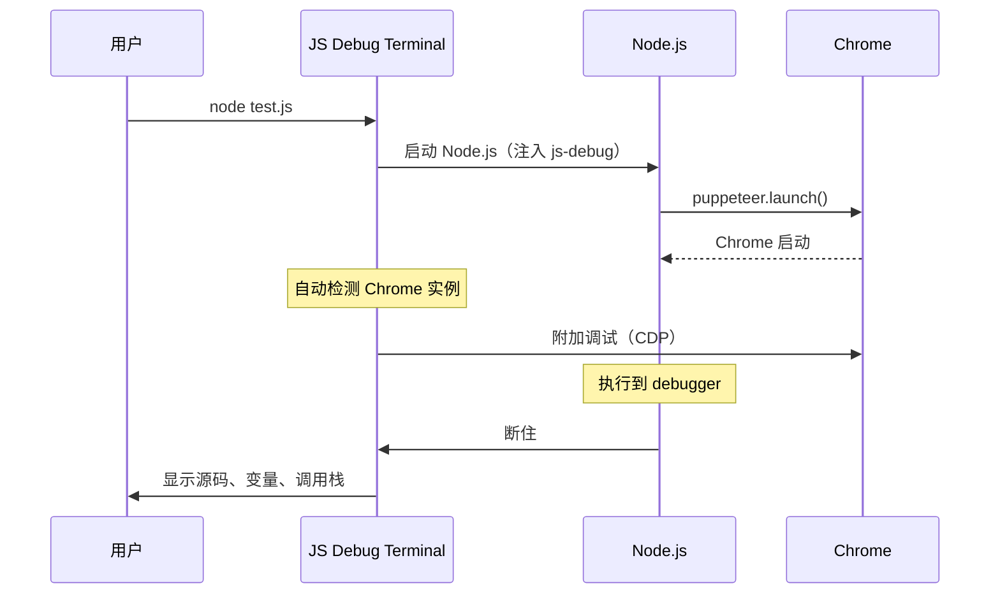
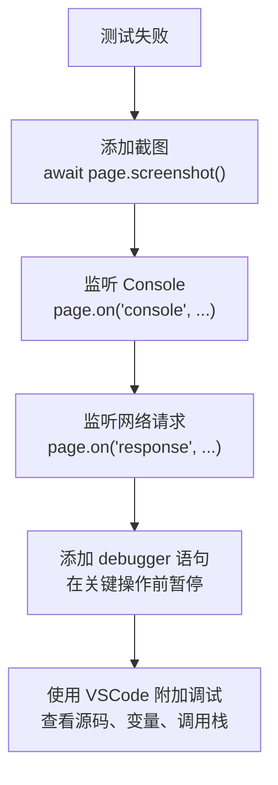

# Puppeteer与VSCode-Debugger融合调试

本节学习如何将 Puppeteer 与 VSCode Debugger 结合，实现自动化调试。

> **2024-2026 更新**：VSCode js-debug 已内置支持，Puppeteer 调试配置更简单。Playwright 也提供了类似的调试体验。

## 融合调试的原理

Puppeteer 通过 CDP 控制浏览器，VSCode js-debug 也通过 CDP 调试代码。它们本质上是两个 CDP Client，连接到同一个 Chrome 实例。



**关键**：两个 CDP Client 可以同时连接到同一个 Chrome 实例，互不干扰。js-debug 使用 Debugger Domain 设置断点，Puppeteer 使用 Page/Network/DOM 等 Domain 控制页面。

## 方式一：Puppeteer 启动 Chrome + VSCode 附加

### 步骤

1. 在 Puppeteer 脚本中启动 Chrome 并暴露调试端口
2. VSCode 通过 attach 配置连接到该端口

```javascript
// test.js
const puppeteer = require('puppeteer');

(async () => {
    // 启动 Chrome，暴露调试端口
    const browser = await puppeteer.launch({
        headless: false,
        args: ['--remote-debugging-port=9222'],
    });

    const page = await browser.newPage();
    await page.goto('http://localhost:5173');

    // 在此处可以设置 debugger 语句
    // 或在 VSCode 中设置断点
    await page.click('#submit');

    await browser.close();
})();
```

VSCode 调试配置：

```json
{
    "version": "0.2.0",
    "configurations": [
        {
            "name": "Attach to Puppeteer",
            "type": "chrome",
            "request": "attach",
            "port": 9222,
            "webRoot": "${workspaceFolder}",
            "sourceMaps": true
        }
    ]
}
```

### 执行流程



## 方式二：VSCode 启动 Chrome + Puppeteer 附加

### 步骤

1. VSCode 启动 Chrome 并打开页面
2. Puppeteer 通过 `puppeteer.connect()` 连接到已有的 Chrome

VSCode 调试配置：

```json
{
    "version": "0.2.0",
    "configurations": [
        {
            "name": "Launch Chrome",
            "type": "chrome",
            "request": "launch",
            "url": "http://localhost:5173",
            "webRoot": "${workspaceFolder}",
            "runtimeArgs": ["--remote-debugging-port=9222"]
        }
    ]
}
```

Puppeteer 脚本：

```javascript
const puppeteer = require('puppeteer-core');

(async () => {
    // 连接到 VSCode 启动的 Chrome
    const browser = await puppeteer.connect({
        browserURL: 'http://127.0.0.1:9222',
    });

    const pages = await browser.pages();
    const page = pages[0];

    // 执行自动化操作
    await page.click('#submit');
    await page.type('#search', 'hello');
})();
```

## 方式三：使用 JavaScript Debug Terminal

> **2024-2026 更新**：最简单的方式是使用 VSCode 的 JavaScript Debug Terminal：

### 步骤

1. 在 VSCode 中打开 JavaScript Debug Terminal（`Cmd+Shift+P` → Debug: JavaScript Debug Terminal）
2. 在终端中运行 Puppeteer 脚本：`node test.js`
3. VSCode 会自动检测到 Chrome 实例并附加调试

```javascript
// test.js - 使用 debugger 语句触发调试
const puppeteer = require('puppeteer');

(async () => {
    const browser = await puppeteer.launch({
        headless: false,
    });

    const page = await browser.newPage();
    await page.goto('http://localhost:5173');

    // 方式一：在 Puppeteer 脚本中设置断点
    debugger;  // VSCode 会在这一行断住

    // 方式二：在页面中注入 debugger
    await page.evaluate(() => {
        debugger;  // 浏览器中会断住，VSCode 也会捕获
    });

    await browser.close();
})();
```

### JavaScript Debug Terminal 的原理



> **2024-2026 新增**：Playwright 的调试模式与 Trace Viewer 见《Playwright 调试模式与 Trace Viewer》篇。

## 调试实战：自动化测试中定位问题

### 场景：E2E 测试失败

```javascript
// test.spec.js
const puppeteer = require('puppeteer');

describe('Login Flow', () => {
    it('should login successfully', async () => {
        const browser = await puppeteer.launch({ headless: false });
        const page = await browser.newPage();

        await page.goto('http://localhost:5173/login');

        // 测试断住在这里
        await page.type('#username', 'admin');
        await page.type('#password', 'password');
        await page.click('#login-button');

        // 期望跳转到首页，但实际没跳转
        await page.waitForNavigation({ timeout: 5000 });
        expect(page.url()).toContain('/dashboard');

        await browser.close();
    });
});
```

### 调试步骤



### 调试辅助代码

```javascript
// 截图
await page.screenshot({ path: 'debug.png' });

// 监听 Console
page.on('console', msg => console.log('PAGE LOG:', msg.text()));

// 监听错误
page.on('pageerror', error => console.log('PAGE ERROR:', error.message));

// 监听网络请求失败
page.on('requestfailed', request => {
    console.log('REQUEST FAILED:', request.url(), request.failure().errorText);
});

// 监听响应
page.on('response', response => {
    if (response.status() >= 400) {
        console.log('RESPONSE ERROR:', response.url(), response.status());
    }
});

// 暂停执行，等待手动操作
// 注意：page.waitForTimeout() 已在 Puppeteer v22 中移除
await new Promise(r => setTimeout(r, 5000));  // 等待 5 秒

// 注意：page.pause() 是 Playwright 的 API，Puppeteer 中不可用
// Playwright 的调试模式见下一篇《Playwright调试模式与Trace-Viewer》
```
