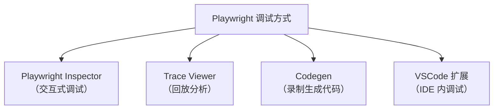
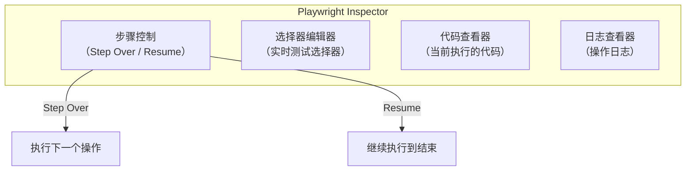
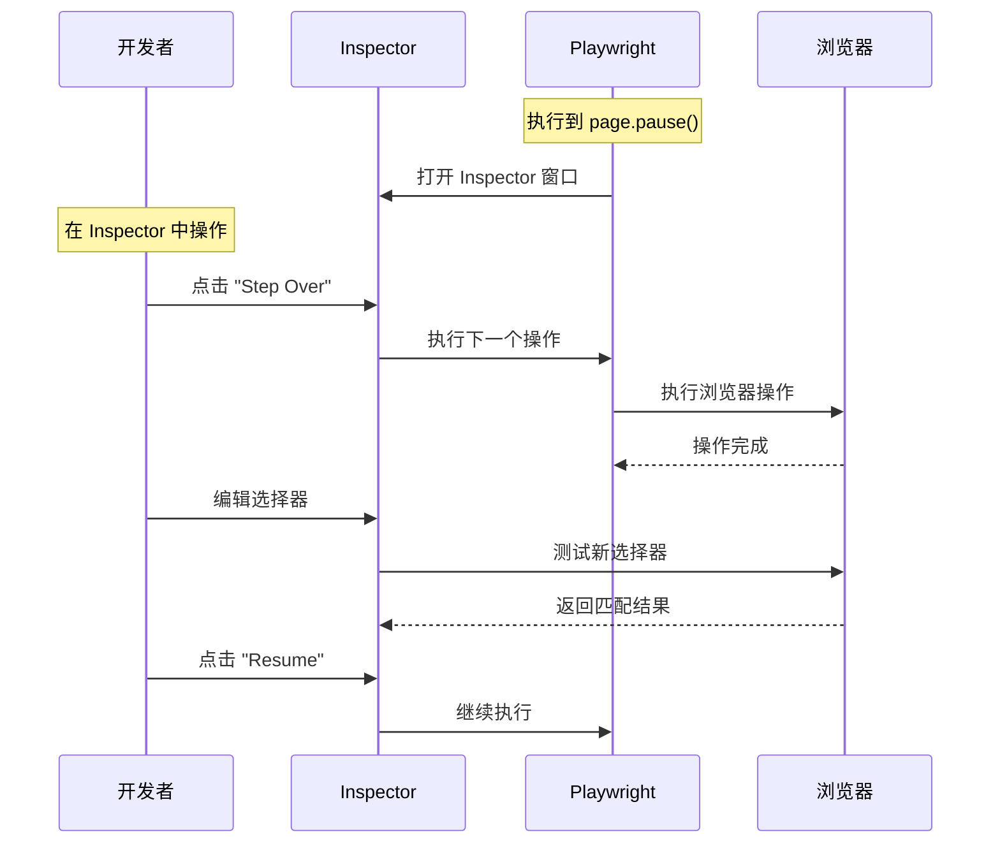
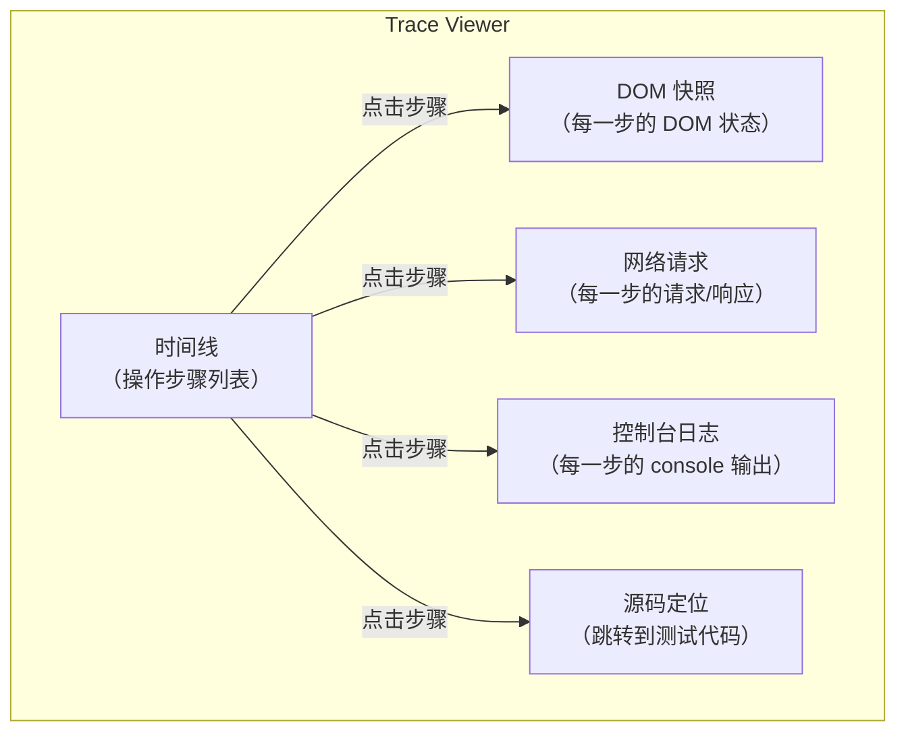
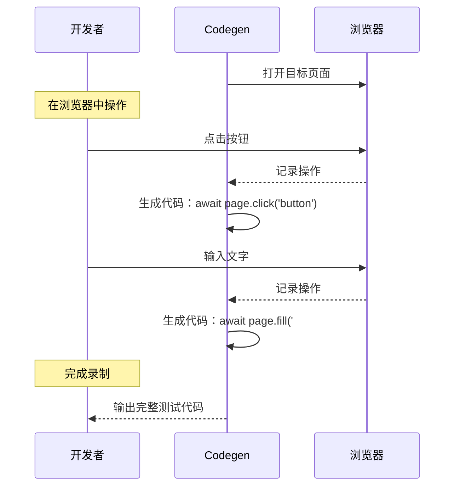

# Playwright调试模式与Trace-Viewer

Playwright 是 Microsoft 开发的自动化测试框架，相比 Puppeteer 支持多浏览器（Chrome/Firefox/Safari），并提供了更完善的调试体验。

> **2024-2026 更新**：Playwright v1.61+ 支持更强大的 Trace Viewer 和 VSCode 扩展：UI Mode / Trace Viewer 可在浏览器标签页中打开（`--ui-port 0`，v1.35+ 起支持）、新增 `on-all-retries` 等 Trace 录制模式。

## Playwright 的调试方式



## 1. Playwright Inspector（调试模式）

### 启动调试模式

```bash
# 方式一：命令行
npx playwright test --debug

# 方式二：只调试某个测试
npx playwright test example.spec.ts --debug

# 方式三：在代码中使用
await page.pause();
```

### Inspector 的功能

Playwright Inspector 是一个独立的调试窗口，提供以下功能：



### 在测试中使用 page.pause()

```javascript
// example.spec.ts
import { test, expect } from '@playwright/test';

test('login flow', async ({ page }) => {
    await page.goto('https://example.com/login');

    // 在此处暂停，打开 Inspector
    await page.pause();

    await page.fill('#username', 'admin');
    await page.fill('#password', 'password');
    await page.click('#login-button');

    await expect(page).toHaveURL(/dashboard/);
});
```

### Inspector 的操作流程



## 2. Trace Viewer（回放分析）

Trace Viewer 是 Playwright 最强大的调试工具，可以录制测试的每一步，此后回放查看。相比 Puppeteer 只能通过截图和 console 日志调试，Playwright 的 Trace Viewer 提供了完整的回放能力。

### 录制 Trace

```bash
# 方式一：命令行录制
npx playwright test --trace on

# 方式二：配置文件
# playwright.config.ts
```

```javascript
// playwright.config.ts
import { defineConfig } from '@playwright/test';

export default defineConfig({
    use: {
        trace: 'on-first-retry',  // 仅在重试时录制（推荐）
        // trace: 'on',           // 始终录制
        // trace: 'off',          // 不录制
        // trace: 'retain-on-failure',  // 失败时保留
        // trace: 'on-all-retries',       // 每次重试都录制（v1.49+）
        // trace: 'retain-on-first-failure',      // 首次失败时保留（v1.49+）
        // trace: 'retain-on-failure-and-retries', // 失败及重试时保留（v1.49+）
    },
});
```

### 查看 Trace

```bash
# 查看录制的 Trace
npx playwright show-trace trace.zip

# 在浏览器标签页中打开（不占用终端）
npx playwright show-trace --port 0 trace.zip

# 或在 CI 中上传 Trace
npx playwright show-trace https://trace.server/trace.zip
```

> **2024-2026 新增**：`show-trace --port 0` 会在浏览器标签页中打开 Trace Viewer，并自动选择一个可用端口；同理，UI Mode 也支持 `npx playwright test --ui-port 0` 在标签页中打开（v1.35+），在 Docker / Codespaces 等容器环境中还可通过 `--ui-host=0.0.0.0` 暴露访问地址。

### Trace Viewer 的功能



### Trace 的数据结构

Trace 文件包含以下数据：

| 数据 | 说明 |
|------|------|
| Actions | 每个 Playwright 操作（click、fill、navigate 等） |
| Snapshots | 每步操作后的 DOM 快照 |
| Network | 所有网络请求和响应 |
| Console | 所有 console 输出 |
| Screenshots | 每步操作后的截图 |
| Metadata | 浏览器版本、视口大小、测试名称等 |

## 3. Codegen（录制生成代码）

Playwright Codegen 可以录制浏览器操作并生成测试代码：

```bash
# 启动录制
npx playwright codegen https://example.com

# 指定浏览器
npx playwright codegen --browser=firefox https://example.com

# 指定设备和视口
npx playwright codegen --device="iPhone 14 Pro" https://example.com
```

### Codegen 的工作流程



### 生成的代码示例

```javascript
import { test, expect } from '@playwright/test';

test('test', async ({ page }) => {
    await page.goto('https://example.com/');
    await page.getByRole('link', { name: 'Login' }).click();
    await page.getByLabel('Username').fill('admin');
    await page.getByLabel('Password').fill('password');
    await page.getByRole('button', { name: 'Sign in' }).click();
    await expect(page.getByText('Welcome')).toBeVisible();
});
```

## 4. VSCode 扩展

Playwright 提供了 VSCode 扩展，可以在 IDE 内直接运行和调试测试：

### 安装与使用

1. 安装 VSCode 扩展：`ms-playwright.playwright`
2. 在测试文件中设置断点
3. 点击测试旁边的 ▶ 按钮运行
4. 或右键选择 "Debug Test" 调试

### VSCode 扩展的功能

| 功能 | 说明 |
|------|------|
| 运行测试 | 点击 ▶ 运行单个测试 |
| 调试测试 | 设置断点，逐步执行 |
| 查看 Trace | 测试失败后自动打开 Trace Viewer |
| 录制测试 | 点击录制按钮，打开 Codegen |
| 选择器查看 | 悬停在代码上查看对应元素 |

## Playwright vs Puppeteer 调试对比

| 方面 | Puppeteer | Playwright |
|------|-----------|-----------|
| 调试模式 | 无内置 | `--debug` / `page.pause()` |
| 回放分析 | 无 | Trace Viewer |
| 录制生成代码 | 第三方工具 | 内置 Codegen |
| VSCode 集成 | 手动配置 | 官方扩展 |
| 自动等待 | 需手动 `waitForSelector` | 自动等待 |
| 多浏览器 | Chrome / Firefox（v23 起官方支持） | Chrome / Firefox / Safari |

## Playwright 调试的最佳实践

### 1. 使用 `--trace on-first-retry`

```javascript
// playwright.config.ts
export default defineConfig({
    use: {
        trace: 'on-first-retry',  // 仅重试时录制，节省资源
    },
});
```

### 2. 在关键步骤前添加 `page.pause()`

```javascript
test('complex flow', async ({ page }) => {
    await page.goto('/');

    // 复杂操作前暂停调试
    await page.pause();

    await page.click('#complex-button');
});
```

### 3. 失败时自动截图

> **2024-2026 补充**：视频录制与 Trace 支持同一套触发模式（`on` / `off` / `retain-on-failure` / `on-all-retries` 等），可在 `use.video` 中配置，配合 Trace 实现完整的失败回放。

```javascript
test.afterEach(async ({ page }, testInfo) => {
    if (testInfo.status !== testInfo.expectedStatus) {
        await page.screenshot({
            path: `test-results/${testInfo.title}-failure.png`,
        });
    }
});
```

### 4. CI 中查看 Trace

```yaml
# GitHub Actions
- name: Run Playwright tests
  run: npx playwright test --trace on

- name: Upload Trace on failure
  if: failure()
  uses: actions/upload-artifact@v4
  with:
    name: playwright-traces
    path: test-results/
```
