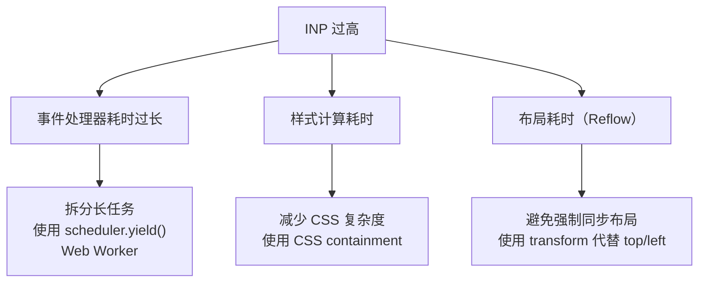

# 用Lighthouse检测网页性能

Chrome DevTools 自带了性能检测工具 Lighthouse，可以自动检测网页的性能、可访问性、最佳实践、SEO 等方面的得分，并给出优化建议。

## 使用 Lighthouse

1. 打开 Chrome DevTools → Lighthouse 面板
2. 选择要检测的类别
3. 点击 "Analyze page load"

> **2024-2026 更新**：Lighthouse 已更新到 v12+，性能评分算法有调整，更侧重于 Core Web Vitals（LCP、INP、CLS）。

### 检测类别

| 类别 | 说明 |
|------|------|
| Performance | 性能指标（LCP、INP、CLS、FCP、TTFB） |
| Accessibility | 可访问性（对比度、ARIA、键盘导航） |
| Best Practices | 最佳实践（HTTPS、安全标头、控制台错误） |
| SEO | 搜索引擎优化（meta 标签、robots.txt、结构化数据） |

## Lighthouse 报告结构


### Performance 评分权重

> **2024-2026 更新**：Core Web Vitals 中 INP 已于 2024 年 3 月替代 FID，Lighthouse 也会采集并展示 INP；但截至 Lighthouse v12/v13，Performance 评分权重仍以 TBT 最高，INP 的权重为 0（不计入评分），TTFB 等指标仅作为诊断信息展示。

| 指标 | 权重 | 说明 |
|------|------|------|
| TBT | 30% | 总阻塞时间（权重最高） |
| LCP | 25% | 最大内容绘制 |
| CLS | 25% | 累积布局偏移 |
| FCP | 10% | 首次内容绘制 |
| Speed Index | 10% | 速度指数 |
| INP | 0% | 交互到下次绘制的延迟（采集展示，不计入评分） |

## 常见优化建议

### Performance 优化

| 建议 | 影响 | 解决方案 |
|------|------|---------|
| Eliminate render-blocking resources | 高 | 异步加载 CSS/JS，使用 `async`/`defer` |
| Properly size images | 高 | 使用响应式图片（`srcset`），WebP/AVIF 格式 |
| Remove unused CSS/JS | 中 | 代码分割、Tree Shaking |
| Reduce unused JavaScript | 中 | 动态导入、代码分割 |
| Serve static assets with an efficient cache policy | 中 | 设置 Cache-Control 头 |
| Avoid enormous network payloads | 中 | 压缩资源、懒加载 |
| Minimize main-thread work | 中 | 使用 Web Worker、任务拆分 |
| Reduce JavaScript execution time | 中 | 代码优化、减少 polyfill |

### 常见 INP 问题

> **2024-2026 新增**：INP 是新的 Core Web Vitals 指标。



### scheduler.yield()

> **2024-2026 新增**：`scheduler.yield()` 是一个新的 API，用于主动让出主线程，让浏览器可以处理渲染和用户交互：

```javascript
// 优化前：长任务阻塞主线程
async function processLargeArray(items) {
    for (const item of items) {
        await doExpensiveWork(item);  // 可能阻塞主线程
    }
}

// 优化后：使用 scheduler.yield() 让出主线程
async function processLargeArray(items) {
    for (const item of items) {
        await doExpensiveWork(item);
        await scheduler.yield();  // 让出主线程，处理用户交互
    }
}
```

## 使用 Lighthouse CI

> **2024-2026 更新**：Lighthouse CI 可以在 CI/CD 流程中自动运行 Lighthouse 检测：

```yaml
# GitHub Actions 配置
name: Lighthouse CI
on: [push]
jobs:
  lighthouse:
    runs-on: ubuntu-latest
    steps:
      - uses: actions/checkout@v4
      - uses: actions/setup-node@v4
        with:
          node-version: 22
      - run: npm install && npm run build
      - name: Run Lighthouse CI
        uses: treosh/lighthouse-ci-action@v12
        with:
          urls: |
            http://localhost:3000
          uploadArtifacts: true
          budgetPath: ./lighthouse-budget.json
```

## 使用 PageSpeed Insights

除了 DevTools 中的 Lighthouse，还可以使用 [PageSpeed Insights](https://pagespeed.web.dev/) 来检测网页性能。它的优势是可以获取真实用户的 Core Web Vitals 数据（来自 Chrome UX Report）：

- **Lab Data**：模拟环境下的数据（Lighthouse 生成）
- **Field Data**：真实用户数据（来自 Chrome UX Report）
