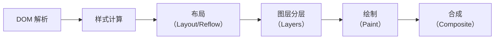
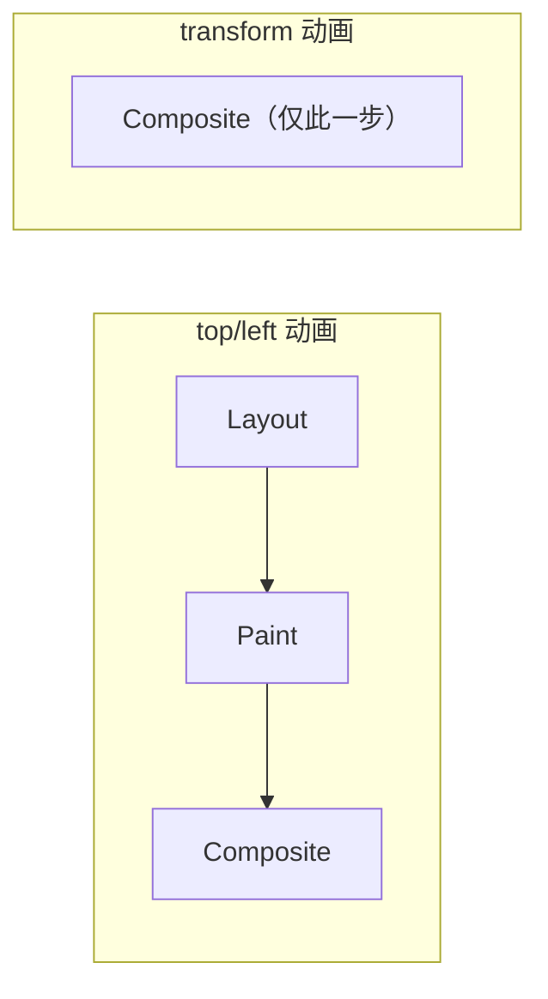

# 用Layers工具分析网页图层

浏览器的渲染过程包括：DOM 解析、样式计算、布局（Layout）、图层分层（Layers）、绘制（Paint）、合成（Composite）。

其中图层分层是一个很重要的环节，它决定了哪些内容会被单独绘制为一个图层，哪些内容会被合并绘制。

理解图层对于排查渲染性能问题非常重要，例如：
- 为什么 `transform` 动画比 `top/left` 动画更流畅
- 为什么有些元素会触发整个页面的重绘
- 如何避免不必要的图层创建

## 浏览器渲染管线



### 各阶段说明

| 阶段 | 说明 | 触发条件 |
|------|------|---------|
| Layout | 计算元素的几何信息（位置、大小） | 修改 width/height/margin/padding 等 |
| Paint | 填充像素（颜色、文字、图片、边框等） | 修改 color/background/shadow 等 |
| Composite | 将多个图层合成最终画面 | 修改 transform/opacity（**不影响布局和绘制**） |

**关键优化原理**：`transform` 和 `opacity` 属性的改变只触发 Composite 阶段，不触发 Layout 和 Paint，所以动画性能最好。

## 图层创建的条件

浏览器会为满足以下条件的元素创建独立的图层：

| 条件 | CSS 属性 / 场景 |
|------|----------------|
| 3D 变换 | `transform: translate3d()` / `translateZ(0)` |
| will-change | `will-change: transform` / `opacity` 等 |
| 视频/Canvas | `<video>` / `<canvas>` |
| 插件 | `<embed>` / `<object>` |
| opacity < 1 的动画 | `opacity` 配合动画 |
| filter | `filter: blur()` 等 |
| 裁剪 | `overflow: hidden` 的子元素需要被裁剪 |
| position: fixed | 固定定位元素 |
| CSS containment | `contain: layout paint` 等 |
| mix-blend-mode | 混合模式 |

> **2024-2026 更新**：`content-visibility: auto` 也会创建新的图层（包含块），用于跳过屏幕外内容的渲染。这是新的性能优化属性。

## 使用 Layers 面板

> **2024-2026 更新**：Chrome DevTools 的 Layers 面板已移至 **More Tools → Layers**（不再默认显示）。

### 打开 Layers 面板

1. 打开 Chrome DevTools
2. 按 `Esc` 打开底部抽屉
3. 点击 `+` → 选择 **Layers**

### Layers 面板的功能

1. **查看图层列表**：列出页面中所有的图层
2. **查看图层内容**：点击图层可以看到它的绘制内容
3. **查看图层原因**：显示该图层被创建的原因（如 "Compositing reason: transform"）
4. **查看图层尺寸**：显示图层的尺寸和内存占用

## 图层优化策略

### 避免不必要的图层

每个图层都会占用额外的内存（GPU 内存），过多的图层会导致内存膨胀。

```css
/* ❌ 不推荐：所有动画元素都提升为图层 */
.animated {
    transform: translateZ(0);  /* 强制创建图层 */
}

/* ✅ 推荐：只在需要时提升 */
.animated {
    will-change: transform;  /* 浏览器智能决定何时创建图层 */
}
```

### 使用 transform 代替 top/left

```css
/* ❌ 不推荐：触发 Layout + Paint + Composite */
.box {
    transition: top 0.3s, left 0.3s;
}
.box:hover {
    top: 100px;
    left: 100px;
}

/* ✅ 推荐：只触发 Composite */
.box {
    transition: transform 0.3s;
}
.box:hover {
    transform: translate(100px, 100px);
}
```



### 使用 CSS Containment

> **2024-2026 新增**：`contain` 和 `content-visibility` 属性可以帮助浏览器优化渲染：

```css
/* 告诉浏览器这个元素的样式/布局不会影响外部 */
.widget {
    contain: layout paint style;
}

/* 屏幕外内容跳过渲染 */
.long-list-item {
    content-visibility: auto;
    contain-intrinsic-size: 0 200px;  /* 预估高度 */
}
```

### 使用 will-change 提示浏览器

```css
/* ✅ 在动画开始前提示浏览器 */
.element:hover {
    will-change: transform;
}

/* ❌ 不要对所有元素都加 will-change */
* {
    will-change: transform;  /* 创建大量不必要的图层 */
}
```

## 使用 Rendering 面板辅助分析

Chrome DevTools 的 Rendering 面板（More Tools → Rendering）提供了几个有用的可视化工具：

| 选项 | 作用 |
|------|------|
| Paint flashing | 高亮重绘区域（绿色 = 被重绘） |
| Layout Shift Regions | 高亮布局偏移区域（蓝色 = 发生偏移） |
| Layer borders | 显示图层边框 |
| FPS meter | 显示帧率 |

> **2024-2026 更新**：Rendering 面板还新增了 **Core Web Vitals** 覆盖层，可以在页面上实时显示 LCP、INP、CLS 的数值。
