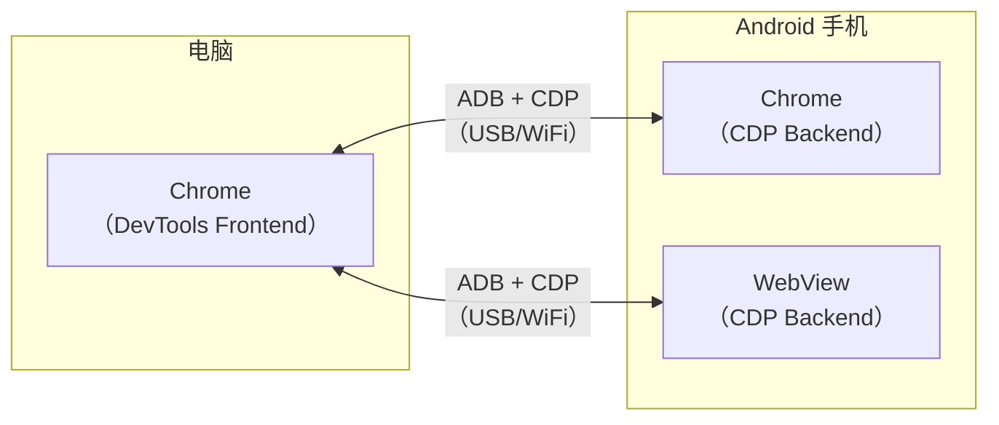
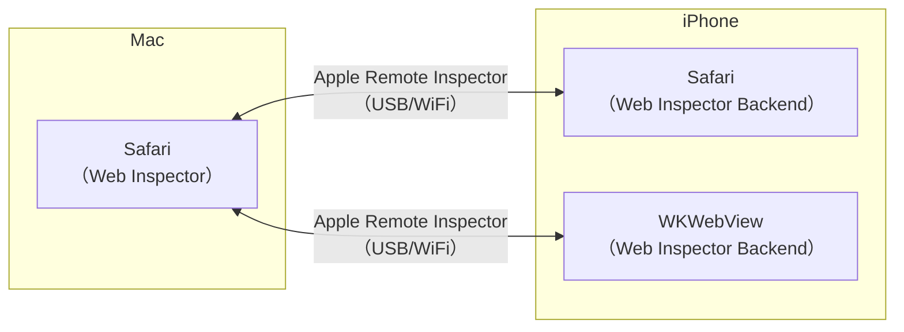

# 移动端网页调试Android和iOS

移动端网页的调试比桌面端复杂，因为代码运行在手机浏览器上，调试工具在电脑上。

本节介绍如何在电脑上调试手机浏览器中的网页。

## Android 网页调试

### 使用 Chrome DevTools 远程调试

**前提条件：**
- Android 手机开启 USB 调试
- 电脑安装 Chrome 浏览器
- USB 数据线连接手机和电脑

**步骤：**

1. 在 Android 手机上开启开发者选项和 USB 调试
2. 用 USB 线连接手机和电脑
3. 在电脑的 Chrome 中访问 `chrome://inspect/#devices`
4. 手机上打开要调试的网页
5. 在电脑的 Chrome 中点击对应的 "inspect"

> **2024-2026 更新**：Chrome 还支持通过 WiFi 进行无线调试，无需 USB 线（首次执行 `adb tcpip 5555` 时需要先连一次 USB）。在手机上通过 `adb tcpip 5555` 和 `adb connect <手机IP>:5555` 连接后，即可在 `chrome://inspect/#devices` 中看到设备。

### 调试 WebView

如果你的 Android 应用内嵌了 WebView，也可以使用同样的方式调试：

1. 在应用代码中启用 WebView 调试：

```java
// Android 代码
if (Build.VERSION.SDK_INT >= Build.VERSION_CODES.KITKAT) {
    WebView.setWebContentsDebuggingEnabled(true);
}
```

2. 在电脑的 `chrome://inspect/#devices` 中找到 WebView 页面，点击 "inspect"

### Android Chrome 远程调试架构



## iOS 网页调试

### 使用 Safari Web Inspector

**前提条件：**
- Mac 电脑
- iPhone/iPad
- USB 数据线

**步骤：**

1. 在 iPhone 上开启 Web Inspector：
   - 设置 → Safari → 高级 → 打开"Web 检查器"
2. 用 USB 线连接 iPhone 和 Mac
3. 在 iPhone 的 Safari 中打开要调试的网页
4. 在 Mac 的 Safari 中：
   - 开发 → [你的 iPhone] → [网页标题]

> **2024-2026 更新**：macOS Sonoma + iOS 17+ 支持**无线调试**（无需 USB 线）。前提是 iPhone 和 Mac 在同一 WiFi 网络下，且 iPhone 已通过 USB 配对过一次。

### iOS Safari 远程调试架构



### 调试 WKWebView

如果 iOS 应用内嵌了 WKWebView，调试方式与 Safari 相同：

1. 确保 `isInspectable` 属性设置为 `true`：

```swift
// iOS 16.4+
if #available(iOS 16.4, *) {
    webView.isInspectable = true
}
```

> **2024-2026 更新**：iOS 16.4+ 要求显式设置 `isInspectable = true` 才能调试 WKWebView。之前的版本默认可调试（Debug 构建）。

## 跨平台调试方案

### 使用 BrowserStack / Sauce Labs

如果没有真机，可以使用云测试平台：

- [BrowserStack](https://www.browserstack.com/)
- [Sauce Labs](https://saucelabs.com/)

这些平台提供了各种型号的手机浏览器，可以直接在网页中调试。

### 使用 Chrome DevTools Device Mode

Chrome DevTools 自带设备模拟模式：

1. 打开 Chrome DevTools
2. 点击左上角的设备切换按钮（或 `Cmd+Shift+M`）
3. 选择设备型号
4. 可以模拟屏幕尺寸、触摸事件、网络条件等

> **注意**：Device Mode 只是模拟，不能完全替代真机调试。某些 iOS/Android 特有的问题只在真机上出现。

### 使用 Playwright 进行移动端自动化调试

> **2024-2026 新增**：Playwright 支持模拟移动设备进行自动化测试和调试：

```javascript
const { chromium, devices } = require('playwright');

const iPhone = devices['iPhone 14 Pro'];

(async () => {
    const browser = await chromium.launch({ headless: false });
    const context = await browser.newContext({
        ...iPhone,
    });
    const page = await context.newPage();
    await page.goto('https://example.com');

    // 在 DevTools 中调试
    await page.pause();
})();
```

## 移动端调试常见问题

| 问题 | 原因 | 解决方案 |
|------|------|---------|
| `chrome://inspect` 看不到设备 | ADB 未连接 | 检查 USB 调试是否开启，重装驱动 |
| inspect 页面白屏 | 网络问题（CDN 资源加载失败） | 翻墙或配置代理 |
| iOS 调试连接断开 | USB 连接不稳定 | 使用 MFi 认证线缆，尝试无线调试 |
| WebView 无法调试 | 未启用调试 | Android: `setWebContentsDebuggingEnabled(true)`；iOS: `isInspectable = true` |
| 触摸事件无法模拟 | 未开启 Device Mode 的触摸模拟 | 在 Device Mode 中启用触摸模拟 |
