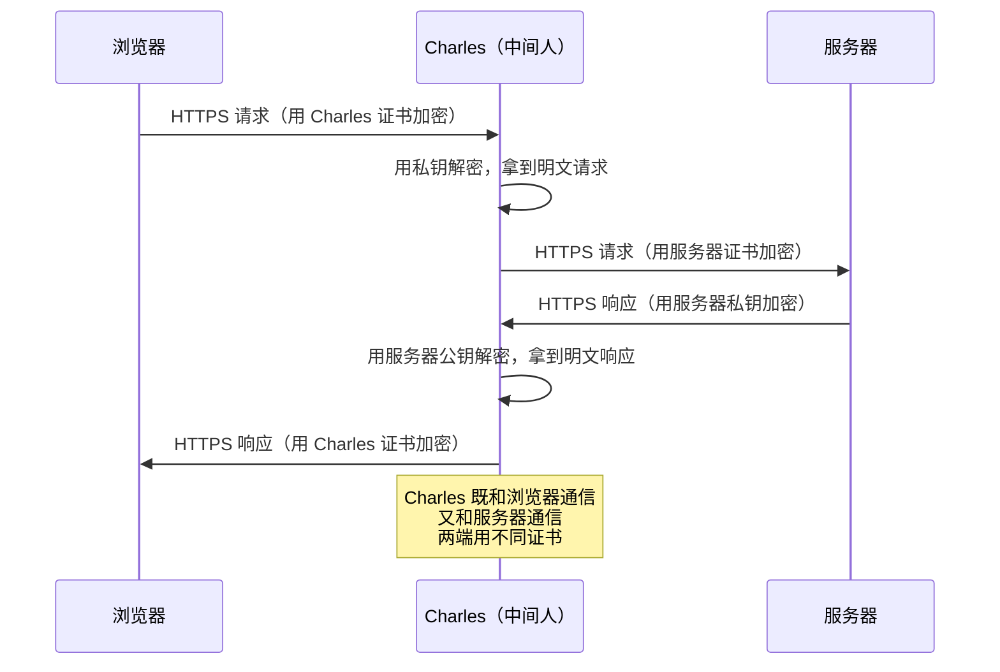
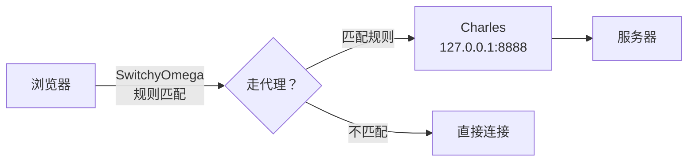
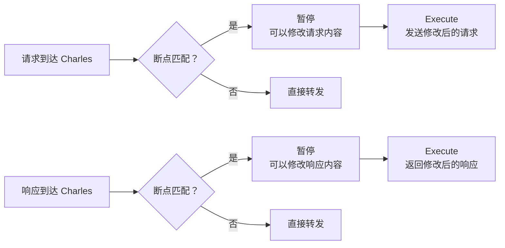
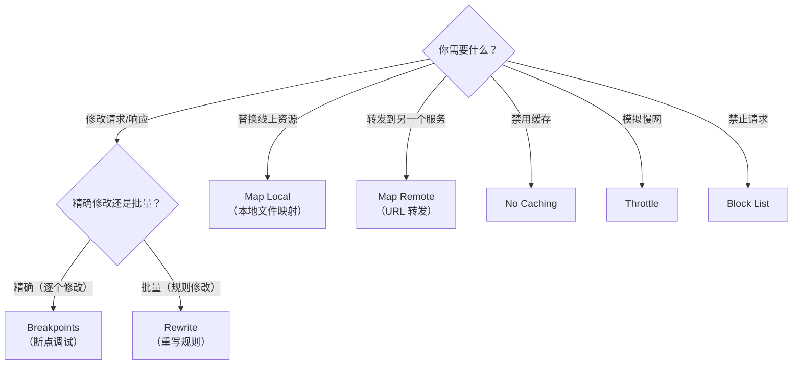

# 用Charles调试网络请求

Charles 是前端常用的代理抓包工具，可以拦截和修改 HTTP/HTTPS 请求，对于调试网络接口、排查请求问题具有重要价值。

> **2024-2026 更新**：除了 Charles，还有以下替代方案：
> - **Proxyman**（macOS 原生，体验更好）
> - **Chrome DevTools Network Override**（无需安装代理工具）
> - **mitmproxy**（命令行，适合自动化）

## Charles 的工作原理

### HTTPS 抓包原理

HTTPS 使用 TLS 加密通信，中间人只能看到加密数据。Charles 通过"中间人代理"实现 HTTPS 抓包：



**关键步骤**：浏览器必须信任 Charles 的根证书，否则 HTTPS 请求会提示不安全。

### 安装 Charles 根证书

1. Help → SSL Proxying → Install Charles Root Certificate
2. 在钥匙串中找到 Charles 证书，设置为"始终信任"

### 开启 SSL Proxying

1. Proxy → SSL Proxying Settings
2. 添加要代理的域名（如 `*.juejin.cn` 或 `*` 代表全部）

## 代理配置方式

### 方式一：系统代理

点击 Proxy → macOS Proxy，Charles 会设为系统代理，所有 HTTP/HTTPS 请求自动经过 Charles。

### 方式二：SwitchyOmega

> **2024-2026 更新**：SwitchyOmega 正在迁移到 Manifest V3。也可以使用 Chrome DevTools 的 Local Overrides 作为替代。

1. 安装 SwitchyOmega Chrome 扩展
2. 配置代理服务器为 Charles（默认 `127.0.0.1:8888`）
3. 选择 Auto Switch 模式，按规则自动切换代理



## 核心功能一览

### 1. Breakpoints（断点调试）

拦截请求/响应，修改后继续发送：

1. 右键请求 → Breakpoints
2. Proxy → Enable Breakpoints
3. 刷新页面，请求被拦截
4. 修改 URL、Header、Body、Cookie
5. 点击 Execute 继续



### 2. Map Local（本地文件映射）

用本地文件替换线上资源，是应用最广泛的功能之一：

1. Tools → Map Local（或右键请求 → Map Local）
2. 配置 URL 到本地文件的映射

**典型场景**：将线上的 JS/CSS 文件映射到本地刚打包的文件，实现线上环境调试本地代码。

### 3. Map Remote（URL 转发）

将请求转发到另一个 URL：

1. Tools → Map Remote（或右键请求 → Map Remote）
2. 如 `https://api.example.com/v1/*` → `https://api-test.example.com/v1/*`

### 4. Rewrite（重写规则）

批量修改请求/响应的各种数据：

1. Tools → Rewrite
2. 支持修改 Header、Host、Path、URL、Query、Response Status、Body

### 5. Throttle（限速模拟）

模拟慢速网络环境：

1. 点击乌龟图标或 Proxy → Start Throttling
2. Throttle Settings 中选择预设（3G/4G）或自定义带宽

### 6. Block List / Allow List

- **Block List**：禁止指定 URL 的请求（断开连接或返回 403）
- **Allow List**：只允许指定 URL 的请求

### 7. DNS Spoofing（DNS 欺骗）

类似修改 hosts 文件，但只对 HTTP/HTTPS 请求生效：

1. Tools → DNS Spoofing
2. 如 `www.test.com` → `127.0.0.1`

### 8. No Caching（禁用缓存）

自动为请求添加 `Cache-Control: no-cache` Header。

### 9. Block Cookies（禁用 Cookie）

移除请求中的 Cookie 和响应中的 Set-Cookie。

### 10. Mirror（镜像）

将响应内容保存到本地文件，配合 Map Local 使用。

### 11. Compose（构造请求）

手动构造 HTTP 请求发送，类似 Postman：

- Tools → Compose New：创建新请求
- 右键请求 → Compose：修改已有请求

### 12. Repeat（重发请求）

- 右键请求 → Repeat：重发一次
- Tools → Advanced Repeat：设置重发次数、并发数、间隔

### 13. External Proxy（外部代理）

Charles 抓包后再转发给其他代理（如科学上网代理），解决同时需要抓包和代理访问的问题。

### 14. Web Interface（Web 控制）

通过浏览器远程控制 Charles 的功能开关。

### 15. Highlight Rules（高亮规则）

根据条件为请求设置颜色标记，如所有含 `Set-Cookie` 的请求标为黄色。

## 功能选择指南



## 现代替代方案

### Chrome DevTools Local Overrides

> **2024-2026 新增**：Chrome DevTools 的 Network 面板支持 Local Overrides，可以替代 Charles 的 Map Local 功能：

1. Sources → Overrides → Select folder for overrides
2. Network 中右键请求 → Override content
3. 修改响应内容后保存

**优点**：不需要安装代理工具，直接在浏览器中修改响应。
**缺点**：只支持响应修改，不支持请求修改；不支持 HTTPS 中间人。

### Proxyman

> macOS 上的替代方案，原生体验更好，UI 更现代，支持 iOS 模拟器调试。

### mitmproxy

> 命令行代理工具，适合自动化场景：

```bash
# 安装
pip install mitmproxy

# 启动代理
mitmproxy --listen-port 8080

# 用 Python 脚本自动修改请求
mitmproxy -s modify_requests.py
```

## 移动端 HTTPS 调试

移动端 HTTPS 调试原理与 PC 端相同，需要在手机上安装 Charles 证书：

1. Help → SSL Proxying → Install Charles Root Certificate on a Mobile Device
2. 手机配置代理服务器为 Charles 的 IP 和端口
3. 手机浏览器访问 `chls.pro/ssl` 下载证书
4. 安装并信任证书

> **2024-2026 注意**：Android 7+ 默认不信任用户安装的证书，只信任系统证书。需要 Root 或使用调试包才能抓 HTTPS。
