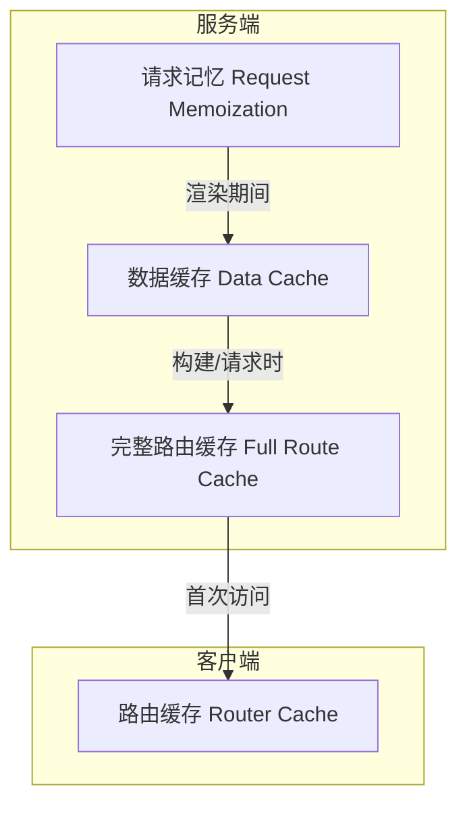

# Caching 缓存机制

> Next.js 提供四层缓存机制以优化应用性能和降低开销。理解每层缓存的作用域、持续时间和失效方式，是解决"数据没有更新"问题的关键。

## 缓存架构概览



| 机制 | 缓存内容 | 存储位置 | 目的 | 持续时间 |
|------|----------|----------|------|----------|
| 请求记忆（Request Memoization） | 函数返回值 | 服务端 | 在 React 组件树中复用数据 | 每个请求的生命周期 |
| 数据缓存（Data Cache） | 数据 | 服务端 | 跨用户请求和部署复用数据 | 持久（可重新验证） |
| 完整路由缓存（Full Route Cache） | HTML 和 RSC Payload | 服务端 | 降低渲染成本、提高性能 | 持久（可重新验证） |
| 路由缓存（Router Cache） | RSC Payload | 客户端 | 减少导航时的服务端请求 | 用户会话或基于时间 |

## 请求记忆（Request Memoization）

### 工作原理

React 扩展了 fetch API，当相同的 URL 和参数被多次调用时，自动缓存请求结果。在组件树中多个位置请求同一数据，实际只执行一次网络请求。

```javascript
// app/page.js
async function getItem() {
  // 自动缓存结果
  const res = await fetch('https://.../item/1')
  return res.json()
}
 
// 函数调用两次，但只会执行一次请求
const item = await getItem() // cache MISS
const item2 = await getItem() // cache HIT
```

底层原理即函数记忆（Memoization）：

```javascript
function memoize(f) {
  var cache = {};
  return function(){
    var key = arguments.length + Array.prototype.join.call(arguments, ",");
    if (key in cache) {
      return cache[key]
    }
    else return cache[key] = f.apply(this, arguments)
  }
}
```

### 关键特性

| 特性 | 说明 |
|------|------|
| 归属 | React 特性，非 Next.js 特有 |
| 适用范围 | 仅 `GET` 方法的 `fetch` 请求 |
| 作用域 | 仅 React 组件树内（`generateMetadata`、布局、页面、服务端组件） |
| 不适用 | 路由处理程序（Route Handler）中不触发 |
| 持续时间 | 服务端请求生命周期，组件树渲染完毕即释放 |
| 重新验证 | 无需，渲染期间使用 |

### 退出方式

通过 AbortController 退出请求记忆（不建议）：

```javascript
const { signal } = new AbortController()
fetch(url, { signal })
```

### React Cache 函数

对于非 fetch 请求，使用 React 的 `cache` 函数实现记忆：

```javascript
// utils/get-item.ts
import { cache } from 'react'
import db from '@/lib/db'
 
export const getItem = cache(async (id: string) => {
  const item = await db.item.findUnique({ id })
  return item
})
```

## 数据缓存（Data Cache）

### 工作原理

Next.js 自有数据缓存方案，可跨服务端请求和构建部署存储数据。通过扩展 fetch API，每个请求可独立配置缓存策略。

```javascript
// 配置缓存行为
fetch(`https://...`, { cache: 'force-cache' | 'no-store' })
fetch(`https://...`, { next: { revalidate: 3600 } })
```

### 持续时间

数据缓存在传入请求和部署中都保持不变，除非重新验证或主动退出。

### 重新验证策略

#### 基于时间的重新验证

适用于不经常更改且新鲜度要求不高的数据：

```javascript
// 每小时重新验证
fetch('https://...', { next: { revalidate: 3600 } })

// 路由段级别配置
export const revalidate = 3600
```

> **注意**：并非到期后自动更新，而是到期后的第一次请求仍返回缓存值，Next.js 在后台更新缓存，第二次请求才使用新数据。

#### 按需重新验证

根据事件手动触发，适用于需要尽快展示最新数据的场景：

```javascript
// 基于路径
import { revalidatePath } from 'next/cache'
revalidatePath('/')

// 基于标签
fetch(`https://...`, { next: { tags: ['a', 'b', 'c'] } })
revalidateTag('a')
```

按需重新验证会从缓存中删除相应条目，下次请求等同于首次调用。

### 退出方式

```javascript
// 方式一：fetch 级别
fetch(`https://...`, { cache: 'no-store' })

// 方式二：路由段级别（影响该路由所有请求）
export const dynamic = 'force-dynamic'
```

## 完整路由缓存（Full Route Cache）

### 工作原理

Next.js 在构建时自动渲染和缓存路由产物（RSC Payload + HTML），访问时直接使用缓存而无需重新渲染。

路由渲染产物：
1. **RSC Payload**：服务端组件渲染结果 + 客户端组件占位引用 + 传递数据
2. **HTML**：基于 RSC Payload 和客户端组件代码在服务端渲染

```javascript
// RSC Payload 示例
["$","div",null,{"children":["Don't give up.", ["$","$L1",null,{}]]}]
1:I{"id":123,"chunks":["chunk/[hash].js"],"name":"ClientComponent","async":false}
```

### 缓存规则

- **静态路由**：构建时自动缓存
- **动态路由**：不缓存，每次请求时渲染

### 失效方式

| 方式 | 说明 |
|------|------|
| 重新验证数据 | 数据缓存失效会连带完整路由缓存失效 |
| 重新部署 | 完整路由缓存被清除（数据缓存可跨部署） |

### 退出方式

将路由改为动态渲染即可退出：

```javascript
// 使用动态函数（cookies, headers, searchParams）
// 或路由段配置
export const dynamic = 'force-dynamic'
export const revalidate = 0
```

## 路由缓存（Router Cache）

### 工作原理

客户端内存缓存，在用户会话期间按路由段存储 RSC Payload。配合 `<Link>` 组件的预获取机制，实现即时导航。

核心行为：
- 首次访问路由时缓存 RSC Payload
- 基于视口内 `<Link>` 预获取可能导航的路由
- 导航时直接使用缓存，不发送网络请求
- 保留 React 状态和浏览器状态

### 持续时间

| 渲染方式 | 自动失效期 |
|----------|-----------|
| 静态渲染 | 5 分钟 |
| 动态渲染 | 30 秒 |

页面刷新时缓存被清除。通过 `prefetch={true}` 或 `router.prefetch` 可延长至 5 分钟。

### 失效方式

```javascript
// 在 Server Action 中
revalidatePath('/path')
revalidateTag('tag')
cookies.set('name', 'value')  // 自动使路由缓存失效
cookies.delete('name')

// 客户端
router.refresh()  // 使当前路由缓存失效并重新获取
```

### 退出方式

**无法完全退出路由缓存**。`<Link prefetch={false}>` 仅退出预获取，访问过的路由仍会缓存 30s。

### 路由缓存问题解决方案

当需要每次导航都获取最新数据时：

```javascript
// 方案一：使用原生 <a> 标签（会导致页面刷新）
<a href="/about">About</a>

// 方案二：router.refresh（需客户端组件）
'use client'
import { useRouter } from 'next/navigation'

const router = useRouter()
router.push('/about')
router.refresh()

// 方案三：监听路由变化自动 refresh
'use client'
import { useEffect } from 'react'
import { usePathname, useSearchParams, useRouter } from 'next/navigation'

export function NavigationEvents() {
  const pathname = usePathname()
  const searchParams = useSearchParams()
  const router = useRouter()
  
  useEffect(() => {
    router.refresh()
  }, [pathname, searchParams])
 
  return null
}
```

## 请求记忆 vs 数据缓存

| 维度 | 请求记忆 | 数据缓存 |
|------|----------|----------|
| 归属 | React | Next.js |
| 持续时间 | 组件树渲染期间 | 跨请求、跨部署 |
| 目的 | 避免组件树内重复请求 | 优化应用整体性能 |
| 失效 | 渲染完毕自动释放 | 需重新验证或主动退出 |

实际开发中两者同时存在、共同作用。

## API 与缓存关系速查表

| API | 路由缓存 | 完整路由缓存 | 数据缓存 | 请求记忆 |
|-----|----------|-------------|----------|----------|
| `<Link prefetch>` | Cache | | | |
| `router.prefetch` | Cache | | | |
| `router.refresh` | Revalidate | | | |
| `fetch` | | | Cache | Cache |
| `fetch options.cache` | | | Cache/Opt out | |
| `fetch options.next.revalidate` | | Revalidate | Revalidate | |
| `fetch options.next.tags` | | Cache | Cache | |
| `revalidateTag` | Revalidate | Revalidate | Revalidate | |
| `revalidatePath` | Revalidate | Revalidate | Revalidate | |
| `const revalidate` | | Revalidate/Opt out | Revalidate/Opt out | |
| `const dynamic` | | Cache/Opt out | Cache/Opt out | |
| `cookies` | Revalidate | Opt out | | |
| `headers, searchParams` | | Opt out | | |
| `generateStaticParams` | | Cache | | |
| `React.cache` | | | | Cache |

> Cache = 触发缓存，Revalidate = 触发重新验证，Opt out = 触发退出缓存

## 参考链接

- [Building Your Application: Caching | Next.js](https://nextjs.org/docs/app/building-your-application/caching)
