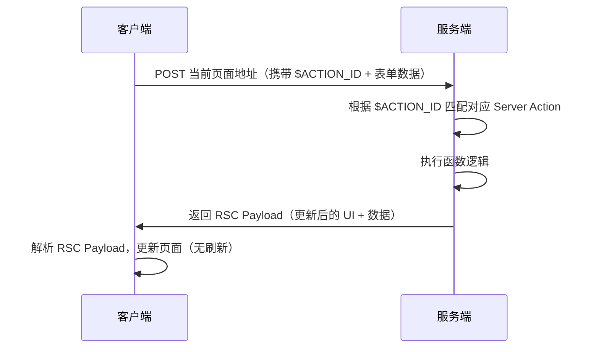

# Server Actions

> Server Actions 是在服务端执行的异步函数，可在服务端和客户端组件中使用，用于处理数据提交和更改（Data Mutations）。自 Next.js v14 起进入稳定阶段，是 App Router 全栈开发的核心数据操作方式。

## 基本用法

### 定义方式

使用 React 的 `"use server"` 指令，按位置分为两种级别：

| 级别 | 位置 | 适用场景 |
|------|------|----------|
| 函数级别 | async 函数顶部 | 服务端组件内联定义 |
| 模块级别 | 文件顶部 | 独立 actions 文件，客户端组件引用 |

```javascript
// 函数级别 —— 服务端组件中使用
export default function Page() {
  async function create() {
    'use server'
    // ...
  }
  return <form action={create}>...</form>
}
```

```javascript
// 模块级别 —— app/actions.js
'use server'

export async function create() {
  // ...
}
```

### 在客户端组件中使用

仅支持模块级别，通过导入使用：

```javascript
import { create } from '@/app/actions'
 
export function Button() {
  return <form action={create}>...</form>
}
```

也可作为 props 传递：

```javascript
// 服务端组件
<ClientComponent updateItem={updateItem} />

// 客户端组件
'use client'
export default function ClientComponent({ updateItem }) {
  return <form action={updateItem}>{/* ... */}</form>
}
```

### 调用方式

Server Actions 不仅限于 `<form>`，还支持：
- 事件处理程序（onClick 等）
- useEffect
- 第三方库回调
- 其他表单元素（`<button>` 等）

```javascript
'use client'
import { createToDoDirectly } from './actions';

export default function Button({ children }) {
  return <button onClick={async () => {
    const data = await createToDoDirectly('运动')
    alert(JSON.stringify(data))
  }}>{children}</button>
}
```

## 工作原理



核心要点：
1. 底层使用 **POST 请求**，请求当前页面地址
2. 通过隐藏的 `<input type="hidden" value="$ACTION_ID_xxxxxxxx">` 区分不同 Action
3. 与 Next.js 缓存和重新验证架构集成，一次性返回更新的 UI 和数据

## 优势

| 优势 | 说明 |
|------|------|
| 代码简洁 | 无需手动创建 API 接口，函数可复用 |
| 渐进增强 | 禁用 JavaScript 后表单仍可正常提交 |
| 无刷新更新 | 启用 JS 时提交表单不刷新页面 |
| 类型安全 | 参数和返回值必须可序列化 |

## 表单处理 API

### useFormStatus

返回表单提交状态，必须用在 `<form>` 下的**子组件**内部：

```javascript
'use client'
import { useFormStatus } from 'react-dom'
 
export function SubmitButton() {
  const { pending } = useFormStatus()
  return (
    <button type="submit" aria-disabled={pending}>
      {pending ? 'Adding' : 'Add'}
    </button>
  )
}
```

> **注意**：不能在与 `<form>` 同一组件中调用 useFormStatus，必须在独立子组件中使用。

### useFormState

根据表单 action 结果更新状态。Server Action 函数签名变为 `(prevState, formData)`：

```javascript
'use client'
import { useFormState, useFormStatus } from 'react-dom'
import { createToDo } from './actions';

const initialState = { message: '' }
 
function SubmitButton() {
  const { pending } = useFormStatus()
  return (
    <button type="submit" aria-disabled={pending}>
      {pending ? 'Adding' : 'Add'}
    </button>
  )
}

export default function AddToDoForm() {
  const [state, formAction] = useFormState(createToDo, initialState)
  return (
    <form action={formAction}>
      <input type="text" name="todo" />
      <SubmitButton />
      <p aria-live="polite" className="sr-only">
        {state?.message}
      </p>
    </form>
  )
}
```

对应 Server Action：

```javascript
'use server'
import { revalidatePath } from "next/cache";

export async function createToDo(prevState, formData) {
  const todo = formData.get('todo')
  // 数据操作...
  revalidatePath("/");
  return { message: `add ${todo} success!` }
}
```

## 工程实践要点

### 数据获取

```javascript
// form action 基本形式：第一个参数为 formData
async function createInvoice(formData) {
  'use server'
  const customerId = formData.get('customerId')
  // ...
}

// useFormState 形式：(prevState, formData)
// 直接调用：自定义参数
```

### 表单验证

基础验证使用 HTML 原生属性（`required`、`type="email"`），高阶验证使用 Zod：

```javascript
'use server'
import { z } from 'zod'
 
const schema = z.object({
  email: z.string({ invalid_type_error: 'Invalid Email' }),
})
 
export default async function createUser(formData) {
  const validatedFields = schema.safeParse({
    email: formData.get('email'),
  })
 
  if (!validatedFields.success) {
    return { errors: validatedFields.error.flatten().fieldErrors }
  }
  // 数据操作...
}
```

### 重新验证数据

Server Action 修改数据后**必须**重新验证缓存：

```javascript
'use server'
import { revalidatePath, revalidateTag } from 'next/cache'
 
export async function createPost() {
  try {
    // 数据操作...
  } catch (error) {
    // 错误处理...
  }
  revalidatePath('/posts')   // 基于路径
  revalidateTag('posts')     // 基于标签
}
```

### 错误处理

**方式一：返回错误信息**（配合 useFormState）

```javascript
'use server'
export async function createTodo(prevState, formData) {
  try {
    await createItem(formData.get('todo'))
    revalidatePath('/')
    return { message: 'Success' }
  } catch (e) {
    return { message: 'Failed to create' }
  }
}
```

**方式二：抛出错误**（由最近的 error.js 捕获）

```javascript
async function serverActionWithError() {
  'use server';   
  throw new Error('Error in Server Action');
}
```

## 乐观更新

使用 React 的 `useOptimistic` hook，先更新 UI 再发送请求：

```javascript
'use client'
import { useOptimistic } from 'react'
import { useFormState } from 'react-dom'
import { createToDo } from './actions';

export default function Form({ todos }) {
  const [state, sendFormAction] = useFormState(createToDo, { message: '' })
  const [optimisticToDos, addOptimisticTodo] = useOptimistic(
    todos.map((i) => ({ text: i })),
    (state, newTodo) => [...state, { text: newTodo, sending: true }]
  );

  async function formAction(formData) {
    addOptimisticTodo(formData.get("todo"));
    await sendFormAction(formData);
  }

  return (
    <>
      <form action={formAction}>
        <input type="text" name="todo" />
        <button type="submit">Add</button>
      </form>
      <ul>
        {optimisticToDos.map(({ text, sending }, i) => (
          <li key={i}>{text}{sending && <small> (Sending...)</small>}</li>
        ))}
      </ul>
    </>
  )
}
```

## 常见问题

### 处理 Cookies

```javascript
'use server'
import { cookies } from 'next/headers'
 
export async function exampleAction() {
  const value = (await cookies()).get('name')?.value
  ;(await cookies()).set('name', 'Delba')
  ;(await cookies()).delete('name')
}
```

### 重定向

```javascript
'use server'
import { redirect } from 'next/navigation'
import { revalidateTag } from 'next/cache'
 
export async function createPost(id) {
  try {
    // 数据操作...
  } catch (error) {
    // 错误处理...
  }
  revalidateTag('posts')
  redirect(`/post/${id}`)
}
```

## 注意事项

1. **参数和返回值必须可序列化**（JSON.stringify 不出错）
2. Server Actions 继承所在页面/布局的运行时和路由段配置项（如 maxDuration）
3. 使用 useFormState 时函数签名为 `(prevState, formData)`
4. 修改数据后必须调用 revalidatePath 或 revalidateTag

## 参考链接

- [Data Fetching: Forms and Mutations | Next.js](https://nextjs.org/docs/app/building-your-application/data-fetching/forms-and-mutations)
- [Functions: Server Actions | Next.js](https://nextjs.org/docs/app/api-reference/functions/server-actions)
- [Data Fetching: Fetching, Caching, and Revalidating](https://nextjs.org/docs/app/building-your-application/data-fetching/fetching-caching-and-revalidating)
