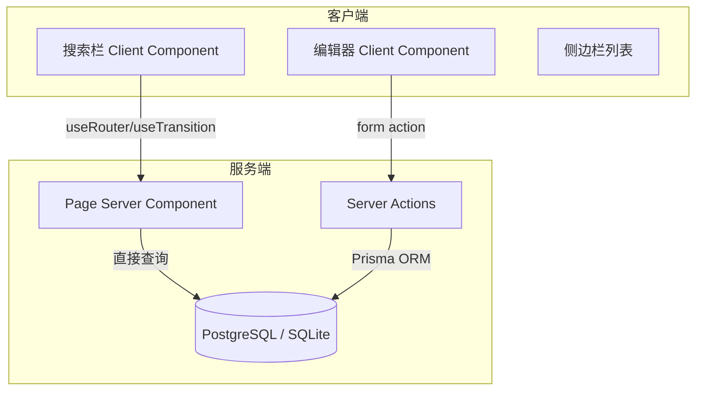
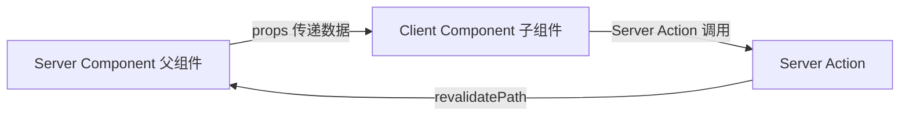

# React Notes 全栈项目实战

> React Notes 是一个基于 Next.js App Router 的全栈笔记应用，完整覆盖 React Server Components 的核心用法：服务端数据获取、Server Actions 表单处理、流式渲染、客户端/服务端组件协作。项目源自 React 官方的 RSC Demo，是理解 App Router 最佳实践的典型范例。

## 项目概述

### 功能需求

| 功能 | 说明 | 核心技术 |
|------|------|----------|
| 笔记 CRUD | 创建、读取、更新、删除笔记 | Server Actions + Prisma |
| Markdown 渲染 | 笔记内容支持 Markdown 格式 | react-markdown |
| 实时搜索 | 按标题/内容搜索笔记 | useTransition + Suspense |
| 国际化 | 中英文切换 | next-intl |
| 文件上传 | 笔记支持附件上传 | FormData + 本地/S3 存储 |
| 身份认证 | 登录/注册保护路由 | NextAuth.js |
| 流式渲染 | 页面渐进式加载 | Suspense + Streaming |

### 技术架构



### 目录结构

```text
react-notes/
├── app/
│   ├── layout.tsx          # 根布局
│   ├── page.tsx            # 首页（重定向到 /notes）
│   └── notes/
│       ├── layout.tsx      # 笔记布局（侧边栏 + 内容区）
│       ├── page.tsx        # 笔记列表首页
│       ├── [noteId]/
│       │   └── page.tsx    # 笔记详情
│       └── edit/
│           └── [noteId]/
│               └── page.tsx # 编辑页面
├── components/
│   ├── SidebarNoteList.tsx      # 笔记列表（Server）
│   ├── SidebarNoteItem.tsx      # 列表项（Server）
│   ├── SidebarNoteItemContent.tsx # 列表项交互（Client）
│   ├── NoteEditor.tsx           # 编辑器（Client）
│   ├── NotePreview.tsx          # Markdown 预览（Server）
│   └── Search.tsx               # 搜索框（Client）
├── lib/
│   └── prisma.ts           # Prisma 客户端单例
├── prisma/
│   └── schema.prisma       # 数据模型
└── public/
    └── uploads/            # 上传文件存储
```

## 数据层设计

### Prisma Schema

```prisma
// prisma/schema.prisma
generator client {
  provider = "prisma-client-js"
}

datasource db {
  provider = "postgresql" // 开发环境可用 "sqlite"
  url      = env("DATABASE_URL")
}

model Note {
  id        String   @id @default(cuid())
  title     String
  content   String   @default("")
  createdAt DateTime @default(now())
  updatedAt DateTime @updatedAt
  files     File[]
}

model File {
  id       String @id @default(cuid())
  name     String
  url      String
  noteId   String
  note     Note   @relation(fields: [noteId], references: [id], onDelete: Cascade)
}
```

### Prisma 客户端单例

```typescript
// lib/prisma.ts
import { PrismaClient } from '@prisma/client';

const globalForPrisma = globalThis as unknown as { prisma: PrismaClient };

export const prisma = globalForPrisma.prisma || new PrismaClient();

if (process.env.NODE_ENV !== 'production') {
  globalForPrisma.prisma = prisma;
}
```

## 核心实现

### 服务端数据获取（Server Component）

App Router 中 Server Component 可直接访问数据库，无需 API 层：

```tsx
// app/notes/layout.tsx
import { prisma } from '@/lib/prisma';
import SidebarNoteList from '@/components/SidebarNoteList';
import { Suspense } from 'react';

export default async function NotesLayout({
  children,
}: {
  children: React.ReactNode;
}) {
  const notes = await prisma.note.findMany({
    orderBy: { updatedAt: 'desc' },
  });

  return (
    <div className="notes-container">
      <aside className="sidebar">
        <Suspense fallback={<div>Loading notes...</div>}>
          <SidebarNoteList notes={notes} />
        </Suspense>
      </aside>
      <main className="note-content">{children}</main>
    </div>
  );
}
```

### Server Actions 实现 CRUD

```tsx
// app/actions.ts
'use server';

import { prisma } from '@/lib/prisma';
import { revalidatePath } from 'next/cache';
import { redirect } from 'next/navigation';

export async function createNote(formData: FormData) {
  const title = formData.get('title') as string;
  const content = formData.get('content') as string;

  const note = await prisma.note.create({
    data: { title, content },
  });

  revalidatePath('/notes');
  redirect(`/notes/${note.id}`);
}

export async function updateNote(noteId: string, formData: FormData) {
  const title = formData.get('title') as string;
  const content = formData.get('content') as string;

  await prisma.note.update({
    where: { id: noteId },
    data: { title, content },
  });

  revalidatePath('/notes');
  revalidatePath(`/notes/${noteId}`);
  redirect(`/notes/${noteId}`);
}

export async function deleteNote(noteId: string) {
  await prisma.note.delete({ where: { id: noteId } });
  revalidatePath('/notes');
  redirect('/notes');
}
```

### 客户端组件：搜索与交互

```tsx
// components/Search.tsx
'use client';

import { useTransition } from 'react';
import { useRouter } from 'next/navigation';

export default function Search() {
  const [isPending, startTransition] = useTransition();
  const router = useRouter();

  function handleSearch(term: string) {
    startTransition(() => {
      router.push(`/notes?search=${encodeURIComponent(term)}`);
    });
  }

  return (
    <input
      type="search"
      placeholder="搜索笔记..."
      disabled={isPending}
      onChange={(e) => handleSearch(e.target.value)}
      className="search-input"
    />
  );
}
```

### 客户端/服务端组件协作



关键规则：
- Server Component 可以 import Client Component
- Client Component **不能** import Server Component（但可通过 `children` 传入）
- Server Component 不能使用 useState/useEffect 等客户端 Hook

```tsx
// SidebarNoteItem.tsx (Server Component)
import SidebarNoteItemContent from './SidebarNoteItemContent';

export default function SidebarNoteItem({ noteId, note }) {
  return (
    <SidebarNoteItemContent
      id={noteId}
      title={note.title}
      expandedChildren={
        <p className="sidebar-note-excerpt">
          {note.content.substring(0, 20)}
        </p>
      }
    />
  );
}

// SidebarNoteItemContent.tsx (Client Component)
'use client';

import { useState } from 'react';

export default function SidebarNoteItemContent({ id, title, expandedChildren }) {
  const [expanded, setExpanded] = useState(false);

  return (
    <div className="sidebar-note-item" onClick={() => setExpanded(!expanded)}>
      <strong>{title}</strong>
      {expanded && expandedChildren}
    </div>
  );
}
```

## 文件上传

```tsx
// components/FileUpload.tsx
'use client';

import fs from 'fs/promises';
import { prisma } from '@/lib/prisma';
import { revalidatePath } from 'next/cache';

export default function FileUpload({ noteId }: { noteId: string }) {
  async function handleUpload(formData: FormData) {
    'use server';
    const file = formData.get('file') as File;
    const bytes = await file.arrayBuffer();
    const buffer = Buffer.from(bytes);

    // 存储到 public/uploads
    const path = `public/uploads/${Date.now()}-${file.name}`;
    await fs.writeFile(path, buffer);

    // 记录到数据库
    await prisma.file.create({
      data: {
        name: file.name,
        url: `/uploads/${Date.now()}-${file.name}`,
        noteId,
      },
    });

    revalidatePath(`/notes/${noteId}`);
  }

  return (
    <form action={handleUpload}>
      <input type="file" name="file" />
      <button type="submit">上传</button>
    </form>
  );
}
```

## 国际化（i18n）

使用 `next-intl` 实现多语言：

```tsx
// i18n.ts
import { getRequestConfig } from 'next-intl/server';

export default getRequestConfig(async ({ locale }) => ({
  messages: (await import(`./messages/${locale}.json`)).default,
}));
```

```json
// messages/zh.json
{
  "notes": {
    "title": "React Notes",
    "new": "新建笔记",
    "search": "搜索笔记...",
    "empty": "暂无笔记",
    "delete_confirm": "确定删除这篇笔记吗？"
  }
}
```

## 身份认证

使用 NextAuth.js 保护路由：

```tsx
// middleware.ts
export { default } from 'next-auth/middleware';

export const config = {
  matcher: ['/notes/:path*'],
};
```

## 部署方案

| 方案 | 适用场景 | 关键配置 |
|------|----------|----------|
| Vercel | 最简部署、自动 CI/CD | `vercel deploy` |
| Docker | 自有服务器、容器化 | 多阶段构建 |
| Node.js 直部署 | VPS、传统服务器 | `next build && next start` |

### Docker 部署

```dockerfile
FROM node:20-alpine AS builder
WORKDIR /app
COPY package*.json ./
RUN npm ci
COPY . .
RUN npx prisma generate
RUN npm run build

FROM node:20-alpine AS runner
WORKDIR /app
COPY --from=builder /app/.next ./.next
COPY --from=builder /app/node_modules ./node_modules
COPY --from=builder /app/package.json ./
COPY --from=builder /app/prisma ./prisma
EXPOSE 3000
CMD ["npm", "start"]
```

## 关键设计决策

| 决策点 | 选择 | 理由 |
|--------|------|------|
| 数据获取 | Server Component 直接查询 | 减少 API 层，降低延迟 |
| 表单处理 | Server Actions | 无需手写 API 路由，类型安全 |
| 缓存失效 | revalidatePath | 精确控制，避免全局失效 |
| 搜索实现 | useTransition + URL 参数 | 可分享、可后退、渐进增强 |
| 组件划分 | 默认 Server，交互时才 Client | 最小化客户端 JS 体积 |
| 数据库 | Prisma ORM | 类型安全、迁移管理、多数据库支持 |

## 参考资源

- [React Server Components Demo](https://github.com/reactjs/server-components-demo)
- [Next.js App Router 文档](https://nextjs.org/docs/app)
- [Prisma 官方文档](https://www.prisma.io/docs)
- [NextAuth.js 文档](https://next-auth.js.org/)
