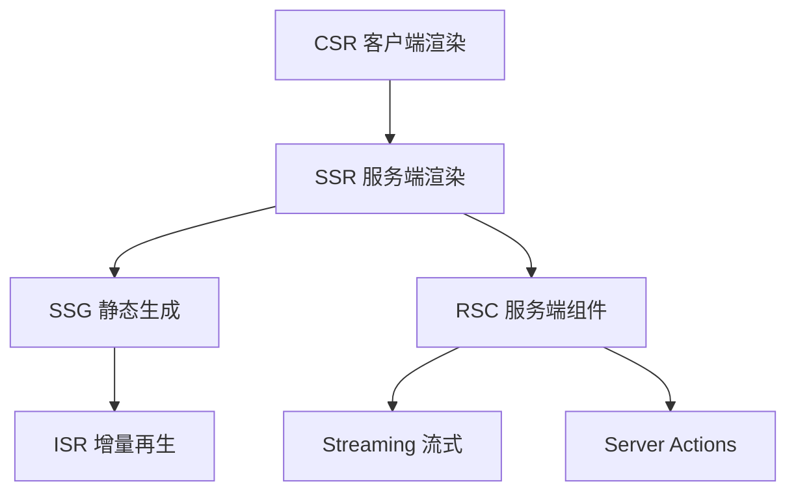
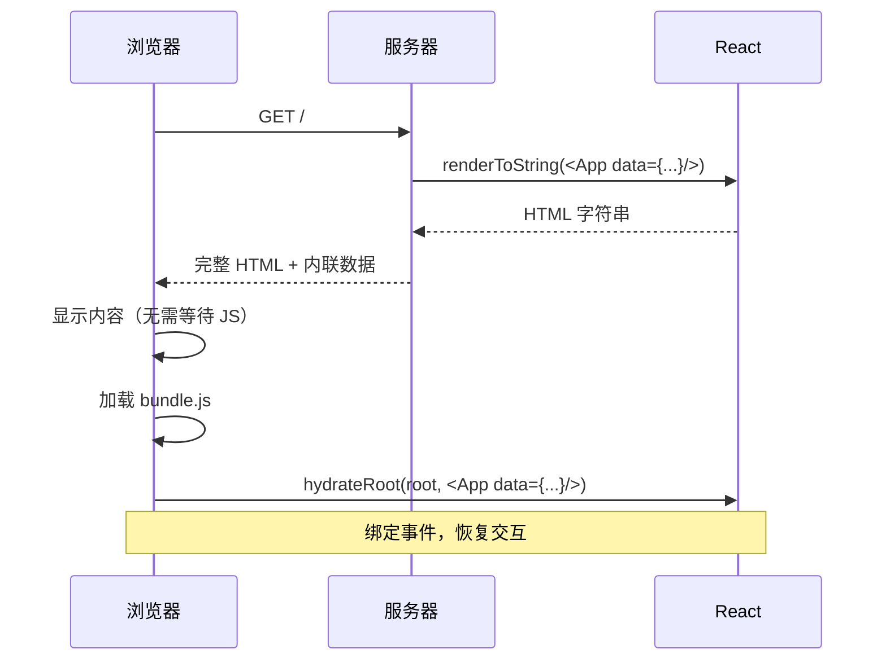
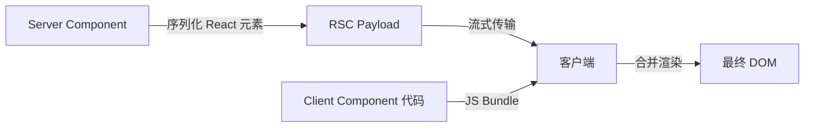
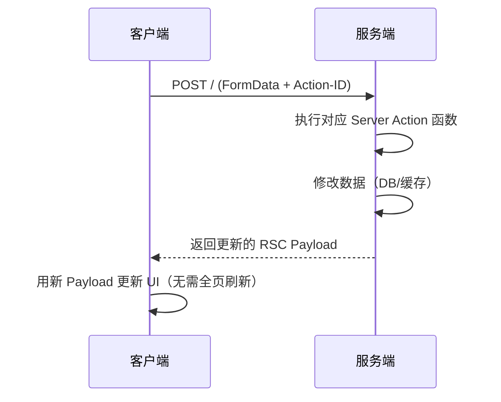

# 手写 React SSR/SSG/RSC 原理

> 通过从零实现 Mini 版本的 SSR、SSG、ISR、RSC、Streaming 和 Server Actions，深入理解 Next.js App Router 底层渲染机制。每个实现都从最简单的 CSR 出发，逐步叠加服务端能力。

## 渲染模式全景



| 模式 | 渲染时机 | 适用场景 | Next.js 对应 |
|------|----------|----------|-------------|
| CSR | 浏览器运行时 | 后台管理、交互密集 | `'use client'` 页面 |
| SSR | 每次请求时 | 个性化内容、实时数据 | 动态 Server Component |
| SSG | 构建时 | 博客、文档、营销页 | 静态导出 |
| ISR | 按需再生成 | 电商列表、新闻 | `revalidate` |
| RSC | 服务端组件级 | 数据获取、减少 JS | Server Component |
| Streaming | 分块发送 | 大页面渐进加载 | `<Suspense>` |

## 手写 SSR

### 从 CSR 开始

最基础的客户端渲染：

```html
<!-- index.html -->
<div id="root"></div>
<script src="/bundle.js"></script>
```

```jsx
// app.jsx
import React from 'react';
import { createRoot } from 'react-dom/client';

function App() {
  return <h1>Hello CSR</h1>;
}

createRoot(document.getElementById('root')).render(<App />);
```

问题：HTML 为空壳，SEO 不友好，首屏白屏时间长。

### SSR 核心实现

SSR 的本质：**在服务端将 React 组件渲染为 HTML 字符串，发送给浏览器，再由客户端 hydrate 恢复交互**。



### 服务端代码

```jsx
// server.js
import express from 'express';
import React from 'react';
import { renderToString } from 'react-dom/server';
import App from './App.jsx';

const app = express();

app.get('/', async (req, res) => {
  // 1. 获取数据
  const data = await fetchData();

  // 2. 服务端渲染为 HTML
  const html = renderToString(<App data={data} />);

  // 3. 返回完整 HTML（含内联数据供 hydrate 使用）
  res.send(`
    <!DOCTYPE html>
    <html>
      <head><title>Mini SSR</title></head>
      <body>
        <div id="root">${html}</div>
        <script>window.__DATA__ = ${JSON.stringify(data)}</script>
        <script src="/bundle.js"></script>
      </body>
    </html>
  `);
});

app.listen(3000);
```

### 客户端 Hydrate

```jsx
// client.jsx
import React from 'react';
import { hydrateRoot } from 'react-dom/client';
import App from './App.jsx';

// 从服务端内联的数据中恢复
const data = window.__DATA__;
hydrateRoot(document.getElementById('root'), <App data={data} />);
```

### 关键要点

| 概念 | 说明 |
|------|------|
| `renderToString` | 将组件树序列化为 HTML 字符串 |
| `hydrateRoot` | 复用已有 DOM，仅绑定事件（非重新渲染） |
| 数据注水 | 服务端数据通过 `window.__DATA__` 传递给客户端 |
| 同构组件 | 同一组件在服务端和客户端都能渲染 |

## 手写 SSG 与 ISR

### SSG：构建时生成

SSG 在 `build` 阶段预渲染所有页面为静态 HTML：

```jsx
// build.js
import { renderToString } from 'react-dom/server';
import { writeFileSync, mkdirSync } from 'fs';
import App from './App.jsx';

const pages = ['/', '/about', '/blog/hello'];

for (const page of pages) {
  const data = await fetchDataForPage(page);
  const html = renderToString(<App data={data} page={page} />);

  const outputDir = `dist${page === '/' ? '/index' : page}`;
  mkdirSync(outputDir, { recursive: true });
  writeFileSync(`${outputDir}.html`, wrapHTML(html, data));
}
```

### ISR：按需再生成

ISR 在 SSG 基础上增加过期重新生成机制：

```javascript
// server.js (ISR 逻辑)
const cache = new Map(); // { path: { html, generatedAt } }
const REVALIDATE_SECONDS = 60;

app.get('*', async (req, res) => {
  const cached = cache.get(req.path);
  const isStale = !cached ||
    Date.now() - cached.generatedAt > REVALIDATE_SECONDS * 1000;

  if (isStale) {
    // 后台重新生成（不阻塞当前请求）
    regenerate(req.path).then((html) => {
      cache.set(req.path, { html, generatedAt: Date.now() });
    });
  }

  // 返回缓存（即使过期也先返回旧版本）
  res.send(cached?.html || await regenerate(req.path));
});
```

## 手写 RSC（React Server Components）

### RSC 核心思想

RSC 将组件分为两类：
- **Server Component**：在服务端执行，输出序列化的 React 元素（非 HTML）
- **Client Component**：发送到客户端执行，支持交互



### 简化 RSC Payload 格式

```javascript
// RSC Payload（非 HTML，是序列化的组件树描述）
[
  { "type": "div", "props": { "className": "note" } },
  { "type": "$L1", "props": { "title": "Hello" } },
  { "type": "p", "props": { "children": "Server rendered text" } }
]
// $L1 引用一个 Client Component
```

### 核心区别：SSR vs RSC

| 维度 | SSR | RSC |
|------|-----|-----|
| 输出 | HTML 字符串 | 序列化 React 元素 |
| 客户端 JS | 需要完整组件代码 hydrate | Server Component 代码不发送 |
| 数据获取 | 需要特殊 API（getServerSideProps） | 组件内直接 async/await |
| 交互 | 全部组件可交互 | 仅 Client Component 可交互 |
| 更新 | 整页重新请求 | 可局部刷新 Server Component |

## 手写 Streaming

### 原理

Streaming 将 HTML 分块发送，配合 `<Suspense>` 实现渐进式加载：

```jsx
// 使用 renderToPipeableStream（Node.js）
import { renderToPipeableStream } from 'react-dom/server';

app.get('/', (req, res) => {
  const { pipe } = renderToPipeableStream(
    <Suspense fallback={<Loading />}>
      <App />
    </Suspense>,
    {
      onShellReady() {
        res.setHeader('Content-Type', 'text/html');
        pipe(res); // 先发送 shell（骨架）
      },
      onAllReady() {
        // 所有内容就绪（用于爬虫/SSG）
      },
    }
  );
});
```

### 客户端接收

```html
<!-- 浏览器先收到 shell -->
<div id="root">
  <div class="loading">Loading...</div>
</div>

<!-- 数据就绪后，服务端追加 script 替换 fallback -->
<script>
  document.getElementById('S:1').replaceWith(
    document.getElementById('B:1').content
  );
</script>
<template id="B:1">
  <div class="note-content">实际内容...</div>
</template>
```

## 手写 Server Actions

### 原理

Server Actions 通过特殊的 POST 请求将表单数据发送到服务端，服务端执行函数后返回更新的 RSC Payload：



### 简化实现

```javascript
// server.js
const actions = new Map();

// 注册 Server Action
function registerAction(id, fn) {
  actions.set(id, fn);
}

// 处理 Action 请求
app.post('/', async (req, res) => {
  const actionId = req.headers['next-action'];
  // 简化处理：假设 req.body 已被中间件解析为 FormData 实例
  const formData = req.body;

  const action = actions.get(actionId);
  if (!action) return res.status(404).send('Action not found');

  // 执行 Action
  await action(formData);

  // 重新渲染并返回更新的 RSC Payload
  const updatedPayload = await renderRSCPayload();
  res.json(updatedPayload);
});

// 定义 Action
registerAction('create-note', async (formData) => {
  const title = formData.get('title');
  await db.notes.create({ title });
});
```

## 核心概念总结

| 概念 | 一句话解释 |
|------|-----------|
| Hydration | 复用服务端 HTML，仅绑定事件恢复交互 |
| RSC Payload | 序列化的 React 元素流，非 HTML |
| Server Component | 服务端执行、零客户端 JS 的组件 |
| Streaming | 分块发送 HTML，Suspense 边界渐进加载 |
| Server Action | 表单直接调用服务端函数，返回更新 Payload |
| revalidate | 标记缓存失效，触发重新生成 |

## 参考资源

- [React Server Components RFC](https://github.com/reactjs/rfcs/blob/main/text/0188-server-components.md)
- [Next.js 渲染机制源码](https://github.com/vercel/next.js/tree/canary/packages/next/src/server)
- [React renderToPipeableStream](https://react.dev/reference/react-dom/server/renderToPipeableStream)
