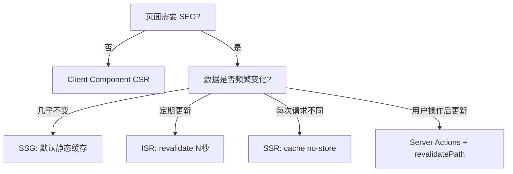

# Next.js 常见面试题解析

> 汇总 Next.js 高频面试题及深度解析，覆盖渲染策略选型、React Server Components 原理、四级缓存机制、性能优化策略和工程实践。

## 框架选型

### Next.js 与纯 React 的核心区别

React 是 UI 库，Next.js 是基于 React 的全栈框架。核心差异：

| 维度 | React | Next.js |
|------|-------|---------|
| 路由 | 需手动配置（React Router） | 文件系统路由，零配置 |
| 渲染 | 默认 CSR | SSR/SSG/ISR/RSC 多策略 |
| 数据获取 | 客户端 fetch | 服务端直接 async/await |
| SEO | 需额外方案 | 内置 Metadata API |
| 部署 | 静态文件 | Node 服务 / Serverless / 静态导出 |
| 优化 | 手动配置 | 图片/字体/脚本自动优化 |

**回答要点**：不必逐条列举，抓住"Next.js 解决了 React 在 production 中的工程化问题"这一核心，再引申到具体场景。

### 何时选择 Next.js

- 需要 SEO（博客、电商、营销页）
- 需要多种渲染策略混合使用
- 全栈应用（API Routes / Server Actions）
- 团队希望约定优于配置

## 渲染策略

### CSR / SSR / SSG / ISR 对比

| 策略 | 渲染时机 | 首屏速度 | SEO | 适用场景 |
|------|----------|----------|-----|----------|
| CSR | 客户端运行时 | 慢（白屏） | 差 | 后台管理、登录墙后 |
| SSR | 每次请求 | 快 | 好 | 个性化内容、实时数据 |
| SSG | 构建时 | 最快（CDN） | 最好 | 博客、文档、营销页 |
| ISR | 按需再生成 | 快 | 好 | 电商列表、新闻 |

### App Router 中如何选择



```typescript
// SSG（默认行为）
const data = await fetch('https://...', { cache: 'force-cache' });

// SSR
const data = await fetch('https://...', { cache: 'no-store' });

// ISR（每 60 秒重新验证）
const data = await fetch('https://...', { next: { revalidate: 60 } });

// 按需重新验证
revalidateTag('posts'); // 在 Server Action 中调用
```

## React Server Components

### RSC 解决了什么问题

1. **减少客户端 JS 体积**：Server Component 代码不发送到浏览器
2. **服务端直接访问后端资源**：无需 API 层，组件内直接查数据库
3. **自动代码分割**：Client Component 按需加载
4. **流式渲染**：配合 Suspense 渐进式加载

### Server vs Client Component

| 维度 | Server Component | Client Component |
|------|-----------------|-----------------|
| 执行环境 | 仅服务端 | 服务端预渲染 + 客户端 hydrate |
| 状态/事件 | 不支持 useState/useEffect | 完全支持 |
| 数据获取 | 直接 async/await | 需 useEffect 或 SWR |
| 标识 | 默认（无标记） | 文件顶部 `'use client'` |
| 嵌套规则 | 可包含 Client Component | 不能 import Server Component |

### RSC Payload 是什么

RSC Payload 不是 HTML，而是序列化的 React 元素描述：

```text
0:["$","div",null,{"children":[["$","h1",null,{"children":"Title"}],["$L1",null,{"postId":"1"}]]}]
1:["$","div",null,{"className":"content","children":"..."}]
```

客户端 React 解析 Payload，与 Client Component 代码合并，渲染最终 DOM。

## 缓存机制

### Next.js 四级缓存

| 层级 | 缓存内容 | 存储位置 | 失效方式 |
|------|----------|----------|----------|
| Request Memoization | 函数返回值 | 服务端内存 | 请求结束自动清除 |
| Data Cache | fetch 数据 | 服务端持久化 | revalidateTag / revalidatePath |
| Full Route Cache | HTML + RSC Payload | 服务端/CDN | revalidate / 重新部署 |
| Router Cache | RSC Payload | 客户端内存 | 导航时自动更新 / refresh() |

### 常见缓存问题排查

```typescript
// 问题：数据更新后页面没变化
// 原因：Data Cache 未失效

// 解决：在 Server Action 中显式重新验证
'use server';
import { revalidateTag, revalidatePath } from 'next/cache';

export async function updatePost(id: string, data: FormData) {
  await db.post.update({ where: { id }, data: { ... } });

  // 方式1：按标签失效
  revalidateTag('posts');

  // 方式2：按路径失效
  revalidatePath('/posts');
  revalidatePath(`/posts/${id}`);
}
```

## 性能优化

### 核心优化策略

| 策略 | 实现 | 效果 |
|------|------|------|
| 图片优化 | `next/image` 自动 WebP + 响应式 | 减少 50%+ 图片体积 |
| 字体优化 | `next/font` 本地加载 + preload | 消除 FOUT |
| 代码分割 | 动态 `import()` + `next/dynamic` | 减少首屏 JS |
| 流式渲染 | `<Suspense>` 分块加载 | 降低 TTFB |
| 缓存 | ISR + CDN 边缘缓存 | 减少服务端计算 |
| Server Component | 数据获取逻辑留在服务端 | 减少客户端 JS |
| 预加载 | `<Link>` 自动 prefetch | 导航即时响应 |

### 性能指标与监控

| 指标 | 含义 | 目标值 |
|------|------|--------|
| LCP | 最大内容绘制 | < 2.5s |
| FID / INP | 交互延迟 | < 200ms |
| CLS | 布局偏移 | < 0.1 |
| TTFB | 首字节时间 | < 800ms |

## 工程实践

### next.config.ts 关键配置

```typescript
import type { NextConfig } from 'next';

const nextConfig: NextConfig = {
  // 图片优化
  images: {
    formats: ['image/avif', 'image/webp'],
    remotePatterns: [{ protocol: 'https', hostname: 'cdn.example.com' }],
  },
  // 实验性功能
  experimental: {
    serverActions: { bodySizeLimit: '2mb' },
  },
  // Webpack 自定义
  webpack: (config) => {
    config.module.rules.push({ test: /\.svg$/, use: ['@svgr/webpack'] });
    return config;
  },
};

export default nextConfig;
```

### 中间件典型用法

```typescript
// middleware.ts
import { NextResponse } from 'next/server';
import type { NextRequest } from 'next/server';

export function middleware(request: NextRequest) {
  // 认证检查
  const token = request.cookies.get('session');
  if (!token && request.nextUrl.pathname.startsWith('/dashboard')) {
    return NextResponse.redirect(new URL('/login', request.url));
  }

  // A/B 测试
  const bucket = Math.random() < 0.5 ? 'a' : 'b';
  const response = NextResponse.next();
  response.cookies.set('ab-bucket', bucket);
  return response;
}

export const config = {
  matcher: ['/dashboard/:path*', '/api/:path*'],
};
```

## 参考资源

- [Next.js 官方文档](https://nextjs.org/docs)
- [Next.js Learn 教程](https://nextjs.org/learn)
- [Vercel Blog: RSC 深入解析](https://vercel.com/blog/understanding-react-server-components)
