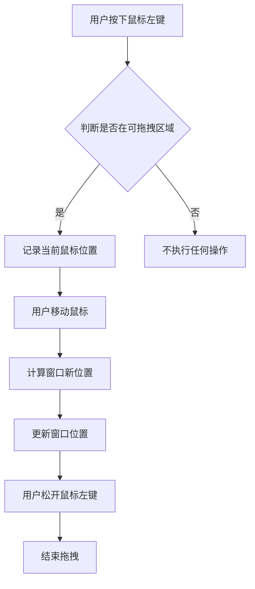
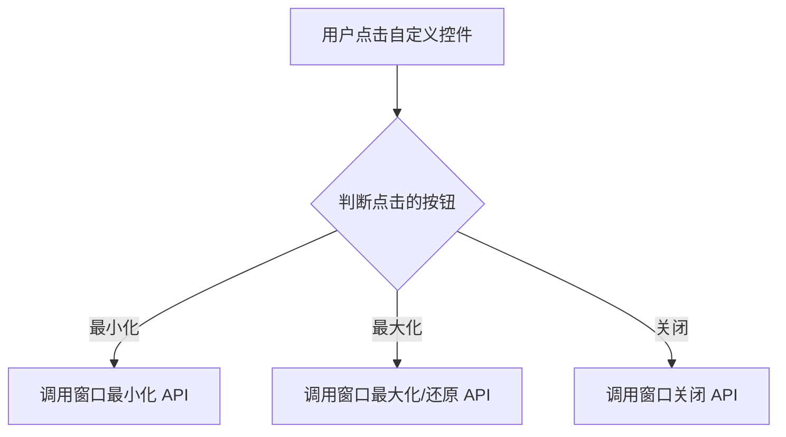
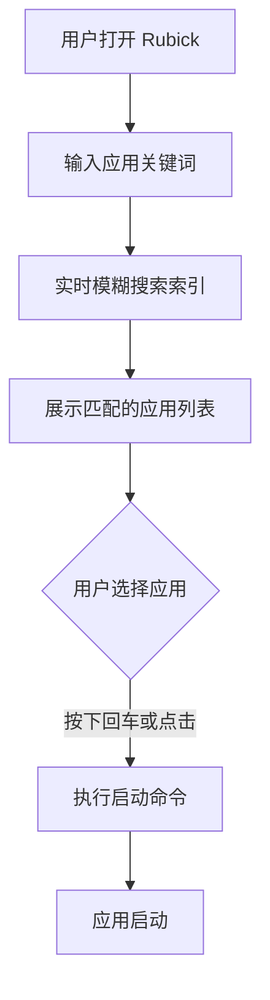

# 需求概述与设计文档

> 本文档作为 Rubick 效率工具箱实战开发的总体设计文档，涵盖项目背景、核心功能需求、技术架构、非功能性需求等内容，为后续各模块开发提供权威指南。

## 1. 前言

### 1.1 项目背景

在日常的开发和工作中，我们经常需要在不同的工具和应用之间频繁切换，这极大地影响了我们的工作效率。为了解决这一痛点，我们构思并开发了一款名为 `Rubick` 的桌面端效率工具箱。它旨在通过一个统一的入口，集成各种常用工具，并通过插件化的方式，让用户可以根据自己的需求进行功能扩展，从而打造一个个性化、高效率的工作环境。

本实战篇将以 `Rubick` 项目为原型，详细介绍如何从零开始，一步步实现一个功能强大、可扩展的桌面端工具箱。

### 1.2 目标读者

本系列文章主要面向以下读者：

- **Electron 初学者**：希望通过一个真实项目，系统学习 Electron 开发的各个方面。
- **前端开发者**：对桌面端应用开发感兴趣，希望将自己的 Web 技术栈扩展到桌面端。
- **有经验的开发者**：希望了解 `Rubick` 的实现原理，或者寻求在自己的项目中实现类似功能的灵感。

### 1.3 `Rubick` 简介

`Rubick` 是一款基于 `Electron` 开发的开源、免费的桌面端效率工具箱。它的核心理念是通过一系列辅助插件，解决工作、学习、开发中遇到的效率问题。

您可以将 `Rubick` 理解为一个类似于微信的平台，而插件则是基于 `Rubick` 开发的“小程序”。不同的是，微信的核心功能是“聊天”，而 `Rubick` 的核心功能是“效率工具”。

## 2. 核心功能需求

### 2.1 无边框窗口的拖拽和缩放

#### 2.1.1 需求描述

为了提供现代化和简洁的用户界面，`Rubick` 的窗口将采用无边框设计。这要求我们自行实现窗口的拖拽和缩放功能。

- **主搜索窗口**：
  - 必须为无边框窗口。
  - 用户可以通过拖拽窗口的任意位置来移动窗口。
  - 窗口大小固定，不支持缩放。
- **插件窗口**：
  - 插件可以打开一个新的、嵌入式的无边框窗口。
  - 该窗口需要包含自定义的控件栏，提供最小化、最大化和关闭功能。
  - 用户可以通过拖拽窗口的非内容区域来移动窗口。

#### 2.1.2 功能流程

**主搜索窗口拖拽**



**插件窗口控件**



### 2.2 应用的快速检索

#### 2.2.1 需求描述

作为效率工具，快速检索并启动本地应用是核心功能之一。

- **应用扫描**：
  - 首次启动时，`Rubick` 需要能够扫描并索引用户系统中所有已安装的应用程序。
  - 支持跨平台（Windows、macOS、Linux）。
- **快速检索**：
  - 用户在主搜索框中输入关键词时，应实时返回匹配的应用程序列表。
  - 检索应支持模糊匹配和拼音首字母匹配。
- **快速启动**：
  - 用户可以通过键盘（回车键）或鼠标点击来启动选中的应用程序。

#### 2.2.2 功能流程



### 2.3 插件化的设计体系

#### 2.3.1 需求描述

为了保持核心应用的轻量和灵活性，`Rubick` 必须采用插件化的设计体系

- **插件隔离**：每个插件应在独立的环境中运行，避免相互影响
- **插件管理**：用户可以方便地安装、卸载、更新和禁用插件
- **插件市场**：提供一个集中的插件市场，方便用户发现和下载插件
- **独立的生命周期**：插件的更新和发布应独立于主程序

#### 2.3.2 架构设计

```mermaid
graph TD
    subgraph 主进程
        A[应用生命周期管理]
        B[窗口管理器]
        C[插件管理器]
    end
    subgraph 渲染进程  (主窗口)
        D[UI 界面]
        E[搜索框]
    end
    subgraph 插件进程 (Webview)
        F[插件 A]
        G[插件 B]
        H[...]
    end
    C -- IPC --> F
    C -- IPC --> G
    C -- IPC --> H
    B -- 创建/销毁 --> F
    B -- 创建/销毁 --> G
    B -- 创建/销毁 --> H
    D -- 用户输入 --> C
```

- **主进程**：负责应用的生命周期、窗口管理和插件管理。
- **渲染进程**：负责主窗口的 UI 展示和用户交互。
- **插件进程**：每个插件运行在独立的 `Webview` 中，拥有独立的进程，确保了环境隔离。
- **IPC 通信**：主进程与插件进程之间通过 `IPC` (Inter-Process Communication) 进行通信。

### 2.4 实现超级面板

#### 2.4.1 需求描述

超级面板是一个系统级的增强菜单，旨在提供比传统右键菜单更强大、更可定制的功能。

- **快速唤起**：用户可以通过全局快捷键或鼠标手势快速唤起超级面板。
- **上下文感知**：
  - 当用户选中一段文本时，超级面板应自动提供“翻译”、“搜索”等相关操作。
  - 当用户选中一个文件或图片时，超级面板应提供“上传”、“压缩”等相关操作。
- **插件集成**：插件可以向超级面板注册新的功能选项。

#### 2.4.2 功能流程

```mermaid
graph TD
    A[用户选中内容<br>(文本/文件)] --> B[按下全局快捷键];
    B --> C[获取当前选中的内容类型];
    C --> D[匹配可用的插件功能];
    D --> E[显示超级面板和功能列表];
    E --> F{用户选择功能};
    F --> G[执行相应插件的功能];
```

### 2.5 本地数据库和多端数据同步

#### 2.5.1 需求描述

为了持久化用户数据并支持在不同设备间同步，需要设计一套可靠的数据存储和同步方案。

- **本地存储**：
  - 应用需要一个本地数据库来存储用户配置、插件列表、插件数据等。
  - 数据库应轻量、高效，并易于集成。
- **数据同步**：
  - 用户登录后，可以将本地数据同步到云端。
  - 在另一台设备上登录同一账号时，可以从云端拉取数据，实现多端同步。
- **数据安全**：同步过程中的数据传输必须加密，确保用户数据安全。

#### 2.5.2 数据结构

我们将采用 `JSON` 格式来存储数据，因为它具有良好的可读性和灵活性。

**用户配置 (`user_config.json`)**

```json
{
  "theme": "dark",
  "hotkey": {
    "show_hide": "Option+Space",
    "super_panel": "Command+Shift+Space"
  },
  "auto_launch": true
}
```

**插件数据 (`plugin_data.json`)**

```json
{
  "installed_plugins": [
    {
      "name": "translator",
      "version": "1.0.0",
      "enabled": true
    },
    {
      "name": "image_compressor",
      "version": "1.2.0",
      "enabled": true
    }
  ],
  "plugin_specific_data": {
    "translator": {
      "default_language": "en"
    }
  }
}
```

### 2.6 基础功能：菜单、截图、取色

#### 2.6.1 需求描述

除了核心功能外，`Rubick` 还将提供一些基础的桌面端工具。

- **截图**：
  - 提供全局快捷键来触发截图功能。
  - 支持框选截图、窗口截图和全屏截图。
  - 截图后，提供简单的编辑功能（如标记、文字）并支持保存到本地或剪贴板。
- **屏幕取色**：
  - 提供全局快捷键来激活取色器。
  - 鼠标在屏幕上移动时，实时显示当前位置的颜色值（HEX、RGB）。
  - 单击后将颜色值复制到剪贴板。
- **自定义菜单**：
  - 提供标准的应用程序菜单（如文件、编辑、关于）。
  - 在系统托盘中提供右键菜单，用于快速访问常用功能（如设置、退出）。

## 3. 技术架构

### 3.1 高阶架构图

```mermaid
graph TD
    subgraph 用户界面 (UI)
        A[主搜索窗口<br>(Vue.js + Element Plus)]
        B[插件窗口<br>(Webview)]
        C[超级面板<br>(Vue.js)]
    end

    subgraph 核心逻辑 (Electron Main Process)
        D[应用生命周期]
        E[窗口管理器]
        F[插件管理器]
        G[全局快捷键]
        H[IPC 通信模块]
    end

    subgraph 数据层
        I[本地数据库<br>(lowdb)]
        J[云端同步服务<br>(RESTful API)]
    end

    subgraph 操作系统集成
        K[系统托盘]
        L[屏幕截图]
        M[屏幕取色]
        N[应用扫描]
    end

    A -- IPC --> H
    B -- IPC --> H
    C -- IPC --> H
    F -- 管理 --> B
    H -- 交互 --> D
    H -- 交互 --> E
    H -- 交互 --> F
    F -- 数据读写 --> I
    I -- 同步 --> J
    G -- 触发 --> A
    G -- 触发 --> C
    D -- 集成 --> K
    E -- 调用 --> L
    E -- 调用 --> M
    F -- 调用 --> N
```

### 3.2 核心模块说明

- **用户界面 (UI)**：
  - **主搜索窗口**：使用 `Vue.js` 和 `Element Plus` 构建，提供流畅的搜索和交互体验。
  - **插件窗口**：每个插件运行在独立的 `Webview` 中，实现了安全的沙箱环境。
  - **超级面板**：同样使用 `Vue.js` 构建，响应迅速，提供上下文相关的操作。
- **核心逻辑 (Electron Main Process)**：
  - **插件管理器**：负责插件的安装、加载、卸载和生命周期管理。
  - **IPC 通信模块**：作为主进程和渲染进程之间通信的桥梁，传递事件和数据。
- **数据层**：
  - **本地数据库**：选用 `lowdb`，一个轻量级的 `JSON` 文件数据库，易于集成和使用。
  - **云端同步服务**：通过标准的 `RESTful API` 与后端服务通信，实现数据同步。
- **操作系统集成**：
  - 通过 `Electron` 提供的 `API`，实现与操作系统的深度集成，如系统托盘、全局快捷键等。

## 4. 非功能性需求

### 4.1 性能需求

- **启动速度**：应用冷启动时间应小于 2 秒
- **响应时间**：搜索框输入响应时间应小于 50 毫秒
- **资源占用**：空闲时内存占用应小于 100MB

### 4.2 兼容性需求

- **操作系统**：支持 `Windows 10` 及以上、`macOS 10.13` 及以上、以及主流 `Linux` 发行版
- **插件兼容**：插件 API 应保持向后兼容，确保旧版本插件在新版 `Rubick` 上依然可用

### 4.3 安全需求

- **插件沙箱**：所有插件必须在沙箱环境中运行，限制其对系统资源的访问权限
- **数据加密**：用户数据在本地和传输过程中都必须进行加密处理
- **代码签名**：发布的应用必须经过代码签名，以确保其来源可靠，未被篡改

## 5. API 接口设计

Rubick 提供了一套完整的 API 接口，供插件开发者调用。这些接口主要通过 `preload.js` 注入到渲染进程中，通过 `window.rubick` 对象访问。

### 5.1 核心接口概览

| 接口名称 | 功能描述 | 参数说明 | 返回值 |
|---------|---------|---------|--------|
| `hideMainWindow()` | 隐藏主搜索窗口 | 无 | `void` |
| `showMainWindow()` | 显示主搜索窗口 | 无 | `void` |
| `copyText(text)` | 复制文本到剪贴板 | `text: string` - 要复制的文本 | `void` |
| `showNotification(msg)` | 显示系统通知 | `msg: string` - 通知内容 | `void` |
| `getDbValue(key)` | 获取本地存储数据 | `key: string` - 数据键名 | `Promise<any>` |
| `setDbValue(key, value)` | 设置本地存储数据 | `key: string`, `value: any` | `Promise<void>` |
| `shellOpenPath(path)` | 在文件管理器中打开路径 | `path: string` - 文件路径 | `void` |

### 5.2 窗口管理接口

```typescript
interface WindowAPI {
  /**
   * 设置窗口尺寸
   * @param width 窗口宽度
   * @param height 窗口高度
   */
  setSize(width: number, height: number): void;
  
  /**
   * 设置窗口位置
   * @param x 横坐标
   * @param y 纵坐标
   */
  setPosition(x: number, y: number): void;
  
  /**
   * 最小化窗口
   */
  minimize(): void;
  
  /**
   * 最大化/还原窗口
   */
  maximize(): void;
  
  /**
   * 关闭当前插件窗口
   */
  close(): void;
}
```

### 5.3 IPC 通信接口

插件与主进程之间的通信采用 Electron 的 IPC 机制：

```javascript
// 渲染进程 -> 主进程
window.rubick.ipcInvoke(channel, ...args): Promise<any>

// 主进程 -> 渲染进程（监听）
window.rubick.on(channel, callback): void

// 移除监听
window.rubick.removeListener(channel, callback): void
```

### 5.4 插件生命周期钩子

系统插件支持以下生命周期钩子：

| 钩子名称 | 触发时机 | 用途 |
|---------|---------|------|
| `beforeReady()` | Electron App `ready` 事件前 | 初始化配置、注册协议 |
| `onReady(ctx)` | Electron App `ready` 事件后 | 创建窗口、注册快捷键 |
| `onRunning(ctx)` | 应用运行时 | 处理激活、多实例事件 |
| `onUnload()` | 插件卸载时 | 清理资源、注销监听 |
| `onQuit()` | 应用退出时 | 保存状态、清理资源 |

## 6. 配置参数详解

### 6.1 应用配置文件 (`config.json`)

```json
{
  "version": "1.0.0",
  "theme": {
    "mode": "system",
    "primaryColor": "#1890ff"
  },
  "hotkey": {
    "showHide": "Option+Space",
    "superPanel": "Command+Shift+Space",
    "screenshot": "Command+Shift+A"
  },
  "autoLaunch": true,
  "language": "zh-CN"
}
```

| 字段 | 类型 | 默认值 | 说明 |
|-----|------|-------|------|
| `version` | `string` | - | 配置文件版本号 |
| `theme.mode` | `'light' \| 'dark' \| 'system'` | `'system'` | 主题模式 |
| `theme.primaryColor` | `string` | `'#1890ff'` | 主题色 |
| `hotkey.showHide` | `string` | `'Option+Space'` | 显示/隐藏主窗口快捷键 |
| `hotkey.superPanel` | `string` | `'Command+Shift+Space'` | 超级面板快捷键 |
| `autoLaunch` | `boolean` | `true` | 是否开机自启动 |
| `language` | `string` | `'zh-CN'` | 界面语言 |

### 6.2 插件配置规范 (`package.json`)

UI 插件和系统插件的配置字段略有不同：

**UI 插件配置：**

```json
{
  "name": "plugin-name",
  "pluginName": "插件显示名称",
  "version": "1.0.0",
  "description": "插件描述",
  "author": "作者名称",
  "main": "index.html",
  "preload": "preload.js",
  "logo": "logo.png",
  "pluginType": "ui",
  "features": [
    {
      "code": "feature-code",
      "explain": "功能说明",
      "cmds": ["关键词1", "关键词2"]
    }
  ],
  "development": "http://localhost:8080"
}
```

**系统插件配置：**

```json
{
  "name": "system-plugin-name",
  "pluginName": "系统插件名称",
  "version": "1.0.0",
  "description": "插件描述",
  "author": "作者名称",
  "pluginType": "system",
  "main": "index.js"
}
```

| 字段 | 必填 | 说明 |
|-----|------|------|
| `name` | 是 | 插件唯一标识，npm 包名格式 |
| `pluginName` | 是 | 插件在界面显示的名称 |
| `version` | 是 | 插件版本号，遵循语义化版本 |
| `description` | 否 | 插件功能描述 |
| `author` | 否 | 作者信息 |
| `main` | 是 | 入口文件路径 |
| `preload` | 否 | 预加载脚本路径（仅 UI 插件） |
| `logo` | 否 | 插件图标，支持本地路径或 URL |
| `pluginType` | 是 | 插件类型：`'ui'` 或 `'system'` |
| `features` | 是 | 功能定义数组（仅 UI 插件） |
| `development` | 否 | 开发环境地址（仅 UI 插件） |

### 6.3 features 字段详解

`features` 数组定义了插件提供的所有功能：

```typescript
interface PluginFeature {
  /** 功能唯一标识 */
  code: string;
  /** 功能描述，显示在搜索结果中 */
  explain: string;
  /** 触发关键词列表 */
  cmds: string[];
  /** 功能图标（可选） */
  icon?: string;
}
```

**示例：**

```json
{
  "features": [
    {
      "code": "translate",
      "explain": "翻译选中的文本",
      "cmds": ["翻译", "translate", "fy"]
    },
    {
      "code": "dictionary",
      "explain": "查词典",
      "cmds": ["词典", "字典", "dict"]
    }
  ]
}
```

### 6.4 快捷键配置说明

Rubick 使用 [Accelerator](https://www.electronjs.org/docs/api/accelerator) 格式定义快捷键：

| 修饰键 | macOS | Windows/Linux |
|-------|-------|---------------|
| Command/Control | `Command` / `Cmd` | `Ctrl` |
| Option/Alt | `Option` / `Alt` | `Alt` |
| Shift | `Shift` | `Shift` |
| Super/Windows | `Super` | `Super` / `Meta` |

**常用快捷键组合：**

```javascript
const defaultHotkeys = {
  // macOS
  darwin: {
    showHide: 'Option+Space',
    superPanel: 'Command+Shift+Space',
    screenshot: 'Command+Shift+A'
  },
  // Windows/Linux
  win32: {
    showHide: 'Alt+Space',
    superPanel: 'Ctrl+Shift+Space',
    screenshot: 'Ctrl+Shift+A'
  }
};
```

> **注意**：快捷键设置应避免与系统快捷键冲突。推荐使用包含 `Option` (macOS) 或 `Alt` (Windows/Linux) 的组合。

## 7. 总结

本篇作为实战部分的开篇，我们对即将开发的 `Rubick` 工具箱进行了全面的需求梳理和设计。我们不仅定义了其核心功能，如无边框窗口、应用检索、插件化体系、超级面板和数据同步，还明确了其技术架构和非功能性需求。

这份文档将作为后续开发工作的权威指南，确保我们能够清晰、高效地将这些设计理念转化为一个功能强大、体验出色的桌面端效率工具。

### 7.1 文档导航

| 文档 | 描述 |
|-----|------|
| [快速检索功能](01-快速检索功能.md) | 跨平台应用扫描与检索实现 |
| [05-超级面板实现](05-超级面板实现.md) | 系统级增强菜单开发 |
| [09-右键菜单注入](09-右键菜单注入.md) | 应用集成到系统右键菜单 |
| [12-系统插件开发](12-系统插件开发.md) | 系统插件与取色器实战 |

接下来的章节，我们将深入到每个模块的实战开发中，逐一实现这些激动人心的功能。
