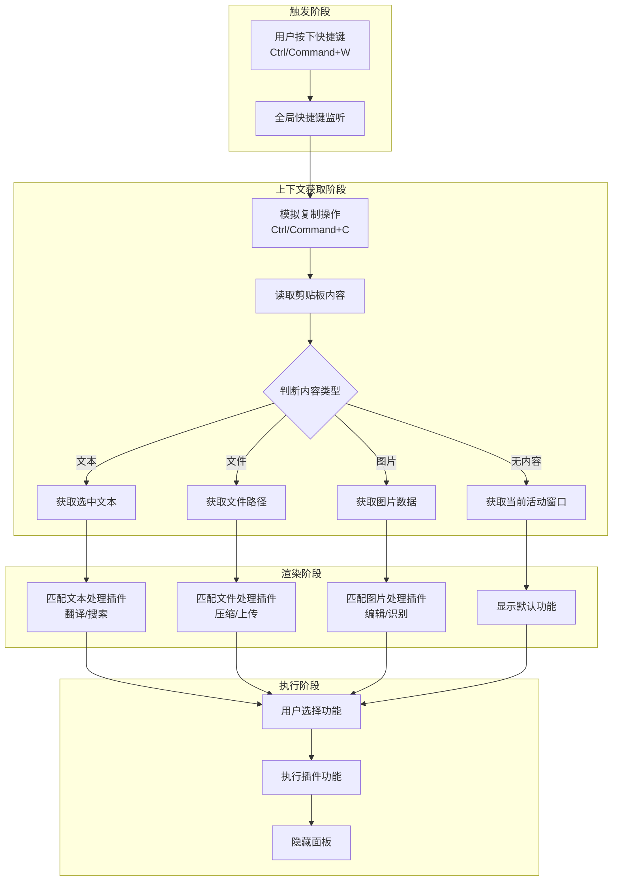

# 实现超级面板

> 本文档介绍如何实现一个系统级增强菜单（超级面板），包括全局快捷键监听、上下文感知、动态功能匹配等核心功能。

超级面板，又称超级菜单，是传统系统右键菜单的增强版。它通常通过快捷键或特定的鼠标操作（如中键单击或长按右键）来唤起。其本质是一个特殊的 `BrowserWindow` 窗口，窗口内承载了用户自定义的各种快捷功能。

## 实现原理

超级面板的核心工作机制可以分解为以下几个关键步骤：

### 整体架构流程图



### 详细工作流程

1.  **全局事件监听**:

    - 通过 Electron 的 `globalShortcut` 模块注册一个全局快捷键（例如 `Ctrl+W`）。当用户在操作系统的任何地方按下此快捷键时，都能触发逻辑
    - 这是实现超级面板能够“随时随地”唤起的基础。

2.  **创建与管理面板窗口**:

    - 超级面板的界面是一个 `BrowserWindow` 实例。为了实现即时响应，我们通常会在应用启动时就创建一个隐藏的 `BrowserWindow`
    - 这个窗口需要进行特殊配置，例如设置为无边框 (`frame: false`)、总在最前 (`alwaysOnTop: true`)，并且在失去焦点时自动隐藏
    - 当监听到快捷键事件后，我们获取当前鼠标的屏幕坐标，然后将这个预先创建好的窗口移动到鼠标位置并显示出来

3.  **上下文感知与信息获取**:

    - 超级面板的强大之处在于它能根据用户当前的操作对象（上下文）提供不同的功能。为了实现这一点，需要在面板唤起时，智能地“猜测”用户的意图
    - **文本选择**: 当用户选中文本时，我们通过模拟一次“复制”操作（`Ctrl/Command + C`）将选中的文本内容发送到系统剪贴板，然后通过 `clipboard` 模块读取文本内容
    - **文件/文件夹选择**: 与文本选择类似，当用户选中文件或文件夹时，我们同样模拟“复制”操作，然后从剪贴板中解析出文件或文件夹的路径。不同操作系统下，剪贴板中文件路径的格式有所不同，需要做平台兼容性处理
    - **无选择**: 如果用户没有选择任何内容，我们也需要判断当前鼠标所在的应用程序（例如是在桌面、还是在某个文件管理器中），以提供不同的默认选项

4.  **动态功能匹配与渲染**:

    - 在获取到上下文信息（如选中的文本、文件路径等）后，主进程将这些信息通过 IPC 通信（`webContents.send`）发送给超级面板的渲染进程
    - 渲染进程接收到信息后，会根据预设的规则进行功能匹配。例如：
      - 如果信息是文本，则显示“翻译”、“搜索”等插件
      - 如果信息是图片文件，则显示“图片压缩”、“图片上传”等插件
      - 如果信息是文件夹，则显示“在此处打开终端”等插件
    - 匹配到的功能项会被动态地渲染到面板窗口中，供用户选择

5.  **执行操作**:
    - 用户在超级面板中点击某个功能项后，渲染进程会执行相应的操作，或者通过 IPC 通信通知主进程来完成需要更高权限的操作。

通过以上流程，便构建起一个完整、智能且高效的超级面板系统

## 核心功能实现

### 初始化插件项目

首先需要创建一个 Rubick 的系统插件项目。系统插件的优势在于它不依赖于 Rubick 的主搜索窗口，可以独立运行，实现“随时随地”使用的效果。[系统插件的加载和取色插件的开发](12-系统插件开发.md)中，已经介绍搭建基于 `Vue 3` 的插件开发环境。这里继续沿用该环境

1.  在 `public/` 目录下新建系统插件的入口文件 `main.js`，这是插件在主进程的执行入口

    ```javascript
    // public/main.js
    module.exports = () => {
      return {
        // rubick 系统插件的 onReady 钩子函数
        onReady(ctx) {
          // todo
        }
      }
    }
    ```

2.  修改 `public/package.json` 文件，指明插件的入口和类型。

    ```json
    {
      "main": "main.js",
      "pluginType": "system"
    }
    ```

    > **说明**: `main` 字段指定主进程入口文件，`pluginType` 设置为 `system` 表明这是一个系统插件

### 创建超级面板窗口

实现在用户按下 `Ctrl+W` 快捷键时唤起超级面板窗口的功能

```javascript
// public/main.js
const path = require('path');

const superPanel = (ctx) => {
  const { BrowserWindow } = ctx;

  let win;

  const init = () => {
    if (win === null || win === undefined) {
      createWindow();
    }
  };

  const createWindow = () => {
    win = new BrowserWindow({
      frame: false,
      autoHideMenuBar: true,
      width: 240,
      height: 50,
      show: false,
      alwaysOnTop: true,
      webPreferences: {
        contextIsolation: false,
        webSecurity: false,
        backgroundThrottling: false,
        nodeIntegration: true,
        preload: path.join(__dirname, 'panel-preload.js'),
      },
    });

    // 根据环境加载不同 URL
    if (process.env.NODE_ENV === 'development') {
      win.loadURL(`http://localhost:8003/main`);
    } else {
      win.loadURL(`file://${__dirname}/main.html`);
    }

    win.on("closed", () => {
      win = undefined;
    });

    // 在生产环境中，窗口失去焦点时自动隐藏
    if (process.env.NODE_ENV !== 'development') {
      win.on("blur", () => {
        win.hide();
      });
    }
  };

  const getWindow = () => win;

  return {
    init,
    getWindow,
  };
};

module.exports = () => {
  let panelInstance;
  let globalShortcut;
  return {
    onReady(ctx) {
      ({ screen, globalShortcut } = ctx);
      // 初始化超级面板 window
      panelInstance = superPanel(ctx);
      panelInstance.init();

      globalShortcut.register('Ctrl+W', () => {
        // 获取鼠标当前位置
        const { x, y } = screen.getCursorScreenPoint();
        const win = panelInstance.getWindow();

        // 设置窗口位置并显示
        win.setPosition(x, y);
        win.show();
        win.focus();
      });
    },
    onUnload() {
      // 注销快捷键
      if (globalShortcut) {
        globalShortcut.unregister('Ctrl+W');
      }
    }
  };
};
```

**代码解析**:

- `superPanel` 函数封装了窗口的创建和管理逻辑，实现了单例模式，确保全局只有一个超级面板窗口实例。
- `onReady` 钩子函数在插件启动时被调用。我们在这里初始化了窗口并注册了 `Ctrl+W` 全局快捷键。
- 当快捷键被触发时，我们使用 `screen.getCursorScreenPoint()` 获取鼠标的当前坐标，然后调用 `win.setPosition()` 将窗口移动到该位置并显示。
- `onUnload` 钩子函数在插件卸载时被调用，我们在这里注销快捷键，防止内存泄漏。

### 获取用户选择内容

这是超级面板实现上下文感知的核心。需要区分用户选中的是文本、文件还是其他内容

#### 选中文本

Electron 的 `clipboard` 模块只能读取已被“复制”到剪贴板的内容。为了获取用户仅仅“选中”但未“复制”的文本，采用巧妙的方法：在监听到快捷键后，程序性地模拟一次 `Ctrl/Command + C` 复制操作。

这里借助 `@nut-tree/nut-js` 这个库来模拟键盘操作

```bash
# 安装依赖
npm install @nut-tree/nut-js
```

```javascript
// public/main.js
const { keyboard, Key } = require("@nut-tree/nut-js")
const { clipboard } = require("electron")

// 根据操作系统判断修饰键
const modifier = process.platform === "darwin" ? Key.LeftSuper : Key.LeftControl

async function simulateCopy() {
  await keyboard.pressKey(modifier, Key.C)
  await keyboard.releaseKey(modifier, Key.C)
}

function getSelectedContent() {
  return new Promise(async (resolve) => {
    // 1. 先清空剪贴板，避免读取到旧内容
    clipboard.clear()
    // 2. 再执行模拟复制
    await simulateCopy()
    // 3. 延时一小段时间，等待操作系统将内容写入剪贴板
    setTimeout(() => {
      const text = clipboard.readText() || ""
      resolve({ text })
    }, 80) // 延时时间可根据实际情况微调
  })
}
```

获取到选中的文本后，通过 IPC 将其发送给渲染进程进行后续处理（如翻译、搜索等）

```javascript
// public/main.js -> onReady -> globalShortcut.register callback
globalShortcut.register("Ctrl+W", async () => {
  const win = panelInstance.getWindow()
  const copyResult = await getSelectedContent()

  // 将获取到的内容发送给渲染进程
  win.webContents.send("trigger-super-panel", {
    ...copyResult
  })

  // ... 显示窗口 ...
})
```

渲染进程监听事件并处理：

```javascript
// 渲染进程 (e.g., in a Vue component)
import { ipcRenderer } from "electron"

ipcRenderer.on("trigger-super-panel", (event, args) => {
  if (args.text) {
    const word = args.text
    // 1. 调用翻译函数
    translate(word)
    // 2. 匹配可处理此文本的插件
    matchPlugins(word)
  }
})
```

#### 选中文件或文件夹

获取文件路径的原理与获取文本类似，同样是模拟复制操作，然后从剪贴板中读取。但不同操作系统下，剪贴板中文件路径的格式差异较大，需要分别处理

```javascript
// public/main.js

function getSelectedFiles(clipboard) {
  let filePaths = []

  if (process.platform === "darwin") {
    // macOS
    if (clipboard.has("NSFilenamesPboardType")) {
      // 多个文件
      const raw = clipboard.read("NSFilenamesPboardType")
      // 解析 XML 格式的路径列表
      filePaths =
        raw
          .match(/<string>.*<\/string>/g)
          ?.map((item) => item.replace(/<string>|<\/string>/g, "")) || []
    } else {
      // 单个文件
      const url = clipboard.read("public.file-url").replace("file://", "")
      if (url) filePaths.push(url)
    }
  } else if (process.platform === "win32") {
    // Windows
    if (clipboard.has("CF_HDROP")) {
      // CF_HDROP 格式存储的是文件列表
      filePaths = clipboard.read("CF_HDROP")
    } else {
      // 单个文件（兼容性处理）
      const rawPath = clipboard.readBuffer("FileNameW").toString("ucs2")
      const path = rawPath.replace(new RegExp(String.fromCharCode(0), "g"), "")
      if (path) filePaths.push(path)
    }
  }

  // 处理从剪贴板复制的图片
  const image = clipboard.readImage()
  if (!image.isEmpty()) {
    filePaths.push({
      isImage: true,
      data: image.toPNG() // or toJPEG, toDataURL
    })
  }

  return filePaths.filter(Boolean) // 过滤掉空值
}
```

**代码解析**:

- **macOS**:
  - 多个文件：通过 `clipboard.read('NSFilenamesPboardType')` 读取一个 XML 格式的字符串，然后用正则解析出文件路径。
  - 单个文件：通过 `clipboard.read('public.file-url')` 直接读取 `file://` 协议的路径。
- **Windows**:
  - 多个文件：通过 `clipboard.read('CF_HDROP')` 读取文件路径。⚠️ 注：`clipboard.read()` 返回的是字符串而非数组；Windows 下读取 `CF_HDROP` 在旧版 Electron 中曾返回文件路径字符串，但在较新版本中会读取为空（见 [electron/electron#39853](https://github.com/electron/electron/issues/39853)），如需稳定读取文件列表需借助原生模块。
  - 单个文件：通过 `clipboard.readBuffer('FileNameW')` 读取一个 UCS-2 编码的 Buffer，再转换为字符串路径。
- **图片**: 无论在哪个平台，如果剪贴板中有图片，`clipboard.readImage()` 都能读取到。我们可以将其转换为 `Buffer` 或 `DataURL` 进行后续处理。

#### 整合上下文获取逻辑

现在将文本和文件获取的逻辑整合起来。当快捷键触发时，同时尝试获取这两种类型的数据

```javascript
// public/main.js -> onReady -> globalShortcut.register callback
globalShortcut.register("Ctrl+W", async () => {
  // 1. 模拟复制
  await simulateCopy()
  await new Promise((resolve) => setTimeout(resolve, 80)) // 等待剪贴板更新

  // 2. 获取剪贴板内容
  const text = clipboard.readText() || ""
  const files = getSelectedFiles(clipboard)
  const activeApp = getActiveAppInfo() // 获取当前活动窗口信息

  // 3. 将信息发送给渲染进程
  const win = panelInstance.getWindow()
  win.webContents.send("trigger-super-panel", {
    text,
    files,
    activeApp
  })

  // ... 显示窗口 ...
})
```

> `getActiveAppInfo()` 是辅助函数，用于获取当前活动窗口的进程名等信息，这在判断用户是否在桌面或特定应用中操作时非常有用。可以使用 `active-win` 等第三方库来实现

### 渲染进程动态展示

渲染进程接收到主进程发来的上下文信息后，需要根据这些信息动态地决定显示哪些功能项

```javascript
// 渲染进程 (e.g., in a Vue component)
ipcRenderer.on("trigger-super-panel", (event, { text, files, activeApp }) => {
  let features = []

  if (files.length > 0) {
    // 优先处理文件
    features = getFeaturesForFiles(files)
  } else if (text.trim()) {
    // 处理文本
    features = getFeaturesForText(text)
  } else {
    // 无选择，根据当前应用显示默认功能
    features = getDefaultFeatures(activeApp)
  }

  // 更新组件状态，渲染 features 列表
  this.features = features
})
```

这里的 `getFeaturesForFiles`、`getFeaturesForText`、 `getDefaultFeatures` 是自定义的逻辑函数，它们会返回一个功能项数组，例如：

```javascript
;[
  { id: "translate", name: "翻译", icon: "..." },
  { id: "search", name: "网页搜索", icon: "..." }
]
```

至此超级面板的核心功能就完成了

## 常见问题 (FAQ)

**Q1: 为什么有时候获取不到选中的文本？**

A: 这通常是由于 `simulateCopy()` 执行后，操作系统还未完成将内容写入剪贴板，我们就去读取了。可以适当增加 `setTimeout` 的延时（例如从 50ms 增加到 100ms）来解决。另外，要确保触发快捷键时，当前窗口是活跃的，否则模拟的 `Ctrl+C` 可能不生效。

**Q2: 在某些应用（如虚拟机、远程桌面）中，模拟复制操作无效怎么办？**

A: `@nut-tree/nut-js` 依赖操作系统的辅助功能 API。在某些沙箱环境或安全级别较高的应用中，这些 API 可能会被禁用。这是 `nut.js` 的局限性，目前没有完美的通用解决方案。可以考虑引导用户手动复制，或者针对特定应用寻找其他的自动化方案。

**Q3: 如何处理多文件/文件夹选择的情况？**

A: `getSelectedFiles` 函数已经处理了多文件选择的情况。在渲染进程中，当你拿到 `files` 数组后，可以遍历这个数组，为每个文件提供操作选项，或者提供一个“批量操作”的选项。

**Q4: 窗口显示的位置不准确，尤其是在多显示器环境下？**

A: Electron 的 `screen.getCursorScreenPoint()` 返回的是鼠标在整个虚拟屏幕坐标系中的绝对位置，多显示器环境下可能落在主显示器之外。因此，需要使用 `screen.getDisplayNearestPoint(screen.getCursorScreenPoint())` 来获取鼠标所在的那个显示器的信息，然后根据该显示器的 `bounds` (x, y, width, height) 来计算窗口的准确位置。

```javascript
const { screen } = require("electron")

const point = screen.getCursorScreenPoint()
const display = screen.getDisplayNearestPoint(point)
const { x, y } = point

// 简单的处理方式，更精确的计算需要考虑窗口尺寸
win.setPosition(x, y)
```

**Q5: 如何让超级面板在全屏应用（如游戏、视频）上显示？**

A: 在创建 `BrowserWindow` 时，需要确保 `alwaysOnTop` 设置为 `true`。在 macOS 上，还需要调用 `win.setVisibleOnAllWorkspaces(true, { visibleOnFullScreen: true });` 来确保窗口可以穿透全屏空间。但请注意，某些独占全屏的游戏可能会阻止任何窗口覆盖其上。

## 性能优化建议

1.  **窗口复用**: 严格遵循单例模式，不要在每次唤起时都 `new BrowserWindow()`。创建窗口是昂贵的开销。预先创建并 `show/hide` 是最高效的方式

2.  **懒加载**: 面板的渲染进程（HTML/JS/CSS）可以进行懒加载。初始只加载必要的 UI 框架和逻辑，当匹配到具体功能（如翻译、图片压缩）时，再异步加载对应的模块或组件

3.  **减少主进程阻塞**: `simulateCopy` 和文件 IO 等操作都应该是异步的。避免在 `globalShortcut` 的回调中使用任何同步的、耗时的操作，否则会导致整个应用卡顿

4.  **合理使用 `setTimeout`**: 在 `getSelectedContent` 中使用的 `setTimeout` 延时要尽可能短，但又要确保能稳定获取内容。建议通过实验在不同机器上找到一个合理的平衡点（通常 80ms-120ms 之间比较稳定）

5.  **图片处理**: 当从剪贴板获取到图片时，`clipboard.readImage()` 返回的是一个 `NativeImage` 对象。如果图片很大，`.toPNG()` 或 `.toJPEG()` 操作可能会消耗一定时间和内存。如果只是为了显示缩略图，可以先将其缩放 (`resize`) 到一个较小的尺寸再进行转换

    ```javascript
    const image = clipboard.readImage()
    if (!image.isEmpty()) {
      const resizedImage = image.resize({ width: 80 }) // 缩放到 80px 宽
      const dataUrl = resizedImage.toDataURL()
      // ... send dataUrl to renderer
    }
    ```

6.  **资源回收**: 确保在插件卸载 (`onUnload`) 或应用退出时，正确地注销全局快捷键 (`globalShortcut.unregisterAll()`) 并销毁窗口，防止内存泄漏

> 完整代码示例可参考：https://gitee.com/rubick-center/rubick-super-x
