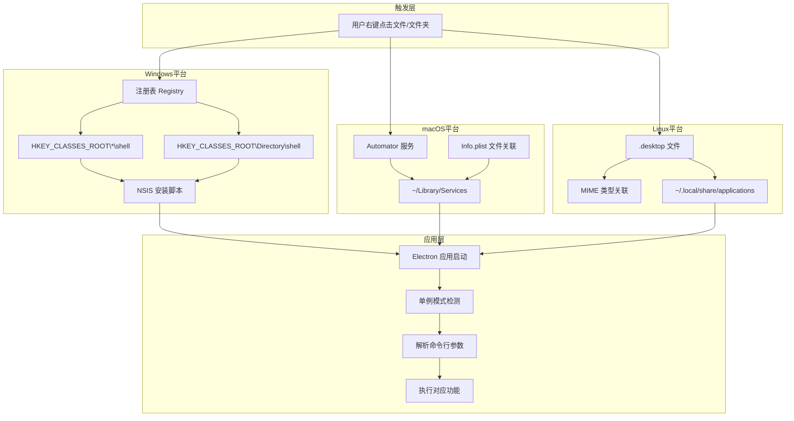

# 应用注入系统右键菜单

> 本文档介绍如何将 Electron 应用集成到各操作系统的右键菜单中，涵盖 Windows、macOS 和 Linux 三个平台的实现方案。

将 Electron 应用集成到操作系统的右键菜单中，是一项提升用户体验的重要功能。它允许用户在文件或文件夹上右键单击时，直接通过上下文菜单启动应用，并执行特定操作（例如，用应用打开文件、上传文件等）。这种方式极大地简化了用户的工作流程，提高了软件的易用性和使用效率。

## 核心原理

尽管不同操作系统的实现方式各异，但其核心思想是共通的：**注册一个自定义命令，并将其与特定的文件类型或上下文关联**。当用户触发该菜单项时，系统会执行预设的命令行指令，启动你的 Electron 应用，并将文件路径等信息作为参数传递进去。

### 跨平台实现架构



### 平台实现方式对比

| 特性 | Windows | macOS | Linux |
|-----|---------|-------|-------|
| **实现机制** | 注册表 | Automator/Info.plist | .desktop 文件 |
| **安装时机** | 安装程序执行 | 应用启动时/打包配置 | 包管理器安装 |
| **参数传递** | 命令行参数 | 命令行参数 | %U/%F 占位符 |
| **卸载清理** | 注册表清理 | 删除 .workflow | 自动管理 |
| **权限要求** | 管理员权限 | 用户权限 | 用户权限 |

- **Windows**: 通过修改 **注册表 (Registry)** 来实现。注册表是 Windows 的核心数据库，通过在 `HKEY_CLASSES_ROOT` 下创建特定的键值对，可以将自定义命令添加到右键菜单

- **macOS**: 主要通过 **Automator 服务** 或 **`Info.plist` 文件关联** 来实现。Automator 允许用户创建 `.workflow` 服务，而 `Info.plist` 则用于定义应用能处理的文件类型

- **Linux**: 通过创建 `.desktop` 文件并放置在特定目录（如 `~/.local/share/applications/`）来实现。`.desktop` 文件描述了应用的属性，包括其 MIME 类型关联和执行命令

- **通用逻辑**: 无论在哪个平台，应用都需要处理从命令行接收到的参数（如文件路径），并确保应用以**单例模式**运行，避免重复打开多个窗口

## Windows 平台实现

在 Windows 上主要通过在应用安装过程中修改注册表来实现右键菜单的添加。`electron-builder` 默认使用 **NSIS (Nullsoft Scriptable Install System)** 作为打包工具，它提供了强大的脚本能力，允许在安装和卸载过程中执行自定义操作

### 注册表基础

Windows 注册表中有两个关键路径与右键菜单相关：

1.  `HKEY_CLASSES_ROOT\*\shell`: 在此处添加的菜单项，会出现在**所有类型文件**的右键菜单中。
2.  `HKEY_CLASSES_ROOT\Directory\shell`: 在此处添加的菜单项，只会出现在**文件夹**的右键菜单中。

例如，`Git` 的右键菜单项就是通过在 `Directory\shell` 下添加 `git_shell` 和 `git_gui` 等键来实现的。每个菜单项下都有一个 `command` 子键，其默认值定义了点击该菜单项时执行的命令。`%1` 是一个占位符，代表用户右键点击的文件或文件夹的完整路径

```
"C:\Program Files\Git\cmd\git-gui.exe" "--working-dir" "%1"
```

### 使用 NSIS 脚本修改注册表

可以创建一个 `.nsh` (NSIS script header) 文件，利用 `electron-builder` 的 `nsis.include` 配置，在打包时将其包含进去

**步骤 1: 创建 `installer.nsh` 文件**

在你的项目 `build` 或 `public` 目录下创建一个名为 `installer.nsh` 的文件。这个脚本将在应用安装和卸载时被调用。

```nsis
!macro customInstall
  # 写入注册表，为所有文件类型添加 "Open with YourApp" 选项
  SetRegView 64
  WriteRegStr HKCR "*\shell\YourApp" "" "用 YourApp 打开"
  WriteRegStr HKCR "*\shell\YourApp" "Icon" "$INSTDIR\YourApp.exe,0"
  WriteRegStr HKCR "*\shell\YourApp\command" "" "\"$INSTDIR\YourApp.exe\" \"%1\""

  # 为文件夹添加右键菜单
  WriteRegStr HKCR "Directory\shell\YourApp" "" "用 YourApp 打开"
  WriteRegStr HKCR "Directory\shell\YourApp" "Icon" "$INSTDIR\YourApp.exe,0"
  WriteRegStr HKCR "Directory\shell\YourApp\command" "" "\"$INSTDIR\YourApp.exe\" \"%1\""
!macroend

!macro customUninstall
  # 卸载时删除注册表项
  DeleteRegKey HKCR "*\shell\YourApp"
  DeleteRegKey HKCR "Directory\shell\YourApp"
!macroend
```

**代码解释:**

- `!macro customInstall`: 定义一个在**安装**时执行的宏。
- `!macro customUninstall`: 定义一个在**卸载**时执行的宏，用于清理注册表，避免留下垃圾数据。
- `SetRegView 64`: 确保在 64 位系统上写入正确的注册表位置。
- `WriteRegStr`: 写入一个字符串类型的注册表值。
  - `HKCR "*\shell\YourApp"`: 创建一个名为 `YourApp` 的菜单项。
  - `"" "用 YourApp 打开"`: 设置菜单项显示的文本。
  - `"Icon" "$INSTDIR\YourApp.exe,0"`: 设置菜单项的图标，`$INSTDIR` 是安装目录的变量。
  - `command` 的值是核心，`"$INSTDIR\YourApp.exe" "%1"` 表示执行你的应用，并将文件路径 `"%1"` 作为参数传入。
- `DeleteRegKey`: 在卸载时删除整个注册表键。

**步骤 2: 配置 `electron-builder`**

在 `vue.config.js`、`electron-builder.json` 或 `package.json` 中，配置 `nsis` 选项，以包含你的脚本。

```javascript
// vue.config.js 或 electron-builder.js
module.exports = {
  pluginOptions: {
    electronBuilder: {
      builderOptions: {
        nsis: {
          include: "build/installer.nsh", // 确保路径正确
          oneClick: false, // 必须为 false，以显示安装选项
          allowToChangeInstallationDirectory: true // 允许用户选择安装路径
        }
      }
    }
  }
}
```

配置完成后，使用 `electron-builder` 打包生成的安装程序，在安装和卸载时就会自动执行上述的注册表操作

### 应用程序实现命令行启动功能

当用户通过右键菜单启动应用时，操作系统会执行你在注册表中设置的命令，并将文件或文件夹的路径作为命令行参数传递给你的应用。因此，你的 Electron 应用需要能够正确处理这些参数，并确保只有一个实例在运行。

这就是所谓的**单例应用**（Single-Instance Application）逻辑。在主进程文件（通常是 `main.js` 或 `background.js`）中，需要添加以下代码：

```javascript
import { app, BrowserWindow } from "electron"

let mainWindow

// 确保应用以单例模式运行
const gotTheLock = app.requestSingleInstanceLock()

if (!gotTheLock) {
  app.quit()
} else {
  app.on("second-instance", (event, commandLine, workingDirectory) => {
    // 当尝试运行第二个实例时，聚焦到主窗口
    if (mainWindow) {
      if (mainWindow.isMinimized()) mainWindow.restore()
      mainWindow.focus()
    }

    // 在这里处理命令行参数
    // commandLine 是一个包含所有命令行参数的数组
    const filePath = commandLine.pop() // 通常最后一个参数是文件路径
    console.log("从右键菜单打开:", filePath)
    // 你可以将 filePath 发送到渲染进程进行处理
    // mainWindow.webContents.send('open-file', filePath);
  })

  app.on("ready", () => {
    // 创建窗口等...
    // ...

    // 处理应用第一次启动时的命令行参数
    // 注意：.pop() 方法仅适用于简单场景。对于复杂的命令行参数，
    // 建议使用更健壮的参数解析库（如 yargs-parser）来处理 process.argv。
    const filePath = process.argv.slice(1).pop()
    if (filePath) {
      console.log("应用启动时打开:", filePath)
      // mainWindow.webContents.send('open-file', filePath);
    }
  })
}
```

**代码解释:**

- `app.requestSingleInstanceLock()`: 这是实现单例应用的关键。它会尝试获取一个锁，如果获取失败，说明已经有一个实例在运行，此时应直接退出新启动的实例。
- `app.on('second-instance', ...)`: 如果应用已经是单例，并且用户尝试再次启动它（例如，通过右键菜单），这个事件会被触发。`commandLine` 参数是一个数组，包含了所有的命令行参数，包括可执行文件路径和你需要的文件路径。
- `process.argv`: 当应用第一次启动时，命令行参数可以通过 `process.argv` 获取。`process.argv[0]` 是 Electron 的路径，`process.argv[1]` 是你的应用路径，之后是传递的其他参数。

通过以上代码，你的应用就能响应从右键菜单传递过来的文件路径，并执行相应的逻辑了。

## macOS 平台实现

在 macOS 上实现右键菜单主要有两种方式：**Automator 服务**和通过应用的 **`Info.plist`** 文件定义文件关联。前者更适合开发和快速测试，而后者是应用打包分发的标准做法

### 方法一：使用 Automator 服务

Automator 是 macOS 内置的强大自动化工具，可以创建“快速操作”（Quick Action），这些操作会出现在右键菜单中

**步骤 1: 创建快速操作**

1.  打开 “Automator” 应用。
2.  选择 “文件” > “新建”，然后选取 “快速操作”。
3.  在顶部的 “工作流程收到当前” 下拉菜单中，选择你希望关联的类型，如 “文件或文件夹”，并选择位于 “任何应用程序”。

**步骤 2: 添加 “运行 Shell 脚本” 操作**

1.  从左侧的操作库中，找到 “运行 Shell 脚本” 并将其拖到右侧的工作流程区域
2.  将 “传递输入” 设置为 “作为自变量”
3.  在脚本区域输入以下命令

```bash
# 启动你的应用，并将所有选中的文件/文件夹路径作为参数传递
# open -a /Applications/YourApp.app --args "$@"

# 或者直接执行应用内部的可执行文件
/Applications/YourApp.app/Contents/MacOS/YourApp "$@" > /dev/null 2>&1 &
```

- `open -a`: 是 macOS 中用于打开应用的命令
- `"$@"`: 是一个 Shell 变量，代表所有传递给脚本的参数（即选中的文件路径）
- `> /dev/null 2>&1 &`: 让脚本在后台运行，避免弹出终端窗口

**步骤 3: 保存快速操作**

将此快速操作保存，例如命名为 “用 YourApp 打开”。保存后，它会自动出现在右键菜单的 “快速操作” 子菜单中

### 在应用中自动安装 Automator 服务

为了让用户无需手动创建，可以在应用启动时，自动将预先制作好的 `.workflow` 文件复制到系统指定目录 `~/Library/Services`

```javascript
import fs from "fs"
import path from "path"
import os from "os"

function installMacService() {
  const source = path.join(__dirname, "assets/YourApp.workflow") // 将 .workflow 文件放在你的项目资源中
  const dest = path.join(os.homedir(), "Library/Services/YourApp.workflow")

  if (fs.existsSync(dest)) {
    return
  }

  // 使用 fs.cpSync 或其他递归复制函数
  fs.cpSync(source, dest, { recursive: true })
}

// 在应用启动时调用
if (process.platform === "darwin") {
  installMacService()
}
```

> **注意**: 由于 Electron 的 asar 打包机制，直接使用 `fs.copyFileSync` 可能失败。需要一个能够处理 asar 归档的递归复制函数，或者在打包时将 `.workflow` 文件夹排除在 asar 之外

### 方法二：通过 `Info.plist` 文件关联 (推荐)

这是更专业、更可靠的方式，通过在应用的 `Info.plist` 文件中声明应用可以处理的文件类型，从而让系统自动将你的应用添加到“打开方式”列表中。

在 `electron-builder` 的配置中通过 `extendInfo` 字段来修改 `Info.plist`：

```javascript
// electron-builder.js
{
  mac: {
    // ...
    extendInfo: {
      CFBundleDocumentTypes: [
        {
          CFBundleTypeName: 'All Files',
          CFBundleTypeRole: 'Editor', // 或 'Viewer'
          LSHandlerRank: 'Owner', // 或 'Alternate'
          LSItemContentTypes: ['public.data', 'public.content'], // 关联所有文件类型
        },
        {
          CFBundleTypeName: 'Image File',
          CFBundleTypeRole: 'Editor',
          LSItemContentTypes: ['public.image'], // 仅关联图片
          CFBundleTypeExtensions: ['png', 'jpg', 'gif'], // 按扩展名关联
        },
      ],
    },
  },
}
```

- `CFBundleDocumentTypes`: 定义了你的应用支持的文档类型
- `LSItemContentTypes`: 使用统一类型标识符 (UTI) 来指定文件类型，例如 `public.image` 代表所有图片
- `LSHandlerRank`: 定义你的应用对于这些文件类型的“身份”。`Owner` 表示是主要处理程序，`Alternate` 表示是备选程序

配置完成后，打包安装应用，系统就会识别这些文件关联。用户可以通过右键菜单的“打开方式”来选择你的应用

## Linux 平台实现

在 Linux 上右键菜单集成通常通过创建 `.desktop` 文件来实现。这些文件定义应用的启动方式、图标、名称以及它能处理的 MIME 类型

### 创建 `.desktop` 文件

一个典型的 `.desktop` 文件如下所示：

```ini
[Desktop Entry]
Name=YourApp
Exec=/opt/YourApp/yourapp %U
Type=Application
Icon=/opt/YourApp/icon.png
Terminal=false
MimeType=application/octet-stream;inode/directory;
```

- `Exec`: 定义执行命令。`%U` 或 `%F` 是占位符，代表传递的文件/文件夹 URL 列表
- `MimeType`: 指定了你的应用可以处理的 MIME 类型。`inode/directory` 表示文件夹，`application/octet-stream` 是一个通用的文件类型

### 使用 `electron-builder` 配置

`electron-builder` 可以为你自动生成 `.desktop` 文件。只需要在 `linux` 配置中指定 `desktop` 和 `mimeTypes`

```javascript
// electron-builder.js
{
  linux: {
    target: ['AppImage', 'deb'],
    category: 'Utility',
    desktop: {
      Name: 'YourApp',
      Exec: 'yourapp %U',
    },
    mimeTypes: ['inode/directory', 'application/octet-stream'],
  },
}
```

当用户安装了打包的 `.deb` 或其他 Linux 安装包后，系统会自动注册 `.desktop` 文件，并将你的应用添加到对应 MIME 类型的右键“打开方式”列表中

## 常见问题与解决方案 (FAQ)

**Q1: 在 Windows 上，右键菜单没有出现或注册表写入失败。**

- **A:**
  1.  **权限问题**: 确保你的安装程序是以管理员权限运行的。`electron-builder` 的 NSIS 安装程序默认会请求管理员权限。
  2.  **`oneClick` 设置**: 检查 `nsis` 配置中的 `oneClick` 是否为 `false`。如果为 `true`，安装过程会静默完成，用户无法选择安装选项（自定义脚本仍会执行）。
  3.  **脚本路径**: 确认 `nsis.include` 指向的 `.nsh` 文件路径是正确的。
  4.  **注册表检查**: 手动打开注册表 (`regedit`)，检查对应的路径（如 `HKEY_CLASSES_ROOT\*\shell\YourApp`）是否存在，以及 `command` 的值是否正确。

**Q2: 在 macOS 上，Automator 脚本执行了，但应用没有反应。**

- **A:**
  1.  **应用路径**: 确认脚本中指定的应用路径是正确的，特别是应用名称和 `.app` 后缀。
  2.  **可执行文件**: 确保你指向的是 `YourApp.app/Contents/MacOS/YourApp` 这个可执行文件，而不是 `.app` 包本身。
  3.  **单例逻辑**: 检查你的单例应用逻辑 (`requestSingleInstanceLock` 和 `second-instance` 事件) 是否正确实现，确保第二个实例能将参数传递给主实例。
  4.  **后台运行符**: 确保命令末尾有 `&` 符号，让脚本在后台执行，否则可能会被系统超时终止。

**Q3: 应用总是多开新窗口，而不是聚焦到已有的窗口。**

- **A:** 这是典型的单例模式问题。请仔细检查 `app.requestSingleInstanceLock()` 的实现。确保在 `!gotTheLock` 的分支中调用了 `app.quit()`，并且在 `second-instance` 事件中正确地聚焦了 `mainWindow`。

**Q4: 如何调试从右键菜单启动时的参数？**

- **A:**
  1.  **日志文件**: 在你的代码中，使用 `fs.writeFileSync` 将 `process.argv` 或 `commandLine` 的内容写入到一个临时日志文件中，方便查看。
  2.  **开发者工具**: 在 `second-instance` 事件处理逻辑中，可以尝试打开开发者工具 `mainWindow.webContents.openDevTools()`，并在控制台输出参数。
  3.  **dialog**: 使用 `dialog.showMessageBox` 将收到的参数弹窗显示出来，这是最直接的调试方法。

## 安全注意事项与最佳实践

### 参数验证与清理

从命令行接收到的任何参数（特别是文件路径）都应被视为不可信的。在使用这些参数之前，务必进行验证和清理，以防止命令行注入等安全风险。

```typescript
import path from "path";
import fs from "fs";

function validateFilePath(filePath: string): boolean {
  try {
    // 1. 检查路径是否合法
    const normalizedPath = path.normalize(filePath);

    // 2. 检查路径是否存在
    if (!fs.existsSync(normalizedPath)) {
      return false;
    }

    // 3. 检查是否包含可疑字符
    const suspiciousPatterns = /[<>:"|?*]|\.\./;
    if (suspiciousPatterns.test(normalizedPath)) {
      return false;
    }

    return true;
  } catch {
    return false;
  }
}

// 使用示例
app.on("second-instance", (event, commandLine) => {
  const filePath = commandLine.pop();
  if (filePath && validateFilePath(filePath)) {
    // 安全处理文件
    handleFile(filePath);
  } else {
    console.error("Invalid file path received:", filePath);
  }
});
```

### 安装卸载规范

务必在卸载脚本中彻底清除所有添加的注册表项或文件，避免在用户系统中留下垃圾数据：

**Windows NSIS 卸载脚本模板：**

```nsis
!macro customUninstall
  # 删除文件关联
  DeleteRegKey HKCR "*\shell\YourApp"
  DeleteRegKey HKCR "Directory\shell\YourApp"

  # 删除自定义协议（如果有）
  DeleteRegKey HKCR "yourapp"

  # 清理缓存文件
  RMDir /r "$APPDATA\YourApp\cache"
!macroend
```

**macOS 清理脚本：**

```javascript
function uninstallMacService() {
  const servicePath = path.join(os.homedir(), "Library/Services/YourApp.workflow");
  if (fs.existsSync(servicePath)) {
    fs.rmSync(servicePath, { recursive: true });
  }
}
```

### 用户体验最佳实践

#### 用户提示与选项

在安装过程中，明确告知用户应用将添加右键菜单项，并提供禁用选项：

```nsis
!macro customInstall
  # 弹出询问对话框
  MessageBox MB_YESNO "是否添加右键菜单快捷方式？" IDYES addContextMenu IDNO skip

  addContextMenu:
    WriteRegStr HKCR "*\shell\YourApp" "" "用 YourApp 打开"
    # ... 其他注册表操作

  skip:
!macroend
```

#### 性能优化建议

1. **macOS Automator 优化**：
   - 自动复制 `.workflow` 文件应只在应用首次启动时执行一次
   - 使用标志文件避免重复安装

   ```javascript
   const FLAG_FILE = path.join(app.getPath("userData"), ".context-menu-installed");

   function installContextMenuOnce() {
     if (fs.existsSync(FLAG_FILE)) {
       return; // 已安装，跳过
     }

     // 执行安装逻辑
     installMacService();

     // 创建标志文件
     fs.writeFileSync(FLAG_FILE, new Date().toISOString());
   }
   ```

2. **Windows 注册表优化**：
   - 避免在注册表路径中使用中文字符
   - 图标路径使用绝对路径，避免相对路径解析问题

3. **Linux .desktop 文件优化**：
   - 正确设置 `StartupNotify` 以提供启动反馈
   - 使用标准 MIME 类型，避免自定义类型导致的兼容性问题

### 多版本兼容性

当应用更新时，需要考虑右键菜单的版本兼容性：

```javascript
// 检查并更新右键菜单版本
async function checkContextMenuVersion() {
  const currentVersion = app.getVersion();
  const installedVersion = getInstalledContextMenuVersion();

  if (installedVersion && installedVersion !== currentVersion) {
    // 版本不同，需要更新
    await updateContextMenu(currentVersion);
  }
}
```

### 错误处理与日志

记录右键菜单相关的操作日志，便于问题排查：

```javascript
import { app } from "electron";
import fs from "fs";
import path from "path";

const logFile = path.join(app.getPath("logs"), "context-menu.log");

function logContextMenu(action: string, data: any) {
  const timestamp = new Date().toISOString();
  const logEntry = `[${timestamp}] ${action}: ${JSON.stringify(data)}\n`;
  fs.appendFileSync(logFile, logEntry);
}

// 在关键操作处记录日志
app.on("second-instance", (event, commandLine) => {
  logContextMenu("second-instance", { commandLine });
  // ... 处理逻辑
});
```
